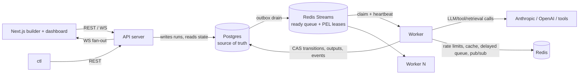

# CLAUDE.md — agentloom: Durable Execution Engine for AI Agent Workflows

## What this project is

A distributed, durable execution engine purpose-built for AI agent workflows — **Temporal-grade distributed-systems guarantees, AI-native orchestration semantics.** Users define workflows as DAGs of steps (LLM calls, tool calls, conditionals, fan-out/fan-in, human approvals); the engine distributes execution across independent worker processes, persists durable state so runs survive crashes and resume from the last completed step, and provides retries, timeouts, idempotency, and dead-lettering.

It sits between: **n8n/Zapier** (easy, not production-grade), **Temporal/Airflow** (production-grade, not AI-native), and **LangGraph** (great agent logic, but an in-process library with no distributed coordination or crash recovery).

**AI-native differentiators (core features, not add-ons):** semantic/self-correcting retries (retry LLM steps with critique-augmented prompts), dynamic runtime DAG generation (planner steps inject steps mid-run, durably), cost-aware scheduling (budgets, model downgrade, park-on-exceed), context/memory management (token accounting + automatic compaction), multi-agent handoff (roles + blackboard + bounded critic⇄writer loops), human-in-the-loop approvals, and a pluggable SPI for tools/agents/retrieval.

## Current status

**M0 in progress.** Ticket 0.1 (repo scaffold & tooling) is done: project named **agentloom**, module path `github.com/mathcslearner/agentloom`, directory skeleton, `Makefile` (`lint` / `test` / `test-integration` / `fmt`, pinned golangci-lint auto-installed into `./bin`), golangci-lint v2 config, Apache-2.0 license, README. Ticket 0.2 (CI pipeline) is implemented: `.github/workflows/ci.yml` runs parallel lint (go vet + golangci-lint, version pinned in sync with the Makefile) and `go test -race` jobs on PRs and pushes to main, with setup-go caching and a README status badge; one acceptance box remains open until the red-path check (a deliberately failing test fails CI, verified once then removed) is done on GitHub. Ticket 0.3 (architecture overview document) is done: `docs/architecture.md` (components + Mermaid diagrams, execution data flow, tech-stack rationale, glossary) and the doc index `docs/README.md`. Ticket 0.4 (ADRs) is done: `docs/adr/` with `template.md` (Nygard-style sections, numbering/supersession conventions), ADR-001 (service boundaries: exactly two deployables, shared internal packages, datastores as the compatibility surface), ADR-002 (scheduling model: no central scheduler, completing worker computes readiness in the completion tx, outbox dispatch, escape criteria for a dedicated scheduler, sharded-streams scale lever), and the index `docs/adr/README.md`. Ticket 0.5 (config & structured logging foundation) is done: `internal/config` (env-driven config with `AGENTLOOM_*` vars, defaults < env precedence, injectable env lookup, all invalid values reported in one joined error; `LogConfig` sub-config), `internal/obs/log` (slog JSON/text logger factory, canonical field constants + typed attr helpers for `run_id`/`step_id`/`attempt`/`worker_id`/`trace_id`, nil-safe `Into`/`From`/`With` context helpers), and the `cmd/demo` throwaway (deleted in M4). All further implementation happens by executing the roadmap; next ticket is 1.1 (ADR-003: workflow definition format). The only open M0 item is the one-time CI red-path verification on GitHub (ticket 0.2).

## How to work on this project

1. **`ROADMAP.md` is the source of truth for sequencing.** 22 milestones (M0–M21), 134 tickets, strictly linear — dependencies only point backwards. Pick the first unfinished ticket, complete it fully, move on. Do not skip ahead or start milestones out of order.
2. **One ticket = one focused session** (1–4h, ~a couple hundred LOC). If a ticket balloons, split it and record the split in ROADMAP.md.
3. **Definition of Done (every ticket):** lint + tests green (integration tests when crossing process/datastore boundaries); tests written in the same ticket as the behavior; structured logs (and metrics/traces once M7 exists) on new hot paths; ADRs updated if a decision changed; no secrets anywhere; no TODOs without a ticket reference.
4. **Status convention:** check off acceptance-criteria boxes in ROADMAP.md as you complete them; append ` ✅` to the ticket heading when all are checked.
5. **ADRs govern design.** Most milestones open with an ADR ticket; implementation must conform. If reality contradicts an ADR, update the ADR and affected future tickets in the same change. ADRs live in `docs/adr/`.
6. **Testing discipline:** unit tests always; integration tests (build tag `integration`) run against the Docker Compose stack (`make test-integration`); chaos/crash tests are first-class deliverables, not optional extras.

## Architecture summary

Two long-running deployables + shared internal packages (ADR-001). No central scheduler (ADR-002): scheduling is event-driven — the worker that completes a step computes successor readiness in the same transaction and dispatches via a transactional outbox.



**Execution flow:** submit → validate → instantiate run in one tx (per-run graph copy, entry steps `ready`, outbox rows) → outbox drained to Redis Streams → a worker claims via Postgres CAS (`ready → running`, fresh `claim_id`) → executes through the middleware chain → completion tx (output + CAS + evaluate CEL edges + decrement join counters + outbox newly-ready steps + events) → ACK.

**Key mechanisms:**
- **Leases:** the Redis Streams pending-entries list (PEL) is the lease ledger. Heartbeat = `XCLAIM JUSTID` to self; reclaim = `XAUTOCLAIM` with min-idle = lease TTL; poison detection via delivery count. Postgres `claim_id` fencing rejects zombie writes. At-least-once delivery + CAS-guarded claims + idempotency keys = effectively-once execution.
- **Outbox + reconciler:** every Postgres→Redis handoff goes through a transactional outbox drained by all workers (`FOR UPDATE SKIP LOCKED`); a periodic reconciler heals crash gaps and stuck states.
- **Executor middleware chain** (order matters): cache read → rate limit (fleet-wide Redis token buckets; throttled = delayed requeue, not a failure) → budget check (park/downgrade) → context assembly + compaction → execute → validate (semantic retries on `validation_failed`) → cost ledger → cache write.
- **Per-run graph copy:** each run owns its graph rows, so planner steps mutate the graph atomically with their completion (`ExpandRun`, `graph_version++`). Loops are authored as marked loop edges and executed by unrolling iterations through the same expansion machinery — the instance graph stays acyclic.
- **Park/resume:** one primitive underlies manual pause, budget-exceeded halts, and human approvals (approvals ACK the queue message — no lease or worker slot is held while waiting).
- **Events:** append-only per-run event log with monotonic `seq` in Postgres (truth), Redis pub/sub for low-latency fan-out, WS protocol = snapshot → backfill from `last_seq` → live tail.

## Tech stack

| Area | Choice |
|---|---|
| Backend | Go; chi (HTTP), coder/websocket, pgx v5 + sqlc, golang-migrate, go-redis, cel-go (expressions), invopop/jsonschema (schema generation), slog |
| Data | Postgres (durable state, source of truth), Redis (streams/leases, token buckets, delayed ZSET, cache, pub/sub) |
| LLM | Anthropic + OpenAI behind one provider interface; deterministic mock provider for tests and load |
| Observability | Prometheus client_golang, OpenTelemetry (trace context propagated through queue envelopes), Grafana + Jaeger in compose |
| Frontend | Next.js (App Router, TS strict), React Flow (`@xyflow/react`), zustand, Tailwind + shadcn/ui, elkjs, openapi-typescript, vitest + Playwright |
| Infra | Docker multi-stage → Docker Compose (local, from M2) → Helm on EKS, RDS, ElastiCache, ECR, Terraform, KEDA (queue-depth autoscaling), GitHub Actions |

## Planned repository layout

```
cmd/            api, worker, ctl, loadgen
internal/
  dag/          definition types, validation, graph algorithms, CEL
  store/        Postgres repositories (sqlc), migrations, tx helpers
  queue/        Redis Streams, leases, delayed delivery, chaos harness
  engine/       claim/execute/complete pipeline, outbox, reconciler
  exec/         executor SPI, registry, middleware, side-effect journal
  llm/          provider interface, Anthropic, OpenAI, mock
  tools/        tool SPI + built-ins (http_request, json_transform)
  ratelimit/    Redis token bucket (shared by API + fleet limits)
  cache/        response cache, key builder
  cost/         pricing catalog, ledger, budget enforcement
  contextmgr/   token counting, blackboard, assembly, compaction
  validate/     validator SPI, deterministic + LLM-judge validators
  api/          HTTP handlers, auth, WS
  obs/          logging, metrics, tracing
  config/
web/            Next.js app (lib/graphdef = serialization boundary)
deploy/         helm/, terraform/, dockerfiles
docs/           architecture.md, adr/, demos/, load/, examples/
examples/       definitions/ (canonical workflow JSON fixtures)
test/           integration + chaos suites
api/openapi.yaml
```

## Non-negotiable invariants

- **Postgres is the source of truth**; Redis is redeliverable transport + coordination. Any Redis data loss must be recoverable via the reconciler.
- **Every state transition is a guarded CAS** appending an event in the same transaction. Completion requires the matching `claim_id` (fencing).
- **Enqueue is at-least-once; claims dedupe.** Duplicate deliveries are ACK-and-drop, never double-execution.
- **Side effects go through idempotency keys** (stable across attempts/reclaims) and/or the side-effect journal.
- **Graph mutations are atomic with planner completion** — no observable half-expanded state, ever.
- **No metric labels with unbounded cardinality** (`run_id`/`step_id` are log/trace fields, never metric labels).
- **No secrets in code, fixtures, logs, traces, or state.** Provider keys via env/config only.
- **Time is injectable** — no bare `time.Now()`/sleeps in logic under test; chaos and backoff tests use controlled clocks.
- **The workflow definition JSON is a versioned contract** — Go structs are the source of truth; JSON Schema is generated; the UI serialization module round-trips unknown fields.

## Scope boundaries

Not building: model training/fine-tuning, LLM/tool implementations (real provider APIs via the SPI), a generic non-AI automation platform, fine-grained microservices (exactly two deployables), multi-tenancy in v1. See ROADMAP.md non-goals and Appendix A backlog.

## Glossary

**run** — one execution of a workflow definition (owns a graph copy) · **step** — node in a run's graph · **attempt** — one execution try of a step · **lease** — a worker's time-bound claim on a step (PEL entry + heartbeat) · **claim_id** — fencing token guarding state writes · **outbox** — transactional Postgres→Redis dispatch buffer · **reconciler** — periodic healer for crash gaps · **blackboard** — run-scoped shared memory store · **expansion** — atomic runtime graph mutation (planners, map, loop unrolling) · **semantic retry** — re-attempt with critique-augmented prompt after output validation fails · **park** — pause a run without holding leases (manual / budget / approval).
