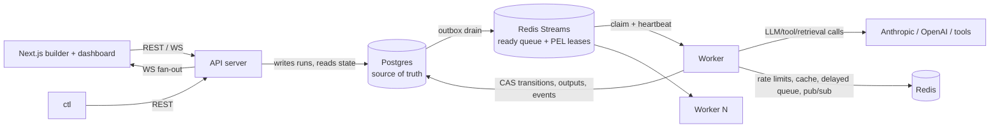

# CLAUDE.md — agentloom: Durable Execution Engine for AI Agent Workflows

## What this project is

A distributed, durable execution engine purpose-built for AI agent workflows — **Temporal-grade distributed-systems guarantees, AI-native orchestration semantics.** Users define workflows as DAGs of steps (LLM calls, tool calls, conditionals, fan-out/fan-in, human approvals); the engine distributes execution across independent worker processes, persists durable state so runs survive crashes and resume from the last completed step, and provides retries, timeouts, idempotency, and dead-lettering.

It sits between: **n8n/Zapier** (easy, not production-grade), **Temporal/Airflow** (production-grade, not AI-native), and **LangGraph** (great agent logic, but an in-process library with no distributed coordination or crash recovery).

**AI-native differentiators (core features, not add-ons):** semantic/self-correcting retries (retry LLM steps with critique-augmented prompts), dynamic runtime DAG generation (planner steps inject steps mid-run, durably), cost-aware scheduling (budgets, model downgrade, park-on-exceed), context/memory management (token accounting + automatic compaction), multi-agent handoff (roles + blackboard + bounded critic⇄writer loops), human-in-the-loop approvals, and a pluggable SPI for tools/agents/retrieval.

## Current status

- **Position:** M0–M7 **complete**, all of M8 (plugin SPI & LLM/tool execution) **complete**, **all of M9 (distributed rate limiting & response caching) complete**, **all of M10 (cost tracking & budget enforcement) complete**, **all of M11 (output validation & semantic retries) complete**, **all of M12 (context & memory management) complete**, and **all of M13 (dynamic DAG — planner steps & runtime expansion) complete: 13.1 (ADR-015 & the expansion spec), 13.2 (`ExpandRun` — graph mutation in the store), 13.3 (planner step executor), 13.4 (dynamic map fan-out), 13.4b (map collect-errors), 13.5 (expansion chaos & recovery matrix), and 13.6 (run-graph introspection API)**, and **all of M14 (multi-agent orchestration) complete: 14.1 (ADR-016 & agent definitions), 14.2 (handoff conventions & the blackboard message thread), 14.3 (loop-edge runtime — unrolling via `ExpandRun`), 14.4 (run guards & termination policies), and 14.5 (flagship research → write → critique example)**, and **M15 (human-in-the-loop) complete: 15.1 (ADR-017 & approval step schema), 15.2 (park without lease — the `awaiting_human` status, the `approvals` table, the ACK-after-commit executor), 15.3 (decision API — `GET /v1/approvals`, `POST /v1/approvals/{id}:decide`, the single-CAS arbiter on `engine.Control`, reject routing), 15.4 (approval timeouts — a delayed-queue expiry through the same `Control.Decide` CAS, reconciler safety net, best-effort early-decision cancellation), and 15.5 (notification webhook & flagship gate)**, and **M16 (realtime events & WebSocket streaming) started: 16.1 (ADR-018 & event schema normalization — the `internal/event` leaf package owning the taxonomy + one typed payload struct per type, the normalized envelope with a lifted `step_id`, the generated `docs/schema/events.v1.json`, the two typed `appendEvent` helpers as the only sanctioned writers enforced by a go/ast CI check, and the `attempt_no → attempt` wire normalization) complete, and 16.2 (live publish path — Redis pub/sub) complete, and 16.3 (run WebSocket endpoint) complete, and 16.4 (multi-run firehose endpoint) complete, and 16.5 (typed TS event client — `web/lib/engine-client`) complete. M16 (realtime events & WebSocket streaming) complete.** **M17 (frontend: visual DAG builder) started: 17.1 (web app scaffold & typed API client — `web/lib/api-client` typed REST client generated from `api/openapi.yaml`, plus the Next.js app `web/app` with a same-origin key-holding proxy and definition/run list pages) complete, and 17.2 (ADR-019 & the serialization module — the pure `web/lib/graphdef` package mapping the definition JSON ⇄ canvas `Flow` state, types generated from `docs/schema/workflow-definition.v1.json`, lossless round-trip over the backend fixture corpus, unknown-field passthrough, zero React/UI imports) complete, and 17.3 (canvas, palette & node components — the React Flow builder at `/builder`: a zustand+zundo store with undo/redo, a step palette over all catalog types, typed connection handles, and the status-neutral `StepNodeView` the M18 dashboard reuses) complete, and 17.4 (schema-driven config panels — config forms generated from each plugin's `GET /v1/plugins` JSON Schema, a client-side config validator in `@agentloom/graphdef` reporting the backend's issue codes/paths (parity-proven against a Go verdict golden), node marking, and a prompt editor with upstream-only `${{ }}` autocomplete) complete, and 17.5 (client-side graph validation — the full `internal/dag` validator ported to `@agentloom/graphdef`, corpus accept/reject parity against the Go verdict golden, and a Problems panel with click-to-focus + cycle-path highlight) complete.** **Next: 17.6** (import/export, save & submit flows).

**17.5 delivered client-side graph validation — the full `internal/dag` validator ported to `@agentloom/graphdef` so a client verdict and a server verdict agree over the whole backend fixture corpus, plus a Problems panel with click-to-focus and a cycle-path highlight. Entirely under `web/`; no Go runtime change, no migration, no config var, no metric, no new Go corpus fixture.** (1) **The full validator** (`web/lib/graphdef/src/validate`): `validateDefinition(value)` runs a **decode stage** (`decode.ts`, a schema-driven walker over `DEFINITION_SCHEMA` reproducing the strict codec's shape/enum/required findings as codeless issues, with the `schema_version` short-circuit — envelope blocks walked against their `$defs`, the loose Step oneOf's known-field set hardcoded) that, when clean, gates a **validate stage** (`definition.ts`) running every rule in the backend's order behind the same well-formed-graph gate, including the graph-semantic checks (a port of the iterative three-colour cycle DFS in `graph.ts` reporting the closing edge + cycle path, loop ancestry, step_output/template ancestry). Two rules are approximated **leniently** (never over-rejecting): a CEL checker (`cel.ts`, tokenizer + Pratt parser + coarse type inference → `invalid_expression`/`expression_not_boolean`, unrecognised → `dyn`) and a ref-level template lint (`template.ts`, config-relative path tracked in sorted-key order to match `dag.tmplParser.walk`). Grammar (`grammar.ts`) + bounds (`limits.ts`) ported verbatim with Go sources cited; `agent.ts` ports `ResolveAgentStep`. `config.ts` became a config-scoped façade over the full validator (17.4 API preserved). Issues carry a client-only `related[]` (cycle nodes + edge) for highlight; client-only `advisory_*` budget warnings surface sanity nudges the backend does not model. (2) **Parity** (`test/parity.test.ts`): identical accept/reject over all 131 golden fixtures + exact (severity, code, path) over the validate stage — the two 17.4 `DEFERRED_TO_17_5` fixtures now pass; `cel.test.ts` + `validate.test.ts` add focused tables. Landed green on the first real run. (3) **The app:** `useProblems` runs `validateDefinition` and maps issues onto nodes AND edges by index (`mapIssuesToEdges`/`issueTargets`/`primaryTarget`); a hoisted `ProblemsProvider` (inside `ReactFlowProvider`) runs one validation and provides per-element error counts, highlight state, and `focusIssue`; `ProblemsPanel` (errors-first, click-to-focus by the issue's own path + hover-preview) marks the offending element and `fitView`s to it; edge renderers gained invalid/highlight strokes + `data-testid="step-edge"`; `StepNodeView` gained a `highlighted` prop (rendered only when true → snapshots unchanged); a minimal `EdgePanel` (loop-edge inspector pulled forward from 17.6) with `store.patchEdge`/`store.selectOnly` makes the loop-authoring flow completable; the toolbar shows `N errors · M warnings` and disables Submit while errors block it. **Decisions:** validator in `graphdef` (pure, parity-tested); lenient CEL/template checkers (backend's `ConfigCompiler` pre-flight + exact cel-go messages stay backend-only); `focusIssue` selects by the issue's primary path (better UX, avoids a flaky canvas edge-click); minimal edge inspector early for DoD-2; no new Go corpus fixture (proven against the existing golden + TS tables). **Accepted residuals:** loop-edge authoring polish + import/export/save/submit are 17.6. Tests: graphdef vitest 778, app vitest 136, Playwright `validation.spec` (2 — DoD-2 loop authoring + DoD-3 click-to-focus) + existing green; workspace lint/typecheck/build green. ADR-019 §"Client-side graph validation (as built, 17.5)"; `web/lib/graphdef/README.md` + `web/app/README.md`. ROADMAP 17.5 ✅. **Next: 17.6** (import/export, save & submit flows).**

**17.4 delivered schema-driven config panels — a step's config form is generated from its plugin JSON Schema (`GET /v1/plugins`), with a client-side config validator, node marking, and upstream-only prompt autocomplete. Entirely under `web/` plus two tiny spec/schema touches and a Go test-only golden; no Go runtime change, no migration, no config var, no metric.** (1) **Backend consumability:** `api/openapi.yaml` `PluginInfo.config_schema` gained `additionalProperties: true` (so `openapi-typescript` renders it as `{[k]: unknown}`, not the unusable `Record<string, never>`); `internal/dag/schema.go` gained `JSONSchema()` enum methods for `OutputFormatType`/`OutputFormatMode` (the last two closed vocabularies without one) so those fields render as selects; and a new Go golden `internal/dag/TestVerdictsGolden` → `internal/dag/testdata/verdicts.golden.json` pins the exact Decode+Validate verdict for the whole corpus (131 fixtures) — the ground truth the client parity test compares against. (2) **`@agentloom/graphdef` gained a client validator** (`validate/config.ts` + a JSON-Schema-subset shape checker `schema/schema.ts`): `validateStepConfigs(def, schemas)` mirrors the backend's single-step-local config rules (required fields, `prompt` xor `messages`, `output_format`, `human_approval`, join mode), reporting the backend's `config_field_*` codes/paths/messages. The generator also emits `generated/definition.schema.ts` (`DEFINITION_SCHEMA`); `fallbackConfigSchemas()` derives per-step-type schemas from it. `config-validate.test.ts` proves parity vs the golden (config-field code+path equality on decode-clean fixtures, reject on decode-fail config fixtures, no false positives on the example corpus; `agent_merged_no_model`/`expansion_bad` explicitly deferred to 17.5). The shape checker deliberately skips enums (config rules own them per field, since join `mode` is a codeless decode error but `output_format.type` a coded validate error). (3) **The app:** `catalog-store` fetches `GET /v1/plugins` (proxy) and layers live executor schemas over the fallback; `ConfigPanel` replaces the Inspector's selection section with a schema-driven `SchemaForm` (widget per field via `fields.ts` + `hints.ts` — model picker, tool/retriever/agent/template picker, prompt editor, enum select, number/boolean, string/object lists, JSON fallback), a per-step Problems list, and a raw-JSON Envelope editor; `PromptEditor` offers upstream-only `${{ }}` autocomplete (`refs.upstreamStepIds` mirrors `classifyUpstreamRef`/`Graph.Ancestors` — normal edges only, self/loop excluded); `useProblems` + a `ProblemsProvider` context mark invalid nodes (O(n)) and drive a toolbar error count; store gained `patchStep`/`setStepEnvelope`; standard shadcn tokens + primitives added. **Decisions:** the validator lives in `graphdef` (pure, parity-tested), not the app; parity is accept/reject with a stronger (code,path) assertion on the config-field family; "secret-ref" **not built** (no backend concept — a leak risk); the model picker warns (never errors) on an unroutable bare model; envelope forms stay raw-JSON (schema-driven envelope forms are 17.5). **Accepted residuals:** cross-section/cross-field config rules, envelope bound checks, and full corpus accept/reject parity are 17.5; the submit round-trip surfacing is wired (`mapIssuesToNodes`) but the submit button is 17.6. **Also fixed a pre-existing 17.3 `builder.spec` e2e flake** (overlapping cascade-placed nodes — confirmed identical on the pristine 17.3 commit). Tests: graphdef vitest 448, app vitest 124, Playwright `config-panel.spec` (2) + repaired `builder.spec` (3) green; workspace lint/typecheck/build green; `make generate` + `make openapi-lint` (100/100) clean. ADR-019 §"Schema-driven config panels (as built, 17.4)"; `web/app/README.md` + `web/lib/graphdef/README.md`. ROADMAP 17.4 ✅. **Next: 17.5** (client-side graph validation — full corpus parity).

**17.3 delivered the React Flow visual DAG builder at `/builder` — the node canvas over the 17.2 serialization boundary, entirely under `web/app`.** **No Go change, no migration, no config var, no metric; `graphdef` untouched.** New deps: `@xyflow/react`, `zustand`, `zundo`, plus the `@agentloom/graphdef` workspace dep on the app. (1) **The RF-v12 data constraint is the one non-obvious modelling choice:** React Flow v12 constrains node/edge `data` to `Record<string, unknown>`, which graphdef's typed `FlowNodeData`/`FlowEdgeData` do not satisfy — so rather than change graphdef (it must stay a pure leaf) or fight the generics, the canvas holds React Flow's own `Node`/`Edge` with the graphdef step/edge object carried *inside* `data`, read back through typed accessors (`src/lib/builder/adapter.ts`). (2) **Pure canvas helpers** (`src/lib/pure/builder`, the app's no-React eslint boundary): `catalog.ts` (per-`StepType` label/group/one-line config summary, exhaustive over `StepType`; a "core" group of ten + a collapsible "test" group of seven), `ports.ts` (the handle contract), `steps.ts` (id allocation `<type>_<n>` + a bare `{id,type,config:{}}` step). (3) **The handle contract** — canvas-owned presentation state (ADR-019 fixed graphdef never persists handles): every node has one `in` target + `out`/`loop` sources; `human_approval` adds `approve`/`reject`. Single source of truth both ways: `deriveHandles(edge)` renders an existing edge from the right port, `edgeSeedForHandle(handle)` seeds a new edge's fields (`loop` → a placeholder marked loop edge, decision handles → a `decision` marker). `isValidConnection` enforces only port rules (source+target, target on `in`, no self-connection, no exact duplicate `(source,sourceHandle,target)`); cycles/ancestry/decision-consistency are 17.5's, so an invalid-but-well-shaped graph rides faithfully onto the canvas. (4) **The store** (`src/lib/builder/store.ts`) is zustand under zundo's `temporal` middleware: the tracked slice is the serializable canvas; RF runtime churn (selection/measurement/viewport) is kept out of history by `partialize`+structural `equality`; a **drag coalesces into one undo entry** (history paused for the drag, the pre-drag snapshot pushed once onto `temporal.pastStates` on stop — a naive pause/resume drops the move from history, so the manual push is what makes a move undoable). Edge ids are the deterministic `graphdef.edgeId(from,to,n)` at the lowest free ordinal; delete is one path (`deleteKeyCode` disabled, a window keyboard hook calls `deleteSelected`, which prunes attached edges). (5) **Components** — `StepNode` splits into a status-neutral, React-Flow-free `StepNodeView` (with a `skin` slot the **M18 dashboard reuses** for run-status skins) and the RF wrapper adding typed `Handle`s; two edge renderers (`step`/`loop`) with routing labels; a `Palette` (grouped, drag-to-create + click/Enter add); a `Canvas` (minimap/zoom/fit, palette-drop at the cursor, drag batching, `isValidConnection`); an `Inspector` placeholder with a live definition preview (replaced by 17.4). (6) **Routing** — the list pages moved into a `(site)` route group (centred column), the builder into a `(builder)` group (full-bleed); URLs unchanged. A webpack `resolve.extensionAlias` in `next.config.ts` resolves graphdef's runtime `.js` specifiers onto its `.ts` source (api-client's are type-only/erased, so this is the first place it bites). (7) **Tests** — vitest over the pure helpers + store (create/connect/delete undo-redo, drag-coalescing, selection/viewport untracked) + committed **DOM snapshots** of `StepNodeView` for every `StepType` (deterministic visual-regression baseline; 62 app tests green, full workspace green, drift-clean); a Playwright `builder.spec` (10-node graph via mouse+keyboard, a reject-port decision edge asserting `decision:"reject"`, delete/move undo-redo); verified live in a browser. **Decisions:** zundo temporal store; RF-native node/edge with graphdef data inside `data`; click/keyboard add primary + HTML5 DnD secondary; DOM snapshots over screenshots; the loop port seeds a placeholder edge now (fields edited in 17.6); no cycle/ancestry rules until 17.5; route groups for a full-bleed builder without URL changes. **Accepted residuals:** config editing (17.4), client-side validation (17.5), import/export/save/submit (17.6) — a new node carries an empty `config: {}`. ADR-019 §"Canvas, palette & node components (as built, 17.3)"; `web/README.md` + `web/app/README.md`. ROADMAP 17.3 ✅. **Next: 17.4** (schema-driven config panels).

**17.2 delivered ADR-019 & the serialization module — the pure workspace package `web/lib/graphdef` (`@agentloom/graphdef`) mapping the workflow definition JSON to and from the visual builder's canvas state, the leaf the rest of M17/M18 build on.** **No Go change, no migration, no config var, no metric** — entirely under `web/` plus the ADR, a CI drift-path widening, and docs. (1) **ADR-019** fixes the frontend package layering (`api-client`/`engine-client`/`graphdef` pure libs; `app` the only React/Next/React-Flow consumer) and the serialization contract: the `Flow` model (`{doc, nodes, edges, ui, uiPresent}`), the `toFlow`/`toDefinition` rules, `ui`-block ownership (`ui.nodes.<id>.position` lifted onto nodes; viewport/`ui.version`/unknowns/orphan node entries preserved), the copy-then-overwrite unknown-field passthrough rule (runtime only touches `id`/`type`/`steps`/`edges`/`ui.nodes.*.position`), the deterministic synthesized edge id (`from->to`/`from->to#n`), and the forward-stated canonical-export (17.6) and validation-parity (17.5) strategies. (2) **Generated types** — `src/generated/definition.ts` emitted from `docs/schema/workflow-definition.v1.json` by `scripts/gen-definition-types.ts`, a dependency-free deterministic walker (engine-client's emitter extended for the `Step` `oneOf` → a discriminated union so `switch (step.type)` narrows `step.config`, plus `additionalProperties:{$ref}` maps and the `true`-any schema); own types not api-client's `Definition` (whose openapi-typescript rendering collapses `config` to `Record<string,never>`). Drift: Go structs → `workflow-definition.v1.json` (`make generate`, Go-CI-diffed) → `definition.ts` (the `web` job's `git diff` widened to `lib/graphdef/src/generated`). (3) **The mapping** — `toFlow(unknown, opts?)` shape-checks + rejects duplicate step ids with a typed `GraphdefError{code,path}` (backend path grammar), lifts positions (else a deterministic grid, `positioned:false`), and carries configs/envelope blocks/unknown fields/residual `ui`/orphans verbatim; it does *not* validate configs/endpoints/cycles/CEL (17.5) — a dangling edge or invalid config rides into the `Flow`. `toDefinition` is the exact JSON-value inverse (omits `ui` only when empty *and* absent in the source, preserving a deliberately-empty `ui:{}` via `uiPresent`). `FlowNode`/`FlowEdge` are structurally React-Flow-compatible with **no `@xyflow/*` dependency**; handles are canvas-owned, never persisted. (4) **Tests (vitest, 319):** `roundtrip.test.ts` (DoD-1: `toDefinition(toFlow(f))` deep-equal over 82 corpus fixtures — `examples/definitions` + `internal/dag/testdata/{valid,invalid_structural}` — 293 assertions + idempotence/determinism; the two dup-id fixtures throw; 43 codec-invalid fixtures round-trip-or-throw, never crash), `passthrough.test.ts` (DoD-2: hand-written unknowns + a seeded-Mulberry32-PRNG property test injecting `x_future_*` keys across the corpus, >300 cases, no `fast-check` dep), `toflow.test.ts` (position lift/synthesis/orphans/edge ids/shape-error paths), `generated.test.ts` (`STEP_TYPES` == the schema enum; compile-time narrowing), `boundary.test.ts` (DoD-3). (5) **Boundary (DoD-3):** `eslint.config.mjs` `no-restricted-imports` bans react/react-dom/next/`@xyflow/*`/`server-only` (parser + `@eslint/js` already in the store, no new fetch), and the package declares no UI or runtime dependency, so such an import wouldn't resolve — structural, not just a rule. **Decisions:** package at `web/lib/graphdef` (roadmap-aligned; React unresolvable inside it) — the app's seeded `src/lib/graphdef/**` lint block repointed at `src/lib/pure/**`; own deterministic emitter; own `FlowNode`/`FlowEdge` shapes; `toFlow` throws only on shape/dup-id (validation is 17.5); losslessness is JSON-**value**-level (byte-for-byte canonical export is specified now, implemented in 17.6); no `fast-check`. **Accepted residuals:** value-level `ui` preservation; templates/agents are document-level libraries not canvas nodes in M17 (template sub-canvas deferred); synthesized edge ids change on reorder/dedupe. ADR-019 added (`docs/adr/README.md` row 019); `web/README.md` + `web/lib/graphdef/README.md`. ROADMAP 17.2 ✅. **Next: 17.3** (canvas, palette & node components).

**17.1 delivered the web app scaffold & typed API client — the opener of M17 (visual DAG builder): the typed REST client `@agentloom/api-client` plus the Next.js app `@agentloom/app` that lists definitions and runs from the compose backend through the typed clients, with the API key held server-side by a same-origin proxy.** **No Go change, no migration, no config var, no metric** — entirely under `web/` plus one CI job, Makefile targets, a smoke script, and docs. (1) **`web/lib/api-client`** — `src/generated/openapi.ts` is emitted from `api/openapi.yaml` by `scripts/gen-openapi-types.ts` via `openapi-typescript` v7 (verified to resolve the spec's two external `$ref`s to `docs/schema/{workflow-definition,events}.v1.json`, inline them, compile strict, and emit byte-deterministically — what a CI diff needs). The runtime is a thin `openapi-fetch` wrapper: `createApiClient({ baseUrl, apiKey?, fetch? })` attaches the bearer via a request middleware only when a key is given, plus `problem()` narrowing the `{error:{code,message,issues}}` envelope + ergonomic re-exports. **Closes the 16.5 residual** with a compile-time `frame-parity.test.ts` asserting engine-client's hand-written `WS*Frame` payloads stay structurally compatible with the generated `WS*Frame` schemas (omitting the synthesized `type` discriminant and the independently-generated `event`/`run` payloads), so engine-client stays dependency-free; `FirehoseCaughtUpFrame` added to its exports. Drift chain: Go structs → `openapi.yaml` (route/op tests) → `openapi.ts` (new CI diff over `lib/*/src/generated`). (2) **`web/app`** — Next.js 15 App Router, React 19, TS strict, Tailwind v4 + shadcn-style primitives (`badge`/`button`/`card`/`table`, `cn`, `components.json`), ESLint 9 flat config with a seeded `no-restricted-imports` boundary rule on `src/lib/graphdef/**` (for 17.2). **Proxy-only auth:** the catch-all Node-runtime route handler `src/app/api/agentloom/[...path]/route.ts` injects the server-held bearer, allowlists `v1/**`+`healthz` (else 404 — no open relay), never copies a client-supplied `Authorization`, forwards method/query/body + `idempotency-key`, passes back status/body + `X-RateLimit-*`/`Retry-After`, and 503s when unconfigured — the API has no CORS, so this is the only browser path. `src/lib/api/{server,browser}.ts` are the two client factories; `src/lib/config.ts` is `server-only`. Pages: `/` (health/setup), `/definitions` (server-rendered, direct client), `/runs` (client-rendered via proxy, status filter + keyset "Load more") — both auth paths in production code. Config reuses `AGENTLOOM_API_URL`/`AGENTLOOM_API_KEY` (never `NEXT_PUBLIC_`). (3) **Tests:** api-client vitest ×9 (bearer, query, error narrowing, `problem`, generated-types, frame parity), app vitest over jsdom ×8 (proxy handler forwarding/allowlist/missing-key, `RunsPage` render/empty/error), engine-client's 26 unchanged — 43 green; lint/typecheck/build green across all three packages. (4) **Bundle no-key proof** (`scripts/check-bundle-no-key.sh`, `pnpm build:verify`, CI step): builds with a runtime-generated sentinel key (so the repo's `sk_`-grep stays clean) and asserts neither the value nor `AGENTLOOM_API_KEY` appears in `.next/static`. (5) **Playwright** (`e2e/smoke.spec.ts`): seeds a definition + run, asserts the pages render them **and that no browser request carries `Authorization`** — verified green against the live compose stack; `scripts/web-e2e-smoke.sh` (`make web-e2e`, new `web-e2e` CI job) boots the compose app profile with an ephemeral root key. (6) **Wiring:** `pnpm-workspace.yaml` gained `app`; root scripts `-r --if-present` (+ `dev`/`e2e`/`build:verify`); engine-client gained `lint`; Makefile `web-build`/`web-dev`/`web-e2e`; the `web` CI job widened (lint + build:verify + two-side drift). **Decisions:** `openapi-fetch` over a hand-rolled client; proxy-mode-only (no CORS, key stays server-side); one app for M17 builder + M18 dashboard; reuse the `ctl` env names; `next-env.d.ts` committed as the canonical 2 lines (tsc tolerates the missing `.next/types` reference so standalone typecheck works pre-build); `next lint` swapped for the ESLint CLI. **Accepted residuals:** a local build rewrites `next-env.d.ts` to 3 lines (harmless — CI only diffs `lib/*/src/generated`); the `web-e2e` job builds the Go compose images (heavy, like other `smoke-*`); shadcn primitives hand-seeded (CLI-compatible). `docs/api.md` "Typed REST client"; `web/README.md` + `web/app/README.md` + `web/lib/api-client/README.md`. ROADMAP 17.1 ✅. **Next: 17.2** (ADR-019 & the serialization module — `web/lib/graphdef`, `toFlow`/`toDefinition`, round-trip property tests over the backend fixture corpus).

**16.5 delivered the typed TS event client, closing M16 — `web/lib/engine-client` (`@agentloom/engine-client`), the exact client M17/M18 build on, generated from the committed event schema with a CI drift check.** It is the first package in the new `web/` **pnpm workspace** (Corepack-managed, `packageManager`-pinned; M17 adds the Next.js app), a **pure library with no React/UI imports and no runtime dependency** (global `WebSocket` + `fetch`, Node >= 22). **No Go change, no migration, no config var, no metric** — the ticket is entirely under `web/` plus one CI job, Makefile targets, a smoke script, and docs. (1) **Generated event types + two-layer drift check.** `src/generated/events.ts` is emitted from the committed `docs/schema/events.v1.json` by `scripts/gen-events-types.ts` — a **dependency-free deterministic emitter** over the exact invopop vocabulary (byte-stable output is what a drift diff needs; a codegen lib's formatting could flake it). It renders one interface/alias per `$defs` entry + a discriminated layer (`EVENT_TYPES` const, `EventType` union, `EventPayloadMap`, `EventEnvelope = {[K in EventType]: base & {type:K; payload:Map[K]}}[EventType]`) so `switch (env.type)` narrows `env.payload`. The one wire override: the reflected `UUID` def is `[16]byte`, but google/uuid marshals a **string** on the wire → `UUID = string`. Drift: Go structs → `events.v1.json` (existing Go-CI diff) → `events.ts` (new `web` CI job regenerates + `git diff --exit-code`), so a Go payload change unreflected in the TS fails CI on one side or the other. (2) **Ticket auth, two modes:** `{ apiKey }` mints tickets itself with a `read` bearer (server-side; the key stays server-side); `{ mintTicket }` lets the caller supply them (browser → server-side proxy, the M17 path). A fresh ticket is minted on **every (re)connect** (TTL ~60s); run vs firehose ticket routes are audience-split; a `read` bearer on the upgrade is the documented non-browser alternative via a custom `webSocketFactory` (standard `WebSocket` can't set headers). (3) **Deterministic recovery:** `RunStream` runs snapshot → backfill from `last_seq` → live tail; reconnects with `last_seq` = highest seq seen (fresh snapshot re-emitted; server re-backfills the exact tail → union gap-free/dup-free by seq); **4001 resumes immediately**, every other close backs off (exponential + full jitter, reset on `caught_up`); a `connectGen` guard drops a stale socket's late callbacks. `closeOnTerminal` defaults **false** (a requeue makes `run_failed` non-feed-terminal). `FirehoseStream` manages subscriptions client-side and **re-issues each with its tracked per-run cursors on reconnect** (bounded to `MaxCursorRuns`, non-terminal-first), deduping each run across the re-backfill; in-band `error` frames are surfaced and leave the connection open. (4) **Frames hand-mirrored** from the OpenAPI `WS*Frame` schemas (M16.5 predates M17.1's generated REST client; the vocabulary that actually drifts is the generated part). Every transport seam (socket/timers/`fetch`) is injectable → **26 vitest unit tests** over a fake transport + fake clock (backoff, cursor dedupe/gap, run resume/dedupe/4001/user-close/mint-failure-backoff/mintTicket/terminal-close, firehose filtered-delivery/cross-run-dedupe/cursor-resubscribe/in-band-error/unsubscribe/cursor-bound, generated-types sanity). (5) **`examples/tail-run.ts`** + **`scripts/ws-tail-smoke.sh` (`make smoke-ws-tail`, DoD-2):** boots app, submits a ~12s sleep chain (offline built-ins), tails via the Node example through a mid-run `docker compose restart api`, asserts received seqs == `1..max(events.seq)` with ≥1 reconnect (a local smoke, not CI — the CI twin of the resume guarantee is Go's `TestWSSnapshotBackfillResume`). **New `web` CI job** (setup-node + Corepack pnpm: install → generate-drift → typecheck → test → build); `Makefile` `web-install`/`web-generate`/`web-test`/`smoke-ws-tail`. **Decisions:** seed the workspace root now (17.1 wants it; hoisting later is churn); dependency-free deterministic emitter over `json-schema-to-typescript` (CI-diff determinism + minimal devDeps); ticket-per-connect always (browser portability); `closeOnTerminal` false; frames hand-mirrored until 17.1. **Accepted residuals:** hand-mirrored frames until 17.1; bearer-on-upgrade needs a custom factory; the firehose resume cursor map is `MaxCursorRuns`-bounded (terminal-first drop, re-backfilled + deduped on rediscovery). ADR-018 §"Typed TS client (as built, 16.5)"; `docs/api.md` client subsection; `web/README.md` + `web/lib/engine-client/README.md`. ROADMAP 16.5 ✅. **M16 complete. Next: M17.1** (web app scaffold & typed API client).

**16.4 delivered the multi-run firehose endpoint — `GET /v1/events/ws` streams a filtered, cross-run event feed (the dashboard run list's source), generalizing the 16.3 run WS to many runs on one connection.** **No migration, no new config var, no new store table**; one additive event-payload field (`run_created.definition_id`), one new ADR-008 `api`-subsystem WS metric group, two OpenAPI ops (`Events` tag), four in-band error codes. (1) **One process-wide, refcounted subscription** — a per-`Handler` `firehoseHub` holds at most one Redis `SubscribeFirehose` (lazy on first connection, released on last), fanning each committed envelope out to every connected client's bounded inbox (non-blocking; a full inbox drops the envelope → `ws_hub_dropped_total`, a seq gap healed by backfill). No background goroutine/`Close` on the `Handler`. No live subscriber (or subscribe failure) ⇒ connections self-discover new runs by polling the run list at `PollInterval` (16.3 parity). (2) **Shared `wsLink`** — the 16.3 run WS was refactored so both endpoints share the connection transport (bounded outbound buffer + sole writer goroutine + the 4001 slow-client discipline; the slow signal is the buffer enqueue timeout, not a ctx cancel). (3) **Per-connection subscriptions + per-run Tailers** — `subscribe {id, filter, cursors}` opens/replaces one filtered subscription (≤ `MaxSubscriptions`), `unsubscribe {id}` cancels it; each tracked run rides one `pubsub.Tailer` (16.3's seq-order/dedupe/gap-heal). A run is **discovered and backfilled to head** the first time a live envelope matches a subscription — backfill-from-0 (not live-only) so the complete per-run feed survives cross-publisher reorder (API writes `run_created`, workers write step events, from different processes); a cursor resumes from a later seq. Terminal runs skip resync; tracked runs bounded by `MaxTrackedRuns` (terminal-first eviction). (4) **Server-side filters** `run_ids`/`types`(catalog-validated)/`definition_id`/`definition_name`, ANDed; run→definition resolution rides a shared bounded hub cache filled cheaply from the new `run_created.{definition_id,name}` payload (one DB `Get` only for a definition-filtered run first seen mid-stream). Each envelope delivered once, tagged with the matched `subscriptions` ids; a run tracked for a type-filtered subscription that excludes this event advances the cursor but sends no frame. (5) **Protocol** (JSON text frames): `subscribed` ack → cursor-backfilled `event` frames → `caught_up {id, cursors}` → live `event` frames → `unsubscribed` acks; a malformed/over-limit control message is an in-band `error` frame (`bad_message`/`filter_invalid`/`subscription_limit`/`unknown_subscription`) leaving the connection open. The firehose runs a control-reader goroutine (`conn.Read`, 64 KiB limit) instead of the run WS's `CloseRead`. (6) **Auth** — the same ticket with a new `aud` claim (`firehose` vs `run`, cross-rejected; `verifyWSTicket`/`verifyFirehoseWSTicket`), minted at `POST /v1/events/ws-ticket` (`read` scope/class); a `read` bearer is the non-browser alternative; both routes absent from the requireScope auth matrix (covered by `TestFirehose*`), 503 `stream_unavailable` when WS is off. (7) **Metrics** (`kind` ∈ {run,firehose}): `engine_api_ws_{connections,subscriptions,frames_sent_total,slow_closes_total,hub_dropped_total,send_queue_fill_ratio}` on `APIMetrics` via extended `RequestMetrics`; the 16.3 run WS retrofitted onto the same set. (8) **Seam** — `WSSubscriber` gained `SubscribeFirehose` (the cmd/api + test adapters widened; api never imports go-redis). **Decisions:** one process-wide subscription fanned out; per-connection Tailers; backfill-from-0 on cursorless discovery; ticket audience split. **Accepted residuals:** a hub-inbox drop of a run's only event delays discovery to its next event/resync; poll fallback degraded; `subscriptions` tags computed at delivery (mid-flight filter change not retroactive). **Tests:** unit `firehose_test.go` (audience split, filter compile/match, cursor parse, run-meta, frame encodings); integration `firehose_integration_test.go` `TestFirehose{FilteredDelivery (DoD-1 — run/type/definition filters + a two-sub connection each get exactly their events, correctly tagged, no gaps/dupes),CursorResume,Auth,ControlErrors,SlowClientCloses,PollFallback,Metrics (DoD-3)}`; load `firehose_load_integration_test.go` `TestFirehoseHundredClients` (DoD-2, `make test-firehose-load`: 100 clients tailing continuous load → 14.7k frames, commit→receipt p95 ~15ms, REST p95 1.3→3.1ms, zero slow-closes). Green under `-race`; golangci-lint clean (incl. integration tag); OpenAPI vacuum 100/100; `make generate` diff-clean. ADR-018 §"Multi-run firehose (as built, 16.4)"; ADR-007 route rows; ADR-008 `kind` label + six WS metric rows; `docs/api.md`/`docs/observability.md`. ROADMAP 16.4 ✅. **Next: 16.5** (typed TS event client).

**16.3 delivered the run WebSocket endpoint — `GET /v1/runs/{id}/ws` streams a run's live event feed (snapshot → backfill → live-tail), authenticated by a short-lived signed ticket.** It composes the 16.2 pubsub leaf (`Subscriber` + `Tailer`) with the store's new `EventRepo.EventsAfter` (the `pubsub.Backfiller` shape — `st.Events()` plugs straight into the Tailer, and the 16.2 engine test's local adapter is deleted). **No migration, no new metric**; one config block (`AGENTLOOM_API_WS_TICKET_{SECRET,TTL}`), one dependency (`github.com/coder/websocket`). (1) **Auth is a short-lived HMAC-signed opaque ticket** minted at `POST /v1/runs/{id}/ws-ticket` (`read` scope, `read` rate class, 404 on unknown run): `base64url(payload).base64url(HMAC-SHA256(secret, payloadB64))`, payload `{v:1, run_id, key_id, exp, nonce}`; the WS handshake's `requireReadOrTicket` accepts the ticket (query param — the browser path, since a browser cannot set an `Authorization` header on a WS) OR a `read` bearer (non-browser clients), and every failure is the uniform 401 — so `/ws` is deliberately exempt from the requireScope-based auth-matrix walk (covered by `TestWSTicket*`) while `/ws-ticket` is an ordinary read route in the scope/class tables. Not single-use (a reconnect inside the TTL reuses it → revocation lag bounded by the TTL); empty `AGENTLOOM_API_WS_TICKET_SECRET` ⇒ cmd/api mints a random per-process secret with a boot warning (not valid across replicas); TTL default 60s clamped `[5s, 1h]`; `withDefaults` also defaults `TicketTTL` so a programmatic caller never mints already-expired tickets. (2) **Protocol** (JSON text frames discriminated by `type`): one `snapshot` (the `GET /v1/runs/{id}` body via the new shared `loadRunResponse`, which `handleGetRun` now reuses) → `event` frames backfilled from `?last_seq` via `pubsub.Tailer.Catchup` → `caught_up` → live `event` frames via `Tailer.Offer`; the client dedupes/orders by `(run_id, seq)` and resumes with `last_seq` = highest seq seen. Subscribe-**before**-backfill (SubscribeRun blocks until SUBSCRIBE confirmed) closes the live/backfill window; a subscribe failure or a nil `WSSubscriber` degrades to DB **polling** at `PollInterval`; a slow `ResyncInterval` `Catchup` while live heals the 16.2 lost-final-publish residual. (3) **Slow-client policy:** frames ride a bounded per-connection buffer drained by one writer goroutine; a client that keeps it full for `SlowClientTimeout` is closed with application code **4001** ("slow consumer") and resumes with its `last_seq`. The non-obvious mechanic — `coder/websocket` closes the connection when a `Write`'s context is cancelled, which would eat the 4001 close frame — so the slow signal is the **buffer enqueue timeout, not a ctx cancel**: on slow the driver stops feeding, lets the writer drain naturally (a resuming client unblocks it), then sends 4001; `connCtx` is cancelled only for a genuine teardown (peer gone, shutdown, write error). A periodic ping detects a dead peer. (4) **Seams (api stays go-redis-free):** `api.WithWebSocket(WSOptions{Subscriber, TicketSecret, TicketTTL, Buffer, Ping/Poll/Resync/SlowClient/Write timings})`; `WSSubscriber`/`WSEventStream` are narrow api interfaces that `*pubsub.Subscriber`/`*pubsub.Subscription` satisfy through a thin cmd/api adapter (the `CacheOps` discipline); without the option the `/ws` and `/ws-ticket` routes are still mounted (route coverage static) but answer **503 `stream_unavailable`** (new error code). `statusRecorder` grew `Unwrap()` so the hijack reaches the underlying `http.Hijacker`; `requestLog` skips the latency histogram for the 101 upgrade so a long-lived connection doesn't skew the read-route p95. (5) **OpenAPI:** two ops (`mintRunWSTicket` → `WSTicketResponse`; `streamRunEvents` → 101 + the four `WS*Frame` schemas, `event` referencing the external `events.v1.json`), a `StreamUnavailable` 503 response, `stream_unavailable` in the `Error.code` enum; vacuum 100/100 with a justified `operation-success-response` opt-out (a WS upgrade returns 101, not 2xx; the Go `TestOpenAPIOperationContracts` still enforces a 2xx on every non-WS op and a 101 on the WS op). **Decisions:** ticket-or-bearer at the handshake (browser vs service); buffer-timeout as the slow signal (not ctx cancel); subscribe-before-backfill; poll fallback + resync heal; the api never imports go-redis. **Accepted residuals:** the ticket is bearer-equivalent within its TTL (short TTL is the mitigation, no pre-expiry revocation); a truly-stalled peer can't receive the 4001 frame (write timeout/ping tears it down abnormally — correct for a dead peer); origin authorized against the request host by default (cross-origin is a later `OriginPatterns` knob). **Tests:** `ws_test.go` unit (ticket round-trip/expiry/exactly-at-expiry/wrong-run/wrong-secret/tamper/version matrix, frame encodings, `parseLastSeq`); `ws_integration_test.go` DoD-1 `TestWSSnapshotBackfillResume` (connect → snapshot → kill mid-stream → reconnect with `last_seq` → union of both connections == seqs 1..N, no gaps/dupes, no re-delivery ≤ cursor), DoD-2 `TestWSTicketAuth` (submit-only key → 403, unknown run → 404, valid ticket + read bearer connect, no-credential/garbage/wrong-run → 401/404), DoD-3 `TestWSSlowClientCloses` (fake-subscriber flood + client stall → 4001 → reconnect re-handshakes), `TestWSPollFallback` (no subscriber → poll delivers the full feed). Green under `-race`; golangci-lint clean (incl. integration tag, one `//nolint:gosec` on the env-var-name const); `make generate` diff-clean. ADR-018 §"Run WebSocket endpoint (as built, 16.3)"; ADR-007 route rows; `docs/api.md` WS walkthrough. ROADMAP 16.3 ✅. **Next: 16.4** (multi-run firehose endpoint).

**16.2 delivered the live publish path — after each transaction commits, the worker and API fan its new event envelopes out to Redis pub/sub best-effort (a per-run channel `<prefix>:run:{id}` + a firehose), the low-latency delivery hint under the durable Postgres event log.** **No migration, no new store table; one config block (`AGENTLOOM_EVENTS_*`), one ADR-008 subsystem (`events`, four instruments on both metric sets).** (1) **The seam is the store's transaction boundary, not the engine:** every one of the ~52 event-append sites already flows through `store.WithTx`, so a single **after-commit sink** (`store.EventSink.EventsCommitted(ctx, []event.Envelope)`) covers engine completion/fan-out, `engine.Control`'s API-side cancel/park/decide/budget, and API-side instantiation (`run_created`/`step_ready`) with **zero call-site change** and no engine awareness of pub/sub. `WithTx` carries a per-tx `*txState` buffer (the `txMarker` value changed from `struct{}{}` to `*txState`); both `appendEvent` helpers `recordEnvelope` the **projected envelope** built from the payload in hand + `RETURNING` `created_at` via `event.NewEnvelope` — no re-decode, no projection error, publish == commit. After a successful `Commit`, `WithTx` hands the buffer to the sink under `context.WithoutCancel`; a rolled-back or event-less tx delivers nothing; no sink ⇒ zero cost. `WithEventSink` is a variadic `store.Option` (every existing caller unchanged); the 16.1 writer fence is untouched. (2) **New leaf `internal/event/pubsub`** (imports `internal/event` + go-redis, never `internal/store` — the `cache/redisstore` precedent): channel naming; the async **`Publisher`** (satisfies `store.EventSink`; non-blocking enqueue into a bounded buffer, single drain goroutine PUBLISHes each envelope's JSON to its run channel + the firehose under a per-batch timeout, drop-on-overflow + publish-failure metered, `Close(ctx)` drains; `publishFn` test seam); the **`Subscription`** (`SubscribeRun`/`SubscribeFirehose` block until SUBSCRIBE confirmed, pump `ParseEnvelope`'d envelopes, drop unparseable); the pure single-run **`Tailer`** (dedupe by seq, gap → paged DB backfill to head → re-evaluate live — the snapshot/backfill/tail assembly 16.3/16.5 reuse, over a `Backfiller` adapted store-side); and **`event.ParseEnvelope([]byte)`** (wire = envelope JSON, so publish and backfill agree). (3) **Config + wiring:** `config.EventsConfig` (`AGENTLOOM_EVENTS_PUBSUB_ENABLED` default true, `_CHANNEL_PREFIX`/`_PUBLISH_BUFFER`/`_PUBLISH_TIMEOUT`); both deployables build the publisher over the shared coordination Redis client and wire it as the store sink (a small `main.go` reorder so the client + metrics precede `store.Open`; the API's Redis stays fail-soft — ADR-002 holds, a latency hint is not a dispatch). (4) **Metrics:** new `events` subsystem embedded in both `WorkerMetrics` and `APIMetrics` as a shared `eventsInstruments` whose four methods satisfy `pubsub.Metrics` structurally — `engine_events_published_total{channel}`, `_publish_failures_total`, `_publish_dropped_total`, `_publish_latency_seconds`. **Decisions:** store-boundary seam (one hook, engine never learns pub/sub); projected envelopes buffered at append time; fire-and-forget bounded drop-on-overflow; one drain goroutine (per-process order = commit order); `WithTx` doesn't recover a sink panic. **Accepted residuals:** a crash strictly between commit and publish loses that one live message (durable in Postgres; next backfill heals); a full buffer drops a batch (metered/healed); cross-process publish reorder at a firehose subscriber is a legal gap. **Tests:** `event.ParseEnvelope` round-trip/rejects; store integration `TestEventSink*` (after-commit batch == appended rows, rollback/no-append deliver nothing, concurrent union = 1..N); pubsub unit (Tailer table, publisher fake/overflow/latency/closed-client) + integration (publish→both channels round-trip); engine integration `TestLivePublishReachesSubscriber` (DoD-1: live latency + backfill completeness under 2 workers), `TestPubSubLossRecoversViaBackfill` (DoD-2: drop every 3rd → heal to 1..N), `TestPublishFailureNeverAffectsEngine` (DoD-3: unreachable Redis → run succeeds, feed gap-free, failures metered). Green under `-race`; golangci-lint clean; `make generate` diff-clean; OpenAPI untouched. ADR-018 §"Live publish path (as built, 16.2)"; ADR-008 amended; `docs/observability.md`/`docs/ops-runbook.md` updated. ROADMAP 16.2 ✅. **Next: 16.3** (run WebSocket endpoint).

**16.1 delivered ADR-018 and the event-feed contract — the opener of M16 (realtime events & WebSocket streaming).** The 9.1/10.1/12.1/14.1/15.1 "ADR + leaf-package code" mold plus a store-internal writer refactor: **no migration, no new config var, no new metric, no new store table.** It replaces the accreted-since-M0 grab-bag of event payloads (exported structs, unexported structs, bare `struct{}{}`, `attempt_no` vs `attempt`) with a single leaf-package contract the WS protocol (16.2–16.4) and the TS client (16.5) generate from — decoupled from `internal/store` (pgx/sqlc) so the UI/transport contract never drags persistence in. (1) **New leaf `internal/event`** (imports only `internal/dag` for `PlanOutput` + `internal/cost` for the unknown-model rate + stdlib): `Type` (40 constants) + the `Payload` interface (`EventType() Type` — self-describing so the append derives the type) + `StepScoped` (`EventStepID() string`); **one payload struct per type** (structurally-identical events like `step_ready`/`step_skipped`/`step_requeued` get **distinct named types** — a payload names exactly one type, making the fence total); the **`attempt` field normalized** across the five step-lifecycle payloads that used `attempt_no`; the **`Envelope`** (`schema_version` stamped at projection from a constant — **no DB column**; `run_id`; `seq` the only ordering key; `ts`=`created_at` display-only; lifted `step_id` via the `StepScoped` interface — origin step for `graph_expanded`, concrete completing instance for a loop event, author step for `blackboard_updated`; typed `payload`); the ordered **`Catalog`** + `Lookup`/`Decode`/`DecodeEnvelope`; `GenerateSchema()` → committed `docs/schema/events.v1.json` (envelope + `oneOf` over payloads discriminated by the `type` const), emitted via new `internal/dag/gen -events-out` (`make generate`, CI drift). (2) **Store refactor** (`events.go` + the transition/instantiate/approval/budget/context/cost/blackboard/expand/loop files): `Event*` string constants **derived** from the vocabulary; engine/api-referenced payloads **re-exported as aliases** (`store.CostUpdatedEvent = event.CostUpdated`, etc.) so those packages are unchanged; the **two `appendEvent` helpers now take `event.Payload`** and derive the type — all 52 call sites rewritten to construct `event.X`, bare `struct{}{}` gone; `RecordApprovalNotification` dropped `(typ, payload any)` for `event.Payload`; the `cost_unknown_model` path typed (`AttemptCostArgs.Warning *event.CostUnknownModel`); `store.EventEnvelope(row)` is the read adapter. (3) **The writer fence** — `TestNoAdHocEventWrites` (go/ast): the only physical `AppendEvent`/`Events().Append` call sites are the two typed helpers + the `eventRepo.Append` plumbing (allowlisted by receiver). (4) **Delivery contract (forward-stated for 16.2–16.5):** durable truth = the append-only `events` table + per-run gap-free `seq` (ADR-004, unchanged); at-least-once, consumers dedupe/order by `(run_id, seq)`, heal missed pub/sub via a DB backfill from `last_seq`; **step logs stay out of the feed** (their M7.4 REST channel). **Decisions:** leaf package owns the contract (inverts the dependency the right way; is what lets the append take `event.Payload`); `step_id` lifted from the payload via a Go interface not a DB column (no migration, no drift); distinct named types over shared structs; one envelope `schema_version` with additive payload evolution; `attempt_no → attempt` an accepted one-time wire break (safe on an append-only feed). **Tests:** `internal/event` (catalog completeness/self-consistency, decode round-trip per type, envelope projection, schema drift+content); store integration `TestEventSeqMonotonicUnderConcurrentWriters` (8×25 concurrent appends → seqs exactly 1..200 — the DoD assertion) + `TestEventBackfillFromLastSeq`; engine integration `TestEventFeedNormalized` (a real run's every stored row decodes typed, seq gap-free, step-scoped events carry a step id). Green under `-race` (the one failure, `TestFleetRespectsResourceLimit`, is the documented shared-Redis flake — passes in isolation, untouched); golangci-lint clean (scoped revive exclusion for the trivial marker methods + re-export aliases); `make generate` diff-clean. ADR-018 added; ADR-004/architecture cross-amended; ROADMAP 16.1 ✅. **Next: 16.2** (live publish path — Redis pub/sub `run:{id}` + firehose, after-commit best-effort, gap-detected backfill).

**15.5 delivered the notification webhook and the flagship approval gate, closing M15 — when a `human_approval` step parks, an optional signed webhook POSTs a notification, delivered best-effort (never a run-correctness dependency) and effectively-once via the 5.5 side-effect journal.** **No migration, no new store table, no new outcome/class; one config block (`AGENTLOOM_NOTIFY_WEBHOOK_*`), two events (`approval_notified`/`approval_notification_failed`), one worker metric (`engine_approval_notifications_total{result}`).** (1) **Leaf `internal/notify`** (stdlib-only, no import cycle): `Notifier` interface + the `ApprovalNotification` wire shape (`schema_version: 1`, mirroring the API's approval view + `/v1/approvals/...` links) + `notify.Webhook` (POSTs one signed payload per attempt under a per-attempt timeout, capped exponential-backoff retries on 5xx/429/408/transport, permanent on other 4xx; **body + signature timestamp fixed on the first attempt and reused across retries** so every attempt is valid and carries one delivery id; `NewWebhook` validates http(s) URL + non-empty secret at construction → boot error). Signing: `X-Agentloom-Signature: v1=<hex HMAC-SHA256(secret, "<ts>.<body>")>` + `X-Agentloom-Timestamp`/`X-Agentloom-Delivery-Id` (= approval id)/`X-Agentloom-Event: approval.requested`; `Verify`/`VerifyWithin` exported for receivers; the URL is exposed only as `Host()` (path/query may carry a token). (2) **Engine hook** (`engine.WithNotifier`, the `WithSummarizer` seam — deliberately **not** a sixth `plugin.Kind`, deferred until a second backend): `completeAwaitHuman` calls `notifyApproval` **post-commit, before the ACK**, right after `scheduleApprovalExpiry`; nothing there returns an error to `Handle`, so a broken webhook can't un-ACK a committed park, and it's skipped entirely when no notifier is wired (zero default cost). Delivery rides the side-effect journal under effect id `approval_notify:<approval_id>` via `Begin`/`Complete` → a re-invocation short-circuits (no second POST), a DLQ-requeue that mints a fresh approval notifies again. Two best-effort events under the run lock (`store.RecordApprovalNotification`, `appendEvent`-only) + the metric. (3) **Flagship** `examples/definitions/research-critic-writer.json` gained an `approve_publish` `human_approval` gate (edit_schema requiring `text`, `timeout: 24h`/`on_timeout: reject`/`on_reject: fail`) between `finalize` and `publish`; `publish` reads `${{ steps.approve_publish.output.payload.text }}`. `TestFlagshipResearchCriticWriter` now waits for `awaiting_human` and **decides through a real `httptest` HTTP decision API** (approve-with-edit, admin key implying `approve`, expiry canceller wired like `cmd/api` so quiescence holds). **Key decisions:** seam-not-plugin-kind; **synchronous capped retries in the leaf, not a delayed-queue envelope** (a repeatedly-failing `approval_notify` envelope would poison-dead-letter the `awaiting_human` step — a notification must not hurt correctness); effectively-once = journal short-circuit + receiver dedupe on the delivery id for the residual crash window; **accepted residual** — a crash strictly between the park commit and the notification loses that one notification (no reconciler net; `GET /v1/approvals` is the source of truth). **Tests:** `internal/notify` unit (sign/verify tamper + replay window; httptest 500→500→200 retries with stable body/sig, 400 permanent, retries-exhausted, ctx-cancel unwrapped, `NewWebhook` validation); config matrix; engine golden `TestBuildApprovalNotificationGolden` (`testdata/approval_notification.json` — the M18 receiver contract) + `approval_notify_integration_test.go` (`TestApprovalWebhookDeliveredOnce` DoD-1: exactly one HMAC-valid delivery despite injected retries + journal short-circuit; `TestApprovalWebhookFailureNeverBlocksRun` DoD-3; `TestApprovalWebhookPermanentFailure`); flagship `TestFlagshipResearchCriticWriter` DoD-2 (edited text flows into publish, `approval_decided` event). Green under `-race`; golangci-lint clean (incl. integration tag); OpenAPI/dashboards unchanged. ADR-017 §"Notification webhook & flagship gate (as built, 15.5)"; ADR-008 metric row; `docs/ops-runbook.md` webhook-receiving recipe; `docs/examples/research-critic-writer.md` + `scripts/demo-research.sh` (a new Act 2 approves via `ctl approve --edit`). ROADMAP 15.5 ✅. **M15 complete. Next: M16** (realtime events & WebSocket streaming — ADR-018).

**15.4 delivered approval timeouts — a parked `human_approval` step with a `timeout` schedules an expiry through the delayed queue, and when it fires the `on_timeout` policy is applied through the same single-arbiter CAS a human decision uses.** **One migration (0027), no new config var, two new worker metrics** (`engine_approval_timeouts_total{action}` and the worker-side `engine_approval_decisions_total{decision,source}`). Built on existing primitives — the delayed queue (M3.5) gains a third client, `Control.Decide` (15.3) is the shared arbiter, park/resume (M5.6) is the escalation. (1) **Expiry scheduled best-effort on park:** `completeAwaitHuman` calls `scheduleApprovalExpiry` post-commit/pre-ACK when `TimeoutAt != nil` — an `approval_timeout` envelope (new `queue.ReasonApprovalTimeout`) through the `RetryScheduler` seam, due at `timeout_at`, naming the **step** not the approval (pointer-not-payload), no `EnqueuedAt` so ZADD dedups; a nil scheduler / failed ZADD only logs (reconciler heals). (2) **Handler branches before the claim:** `Engine.Handle` routes `approval_timeout` to `handleApprovalTimeout` (a parked step holds no lease) — resolves the step's current pending approval via `store.ApprovalRepo.GetPendingByStep` (envelope carries no id → a requeue-minted fresh approval is found live), ack-drops a missing/nil-deadline/already-`expired_at`-marked one, reschedules a not-yet-due delivery, reads the materialized `on_timeout` (unreadable → default reject). (3) **reject/approve reuse `Control.Decide`** with `Source: timeout` / `DecidedBy: system:timeout` — the same CAS → one winner. `Decide` targets status **`expired`** for a timeout source + stamps `expired_at`; `store.DecideApproval` widened to accept `ApprovalStatusExpired` and append a distinct **`approval_expired`** event (`ApprovalExpiredEvent{policy, decision, action, timeout_at}`) — honest audit, real `?status=expired` filter. Reject routes via `on_reject`; approve auto-approves the **original** payload. Lost race (`*ApprovalNotPendingError`) / non-live run (`ConflictRunNotRunning`) → ack-drop. (4) **park records no decision:** `store.ExpireApprovalPark` CASes the marker `approvals.expired_at` on the still-pending row (guard `status='pending' AND expired_at IS NULL`), `ParkRun`s the run (`park_reason=awaiting_human`, or `run_already_parked`), appends `approval_expired` policy park. The **marker, not the status, is the idempotence key** (status stays pending); a redelivery → `*ApprovalAlreadyExpiredError` → ack-drop, no re-park. A decision while parked settles via the park-tolerant `Decide`; `unpark` resumes (DoD-3). (5) **Migration 0027:** `approvals.expired_at` + partial `approvals_overdue_idx (timeout_at) WHERE pending AND expired_at IS NULL AND timeout_at IS NOT NULL`. (6) **Early-decision cleanup best-effort; CAS is authority:** a human `Decide` post-commit ZREMs the pending expiry via new `queue.Delayed.Cancel` through the new `engine.ExpiryCanceller` seam (on the worker engine `WithExpiryCanceller` **and** the API's `Control` `WithControlExpiryCanceller`); a missed Cancel just means a stale expiry fires later and no-ops. `cmd/api` wires a `queue.New(...).NewDelayed(...)` handle when Redis is up (pure constructor, a ZREM is not a dispatch — ADR-002 intact); `cmd/worker` shares one `Delayed` for retry/expiry/cancel. (7) **Reconciler safety net** (ADR-005 P3 analogue): new duty `store.ListOverdueApprovals` (grace = existing `RetryStale`, **no new config var**) re-outboxes an `approval_timeout` (new `OutboxReasonApprovalTimeout`) for a pending approval whose deadline is well past due with no policy applied; a duplicate is arbitrated by the CAS. New `ReconcileResult.ApprovalsHealed`. (8) **Metrics:** `engine_approval_timeouts_total{action}` (rejected/approved/run_parked/run_already_parked) + the worker-side decisions counter (same series as the API's, distinct registries — `build_info` precedent); the conformance/dashboards tests split to register worker & API sets on **separate** registries and union (resolves the 15.3 "shared set / split harness" note). (9) **API/ctl:** `ApprovalView`+OpenAPI (100/100) gained `expired_at`; `?status=expired` already validated. (10) **Fixtures:** reused `approval_gate.json` (reject); new `approval_timeout_approve.json` + `approval_timeout_park.json` in the golden corpus (demo beds for M18). **Decisions:** shared `Control.Decide` arbiter; `expired` status + `approval_expired` event distinct from human decisions; `expired_at` the durable park idempotence marker; envelope names the step (fresh approval resolved live); scheduling+cancellation best-effort with reconciler net + CAS authority; grace reuses `RetryStale`. **Accepted residual:** a repeatedly-failing expiry envelope crossing the poison threshold poison-dead-letters the `awaiting_human` step (approval left pending) — transport-only, same class as a poisoned retry envelope. **Tests:** store integration (expire CAS / single-winner race / park-marks + no-re-park / GetPendingByStep / ListOverdueApprovals), engine integration (`approval_timeout_integration_test.go`, fake clock + hand-driven `PromoteDue`: reject via delayed queue, approve, park→redeliver-noop→decide-while-parked→unpark→succeed [DoD-3], early-decision cancels expiry [DoD-1], stale-expiry-no-ops, decide-vs-timeout race ×8 [DoD-2], reconciler heal), queue integration (`TestCancelRemovesScheduledMember`), engine unit (`TestApprovalTimeoutEnvelope`), API integration (`TestExpiredApprovalSurfacedInInbox`) — green under `-race`; golangci-lint clean (incl. integration tag); OpenAPI 100/100; migrate round-trip → 27. ADR-017 §"Approval timeouts (as built, 15.4)"; ADR-005/004/008 cross-amended; ROADMAP 15.4 ✅. **Next: 15.5** (notification webhook & flagship example update).

**15.3 delivered the decision API — `GET /v1/approvals` (the pending-approval inbox) and `POST /v1/approvals/{id}:decide` (the single-CAS arbiter), resolving a parked `human_approval` step through approve / approve+edit / reject→fail / reject→route.** **One migration (0026), no new config var, one new metric** (`engine_approval_decisions_total{decision,source}` on `APIMetrics`). (1) **The arbiter is `engine.Control.Decide`**, not the API handler — the registry-free control surface the API already holds (no executor registry, no queue; successors dispatch on the fleet's drain cadence, ADR-002). Deliberately shared: 15.4's timeout policy calls the same `Decide` with `Source: timeout`/`DecidedBy: system:timeout`, so "the same CAS as a human decision" is true by construction. Pre-tx it loads the approval/step/run and validates the decision against the gate (a client error before any write). Then one tx: `LockRunStatus` gates on the run being **running or parked** (the 15.2 fail-fast note → 409 via a synthesized `*store.TransitionError`), `store.DecideApproval` CASes the `approvals` row `pending → approved|rejected` (the arbiter — a loser matches nothing → `*store.ApprovalNotPendingError` → 409, whole tx rolls back), and the parked step settles in the same tx. (2) **Settlement:** approve (or reject under `on_reject: route`) → `store.SucceedAwaitingHumanStep` (**unfenced** `awaiting_human → succeeded` — no lease held, the approvals CAS is the fence) with the ADR-017 decision output `{approval_id, decision, payload, edited, comment, decided_by, decided_at, source}` as the step result; out-edges read under the run lock, `planEdges` for `when`, then **`filterDecisionVerdicts`** narrows the fired set by the decision edge marker (approve → unmarked + `approve`-marked; reject-route → only `reject`-marked, the unmarked approve edge skip-propagates), and ordinary `fanOut` + outbox dispatch successors. Reject under `on_reject: fail` → `store.DeadLetterAwaitingHumanStep` (unfenced `awaiting_human → dead_lettered`, attempt `permanent`, DLQ `permanent` with `approval_rejected: <comment>` — ADR-006 row 24) + the run's `on_failure` disposition; a DLQ requeue re-runs the gate (fresh pending approval — old row is now `rejected`). (3) **Migration 0026 — `run_edges.decision`** (`approve`/`reject`/NULL): materialized via the shared `edgeRowParams` so authored edges (`CreateRun`) and injected instances (`ExpandRun`) carry it identically (`loopexpand`/`mapexpand` clone it → a gate inside a loop keeps its reject edge across `#k`); the runtime gate is a column comparison, never a re-decode of the definition snapshot. (4) **Store** (`approval.go`): `DecideApproval` (run lock → CAS → `approval_decided` event; a matched-nothing CAS re-reads to name the actual status), `SucceedAwaitingHumanStep`/`DeadLetterAwaitingHumanStep`, `ApprovalRepo.List` (status/run filters, keyset oldest-first over the 0025 pending index); new `ApprovalDecidedEvent`, `ApprovalSourceHuman|Timeout`, `ApprovalActorTimeout` (`system:timeout`). (5) **Edit validation reuses the built-in `validate.JSONSchema`** (the engine already imports `internal/validate`): the edited payload is wrapped in `{schema: <edit_schema>}` and run through the validator, so the RFC-6901 issue flattening is the tested one → `*engine.DecisionInvalidError{Message, Issues}` → **422**; edits accepted only on approve + `allow_edit`; the 15.2 `compileEditSchema` was exported to `exec.CompileEditSchema`. (6) **API** (`approvals.go`): `GET /v1/approvals` (`read`/`read`) keyset oldest-first + `status`/`run_id` filters + opaque cursor; `POST /v1/approvals/{approvalID}:decide` (`approve` scope, **`submit`** rate class — no new class) actor from `identityFrom`, `Source: human`, comment ≤ 4 KiB; new codes `approval_not_found` (404)/`approval_not_pending` (409)/`approval_decision_invalid` (422 w/ issues); `ApprovalView` gained `run_id` (list only); new `ApprovalListResponse`/`DecideApprovalRequest`/`DecideApprovalResponse`; chi `{approvalID}:decide` verb-suffix route covered by route→scope/route→class tables + OpenAPI 100/100 (new `Approvals` tag, `DecisionInvalid` 422 response); `ctl approvals`/`approve [--edit @file]`/`reject`. (7) **Metric:** `engine_approval_decisions_total{decision,source}` recorded post-commit from the decide handler; **deferred to 15.4:** it is on `APIMetrics` (human path) — the worker timeout path needs the same-named counter (shared set / split harness then). **Decisions:** arbiter on `Control` (shared with 15.4); the CAS as the sole fence for the claimless `awaiting_human →` transitions; `parked` runs accept decisions (`unpark` resumes the rest); decision marker materialized not re-decoded; edit validation via the json_schema validator; decide under the `submit` rate class; response carries `approval`+`run`+`readied_steps` (settled step status is on the run view). **Tests:** engine unit (`edgeMatchesDecision`/`filterDecisionVerdicts` tables), store integration (`TestDecideApprovalCAS` single-winner + `SucceedAwaitingHumanStep`/`DeadLetterAwaitingHumanStep`), engine integration (`decide_integration_test.go`: approve, approve+edit, reject→fail+requeue, reject→route via new `approval_reject_route.json`, invalid-edit→422, concurrent double-decide→one winner, parked-run→resume), API integration (`approvals_api_integration_test.go`: list+run_id+filter, 403 read-only, 200 approve+attribution+readied+immutable run-view, 422 invalid edit, 409 double-decide, 404 unknown) — green under `-race`; golangci-lint clean (incl. integration tag); OpenAPI 100/100; migrate round-trip → 26. ADR-017 §"Decision API (as built, 15.3)"; ROADMAP 15.3 ✅. **Next: 15.4** (approval timeouts — schedule an expiry via the delayed queue on park, apply `on_timeout` through the same `Control.Decide` CAS under the decision-vs-timeout race, cancel the schedule on early decision).

**15.2 delivered park without lease — the executor half of human-in-the-loop: a `human_approval` step parks its branch without holding a lease or worker slot.** One transaction writes a pending `approvals` row and CASes the step `running → awaiting_human` (fenced on the claim), then the queue message is ACKed — so the PEL holds nothing and the heartbeat stops while a human deliberates. Built on the 15.1 contract + the M5.6/M10.3 park primitive; **one migration (0025), no new config var, one new metric** (`engine_approval_pending` gauge). (1) **Migration 0025:** `awaiting_human` added to the `run_steps` status CHECK (the 0024/`collected` recipe) + the `approvals` table (UUID key; `run_id`/`step_id`/`attempt`; `status` `pending|approved|rejected|expired|cancelled`; rendered `title`/`description`/`payload`; `allowed_decisions`/`allow_edit`/`edit_schema`; `timeout_at`; nullable 15.3-written decision fields; FK to `run_steps` ON DELETE CASCADE) with a **unique partial `(run_id, step_id) WHERE status='pending'`** index (one open approval per step) + a pending-list index + a run index. Round-trip `latestVersion` → 25. (2) **Store** (`approval.go`, transition-style like `BudgetParkStep`): `AwaitHumanStep` CASes `running → awaiting_human` fenced on the claim (clears it — no lease), inserts the pending row, appends `approval_requested`; the **attempt is left open** (spans the wait). `CancelAwaitingHumanStep` is the 5.6 run-cancel sweep widened to `awaiting_human` — CAS to `cancelled`, close the open attempt `cancelled`, bump `steps_cancelled`, `step_cancelled`, CAS the pending approval → cancelled (`CancelPendingApprovalByStep`) + `approval_cancelled`. New `ApprovalRepo` (`Get`/`ListByRun`/`CountPending`); `ListStalledRuns`' live-status set gains `awaiting_human` (parked-for-approval is healthy, never flagged stalled). (3) **Executor** (`exec.HumanApprovalExecutor`, `1.0.0`, side_effectful — the planner "executor produces, engine applies" shape): decode the rendered config, resolve the `[approve, reject]` default, **compile the `edit_schema`** (uncompilable → permanent before parking, the 11.3 pre-flight precedent), parse the `timeout`; returns an `exec.ApprovalRequest`. Its flags make cache/limiter/budget/window bypass it structurally. Registered in `CoreBuiltins`; `human_approval` **left `deferredStepTypes`** (now empty — every catalog type has a builtin; api plugin counts 16→17/13→14, flag-table pin +row). (4) **Engine** (`completeAwaitHuman`, the `completeBudgetPark` shape): a `human_approval` step does not complete on its executor's return — the routing branch (after `execErr`, before `runChain`; no chain — the envelope block is forbidden) parks it. It decodes the request, computes `timeout_at = now + timeout` (persisted for 15.4; **nothing scheduled**), and in one `step.completion` tx: `LockRunStatus` → cancelling settles `cancelled` via `CancelRunningStep` (ADR-006 row 8), else `AwaitHumanStep`; post-commit crash seam + **return nil (ACK)**. Fenced → abandon; transport error → redeliver; the run stays `running`. `classifyClaimFailure` maps `wrong_status(awaiting_human)` → **ack-drop** regardless of delivery count (the crash-before-ACK convergence); `classifyTakeoverFailure` adds it to the "completed between reclaim and takeover" set; the `cancelRunTx` sweep gets an `awaiting_human` case. (5) **API/ctl/OpenAPI:** `GET /v1/runs/{id}` gains `approvals[]` (`ApprovalView`); `awaiting_human` joins `StepStatus`; `ctl watch` glyph `?` (non-terminal, keeps polling); OpenAPI 100/100. (6) **Metrics:** ADR-008 `approval` subsystem — `engine_approval_pending` gauge sampled by the worker loop from `Approvals().CountPending` (decisions counter is 15.3). (7) **Fixture:** canonical `examples/definitions/approval_gate.json` (mock draft → gate with edit schema + timeout + `on_reject: fail` → echo publish) — the 15.3/15.4 test bed. **Decisions:** executor-produces/engine-applies; `claim_id` cleared at park (claimless like `retrying`); cancel-sweep + `ListStalledRuns` widening ship now (convergence/health need them); `timeout_at` persisted, expiry unscheduled until 15.4; gauge now / decisions counter in 15.3; compile edit_schema at pre-flight. **Fail-fast note for 15.3** (in ADR-017): a `fail_fast`/`on_reject: fail` run may go `failed` with an approval still `pending` — 15.3's decide endpoint must gate on the run being `running`/`parked`. **Tests:** store integration (park, fenced-writes-nothing, unique-pending index, cancel-sweep), executor unit (defaults, timeout, edit-schema compile, missing title), engine integration (`TestApprovalParksWithoutLease` a+c incl. PEL-empties + throughput probe; `TestApprovalCrashBeforeAckConverges` b via `KillAt(PhasePreAck)` = the W4 cell → survivor reclaim → ack-drop, one approval, no double park; `TestApprovalCancelSweepsParkedGate`), API integration (run view surfaces `approvals[]` + `awaiting_human`), classifier unit tables extended — all green under `-race`; golangci-lint clean (incl. integration tag); OpenAPI 100/100. ADR-017 §"Park without lease (as built, 15.2)"; ADR-005/008/009 cross-amended (ADR-004's transition rows were written forward in 15.1). ROADMAP 15.2 checked. **Next: 15.3** (decision API — `GET /v1/approvals`, `POST /v1/approvals/{id}:decide`, the CAS arbiter, reject routing).

**15.1 delivered ADR-017 and the human-in-the-loop contract half — the opener of M15 (human-in-the-loop).** The 9.1/10.1/12.1/13.1/14.1 mold: new ADR + `internal/dag` leaf-package code, **no migration, no config var, no store/engine/executor/API runtime change**. It replaces the provisional `human_approval` stub (`config: {prompt}`) with the real config shape, adds a `decision` edge marker for reject routing, and fixes the whole HITL contract so 15.2–15.5 conform (the step stays in `deferredStepTypes` — its executor is 15.2). (1) **ADR-017** fixes: the `human_approval` config (title/description/`payload` templated by 8.2, `allowed_decisions`, `allow_edit` + `edit_schema`, `timeout` + `on_timeout`, `on_reject`); the decision output contract (`{approval_id, decision, payload, edited, comment, decided_by, decided_at, source}`, consumed downstream via ordinary `${{ steps.gate.output.payload }}`); the `decision` edge marker (a typed field, not a synthesized CEL `when` — statically checkable, UI-renderable, a trivial runtime gate on `run_edges.decision`); the timeout↔decision **race** as a mermaid `stateDiagram-v2` with **one CAS on the `approvals` row as the single arbiter** (loser → 409 / ACK-and-drop; early decision best-effort `ZREM`s the delayed member, but the CAS is the authority); `on_timeout` policies (`reject` default / `approve` — documented dangerous / `park` — keeps the approval pending and parks the run with the reserved `park_reason = awaiting_human`, resumable via unpark); the **park-without-lease** mechanics for 15.2 (render → `approvals` row + `running → awaiting_human` in one tx → **ACK** so the PEL holds nothing and no worker slot is pinned; crash-before-ACK is ACK-and-drop; the **attempt spans the wait**); the `approvals` table + `awaiting_human` status + event sketch (owned by 15.2); and the authz/audit rules (`GET /v1/approvals` = `read`, decide = `approve`; **self-approval permitted and documented** — v1 has no principal below the key, operators get SoD via distinct `submit`/`approve` keys). (2) **Config** (`stepconfig.go`): `HumanApprovalConfig` grew from `{prompt}` to `{title, description, payload, allowed_decisions, allow_edit, edit_schema, timeout, on_timeout, on_reject}`, three closed enums with `JSONSchema()` methods (`ApprovalDecision{approve,reject}`, `ApprovalTimeoutPolicy{reject,approve,park}`, `ApprovalRejectPolicy{fail,route}`), and `MaxApprovalTimeout = 30d`. (3) **Edge marker** (`definition.go`): `Edge.Decision ApprovalDecision` (omitempty), valid only on a normal edge leaving a `human_approval` step. (4) **Decode** (`decode.go`): `compactRaw` on `payload`/`edit_schema`, closed-enum checks on the config + the edge `decision`. (5) **Validation** (`validate.go` + `expansion.go` mirror): a dedicated `checkHumanApproval` covers every config combination (title required; distinct `allowed_decisions`; `edit_schema` requires `allow_edit` + must be a JSON object; `allow_edit` requires `approve` allowed; `on_timeout` requires `timeout`; `timeout` parseable/positive/≤ 30d; `on_timeout: reject|approve` names an allowed decision; `on_reject: route` requires `reject` allowed; envelope `validation`/`timeout` **forbidden**), the per-edge `decision` syntactic + from-type rules in `checkEdges`, and the two cross-edge aggregates (a `decision: reject` edge is meaningful only under `route`; a `route` step needs a reject edge) in a new `checkApprovals(def, stepIndex)`; new codes `approval_edge_invalid` / `approval_reject_edge_required`. **Decisions:** `prompt` → `title` + `description` (breaking, but the field was provisional); typed `decision` marker over CEL; `on_timeout: park` keeps the approval pending; the attempt spans the wait; envelope `validation`/`timeout` forbidden; self-approval permitted and documented. **Tests:** renamed `human_approval_missing_prompt.json` → `_missing_title.json`; new multi-error `human_approval_bad.json`; programmatic `TestValidateHumanApproval` (17 cases isolating every rule); both kitchen sinks rewritten to the full approval shape + a `decision: reject` edge; construct pins extended (`decisionEdge` + an ADR-017 config pin); both JSON schemas regenerated; full `dag`/`exec`/`api` unit suites green, `gofmt`/`vet` clean. ADR-017 added; ADR-003/004/006 (taxonomy **row 24** — reject-under-`fail` → `permanent` DLQ, reserved-for-15.3)/007 (route→scope rows) cross-amended; ROADMAP 15.1 checked. **Next: 15.2** (park without lease — the `awaiting_human` status, the `approvals` row, and the ACK-after-commit executor).

**14.5 delivered the M14 flagship — `examples/definitions/research-critic-writer.json`, a research → write → critique agent pipeline that composes nearly every AI-native feature into one runnable definition, closing M14.** A `search` (retrieve) → `researcher` agent → `writer` agent → `critic` refinement loop → `editor` agent → `publish` pipeline: agent roles (14.1), the handoff thread (14.2), loop unrolling (14.3), run guards (14.4), a cost-bearing `llm_judge` with semantic-retry feedback (11.4/11.5), `budget_usd` + `model_fallbacks` (10.3/10.4), and a `context` preset with `summarize` compaction under `budget_tokens` (12.4/12.5) — **pure composition, no new engine code, no migration, no new metric**; the one new (test/dev-only) config surface is the mock script. (1) **The fixture** (registered in the `internal/dag` golden corpus + examples README): the `writer` role carries the `llm_judge`, the semantic-retry `feedback`, the `model_fallbacks` chain, and the compaction `context` preset; the loop edge carries `condition: has(output.json.verdict) && output.json.verdict == 'revise'`, `max_iterations: 3`, `on_exhausted: proceed`, and an opt-in `no_progress` guard; run-level `max_wall_clock`/`expansion` caps/`budget_usd`. **The exit target is an `editor` agent reading the blackboard-head draft** (a pinned `blackboard` source), not a template — loop exit-target refs are not rewritten (14.3), so `${{ steps.draft.output.text }}` in a post-loop step resolves to iteration 0; the writer `blackboard.write`s a `draft` key each iteration and the editor reads the head, then `publish` echoes it (the side-effect payload M15's approval gate slots in front of). **`budget_tokens: 4000`** because the pinned `research_brief` (≈600 tokens) is untouchable by compaction, so a tight budget fails permanent ("pinned sources alone …") — the compaction pipeline stays declared-but-dormant offline, engaging under real model verbosity. (2) **The env-scripted mock** (`internal/llm/mockscript.go` — `ParseMockScript`, a strict wire subset of `MockConfig`; `config.LLMConfig.MockScript`/`MockScriptFile` = `AGENTLOOM_LLM_MOCK_SCRIPT[_FILE]`, mutually exclusive, the `AGENTLOOM_PRICING` precedent; `cmd/worker` builds the mock from it, malformed → boot failure; compose/`.env.example` passthrough): the stock echo mock never returns a `revise` verdict, so a scripted critic is what makes the loop iterate on compose. (3) **Integration tests** (`internal/engine/flagship_integration_test.go`): `TestFlagshipResearchCriticWriter` wires the whole production stack (retrieve+agent+echo executors, `validate.NewBuiltins` incl. `llm_judge`, pricing, blackboard, retrievers, summarizer) over a scripted mock (critic revise/revise/approve; judge 0.4→0.9; one shared mock instance across two workers keeps the sticky sequence deterministic) and asserts convergence (loop unrolls twice, `graph_version` 3, loop provenance/constant depth), `draft` history `[validation_failed, succeeded]`, threaded feedback in each revision, `judge:*` overhead ledgered, run aggregate == exact ledger sum, no downgrade/budget events, the pinned brief + 3 draft versions + 8-entry thread, a non-empty published article, 5 `context_assembled` events; `TestFlagshipLive` (`LIVE_LLM_TESTS=1` + Anthropic key, the `internal/llm` live-smoke precedent) rewrites the `mock/*` ids to Sonnet/Haiku and asserts a published article, skipped in CI. (4) **The demo + narrative** (`scripts/demo-research.sh` + `make demo-research` + `docs/examples/research-critic-writer.md` + `docs/examples/research-critic-writer.mock.json`): the script boots compose with the scripted mock (a **single worker** — the scripted response sequence is per worker process; the CI test shares one mock instance instead), seeds a corpus via SQL, submits, watches, and prints the thread/graph/cost(+judge overhead)/events + a passing receipt; run end-to-end and its real output (`spent_usd 0.010972`, two `graph_expanded` deltas, an 8-entry thread) captured into the narrative doc. **Decisions:** editor-reads-blackboard-head exit target (deferred quirk: a `blackboard.<key>` template root or terminal-instance rewriting would let a plain step read the final draft); `budget_tokens: 4000` for the untouchable pinned brief; env-scripted mock as a strict wire subset (not JSON tags on `MockConfig`, which carries clock/func/duration fields); single-worker demo + shared-mock test for scripted-sequence determinism; pure composition (the flagship is the proof M14 composes). ADR-016 §"Flagship example — research → write → critique (as built, 14.5)" (+ removed from the deferred list); `docs/examples/` promoted in the docs index; ROADMAP 14.5 checked. **M14 complete. Next: M15** (human-in-the-loop) — 15.1 (ADR-017 & approval step schema).

**14.4 delivered run guards & termination policies — every run-level halt is now a typed disposition with an explanatory event carrying "which limit, current value, configured cap".** Three guard families already enforced themselves and keep their richer events (budget → `budget_exceeded`, iteration cap → `loop_exhausted`); 14.4 fills the two gaps (expansion caps + the wall-clock deadline, which carried only a reason string) and adds the opt-in loop no-progress detector. **No migration, no new config var, no new metric** — caps and deadline are materialized run data (13.2 / 5.6), and the two new events (`guard_tripped`, `loop_no_progress`) ride the `events` table like `loop_exhausted`. (1) **Contract** (`dag`): new loop-edge-only `Edge.NoProgress *NoProgressPolicy` (`{step?, path?, policy?}`, nil = disabled) — `checkEdges` validates the policy enum (reuses `ExhaustPolicy` proceed|fail) + `path` RFC-6901 syntax and forbids the block on a normal edge; `checkGraphSemantics` requires `step` to name a loop-body member (`loopBody`); `checkExpansionEdgeFields` mirrors the syntactic checks; the struct reflects into the schema automatically. Separately `dag.ExpansionVerdict` gained `Breaches []CapBreach{Limit, Current, Cap}`, populated alongside the four `expansion_cap_exceeded` issues. (2) **Store** (`loop.go`, `status.go`, `expand.go`): `EventGuardTripped`/`GuardTrippedEvent{Guard, StepID?, Current, Cap, Unit, Action}` + `EventLoopNoProgress`/`LoopNoProgressEvent{...ComparedStep, Path?, Iteration, PrevInstance, CurInstance, Hash, Policy, Action}` with `RecordGuardTripped`/`RecordLoopNoProgress` (the `RecordLoopExhausted` pattern); `*ExpansionRejectedError.Breaches()`; `LockRun` grew `started_at`/`deadline_at` and `ClaimOrigin` grew `StartedAt`/`DeadlineAt` (sqlc-regenerated) so the claim path enforces the wall-clock guard with **no extra read**; `ListDeadlineExceededRuns` grew `started_at`. (3) **Engine** (`guard.go`, `loop.go`, `claim.go`, `complete.go`, `expand.go`, `reconcile.go`): **claim-time wall clock** — `guardDeadline` is the first pre-execution stage in `execute()` (a single time compare on `origin.DeadlineAt`); a run at/past its deadline is cancelled (`cancelRunTx`, reason `deadline_exceeded`) with a `guard_tripped(max_wall_clock)` event in one tx, then the claimed step settles `cancelled` via the 5.6 cancelling path — so a runaway loop halts at the **next claim**, not only on the reconciler sweep (kept as the safety net, records the same event). **Expansion caps** — `recordExpansionCapGuards` appends one `guard_tripped` per breach before the permanent dead-letter, wired into `routeExpansionRejection` (planner) and `routeMapRejection` (map/loop). **No-progress** — `loopDecision` (now takes `ctx`) branches only when the loop would otherwise continue (`k ≥ 1`): `checkNoProgress` hashes the compared step's output (`outputHash` = SHA-256 over value-canonical JSON at an optional pointer, reusing `blackboard.ResolvePointer`; `loopInstanceID` maps iteration 0 → the authored id, `k` → `<id>#k`) at `k` and `k−1`; identical hashes → a `loopNoProgress` outcome handled in `completeSuccess` exactly like `loopExhaust` (proceed records the event in the completion tx and routes the exit; fail records it and dead-letters the loop source). It is **purely additive** — an unresolvable pointer or unreadable prior instance skips the check, never a new failure. **Decisions:** one `guard_tripped` for the caps + wall clock (no duplication of `budget_exceeded`/`loop_exhausted`); claim-time deadline enforcement with the reconciler as safety net; wall-clock halts stay `cancel` (nothing to resume), caps stay permanent fail (a cap is not runtime-adjustable); structured breaches over message-parsing; no-progress opt-in and purely additive (precedence exit → exhaust → no-progress → continue); no new metric (events are the surface, as in 14.3). **Tests:** `dag` (`no_progress` decode/validate matrix, `loop_no_progress_bad.json`, `TestValidateExpansion_Breaches`, kitchen-sink construct pin); `engine` unit `guard_test.go` (`outputHash`, `loopInstanceID`, `deadlineGuardEvent`, `capBreachUnit`); engine integration `guard_integration_test.go` (`TestGuardMaxTotalStepsHaltsRunawayLoop`/`TestGuardMaxExpansionsHaltsRunawayLoop` → dead-letter + `guard_tripped` with the right current/cap; `TestGuardWallClockHaltsLoopAtClaim` → manually driven on a fake clock, deadline crosses mid-loop → run cancelled + `guard_tripped`; `TestLoopNoProgress{ProceedExits,FailDeadLetters,DisabledByDefault}`), the 5.6 reconciler deadline test extended to assert the guard event. Schema regenerated; lint clean except the two pre-existing `expansion.go` warnings; full unit + engine/store/api integration green (the one failure, `TestFleetRespectsResourceLimit`, is the documented pre-existing shared-Redis flake — verified passing in isolation, untouched here). ADR-016 §"Run guards & termination policies (as built, 14.4)"; ADR-015 rejection-routing §"14.4 amendment"; ROADMAP 14.4 checked. **Next: 14.5** (flagship research → write → critique example).

**14.3 delivered the loop-edge runtime — executing M1's marked loop edges by unrolling one iteration at a time through `store.ExpandRun`** (the same primitive planners/maps use, with an engine-generated delta). **No migration, no new config var, no new metric** — migration 0023's `origin_kind` CHECK already admits `'loop'`, and the `loop_exhausted` event rides the `events` table like `graph_expanded`. A loop is **edge-driven, not step-typed**: any completing step whose *authored* node (its id with the `#k` suffix stripped) has an outgoing marked loop edge is a loop source, so the logic is a branch beside the map path in `completeSuccess`, gated on `plan == nil && originKind == ""`. (1) **Contract** (`dag/definition.go`, `decode.go`, `validate.go`, `schema.go`): new loop-edge-only `Edge.OnExhausted` (`ExhaustPolicy`, `proceed` default | `fail`) — decode normalizes an absent value on a loop edge to `proceed`, `MarshalJSON` omits the default, `checkEdges`/`checkExpansionEdgeFields` accept `{"", proceed, fail}` on a loop edge and forbid it on a normal one; a `JSONSchema()` method renders the enum. (2) **Generator** (`dag/loopexpand.go`, mirroring `mapexpand.go`): pure `GenerateLoopExpansion(def, loopEdge, currentInstanceID, nextIter)` — the **loop body** is the normal-edge span from the loop edge's `to` (entry) to `from` (source), via the new `Graph.Descendants` (forward mirror of `Ancestors`); it clones each body step as `<id>#nextIter` (resolving agent body steps via `ResolveAgentStep` so an injected agent is self-describing), clones internal body edges, **after-splices** `currentInstance → entry#nextIter`, and **before-splices** `<source>#nextIter → <exit target>` for each non-loop out-edge (carrying its `when`). The **key divergence from map** is **body-only reference rewriting**: only `${{ steps.<x> }}`/`step_output` refs to *body members* gain the `#nextIter` suffix (a loop body may reference pre-loop steps; a map body cannot). The loop edge is never cloned — the next loop-back is lazy. (3) **Event** (`store/loop.go`, `status.go`): `EventLoopExhausted` + `LoopExhaustedEvent{LoopSourceStep, LoopSourceInstance, BodyEntry, Iteration, MaxIterations, Condition, Policy, Action}` (the 14.4 "which limit / value / cap" contract), appended by `RecordLoopExhausted` inside the completion tx. (4) **Runtime** (`engine/loop.go`, `complete.go`, `expand.go`): `loopDecision` finds the authored loop edge, evaluates its `condition` (CEL, like `planEdges`; malformed → permanent), and branches — **continue** (`condition` true, `k < max_iterations`) sets `plan`+`originKind=OriginLoop` and rides the existing `ExpandRun` site; **exhaust** (`k >= max_iterations`) records `loop_exhausted` and either proceeds (event in-tx, ordinary fan-out routes the exit edges) or fails (dead-letters the loop source permanently); **exit** (`condition` false) does nothing. A rejected loop delta is **always permanent** (`routeMapRejection` generalized: `loop_expansion_invalid`). **Decisions:** edge-driven detection; **unconditioned exit as the idiom** (the before-splice keeps the exit target pending across iterations — its `remaining_deps` widened each continue, decremented as each intermediate iteration's exit resolves — so the terminal iteration fires `publish` at convergence *or* exhaustion; a conditioned exit must be false while the loop continues); **constant iteration depth** via the new `ExpandRunArgs.DepthOverride` pinning every iteration to the loop source's *authored* depth (recovered as `instance.depth - 1` for a loop instance) — loops are bounded by `max_iterations`, **not** `MaxDepth` (default 4), the one non-obvious store change (caught by the convergence test's `depth = 2, want 1`); **feedback via the 14.2 thread, no bespoke path** (the critic auto-threads its verdict; the writer's role `thread` context source filtered to the critic role, `on_missing: skip`, surfaces it; `rewriteInstanceContext` leaves thread sources untouched so each cloned writer re-reads the growing thread); `max_iterations` = maximum loop-backs (total body runs = `max_iterations + 1`); permanent rejection routing. **Crash-safety inherited for free** (13.3/13.5): the expansion rides the fenced completion tx (`SucceedStep` → `ExpandRun` → fan-out, atomic) — a zombie loop source is fenced and never expands, a crash after `ExpandRun` before commit rolls the iteration back, so a resumed takeover completes the same iteration once. **Tests:** `dag/loopexpand_test.go` (body computation, body-only rewriting, splice structure, delta passes `ValidateExpansion`); engine integration `loop_integration_test.go` (scripted mock + agents + blackboard + json_schema validator) — `TestLoopWriterCriticConverges` (reject twice → approve: 3 writer instances at `graph_version` 3, loop provenance, constant depth 1, feedback echoed into each revision — criterion 1), `TestLoopCapExhaustedProceed`/`TestLoopCapExhaustedFail` (`max_iterations: 2`: `loop_exhausted` event; proceed → `publish` succeeds, fail → `critique#2` dead-letters + run fails — criterion 2), `TestLoopExpansionAtomicOnFailpoint` (abort after `ExpandRun` → whole completion rolls back, no `draft#1` — criterion 3). `critic_loop.json` rewritten to the runnable writer⇄critic shape (both agents; writer reads the critic-filtered thread; critic `output_format: json` so `output.json.verdict` resolves; unconditioned exit); `TestCreateRunLoopEdgesExcluded` updated; both kitchen sinks carry `on_exhausted` + a construct pin. Schema regenerated; OpenAPI unaffected (loops surface in the 13.6 graph API via their `graph_expanded` events with `origin.kind = loop`); lint clean except the two pre-existing `expansion.go` warnings; full unit + engine/store integration green. ADR-016 §"Loop-edge runtime — unrolling (as built, 14.3)"; ADR-015/003 cross-amended; ROADMAP 14.3 checked. **Next: 14.4** (run guards & termination policies).

**14.2 delivered the blackboard handoff thread — the standardized memory agents hand off through.** Composed from the 12.2 blackboard and 12.3 context assembly with **no migration, no new config var, no new metric**: the append-only-per-key blackboard is already a conversation log, so each agent turn appends a new *version* of a thread key and `History` reconstructs the ordered conversation. (1) **Shared message shape** (`internal/blackboard`): `TagThread`/`DefaultThreadKey="thread"` + `ThreadMessage{Author, Role, Iteration, Content, CreatedAt}` in the leaf both the engine (writer) and `contextmgr` (reader) import; author/attempt/created_at are also entry-row columns, role/iteration ride only in the value. (2) **`AgentConfig.Role` on the merged row** (`dag/agent.go`): `ResolveAgentStep` now sets `merged.Role = role.Role` (fallback to the agent ref), so the materialized `run_steps.config` is self-describing and the auto-thread append reads the role without re-reading the `agents` section; `llmConfigView` ignores it. (3) **Write side — auto-append, default-on for agents** (`engine/blackboard.go`, `complete.go`): pure `planThreadAppend` (agent steps only — decodes the role, resolves `/text` with a whole-output fallback, parses iteration from the `#k` instance suffix via `threadIteration` — 0 for authored steps, the loop iteration once 14.3 mints `#k`) + `applyThreadAppend` (a new version of the thread key, tagged `TagThread`, token-counted, step-attributed, inside the completion tx after the blackboard writes, unconditional + unfenced since the success CAS already fenced; runs on the cache-hit path too). (4) **Read side — the `thread` context source** (`dag/context.go`, `contextmgr`): a new `thread` source kind reads a thread key's full **History** (not just the head, unlike a `blackboard` source) and renders turns oldest-first as `<message author=… role=… iteration=… version=…>` under one `<context kind="thread">` block; `ContextSource.Role` filters to one role (thread-only, forbidden elsewhere), `Key` is reused as the thread key (defaults to `DefaultThreadKey`). Because a role carries a default `context` spec (14.1), the "conversation view" preset — a `thread` source + a pinned handoff source — is just a role's default context, inherited by every agent in that role. (5) **Explicit handoff payloads** reuse the existing pinned `blackboard.write`; the thread source is one compaction unit and the pinned handoff a separate pinned source, so a long conversation compacts (`truncate_oldest`) while the pinned handoff survives (the ADR-014 pinning guarantee). **Decisions:** one key, versions = messages (the append-only store *is* the ordered log); metadata in the value + `thread` tag (no schema change); auto-append default-on for agents (the "standardized/auto" contract, user-confirmed); thread renders as one compaction unit (per-message windowing deferred); role via `AgentConfig.Role` not a materialized directive. **Tests:** `dag/agent_test.go` (Role merge + ref fallback), `contextmgr/thread_test.go` (`resolveThread` rendering/role-filter/`on_missing` + `TestThreadCompactionPinnedHandoffSurvives`), engine integration `TestAgentThreadRelay` (new `examples/definitions/agent_handoff.json`: researcher turn auto-threads → writer's role preset surfaces it → the topic reaches the writer's output ONLY via the thread; History entry carries author/role/iteration + the `thread` tag), new `context_bad.json` cases (forbidden `tags` on a thread source; `role` on a blackboard source), `thread` source added to `kitchen_sink.json` + the construct-coverage loop. Schema regenerated (`role` on `AgentConfig`/`ContextSource`, `thread` in the source-kind enum); OpenAPI 100/100; lint clean except the two pre-existing `expansion.go` warnings; full unit + engine/store/api integration green. ADR-016 §"Handoff conventions & the message thread (as built, 14.2)"; ROADMAP 14.2 checked. **Next: 14.3** (loop-edge runtime — unrolling via `ExpandRun`).

**14.1 delivered ADR-016 and the agent model — the opener of M14 (multi-agent orchestration).** An `agents:` section declares named roles (system prompt, model + fallbacks, allowed toolset, default validators, default context spec); an `agent` step references a role and merges its own step-level overrides over the role's defaults; the production `agent` executor runs an agent turn as a fully-configured llm step. **No migration, no new config var, no new metric** — the `agents` section is definition data, the merge reuses the existing `run_steps` materialization, and the agent executor reuses the llm executor's instruments; `LLMConfig.System` is additive. (1) **The `agents` library** (`internal/dag`) — `Definition.Agents map[string]*AgentDef`, plumbed exactly like the `templates` library (`decodeAgents`/`writeJSON`/`topLevel` entry/`checkAgents`); a role (`AgentDef`) carries config-level defaults (`system`/`model`/`model_fallbacks`/`tools`/`max_tokens`/`temperature`/`output_format`) + two envelope defaults (`validation`/`context`) but **no prompt of its own**. `decodeContext` refactored onto the extracted `checkContextEnums` (shared by a role's context block). (2) **`AgentConfig` expanded** from the `{agent, prompt}` stub to the authored override shape (`agent` ref + task + per-field overrides; step-level validation/context reuse the `Step.Validation`/`Step.Context` envelope). New additive `LLMConfig.System`, framed onto `ChatRequest.System` in `buildChatRequest`. (3) **The deterministic merge** — pure `dag.ResolveAgentStep(def, step)`: per-field precedence (step wins, else role, else engine default; shallow per-field replacement), task always the step's, envelope blocks replace wholesale, a nil toolset inherits while an explicit list (incl. empty `[]` = forbid all) overrides, transport policy stays step-level. Used by **both** validation and instantiation. (4) **Merge at instantiation** (`store/instantiate.go`): authored agent steps are resolved via `ResolveAgentStep` before `stepRowParams`, so the merged config + envelope land in `run_steps.config`/`validation_policy`/`context_policy` — the materialized row is then an ordinary llm-family step and the engine's validate/context stages need **no agent-specific code** (the `agents` section is never re-read at claim time, unlike `templates`). Planner-injected agent steps deferred. (5) **The agent executor** (`internal/exec/agentexec.go` — the planner pattern): `AgentExecutor` embeds `LLMExecutor`, overrides only `Type()`→`"agent"`, `PluginManifest()` (distinct cacheable+cost-bearing identity), and `Execute()`; the `llmConfigView` agent branch projects the merged `AgentConfig`→`LLMConfig` (incl. `system`), so every hook is inherited and re-targets through the one projection. `CacheBinding` sets `System` (already a `cache.LLMRequest` key component). Registered in `CoreBuiltins`; removed from the test-side `deferredStepTypes`. (6) **Tool allowlist — rejection only**: `Execute` runs the embedded completion, then rejects any `tool_use` naming a tool outside the role's toolset with a **permanent** error (empty/absent allowlist forbids all). Tools are **not offered to the model and not executed** — no ReAct loop yet (deferred). `implicitOutputFormatSpec` gained an agent branch (`materializedOutputFormat`) so an agent's merged `output_format` yields the implicit `json_schema` validator. **Validation** (`checkAgents`, new codes `agent_section_invalid`/`agent_ref_unknown`): each role validated by reusing the llm-family checks over a synthetic step + name shapes; each `agent` step's ref must name a declared role and its **merged** step must be a valid model call (model + prompt-xor-messages); `checkValidation`'s `hasImplicitChain` now admits `StepAgent`. **Decisions:** merge at instantiation (a role's default validators/context must land in the materialized columns; keeps executor/engine agent-agnostic); rejection-only tool allowlist (honest 14.1 scope — no tool loop; user-confirmed); reuse llm-family checks over a synthetic step for role validation; `LLMConfig.System` is a real llm field (plain llm steps gain a system prompt too). **Tests:** `dag/agent_test.go` (merge precedence + purity), three new invalid fixtures, `exec/agentexec_test.go` (identity, system projection, tool-allowlist matrix, cache-key divergence + system re-keys), engine integration `TestAgentPipelineCompletes` (headline e2e over the new `examples/definitions/agent_pipeline.json` — two agents, data flow, merge landed in the rows, usage metered) + `TestAgentDisallowedToolDeadLetters` (scripted disallowed `tool_use` → permanent DLQ). api plugin counts bumped (16 builtins / 13 core), manifest flag table +agent; `agents` sections added to `kitchen_sink.json` (+ coverage pin), the testdata construct-pin kitchen_sink, `critic_loop.json`, `conditional_branch.json`; schema regenerated; OpenAPI lints 100/100; lint clean except the two pre-existing `expansion.go` warnings. ADR-016 (multi-agent orchestration) added; ROADMAP 14.1 checked. **Next: 14.2** (handoff conventions & the blackboard message thread).

**13.6 delivered the run-graph introspection API — `GET /v1/runs/{id}/graph`, closing M13.** The read-only endpoint surfaces a run's current versioned graph with per-row provenance plus the ordered per-version expansion deltas — the contract the M18 dashboard uses to render and animate runtime graph expansion (planner / map / loop injection). **Purely additive: no migration, no new config var, no new metric** — every fact it reports was already persisted by 13.2 (the `depth`/`origin_step`/`origin_kind`/`graph_version` columns) and the `graph_expanded` events; the only store change is one bounded read query, `ListEventsByType` (a run's `graph_expanded` events are few, so filtering the event log by type beats scanning it). (1) **Handler + pure projection** (`internal/api/graph.go`): `handleRunGraph` mirrors `cost.go` — `runIDParam` → `Runs().Get` (404 `run_not_found`) → `Steps().ListByRun` + `Steps().ListEdgesByRun` + `Events().ListByType(id, EventGraphExpanded)` → `buildRunGraphResponse` → `writeJSON`; the projection is a pure function so the contract/consistency tests drive it over fixture rows with no DB/clock. (2) **Sourcing — rows for the graph, events for the deltas.** `nodes`/`edges` come from the `run_steps`/`run_edges` rows (live `status`/`resolution` + the denormalized provenance columns → a `GraphOriginView`: `kind: definition` when the origin columns are NULL, else the stored `origin_kind` with the injecting `origin_step`); `expansions` come from the `graph_expanded` events (`from/to_version`, injected `depth`, the delta, `readied`/`widened`). A node's `added_at` resolves through a version→time map: version 1 → the run's `created_at`, each later version → its expansion event's `created_at`. (3) **The delta is decoded to topology only** — `buildRunGraphResponse` unmarshals each event payload into a **shallow local struct** (`graphExpandedPayload`) reading `delta.steps[].{id,type}` and `delta.edges[].{from,to,type}`, deliberately NOT into `store.GraphExpandedEvent`/`dag.PlanOutput`: a `dag.Step.Config` is a `StepConfig` interface only `DecodePlanOutput` can populate, so a plain `json.Unmarshal` of a real planner delta (whose injected steps carry full llm configs) fails — the integration test caught this — and topology is all the graph view surfaces (the "no step config in nodes" decision). (4) **Reconstructing any version** holds two ways by construction: every node/edge carries the `graph_version` it was introduced at (keep rows with `graph_version ≤ N`), and `expansions` replays base-graph + ordered deltas. **Decisions:** nodes carry topology + provenance only (no step config — config lives on `GET /v1/runs/{id}`); no `ctl graph` command (not in DoD); rows-for-graph + events-for-deltas with a consistency test proving they agree (deriving deltas from rows loses `readied`/`widened`/version-transition metadata; reading everything from events loses live status); non-transactional reads matching the `handleGetRun`/`cost` precedent (a torn read on a live-expanding run is a benign momentary inconsistency the next poll heals); the route is enforced by the `chi.Walk` `routeScopes`/`routeClasses` coverage tables (both updated) rather than the representative-subset auth/rate-limit behavioral matrices (cost/blackboard/logs read sub-resources are absent from those too). **Tests:** `TestRunGraphContract` (golden `internal/api/testdata/run_graph_fixture.json` — the **exported fixture for M17/M18 frontend consumption**, regen `UPDATE_GOLDEN=1`), `TestRunGraphVersionConsistency` (`graph_version = 1 + len(expansions) = run.graph_version`, every node's version is 1 or an expansion's, row-derived and event-derived added sets coincide per version, delta feed linear), and integration `TestRunGraphIntrospection` (drives `planner.json` to completion → injected `work_a`/`work_b` carry `origin.kind=planner`/`depth=1`/`graph_version=2`, authored steps `definition` provenance, one expansion delta, + 404). OpenAPI `getRunGraph` + `RunGraphResponse`/`GraphNodeView`/`GraphEdgeView`/`GraphOriginView`/`GraphExpansionView`/`GraphEdgeRef` schemas (lints 100/100; route-coverage/operation-contract tests green). ADR-015 §"Run-graph introspection API (as built, 13.6)"; ROADMAP 13.6 checked. **M13 complete.** **Next: M14** (multi-agent orchestration).

**13.5 delivered the expansion chaos & recovery matrix — the ADR-015 crash matrix turned from an argued contract into an automated one against real `cmd/worker` subprocesses, plus a fuzzer over `dag.ValidateExpansion`. No migration, no new config var, no new metric** — one test-gated engine crash-injection seam and two test files. **The core problem:** two of the four boundaries the ticket names — `pre-commit` (E3, after `ExpandRun`, before the completion tx commits) and `post-commit-pre-dispatch` (E5, after commit, before the ACK/dispatch) — live *inside* the completion transaction and **cannot be provoked from outside the process** (a parent's SIGKILL lands at an arbitrary instruction), exactly the gap the queue's `ConsumerConfig.PhaseHook` (3.6) and the in-process `completeFailpoint` fill for their boundaries. (1) **The crash seam** (`internal/engine/crashpoint.go`): a `crashDirective{stage, stepID}` behind a package-global `atomic.Pointer` (the `completeFailpoint` shape) with a **nil-pointer fast-path** `maybeCrash(stage, stepID)` — same negligible cost as the `failpoint` checks already on these paths. Unlike the failpoint (returns an error → redeliver), a crash point **hard-exits** via `os.Exit(137)`: no deferred cleanup, heartbeats stop, the pgx connection drops (in-flight tx rolls back under Postgres atomicity), the PEL entry lingers un-acked, recovery flows entirely through ADR-005's reclaim → takeover — the faithful SIGKILL analogue. `InstallCrashPointFromEnv` arms it from `AGENTLOOM_WORKER_CRASH_POINT=<stage>:<step_id>` (malformed → disarmed, never a boot failure); `cmd/worker` calls it **only when `TestExecutors` is enabled**, so it is doubly inert in production. Stage constants **exported** (`engine.CrashStagePreClaim`/`PreCompletion`/`AfterExpand`/`PostCommit`) so the matrix references one vocabulary — a rename is a compile error, not a silently-never-firing crash. Matching is by **step id** (uniform: `pre_claim` has only the envelope's id). Four `maybeCrash` calls wired: `Handle` before the claim CAS (E1), `execute` after the executor returns & before the completion tx (E2 — deterministic, same recovery class as a genuine mid-LLM kill), `completeSuccess` at the `stageAfterExpand` site (E3) and right after the tx commits before the ACK (E5). E6 (zombie double-expand) stays the in-process 13.3 fencing test. (2) **The subprocess matrix** (`test/crash/expansion_chaos_integration_test.go`, `TestExpansionKillAtBoundaryMatrix`) reuses the 5.8/4.7 harness and the offline planner (prompt IS a valid `PlanOutput`, mock echoes it verbatim, `AGENTLOOM_LLM_MOCK_ENABLED=true`; response cache **disabled** — it is global-scoped in the shared dev Redis and would short-circuit the boundary, and caching is orthogonal to expansion recovery per ADR-015 E2). Per boundary × repeated runs: submit → **one armed worker** crashes at the boundary on `plan` (asserted **exit 137**, never a clean drain) → an **unarmed survivor fleet** recovers via reclaim + the transactional outbox (reconciler out at 10m). **The invariant proved across every boundary** (the matrix reduces each cell to "did the completion tx commit?"): exactly one committed expansion — `graph_version` 2, `steps_total` 5, one `graph_expanded` event stepping `1→2` linearly (`requireGraphVersionLinear` — the "linear history / no orphan steps" quiescence check) — and every step (injected included) terminal `succeeded` with `step_succeeded` firing **exactly once** (no double-execution, no double-expansion). (3) **The fuzzer** (`internal/dag/expansion_fuzz_test.go`, `FuzzValidateExpansion`, DB-free leaf) feeds bytes through `DecodePlanOutput` — the production gate — then asserts (a) `ValidateExpansion` never **panics** and (b) no **acceptance-of-invalid**: when `OK`, an **independent oracle** (`NewGraph`+`TopoOrder` over the merged graph, sharing none of the validator's code path) confirms injected ids are unique/collision-free, every edge endpoint resolves, and the merged normal-edge graph is acyclic. Necessary-conditions-only oracle → no false positives; anchor-status & cap semantics stay covered by `expansion_test.go`'s deterministic tables. **Over 1.1M executions: no panic, no over-acceptance.** New `make test-expansion-chaos` (matrix + a bounded `-fuzz`). `TestExpansionKillAtBoundaryMatrix` green ×3 under `-race` (~11s each); engine + `cmd/worker` lint clean (the two pre-existing `internal/dag/expansion.go` warnings are untouched). ADR-015 §"Expansion chaos & recovery matrix (as built, 13.5)"; ROADMAP 13.5 checked. **Also fixed a 12.5 summarizer determinism bug surfaced during verification:** `contextmgr.SummaryValue` (the durable blackboard summary a downstream summarization re-folds into its span) carried a `cache_hit` provenance flag, so a fresh (`false`) vs cache-served (`true`) first summary changed every *downstream* span's ADR-011 cache key → cascading misses; `TestContextSummarizationCacheHit` was mislabeled a "shared-Redis flake" but reproduced deterministically. Fix: drop `cache_hit` from the persisted `SummaryValue` (per-invocation cache provenance already lives on `SummaryAction`/the `compaction:*` ledger row) — now green 5/5, full engine integration suite green. **Next: 13.6** (run-graph introspection API, closing M13).

**13.4b delivered the `collect_errors` map item-failure policy — the alternative to 13.4's fail-fast.** Under it a map instance that fails terminally is **tolerated**: the run stays alive, the failure is recorded honestly, and the generated gather emits the ordered result array with an error slot for the failed item. **One migration (0024), no new config var, no new metric.** **The irreducible constraint:** `store.SucceedRun`'s guard is `steps_succeeded + steps_skipped = steps_total AND steps_failed = 0`, so a dead-lettered instance (which bumps `steps_failed`) makes the run unsucceedable — a tolerated failure must NOT count as `steps_failed`. That is the one unavoidable store change; the rest composed cheaply because `planWriteOff` only considers *unresolved* edges, so once the collected instance's edge to the gather is fired, the dead-letter/write-off path is bypassed. (1) **New `collected` terminal status + `runs.steps_collected` counter** (migration 0024, distinct from `dead_lettered` for observability honesty). `store.CollectFailStep`: `running → collected` claim-fenced, records the real ADR-006 class on the attempt, stores an **engine-synthesized error marker** (`{"map_item_failed": true, "class": …}` — structural, never raw error text) as the step output, bumps `steps_collected` not `steps_failed`, appends `step_collected`, **no `dead_letters` row**. `SucceedRun`/`FailRunRollup`/`CancelRunRollup` all-terminal sums widened `+ steps_collected` (success still needs `steps_failed = 0`, so `collected` never blocks it); `collected` added to the claim/takeover ack-drop terminal sets. (2) **The gather stays mode-agnostic**: its config is identical for both policies (strict `${{ steps.<sink>#k.output }}` refs, no generator branch); `engine/render.go`'s `renderConfig` was widened to include `collected` outputs so a failed instance's ref resolves to the error marker (rich, not null). Under fail-fast the gather simply never renders. (3) **Readiness via the ordinary fan-out**: `completeFailure`'s terminal branch — for a collect-errors instance, detected pre-tx by `isCollectErrorsInstance` (reads the origin map's config; unreadable → fall back to fail-fast, never panic) — routes to `CollectFailStep` then the normal success-style fan-out, so the unconditioned `sink#k → gather` edge fires and the gather's ordinary all-mode counter readies it once every instance is terminal (succeeded ∨ collected). The instance's transport-retry budget is unchanged — only the terminal disposition differs; the failed attempt's productive spend is metered (the 11.5 pattern). (4) **Contract + scope** (`internal/dag`): `MapConfig.OnItemFailure` (`fail_fast` default | `collect_errors`, closed enum); collect_errors is validation-restricted to **single-step bodies** (`config_field_invalid` on multi-step — a mid-body failure would strand the sink; deferred). No generator change. **Decisions:** honest `collected` status over the minimal "settle-as-succeeded-with-error-output" (which would show a genuinely-failed item as succeeded); the gather needs no mode flag (the 3-line `renderConfig` widen carries it); single-step-body restriction to bound the ticket. Tests: `mapvalidate_test.go` (collect_errors single-step valid / multi-step rejected / fail_fast-multi-step fine / unknown-enum decode-rejected); engine integration `map_collect_integration_test.go` — `TestMapCollectErrorsSucceeds` (`[ok1, boom, ok3]` → `analyze#1` collects → ordered gather array `[out, {marker}, out]` → run **succeeds** at `steps_collected` 1 / `steps_failed` 0, no DLQ, real `permanent` class on the attempt), `TestMapCollectAllFail` (all items fail → all collected → all-error gather → run still succeeds); `TestMapItemFailureFailFast` (13.4) stays the fail-fast regression. api/OpenAPI: `collected` in `StepState`, `steps_collected` on the run view (lints 100/100); `ctl watch` glyph `~`; migration round-trip `latestVersion` 24. **Full unit + engine/store/api integration green except two documented shared-Redis-under-parallel-load flakes — `TestContextSummarizationCacheHit` (verified failing identically on clean `main`) and `TestFleetRespectsResourceLimit` (both pass in isolation with a fresh Redis; neither touches collect-errors code).** ADR-015 §"Map collect-errors (as built, 13.4b)". **Next: 13.5** (expansion chaos & recovery matrix).

**13.4 delivered the `map` step — dynamic map fan-out, the second producer of an expansion delta and the first engine-generated one (no LLM).** It composes the exact `store.ExpandRun` primitive the planner uses; only how the plan is built (generated from a sub-template + a runtime list) and how a rejection routes (always permanent — no model to re-prompt) differ. **No migration, no new config var, no new metric** — migration 0023's `origin_kind` CHECK already admitted `'map'`, and the run's definition snapshot already carries the `templates` library the delta is generated from. **Scope split:** collect-errors was carved into **new ticket 13.4b** (it needs the gather to fire on all-terminal, not all-succeeded — new engine readiness); 13.4 ships map + fail-fast + gather + the caps. (1) **The `templates` library** — `Definition.Templates` (`map[string]*Template`, `Template = {steps, edges}`), a definition-level library of reusable sub-graphs, canonically decoded/encoded (new `writeTemplates`) and validated but **never instantiated at run creation**; it rides in the run's definition snapshot so a map completion decodes it at runtime. `MapConfig.items` `string` → `json.RawMessage` (a whole-expression template renders an **array** into it), + `body` (template name) + new `max_items` (per-map cap); new `GatherConfig{items}` + `StepGather` step type. (2) **Validation** (`internal/dag/mapvalidate.go`): `checkTemplateSection` validates each template as a self-contained mini-definition (unique local ids, valid config/envelope, local-only edges, acyclic, **exactly one sink**, `item`/`item_index`/`steps.<local>` ref lint), `checkMaps` requires each `body` to name a declared template; new codes `template_section_invalid`/`map_body_unknown`; an `item` root on a non-template step is `template_ref_invalid`. (3) **The reserved `#` instance space, finally used**: `instanceStepIDRe` (`^…(#[a-z0-9_]+)+$`, disjoint from the authored `stepIDRe`); `ValidateExpansion` accepts instance ids **only for map/loop origins**; the template grammar relaxed so `steps.<body>#<k>.output` parses (`isRefChar` admits `#`, `parseRef` accepts instance ids); two new reserved roots `item`/`item_index` (`TemplateRef.ItemRef`), scoped to bodies. (4) **Generation** — pure `dag.GenerateMapExpansion` (`internal/dag/mapexpand.go`): per item `k`, one instance of every body step (`<id>#k`, config rewritten by `rewriteConfigRefs`: `item → steps.<map>.output.items.<k>`, `item_index → steps.<map>.output.indices.<k>`, `steps.<local> → steps.<local>#<k>`), internal edges rewritten, after-splice `map → <entry>#k`, `<sink>#k → gather`, and the gather (`<map>#gather`) with an ordered `["${{ steps.<sink>#k.output }}", …]` config so it emits **in list order**; empty list → gather-only delta. The item flows through the map's own output, so the ordinary runtime renderer resolves every instance ref — no partial-render engine. (5) **Executors** (`internal/exec/mapexec.go`): `MapExecutor` (no flags) resolves the rendered list, enforces `max_items` (over → **permanent, before any expansion**), emits `{items, indices, count}`; `GatherExecutor` (no flags) emits its resolved ordered array verbatim (all-mode readiness = barrier). Both in `CoreBuiltins`; `map` removed from `deferredStepTypes`, `gather` added to the flag table. (6) **Completion + routing** (`engine/complete.go`, `engine/expand.go`): `completeSuccess`'s origin block became a `switch` — a `map` origin decodes the body from `run.Definition` + the list from the completion output (`mapPlanFromOutput`), generates the delta, `ExpandRun` origin `map`. A rejected map delta is **always permanent** (`routeMapRejection`): `CapExceeded` → `expansion_cap_exceeded`, else `map_expansion_invalid`. fail-fast falls out for free (an instance dead-letter fails the run under default `fail_fast`; the gather never gathers). **Decisions:** engine-generated deltas never semantic-retry (the one routing difference from planners); the item flows through the map's output not a literal substitution (reuses the renderer, keeps configs small, makes the map a proper ancestor for the ref lint); two caps both permanent at two layers (`max_items` executor + per-expansion step cap in `ValidateExpansion`); the gather is generated not authored (downstream consumption of the gathered array by an authored step is deferred — the gather id is runtime-minted); multi-step bodies fully general (the rewriter handles internal refs/edges/entry-sink splicing). Tests: `mapexpand_test.go` (single/multi-step generation, ref rewriting, gather ordering, empty-list, delta-passes-`ValidateExpansion`), `mapvalidate_test.go` (body-unknown, multi-sink, item-root misuse, non-local ref, empty template, negative max_items), `mapexec_test.go` (list emission, cap/non-array permanent, gather verbatim/empty); engine integration `map_integration_test.go` — `TestMapFansOutAndGathers` (criterion 1: 20-item list → 20 llm instances → ordered 20-element gather array at `graph_version` 2 / `steps_total` 23, instance provenance depth 1/process/map), `TestMapCapExceededPermanent` (per-expansion cap → permanent `expansion_cap_exceeded`, graph unmoved), `TestMapMaxItemsPermanent` (executor cap → permanent before expansion), `TestMapItemFailureFailFast` (scripted 400 on one item → instance dead-letters → run fails, gather never succeeds). New canonical `examples/definitions/map_fanout.json`; both kitchen sinks + construct pin gained a `templates` section + `map` + `gather`; both `docs/schema` files regenerated; api plugin counts bumped (13→15 builtins, 10→12 core). ADR-015 §"Map fan-out (as built, 13.4)"; ROADMAP inserted ticket 13.4b. **Full unit + engine/store/api integration green except the documented pre-existing `TestContextSummarizationCacheHit` summarizer flake (re-verified failing identically on clean `main`).** **Next: 13.4b** (map collect-errors), then **13.5**.

**13.3 delivered the `planner` step executor and the runtime that turns its validated output into a graph mutation — `store.ExpandRun` composed into the planner's completion transaction.** This is where M13's contract (13.1) and store primitive (13.2) meet the engine, and it is deliberately *composition*: a planner is an **llm-family step**, so the whole M8–M12 pipeline is reused verbatim and plan validation reuses M11's implicit-validator + semantic-retry machinery. **No migration, no new config var, no new metric.** (1) **`exec.PlannerExecutor`** (`internal/exec/plannerexec.go`) embeds `LLMExecutor`, overriding only `Type()` (`planner`) and the manifest (distinct `(executor, planner, 1.0.0)`, cacheable + cost-bearing). The reuse hinges on one refactor: the seven `configAs[*dag.LLMConfig](sc)` sites in `llmexec.go` became `llmConfigView(sc)`, which for `planner` **projects** `PlannerConfig` onto an `LLMConfig` carrying an implicit plan `output_format` (`type: json`, `mode: auto`) and dropping `max_added_steps`; the raw-key hooks (`WithFeedback`/`WithContext`/`WithModel`) already rewrite the top-level `prompt`/`messages`/`model` keys a planner config also has, so feedback injection and context assembly work for a planner for free. `CacheBinding`'s executor ref moved from a hardcoded `dag.StepLLM` to `string(sc.StepType)`, so planner and llm never share a cache entry. Registered in `CoreBuiltins`, removed from `deferredStepTypes`, flag-table pin gained the planner row. (2) **The implicit plan validator** (`engine/validate.go`): `implicitOutputFormatSpec` gained a `planner` branch → a `json_schema` validator over the **published `plan-output.v1.json`** (`dag.GeneratePlanOutputSchema()`, cached once per process), so a malformed plan is `invalid_json`/schema `validation_failed` before the engine tries to apply it — reusing 11.3/11.4 with zero new code. The schema stays engine-side (not in the provider request): the plain-`json` native request keeps plan-shape checking provider-independent (OpenAI strict mode rejects the schema's `$ref`/`$defs`, Anthropic can't be validated offline). (3) **The completion transaction** (`engine/complete.go` + new `engine/expand.go`): `completeSuccess`, for a `planner` origin, decodes the plan from `output.json` pre-tx (`planFromOutput`), then inside the tx — after the fenced `SucceedStep`, at a new `after_expand` failpoint — calls `store.ExpandRun` (skipped on a cancelling run), then reads out-edges + runs `planEdges` **under the run lock, after any expansion**. That out-edge read **moved from before the transaction to inside it for every completion, not just planners** — the pre-M13 "out-edges immutable" assumption is exactly what expansion breaks (a planner's own `origin → new` edge, and a concurrent `parallel-to` splice onto an active anchor). (4) **Rejection routing** is one branch on `CapExceeded()` (`routeExpansionRejection`): `CapExceeded()` → `completeFailure` permanent with a descriptive `expansion_cap_exceeded:` reason; otherwise → `completeValidationFailure` with a **synthesized fail verdict** (the passing chain verdict's results + one `expansion` validator result whose issues are the rejection's error-severity issues mapped 1:1, structure only) → 11.4's semantic-retry loop re-prompts the planner with the issues as feedback and the DLQ records them as verdict history — no bespoke planner feedback path. `out` carries the productive spend on both routes, so the planner's call is metered whether the plan is applied, retried, or capped. **Decisions:** schema-less native request + full-schema engine-side validation; an **empty plan** (`steps: []`) is a no-op (ADR amendment — no wasteful semantic retry against the store's "≥1 step" guard); the mock's structured echo now returns the last user text verbatim when it is itself a JSON object (a planner prompt carrying its plan), so `examples/definitions/planner.json` runs a real expansion offline. `dag` touch-ups: `hasImplicitChain` true for planner (a `validation` block with only `max_attempts` is legal), `checkStepBudget` `max_tokens` allowed on planner. Tests: `plannerexec_test.go` (identity, structured framing, hook delegation, planner-vs-llm cache-key divergence); `engine/expand_integration_test.go` — `TestPlannerExpandsAndCompletes` (criterion 1: plan → injected steps → join continues → success at `graph_version` 2 / `steps_total` 5, injected rows carrying `depth`/`origin_step`/`origin_kind`), `TestPlannerMalformedPlanSemanticRetries` (criterion 2: id-collision → `validation_failed` → feedback-augmented valid retry → success, graph moved once), `TestPlannerCapExceededPermanent` (per-expansion cap = `CapExceeded` → permanent DLQ, graph unchanged), `TestZombiePlannerCannotDoubleExpand` (criterion 3 / cell E6: A stalls, B expands, A fenced at `SucceedStep`, one expansion, history `[lost, succeeded]`), `TestPlannerExpansionAtomicOnFailpoint` (cell E3: abort after `ExpandRun` leaves no injected rows). New canonical `examples/definitions/planner.json`. ADR-015 §"Planner executor (as built, 13.3)"; ADR-009 flag table gained the planner row. **Full unit + engine/store/api integration green except the documented pre-existing `TestContextSummarizationCacheHit` summarizer flake (re-verified failing identically on clean `main`).** **Next: 13.4** (dynamic map fan-out — the same `ExpandRun` with an engine-generated delta).

**13.1 delivered ADR-015 (dynamic graph expansion) and the pure `internal/dag` expansion contract — the opener "contract half" (like 9.1/10.1/12.1: ADR + leaf-package code, no migration, no config var, no store/engine/executor runtime change).** It fixes the whole M13 contract so 13.2–13.6 conform: (1) **ADR-015** — the expansion operation `(origin, delta)` and its **additive-only** rule (a plan never deletes/mutates existing steps; it bypasses a path with a `when`-conditioned new edge); anchors and the three splice patterns (**after** `origin→new`, **before** `new→pending-existing`, **parallel-to** `existing→new→existing-join`) with anchor-status rules (edge *from* an existing step legal while non-terminal — the origin is `running`, a valid `from`; edge *to* legal only while `pending`); **injected ids verbatim** in the authored id space (reserved `#k` stays for engine-generated map/loop instances); the completion-transaction placement (`ExpandRun` after the claim-fenced `SucceedStep`, before `fanOut`, so an "after"-spliced step is readied in the same tx); `graph_version` as both stamp and expansion counter (count = `graph_version − 1`, no new column); and the **crash matrix** E1–E7 across the 13.5 boundaries, each reducing to "did the completion tx commit?" (proven from existing ADR-005 W1/W2/W4/P1/P2 + 4.5 fencing invariants; automation is 13.5). (2) **`internal/dag/expansion.go`** — `PlanOutput{schema_version, steps, edges}` reusing the definition's own `Step`/`Edge` types verbatim + strict `DecodePlanOutput` (`MaxPlanSteps`/`MaxPlanEdges` ceilings, `PlanSchemaVersion=1`); `ExpansionPolicy` (top-level `expansion` block, `*int` overrides) + `ExpansionCaps` + `Resolve()` applying compiled defaults (per-expansion 32, total = `MaxSteps` 10k, expansions 100, depth 4); the **pure/deterministic `ValidateExpansion(ExpansionInput) ExpansionVerdict`** over a graph snapshot — plan shape + per-step envelope/config validation (reusing `checkStepConfig`/`checkRetry`/…/`checkContext`), id syntax/uniqueness/non-collision, edge endpoint resolution + additive-only + anchor-status + loop/normal field rules, whole-merged-graph acyclicity + loop-edge ancestry (synthesized merged `*Definition` + `NewGraph`/`findCycles`/`reaches`), and the four caps — with `ExpansionVerdict.CapExceeded()` the routing signal: **run-guard cap exhaustion (`expansion_cap_exceeded`) → permanent (ADR-006 row 23), everything else → `validation_failed` feedback → M11 semantic retry (row 22)**. Cross-graph template/context-source **ancestry** lint (references into materialized run rows) is deliberately deferred to the store's in-tx revalidation (13.2/13.3). (3) **Definition wiring** — `Definition.Expansion`, `PlannerConfig.MaxAddedSteps` (per-planner override ≤ run cap), `decodeExpansion`, codes `expansion_field_invalid`/`expansion_anchor_invalid`/`expansion_cap_exceeded`, and submit-time `checkExpansion` bounds. (4) **Published `docs/schema/plan-output.v1.json`** — `PlanOutputSchema()`/`GeneratePlanOutputSchema()` reuse a factored `bindStepConfigs` so the plan schema shares the definition schema's step-config `$defs`; `internal/dag/gen` grew `-plan-out`, `make generate` emits both, CI's `git diff docs/schema` covers it. Tests: `expansion_test.go` (decode matrix, `ValidateExpansion` happy paths + a full rejection matrix asserting code/`CapExceeded()`/`Err()`, `Resolve()` defaults, block-bounds + lossless round-trip); both schemas pinned + drift-clean; `invalid_structural/expansion_bad.json`; both kitchen sinks + construct pin gained an `expansion` block + planner `max_added_steps`. **No migration, no new config var, no new metric.** ADR-015 added; ADR-013/006/003 + `docs/architecture.md` cross-amended. **Not yet (after 13.1):** `ExpandRun` in the store (13.2), the planner executor (13.3), dynamic map fan-out (13.4), the chaos/recovery matrix (13.5), the run-graph introspection API (13.6).

**13.2 delivered `store.ExpandRun` — the transition-style store primitive that applies a validated `dag.PlanOutput` to a running graph inside the caller's transaction, plus its schema, the shared materialization that keeps an injected step's row identical to an authored one's, and the cross-graph ref lint 13.1 deferred.** Store-only (the ADR/leaf-code opener was 13.1; the planner executor that composes it is 13.3 — **nothing calls `ExpandRun` in production yet**). **(1) Migration 0023:** `run_steps` grew `depth` (nesting: 0 authored, `origin.depth+1` injected) + `origin_step`/`origin_kind` (NULL for authored; paired CHECK, `origin_kind ∈ {planner,map,loop}`); `run_edges` grew the same origin pair; `runs` grew `expansion_caps JSONB` — the run's **resolved** `dag.ExpansionCaps`, materialized at instantiation like `retry_policy`/`on_failure` (NULL pre-0023 row → compiled defaults). No new event table (`graph_expanded` rides `events`); `graph_version` (all three tables since 0002) already stamps the introducing version. **(2) Shared materialization** (`materialize.go`): `stepRowParams`/`edgeRowParams` are the single materialization both `CreateRun` and `ExpandRun` call — placement (status/remaining_deps/graph_version/depth/origin) differs per path, every envelope policy (retry/timeout/cache/budget/validation/blackboard/context) is materialized identically, so an injected step's row provably can't drift from an authored one's; `instantiate.go` refactored onto them (its ~100-line inline block → two calls) + materializes `expansion_caps`. New queries `ExpandRunGraph` (`graph_version++`+`steps_total += n`, `expected_version` CAS under the lock), `AddRunStepRemainingDeps` (the "before"-splice widen, guarded `status='pending'`), `MaxRunEdgeOrdinal`. **(3) `ExpandRun`** (`expand.go`, `ErrNoTx`-guarded like `ApplyAttemptCost`): under the run lock — status guard (`running`/`parked` only → else `ConflictRunNotRunning`), read run+origin(depth)+steps+edges, build `dag.ExpansionInput`, `dag.ValidateExpansion`; on rejection return the typed **`*store.ExpansionRejectedError`** (carries the verdict + `CapExceeded()`, unwraps to the joined `*ValidationIssue`s) so the caller's error return rolls the whole tx back — **a rejected plan mutates nothing**; else insert steps (zero-indegree → `ready`, else `pending`; `remaining_deps` = incoming normal delta-edge count) + edges (ordinals from `MAX+1`), widen every `new → existing-pending` anchor's `remaining_deps`, `ExpandRunGraph` bump, append `graph_expanded` (new `EventGraphExpanded`/`GraphExpandedEvent`, verbatim delta + readied/widened), then `step_ready` + outbox for the zero-indegree injected steps. **"After"-spliced steps stay `pending`** — the origin's fan-out (13.3's caller, after `ExpandRun`) readies them; the **origin is forced `AnchorActive`** (its `SucceedStep` ran, but its out-edge-resolving fan-out has not, so `origin → new` is a valid `from`), with `Succeeded` read from the true status so the ref lint sees its output. **(4) The deferred cross-graph ref lint lands in `dag`** (not the store, to stay pure/fuzzable): `ExpansionAnchor.Succeeded` + `ExpansionInput.RunParams` are new inputs the store fills; `checkExpansionRefs` (sharing `buildMergedGraph` with `checkMergedGraph`) requires every injected-step `${{ steps.x }}`/`step_output`-context ref to resolve to a merged-graph **normal-edge ancestor** *or* an existing **succeeded** step, and every `run.params.<key>` to name a submitted param — reusing `classifyUpstreamRef` + the authored-template codes; a ref failure is plan-attributable, never a cap. Tests: `expansion_test.go` ref-lint matrix; `expand_integration_test.go` (splice matrix after/before/parallel-to with `assertCountersMatchEdges`, `TestExpandRunConcurrent` versions strictly 2→3 + `graph_expanded` seqs linear, id-collision reject, cap-exceeded atomic, composed-`SucceedStep`+rejected-`ExpandRun` both-roll-back, guards, depth 0→1→2-then-`max_depth`-bites); migration round-trip → v23. Full unit + store/engine/api integration green (the one failure, `TestContextSummarizationCacheHit`, is the documented pre-existing summarizer flake — confirmed failing identically on clean `main` at DB v22). **No new config var, no new metric.** ADR-015 §"Graph mutation in the store (as built, 13.2)"; ADR-004 (provenance columns + `expansion_caps` + `graph_version` counter note) cross-amended. **Next: 13.3** (planner executor — composes the completion tx, routes `*ExpansionRejectedError` (`CapExceeded` → permanent `expansion_cap_exceeded`, else `validation_failed` → semantic retry), and moves `completeSuccess`'s out-edge read under the run lock for every completion).

**12.6 delivered provider-window guardrails, closing M12 — "context overflow 400" is now unreachable by construction for every llm step (with or without a `context` block), and M9.2's `chars/4` estimator is swapped for the real `internal/tokens` counters.** Three pre-call mechanisms. **(1) Model context windows in the pricing catalog:** `cost.ModelEntry` grew an optional `context_window` (positive tokens), resolved by `Catalog.ContextWindow(name, at)` with the same exact → `<provider>:*` wildcard → miss order as rates (a rate-only entry inherits the family wildcard's window); `defaults.json` windows the real families (Anthropic 200k, OpenAI gpt-5 400k / o3 200k / `openai:*` 128k) plus a deliberately small `mock:small` (1024) and `mock:*` (1M) so offline fixtures/smokes exercise the guardrail with no override; a model with **no** window (no entry, no wildcard window, `fallback` carries none) is **unguarded** — the ADR-010 "unlimited by omission" stance. **(2) Window-derived default budget** (pure `internal/contextmgr/budget.go`): `DefaultBudget(window, max_tokens) = window − max_tokens − Headroom(window)` (`Headroom = max(⌈5%·window⌉, 64)`), and `EffectiveBudget(explicit, default, hasDefault)` combines an author's `budget_tokens` with the window default under *explicit may only tighten, never loosen* (`min`), reporting a `BudgetSource` (`explicit`/`window`/`explicit_capped`/none) — so a `context` block with a compaction pipeline and **no** `budget_tokens` auto-compacts to fit the window (zero per-workflow budget authoring), and an explicit budget over the window is silently tightened; `assembleContext` resolves the window from the step's `CostEstimate` resource and records `budget_source`/`context_window` on the `context_assembled` event (12.4/12.5 compaction otherwise unchanged). **(3) The hard guard** (`engine/window.go` `guardWindow`), a new pipeline stage **after budget/downgrade, before the rate limiter**, over the final (possibly downgraded) config for every llm claim: counts the framed request and, if `preflight + max_tokens > context_window`, fails the step **permanently before any provider call** (a `context_window_exceeded` DLQ — the 10.3 descriptive-dead-letter precedent, no new event) and records a rejection metric; otherwise records `context_utilization = (preflight + max_tokens)/context_window`. A context-bearing step reaching here was already compacted to fit `window − headroom`, so the guard's real work is context-less oversize prompts, the rare post-downgrade smaller-window case, and recording utilization uniformly; a cache hit short-circuits before it ($0, no call), an unguarded model is a no-op. **Estimator refinement:** `LLMExecutor.CostEstimate`/`ResourceClaim` compute input tokens via `counter.CountRequest(buildChatRequest(cfg))` (the same counter assembly/guardrail use) instead of `chars/4` — exact on the mock and OpenAI, calibrated on Anthropic — with `chars/4` kept only as a build-failure fallback; before/after captured (`TestEstimatorErrorImproves`, mock ground truth): aggregate abs error `chars/4=2` vs `counter=0`, so 9.3's `engine_ratelimit_estimate_error_tokens` tightens to zero offline. **Metrics:** new ADR-008 `context` subsystem — `engine_context_utilization_ratio{resource}` (histogram, pre-call) + `engine_context_window_rejections_total{resource}` (counter); Grafana Engine board gained a **Context** row (utilization p50/p95, rejections/s, estimate-error quantiles). **No migration, no new config var, no new metric beyond the two `context` instruments** — the window is catalog data (operators set it via the pricing override), the headroom is a constant, and the new event fields ride the existing `context_assembled` JSON. Canonical `examples/definitions/context_window.json` (offline mock on `mock/small`, no explicit budget → auto-compaction). Tests: `internal/cost` window resolution/validation/defaults; `internal/contextmgr` budget tables; `internal/exec` estimator before/after; `internal/llm` mock context-window overflow (`MockConfig.ContextWindow`, test-only); engine integration `TestContextWindowAutoCompacts` (budget_source=window, auto-compaction, `assembled + max_tokens ≤ window`), `TestContextWindowExceededDeadLetters` (context-less oversize → permanent DLQ, no provider call), `TestNoProviderContextOverflowByConstruction` (window-enforcing mock proves the engine's typed error fires first, never the provider's overflow), `TestContextWindowUnknownSkipsGuard`; metrics conformance + dashboard anti-drift extended; `metrics-smoke.sh`/`dashboard-smoke.sh` drive an auto-compact fixture + an oversize rejection. ADR-014 §"Provider-window guardrails (as built, 12.6)"; ADR-012 (`context_window` catalog field + estimator refinement), ADR-010 (estimator swap), ADR-008 (`context` subsystem) cross-amended; `docs/observability.md`/`docs/ops-runbook.md` updated. **Accepted:** Anthropic windows checked against the calibrated estimate (headroom absorbs it); summarizer/judge calls not window-guarded (small, bounded). **Observed pre-existing flake (not 12.6):** `TestContextSummarizationCacheHit` fails intermittently in the local env under parallel Redis load — verified identical on a clean checkout, passes in isolation with a fresh Redis; out of scope, flagged for a stabilization pass.

**12.5 delivered summarization compaction — the fourth compaction strategy, `summarize`, the only one that is not a pure function: it replaces the oldest evicted non-pinned span with a cheap-model summary written to the run blackboard, chaining across steps through the summary key's version history (ADR-014).** `dag.CompactionStrategy` un-reserved `summarize` and grew four summarize-only fields — `model` (required, routed through the llm registry like a step's model; routability checked at claim pre-flight), `key` (default `context_summary`), `max_tokens` (default 256), `timeout` (default 60s, ≤ 10m) — materialized on the existing `run_steps.context_policy`, **no migration**. New `internal/contextmgr/summarize.go`: the `Summarizer` interface + concrete `LLMSummarizer` (one temperature-0 `Chat` under a per-call timeout; a per-call timeout is a fallback-able error, a **parent-context cancellation passes through unwrapped**; empty summary is an error) + the deterministic `SummaryChatRequest` (fixed system prompt, span as a leading user turn, fixed instruction trailing — the mock echoes the short instruction so the offline fixture shrinks without scripting). In `compact.go` the `summarize` strategy gathers the oldest non-pinned live entries oldest-first until their token sum reaches `over + max_tokens`, calls the summarizer once over the rendered span, writes a versioned `SummaryValue` to the blackboard (`parent_version` = prior head → the key's version history **is** the chain), drops the span (disposition `summarized`), and **splices a synthetic `summary`-kind entry** into the assembly at the span's oldest position (re-renders in place, may be folded again — chaining within a pipeline and across steps that read the running summary via a `blackboard` source); a summary commits only if genuinely smaller than its span. The compaction working set moved from source-index to **message-position ordering** (behavior-identical for the no-splice 12.4 case). `Compact` gained a `ctx` param + `Policy{Summarizer, Board}`; `Revision` gained `Summaries`/`Error`; `OverBudgetError` gained `Revisions`/`Summaries`; disposition `Summarized` added; the property test now includes summarize (still `FinalTokens ≤ budget` or `*OverBudgetError`, pins byte-identical). Determinism restored operationally: the fixed temp-0 prompt is cached under ADR-011 — the engine's `cachedSummarizer` (`engine/summarize.go`) keys the deterministic request under a dedicated `context_summarizer` namespace at `SummarizerVersion`, **global** scope, fail-safe on every cache error, reusing `engine_cache_*` under a bounded `summarizer` label; a repeat compaction of the same span is a cache hit ($0 saved overhead row). Cost is **overhead ledgered before the call**: `store.CompactionEntry(i)` = `compaction:<i>` (the 0016-reserved slot), priced by `priceSummaryOverheads` (cache-hit → $0 + saved), applied **inside the fenced `RecordContextAssembled` tx** (and the new `RecordContextRevisions` for the over-budget path) — under the claim fence, before the step's own provider call — so summarizer spend is metered even if the step later fails/retries (the 11.5 judge discipline; also closes 12.4's "failed-attempt revisions unpersisted" gap whenever a summarizer billed). **A summarizer failure never blocks the step** (ADR-006 row 21): unavailable/error/timeout/non-shrinking → fall back to the next deterministic strategy + a warning on the `context_revision` (`error` field); only a caller-ctx cancel is fatal (redeliver). `ContextRevisionEvent` grew `summaries[]`/`error`; `ContextAssembledEvent` grew `summaries`; the assembled `sources` gained the `summarized` disposition + a synthetic `summary` source. `cmd/worker` wires `engine.WithSummarizer(contextmgr.NewLLMSummarizer(providers))`. Canonical `examples/definitions/context_summarization.json` (offline mock: sixteen turns + four rollups → four chained `context_summary` versions). Both kitchen sinks + the construct pin gained a summarize strategy; `context_bad.json` grew five summarize validation cases. Tests: `internal/contextmgr` summarize unit matrix + extended property test; engine integration `TestContextSummarization` (four chained versions, under budget, four `compaction:*` overhead rows at `mock:cheap`), `TestContextSummarizationCacheHit` (second identical run → `compaction:*` are `cache_hit` $0 saved rows), `TestContextSummarizerFallsBack` (unroutable model → deterministic fallback + warning revision, no summary/overhead). **No migration, no new config var, no new metric** (`context_utilization` is 12.6). ADR-014 §"Summarization compaction (as built, 12.5)" + worked example; ADR-012 rule 4, ADR-011, ADR-006 row 21 cross-amended. **Not yet (after 12.5):** provider-window guardrails (12.6, closing M12).**

**12.4 delivered deterministic context compaction — when an assembled context (12.3) makes the framed request exceed a step's token budget, the step's ordered strategy pipeline runs in the pre-execution path until the request fits or a typed failure fires before any provider call (ADR-014).** The `context` envelope block (`dag.ContextSpec`) grew `budget_tokens` (positive framed-request cap), `compaction` (ordered `[]CompactionStrategy`, ≤ 8, no duplicates: `sliding_window {n≥1}` / `truncate_oldest {min_tokens≥0?}` / `drop_lowest_priority`; `summarize` **reserved-and-rejected** until 12.5), and a per-source `priority` (default 0) — all materialized on the existing `run_steps.context_policy`, so **no new migration**. New `internal/contextmgr/compact.go`: `Compact(asm, Policy{Budget,Pipeline}, counter, MeasureFunc) → Compacted` measures the **whole framed request** each pass (the engine supplies `MeasureFunc` = inject-preamble-then-`PreflightTokens`, the same arithmetic 12.6 guards; re-measured every pass because BPE counts are not additive). The compaction unit is a source (1:1 with a rendered `<context>` block, so `Render` reproduces 12.3's byte-identical preamble and the goldens survive): `sliding_window` keeps the last N non-pinned in message order (one-shot); `drop_lowest_priority` evicts one non-pinned at a time (lowest priority, then later-declared), re-measuring; `truncate_oldest` middle-out-truncates the oldest non-pinned above the `min_tokens` floor with a fixed `…[elided]…` marker (binary search over the rune split, guaranteed ≤ the local target). **Pinned sources are untouchable across every strategy**; on failure `Compact` returns a typed `*OverBudgetError{Budget,Tokens,PinnedTokens,PinnedOnly,Applied}` the engine turns into a **permanent** step failure before any provider call (ADR-006 row 21, DLQ reason carries the summary) — overflow is never sent. `Assemble` now also returns `Assembly.Entries` (the compaction unit). Store: new `context_revision` event (`EventContextRevision`/`ContextRevisionEvent`: strategy, params, tokens before/after, per-entry drop/truncate actions, kept names); `RecordContextAssembled` appends the revisions **before** the `context_assembled` event in the same fenced tx (raw → revision* → assembled in seq order, one atomic audit under the claim fence), and the assembled event grew `budget_tokens`/`raw_*_tokens`/`revisions` + a `dropped` source disposition — **no migration** (revisions are events). Engine (`engine/context.go`): the compaction stage sits after `Assemble`, requires a `PreflightCounter` when a budget is declared (else permanent), routes `*OverBudgetError`/measure-build failures to a permanent `contextError`, injects the compacted preamble, and records revisions + the extended event together; the no-budget path is 12.3 verbatim; the recorded post-compaction `preflight_tokens` still equals the attempt's `Usage.InputTokens` exactly on the mock. Canonical `examples/definitions/context_compaction.json` (offline mock: five turns → blackboard, a budgeted summary compacting them); both kitchen sinks carry a budget + all three strategies + a priority (construct pin extended); `context_bad.json` grew seven compaction validation cases. Tests: `internal/contextmgr` rapid property test (`FinalTokens ≤ budget` or `*OverBudgetError`, pinned survives byte-identical) + per-strategy tables + determinism; engine integration `TestContextCompaction` (pin + recent turns kept, oldest dropped, revisions queryable per attempt with non-increasing tokens, exact preflight), `TestContextCompactionDeterministic`, `TestContextOverBudgetPinnedDeadLetters`. One ADR section (§"Deterministic compaction (as built, 12.4)" + worked examples); ADR-003/004/006 cross-amended. **No migration, no new config var, no new metric** (`context_utilization` is 12.6). **Not yet (after 12.4):** summarization compaction (12.5), provider-window guardrails (12.6).

**12.3 delivered declarative context assembly — an llm-family step declares an ordered `context` spec whose sources are assembled into the provider request before the call (ADR-014).** New `dag/context.go`: `ContextSpec{Sources []ContextSource}` (`MaxContextSources = 32`), kinds `step_output | blackboard | retrieval | literal`, `on_missing` (`error` default | `skip`); `Step.Context *ContextSpec` on the envelope, materialized onto `run_steps.context_policy` (migration 0022) like `blackboard_policy`. `checkContext` (llm-family only, per-kind required/forbidden fields, key/tag/pointer grammar, `top_k` ≤ 100, `pinned`+`max_tokens` conflict, **no `${{ }}` templating**) + a graph-gated `checkContextGraph` for `step_output` ancestry through the **extracted shared** `classifyUpstreamRef` (now also used by the 8.2 template lint, so the two can't drift); codes `context_field_required`/`context_field_invalid`. New **leaf** `internal/contextmgr` (imports only leaves): `Assemble(spec, counter, Sources) → Assembly` resolves sources in declaration order (precedence = message order), renders each into a stable `<context name=… kind=…>…</context>` block, truncates a per-source `max_tokens` cap on a rune boundary with a `…[truncated]…` marker (binary search over the **final** string — BPE counts are non-additive), never truncates a `pinned` source, and counts everything with the step's counter — deterministic given store state. Missing-source policy: `error` (default) → `*MissingSourceError` permanent before any provider call; `skip` → omit + a `skipped` source on the audit event; an unwired/unknown backend → `*ConfigError` permanent regardless of policy; a transport read failure redelivers. Two optional `LLMExecutor` hooks: `ContextInjector.WithContext(sc, preamble)` (prepend a leading user message / prompt prefix, the `WithFeedback` re-key mirror — so the assembled context is a cache-key input by construction) and `PreflightCounter.PreflightTokens(sc, counter)` (count the whole framed request, returning an `int` so the engine never imports `llm`). Engine stage (`engine/context.go`) sits **after feedback injection, before the cache read** (`claim.go`): decode spec (no spec → zero-read fast path; corrupt → permanent), require a `ContextInjector` (else permanent), build readers (one batched step-output `ListByIDs`, `sc.Blackboard`, `engine.WithRetrievers` registry), assemble, route errors, inject, count preflight, and append a **`context_assembled` event** in its own fenced tx (the `RecordModelDowngrade` precedent — counter fingerprint, per-source disposition `included/truncated/skipped`, context + preflight tokens). On the mock the recorded `preflight_tokens` equals the attempt's reported `Usage.InputTokens` **exactly** (the ±5% criterion). `cmd/worker` wires `WithRetrievers` (the retrieve executor's registry). Canonical `examples/definitions/context_assembly.json` (offline mock); kitchen-sink `context` block + construct pin (all four kinds + pinned + cap + skip; plus the backfilled 12.2 pinned-write assertion); decode + structural bad fixtures. Headline `TestContextAssembly` (sources reach the echo, retrieval skips on an empty corpus, event dispositions, exact preflight), determinism, and missing-error→DLQ integration tests. One migration (0022), no new config var, no new metric (`context_utilization` is 12.6). ADR-014 §"Context assembly (as built, 12.3)"; ADR-003/004/006/011 cross-amended. **Not yet (after 12.3):** deterministic compaction (12.4), summarization compaction (12.5), provider-window guardrails (12.6).

**12.2 delivered the run-scoped blackboard — shared, versioned key/value memory steps read and write during a run (ADR-014).** New **leaf** `internal/blackboard` (stdlib only: `Entry`/`PutArgs`/`Board`, key/tag/value rules, shared `CanonicalValue`/`ResolvePointer`, typed errors) + the Postgres subpackage `internal/blackboard/pgboard` (the only importer of `internal/store` — SPI stays a leaf, the `retrieval`/`pgfts` precedent). Migration 0021 `blackboard_entries` is **append-only per key** (`PRIMARY KEY (run_id, key, version)`, version 1-based; `value` JSONB, `token_count`+`token_counter` stored together, `tags` `TEXT[]` GIN-indexed and **per-version immutable** carrying the reserved `pinned` tag, author step/attempt) + `run_steps.blackboard_policy`. `store.PutBlackboardEntry` is transition-style (run-lock → optional **claim fence** → **CAS** on `expected_version` → insert `head+1` → `blackboard_updated` event, all atomic; a rejected CAS `*BlackboardVersionConflict`/fence `ErrBlackboardFenced` writes nothing, no seq burned); concurrent unconditional writers of one key serialize into v1/v2 (no lost update). `StepContext.Blackboard` (programmatic `Get`/`History`/`List`/`Put`, attributed + claim-fenced) bound in `claim.go`; the pgboard translates store errors → leaf errors so the engine classifier maps **CAS→transient, fence/bad-input→permanent**. Entries token-counted via the new `exec.TokenCounterProvider` hook (llm executor resolves the model tokenizer, else `tokens.Fallback()` chars/4; `tokens.Fallback()` exported). Declarative `blackboard.write` envelope block (`from` RFC-6901 pointer into the step's own output, `pinned` sugar) applied **in the completion transaction** after the success CAS (`completeSuccess` grew a `tokens.Counter` param; both call sites pass `stepCounter`), planned pure pre-tx (a bad pointer → permanent, ADR-006 row 15); a cache-hit completion writes too. New test-only step type `blackboard_write` (in `Builtins` not `CoreBuiltins`). `GET /v1/runs/{id}/blackboard` (read scope, heads/history, key/tag filters, keyset pages) + `ctl blackboard`; OpenAPI still 100/100. Canonical `examples/definitions/blackboard.json` (offline mock). **Declarative reads into a prompt are 12.3's context sources** — 12.2 ships writes + the programmatic read/write API; the `blackboard.<key>` template read root is deferred with them (keeps this ticket out of the template engine). One migration (0021), no new config var, no new metric. ADR-014 §"Blackboard store (as built, 12.2)"; ADR-004/003/006/007 cross-amended. **Not yet (after 12.2):** context assembly (12.3), deterministic compaction (12.4), summarization compaction (12.5), provider-window guardrails (12.6).

**12.1 delivered ADR-014 (context & memory model) and the token-counting primitive `internal/tokens`** — the foundation the rest of M12 rests on (budgets, assembly, compaction, window guardrails all need a trustworthy pre-flight token count). Like the other milestone openers (9.1/10.1/11.1) it is a **contract half: new leaf package + ADR, no migration, no config var, no engine/executor change** — 12.6 swaps the M9.2 chars/4 estimator for these counters. `internal/tokens` (leaf: imports `internal/llm` for the unified `ChatRequest`/`Message`/`Block`/`ToolDef` it counts, plus stdlib + tiktoken; nothing else, so exec/engine/contextmgr can depend on it without a cycle) — the `Counter` interface (`ID()`/`Count(text)`/`CountRequest(llm.ChatRequest)`, pure: no clock/network/log on the count path) and four families: **openai** (exact BPE via `github.com/pkoukk/tiktoken-go` + the `tiktoken-go-loader` `go:embed`'d **offline** rank tables set once via `SetBpeLoader` — no runtime download, proven by an `http.DefaultTransport` tripwire; encoding by model prefix — `o200k_base` for gpt-4o/4.1/4.5/gpt-5/o1/o3/o4, `cl100k_base` for legacy gpt-4/gpt-3.5, default o200k), **anthropic** (an estimate — Claude has no public tokenizer — o200k count × pinned `AnthropicCalibrationFactor` (seed 1.15), rounded; the gated recorder re-derives the factor, a test guards >0.5% drift), **mock** (mirrors `internal/llm`'s mock provider input estimator `len(flattenPrompt)/4 + 1` EXACTLY, so a mock request's counted total == the mock's reported `Usage.InputTokens` — the property that lets M12's mock exit fixture run offline in CI with real ±5% assertions), **fallback** (chars/4 ceil, ≥1). `CountRequest` frames the whole request (system message, per-message role framing, text/tool_use-input/tool_result-content blocks, per-tool name+desc+schema+constant, structured-output schema, reply priming) — bare-text counting would drift a multi-turn conversation past ±5%. `Registry.Select(provider, model)` takes the **resolved** provider (from `llm.Registry.Resolve` — routing not re-implemented), returns counter + `Selection`, logs the chars/4 fallback **once per (provider, model) per process** (`sync.Map` of `sync.Once`), never per call. Stable `ID()` fingerprints (`openai/o200k_base@1`, `anthropic/estimate@1;factor=1.15`, `mock/estimate@1`, `fallback/chars4@1`) so a stored `(token_count, counter_id)` is valid only against the counter that produced it (12.2/12.3 recompute on mismatch). Optional Anthropic `count_tokens` API use is a documented, off-by-default, **not-yet-implemented** seam. **Accuracy status:** OpenAI ±5% is green offline (tiktoken is OpenAI's real tokenizer — six framed fixtures + hand-verified exact cases + an independent framing walk); **Anthropic needs one live recording pass** (`LIVE_LLM_TESTS=1 … TestRecordTokenCorpus -record`, using a real Chat call's `Usage.InputTokens` as ground truth) to populate the three `pending` fixtures and confirm the factor — until then the accuracy assertion skips-with-notice and the ADR's 5% budget headroom absorbs the slop. Two new deps (~6.7 MB embedded BPE tables). ADR-014 §Decision fixes the M12 context contract (sources/precedence/pinning, default budget `window − max_tokens − headroom`, strategy-pipeline semantics + hard ≤-budget guarantee, determinism/audit) with worked compaction examples; ADR-012 cross-noted (12.6 adds `context_window` to the catalog). **Not yet (after 12.1):** blackboard store (12.2), context assembly (12.3), deterministic compaction (12.4), summarization compaction (12.5), provider-window guardrails (12.6).

**11.6 delivered the output-quality metrics & status roll-up, closing M11** — the health signals M11 had been persisting all along (verdicts, structured-output provenance, semantic depth, judge scores), surfaced as Prometheus metrics, a per-step status-API summary, and a Grafana "Output quality" row. Purely additive: **no migration, no config var, no store change, no new outcome/class**. Five instruments under a new ADR-008 `validate` subsystem on the 7.2 registry — `engine_validate_verdicts_total{step_type,resource,status}` (pass/fail by step & resolved resource — the failure rate by step/model), `engine_validate_validator_results_total{validator,status}` (per-validator pass/fail/skipped/error), `engine_validate_semantic_depth_attempts{outcome}` (histogram 1..10, one per terminated loop under succeeded/validation_failed), `engine_validate_repairs_total{status}` (native/raw/repaired/unrepairable per productive `output_format` attempt), `engine_validate_judge_score_ratio{validator}` (histogram 0.1..1.0 — judge score distribution); `resource` bounded to the pricing catalog + `none`, `validator` to the validator catalog; `_attempts`/`_ratio` added to the histogram unit suffixes, the stale `outcome` allowlist row corrected. All recorded **post-commit** (the 10.5 cost-metric discipline — a fenced completion counts nothing) via `recordVerdictQuality`/`recordRepairQuality` in `completeSuccess` (which grew a `semanticAttempt` param; both callers — `claim.go` and the cache-hit path — pass it), `completeValidationFailure` (verdict+results+scores+repair on both semantic-retry and terminal routes; depth only at the terminal DLQ), and `completeFailure` (repair only — the 11.5 judge-under-`on_error:fail` shaped output). **Two documented counting decisions:** a cache-hit re-validation *fail* is a bypass+re-execute (the fresh execution's verdict is counted, not the stale one); a validator *transport* error is already visible via `engine_step_retries_total`/`dead_letters_total`, so no separate counter — the verdict counters count judgments, not stage failures. Status API: `StepView.validation` (`ValidationSummaryView`+`ValidatorSummaryView`) — `summarizeVerdicts` rolls `attempts[].verdict` (ascending, last-wins, a corrupt row skipped never a 500) into pass/fail counts + latest verdict + per-validator breakdown, present only for a validated step; OpenAPI `ValidationSummary`/`ValidatorSummary` (still 100/100); `internal/api` now imports the `internal/validate` leaf in production (no cycle). Grafana Engine **Output quality** row (verdicts, failure ratio by resource, validator results, semantic-depth p50/p95, repair share, judge score p50/p90) — anti-drift audit green; dev-scale `ValidationFailureRatioHigh` alert (min-verdict-rate guarded) + promtool tests; `make smoke-metrics`/`smoke-dashboards` drive a mixed-quality offline workload (contains-pass, contains-fail→DLQ under a 3-attempt budget, `output_format` native echo, `repair_only` prose→unrepairable) asserting the series non-empty. **Accepted limitation:** the unscripted compose mock emits no parseable judge verdict, so the judge-score panel is allowlisted quiet in the dashboard smoke and covered by `TestQualityMetricsJudgeScore` instead. ADR-013 §"Quality signals & metrics (as built, 11.6)"; ADR-008 amended; `docs/observability.md`/`docs/api.md` updated.

**11.5 delivered the `llm_judge` validator** — the first **cost-bearing** built-in, a semantic quality gate whose failing rationale feeds 11.4's loop and whose provider call is billed to the serving step as **overhead** (ADR-012 rule 4). `internal/validate/llm_judge.go` (`cacheable + cost_bearing`, `1.0.0`): config `model` (routed via `llm.Registry`) + ordered `fallback_models` + `rubric` (static text) + `threshold` (pass iff `score >= threshold`) + `on_error` (`fail` default | `skip`) + optional `max_tokens`/`temperature`/`timeout`; `CompileConfig` (11.2's gate) makes a blank rubric / out-of-range threshold / duplicate fallback / bad `on_error`/`timeout` / unroutable model (nil registry routes nothing) a **permanent config error at claim before spend**, artifact compile-cached by config bytes. `Validate` builds a fixed system prompt + rubric/candidate-output user message + `ResponseFormat` (native structured output; `jsonrepair` fallback reused from 11.3) at temp 0, calls the model chain under a per-call `context.WithTimeout` (provider error / judge timeout → next model; **caller-ctx cancel passes through unwrapped** so the engine keeps the timeout/cancelled judgment), parses `{score∈[0,1], rationale}`. Pass → verdict with score + `Results[0].{rationale,usage}`; below-threshold → `rubric_below_threshold` fail whose message carries the rationale (11.4's `formatVerdictIssues` folds it into feedback unchanged). New **additive** `ValidatorResult.{rationale,usage,error}` + `ValidatorUsage` (resource+model+tokens) + `validate.Error.Usage` on the existing `verdict` JSONB — **no migration, no new config var, no new metric, no new outcome/class**; the `Chain` runner lifts them from a single-result verdict (the `StatusError` status 11.1 reserved is now produced by `on_error:skip`, which returns a **pass** verdict whose sole result is `error` so an unavailable judge never blocks a workflow; `on_error:fail` returns a classified `*validate.Error` — provider error transient, malformed answer permanent — routed through `completeFailure`). **Overhead ledgering:** pure `engine.priceOverheads` reads judge usage off the verdict results and writes `overhead:true` rows under a `judge:<i>` entry (the same-attempt PK slot 0016 reserved — no schema change) in the same completion tx on every verdict route (`completeSuccess` incl. cache-hit re-judge, `completeValidationFailure` retry+DLQ, `completeFailure` malformed-under-fail `judge:e`), each priced under `PolicyEstimate`, bumping `runs.spent_nano_usd`, emitting `cost_updated`, recording `engine_cost_spent_usd_total{resource}` — so judge spend counts against the run budget on the next claim and a step `max_usd` cap. Cost API: `entries[].overhead` + new per-step `overhead_nano_usd` (`AggregateCostByStep`, sqlc-regenerated) + `CostByStepView`/OpenAPI `ValidatorResult`/`ValidatorUsage` (still 100/100). **Pre-existing gap closed:** `completeFailure` now takes the executor `exec.Output` (mechanical-failure callers pass `exec.Output{}` — a no-op since an errored call carries no usage), so a step whose executor **succeeded and billed** but whose validation chain then errored (a judge under `on_error:fail`) records the productive attempt's usage (`RetryStepArgs` gained `Usage`; `DeadLetterStepArgs` had one) and ledgers its productive cost on both retry and DLQ branches — and the judge's own billed call rides usage on `*validate.Error.Usage` and is metered (`judge:e`), so **every** judge spend is metered regardless of outcome. Judges are terminal (not a step, chain never recurses). `validate.NewBuiltins(providers *llm.Registry)` (the `exec.Builtins` precedent) wired in `cmd/worker`/`cmd/api`/tests; `GET /v1/plugins` lists `llm_judge` with its schema. Canonical `examples/definitions/llm_judge.json`. **Accepted limitations (documented):** judge calls bypass the M9 fleet limiter, and judge overhead is metered after the fact not pre-projected. Tests: full `internal/validate/llm_judge_test.go` unit matrix + engine integration (fail→feedback→pass e2e; on_error fail/skip) + api cost-overhead e2e. ADR-013 §"LLM-judge validator (as built, 11.5)"; ADR-012 rule 4, ADR-009 flag table, ADR-010, `docs/plugins.md` amended. **Not yet (after 11.5):** quality metrics (11.6, closing M11).

**11.4 delivered the semantic-retry loop** — on a failing verdict the engine rebuilds the prompt from the critique and re-attempts under a semantic budget disjoint from the transport one, instead of dead-lettering on the first bad verdict. `internal/dag`: `ValidationPolicy.MaxAttempts` (1..`MaxSemanticAttempts`=10; absent=1=11.1 behavior via `EffectiveMaxAttempts()`) + `FeedbackPolicy{template?, max_output_chars?}` (llm-family-only, requires max_attempts≥2); a **deliberately narrow** feedback template (`internal/dag/feedback.go`) admitting exactly `${{ feedback.prior_output|issues|attempt|max_attempts }}`, one scanner shared by submit-time `CheckFeedbackTemplate` and retry-time `RenderFeedback`; `checkSemanticPolicy` + one relaxation (a `validation` block with no validators is admissible on an llm step with `output_format` — the implicit json_schema validator is the chain). Migration 0020 adds `run_steps.feedback` (the pending critique the claim CAS copies onto the next attempt, cleared on succeed/DLQ/poison) + `step_attempts.feedback` (what each attempt was given) — the `exec.Repair` JSONB precedent, no new outcome/class; record is `exec.Feedback{schema_version, semantic_attempt, max_attempts, prior_attempt, text}`. Injection is `exec.FeedbackInjector.WithFeedback` on the llm executor (raw-message re-key: prompt-suffix / trailing user message), called in `execute()` **after resolveChain, before cacheRead**, so the augmented request re-keys the cache/estimate/limiter/provider by construction (a semantic retry is cache-bypassed — `TestFeedbackChangesCacheKey`). `completeValidationFailure` became a router: in-tx `CountValidationFailures` (validation_failed past the DLQ baseline — the exact mirror of `CountCountedFailures`, disjoint semantic budget, both requeue-re-armable) → `n<max` ⇒ `store.SemanticRetryStep` (running→retrying reusing the 5.2 CAS + new `SemanticRetryRunStep` query stamping `feedback`; attempt closed validation_failed with usage/verdict/repair; cost ledgered) + an **outbox** re-dispatch (reason `semantic_retry`, `next_attempt_at=now` — no backoff; `reconcile_retry` heals a crash), new event `step_semantic_retry_scheduled`, post-commit `engine_step_retries_total{class=validation_failed}` + nudge; else the terminal DLQ with `semantic_attempts` + `verdict_history`. Budget interplay is free (the re-attempt is an ordinary claim, so an over-budget projection parks the run mid-loop — parked attempt `budget_exceeded`, feedback intact — and SetBudget+Unpark resumes). API: `AttemptView.feedback` + `StepView.{transport_failures,validation_failures}` (disjoint counters) + OpenAPI `Feedback` component (still 100/100). Canonical `examples/definitions/semantic_retry.json`. One migration (0020), no new config var, no new metric (depth histograms are 11.6). ADR-013 §"Semantic retry engine (as built, 11.4)"; ADR-005/006/011 cross-amended; `docs/plugins.md` updated. **Not yet (after 11.4):** the `llm_judge` validator (11.5), quality metrics (11.6). **11.3 delivered the `output_format` step option** — deterministic JSON repair + provider-native structured output that shapes an `llm` step's completion into structured JSON before the validate stage judges it. The new `output_format` block on the llm config (`type: json | json_schema`, optional `schema`, `mode: auto | repair_only`; validated `config_field_invalid`/`config_field_required`, llm-only, schema compilability deferred to claim pre-flight; regenerated JSON Schema, both kitchen sinks + construct pin, `output_format_bad.json`, schema RawMessage compacted for lossless round-trip). New stdlib-only leaf **`internal/jsonrepair`**: `Repair(text)` runs conservative cumulative passes (`strip_code_fence`, `extract_first_json`, `trailing_commas`, `unquoted_keys`, never touching string contents, short-circuiting on first valid parse, compacting) → `raw | repaired | unrepairable` with changed passes named + raw text kept on `repaired`; fixture corpus with an **exact asserted repair rate (14/17)** + per-pass tables + idempotence + fuzz. Provider-native structured output on `internal/llm`: `ChatRequest.ResponseFormat` + `ChatResponse.Structured`; Anthropic forced synthetic tool (`agentloom_structured_output`, `tool_choice` forced, input lifted onto `Structured`, kept out of user-visible tool calls); OpenAI `response_format` (`json_object` / strict named `json_schema`); mock native `{"echo": <text>}` echo + scripted `Structured` — golden request/response fixtures both directions per provider, gated live smokes. The llm executor builds `ResponseFormat` for `mode: auto` (nil for `repair_only` — request byte-identical), and post-call shapes the output: native → `json`/canonical `text` provenance `native`; else `jsonrepair` → `raw`/`repaired` (`json` + canonical `text`) or `unrepairable` (raw text kept, no `json`); persists a new `json` output field (so `${{ steps.x.output.json.field }}` flows structured data) + `exec.Output.Repair`. An **implicit `json_schema` validator is prepended to the step's chain at `engine.resolveChain`** whenever it declares an `output_format` (author schema for json_schema, empty `{}` parseability for json, `/text` default target), so an unrepairable output is a proper `invalid_json` fail verdict feeding 11.4 rather than a silent success, and an uncompilable schema is a permanent config error at claim before spend — **reusing all of 11.1/11.2 with zero `internal/validate` changes** (schema read off the materialized config, which is never templated). Provenance persisted per attempt on **migration 0019** `step_attempts.repair` (nullable JSONB, the usage/verdict precedent — no new outcome/class), threaded through `finishAttempt`/`SucceedStepArgs`/`DeadLetterStepArgs`, carried across a cache hit (`cacheEntry.repair`), surfaced as `attempts[].repair` (`RepairProvenance` OpenAPI component, still 100/100). `output_format` is a **trailing cache-key component appended only when present** (no `KeySchemaVersion` bump — existing entries stay valid; a `repair_only` format still re-keys since it changes the output without changing the request). Canonical `examples/definitions/structured_extract.json` (corpus-pinned, schema matches the mock echo so it runs offline-green); engine integration suite (repaired → success + downstream `.json` flow; prose → `validation_failed` with `invalid_json` + unrepairable provenance; native echo → native provenance); executor unit suite. **No new config var, no new metric (repair rate is 11.6).** ADR-013 §"JSON repair & structured-output modes (as built, 11.3)", ADR-011 cache-key amendment, `docs/plugins.md` updated. **Not yet (after 11.3):** the semantic-retry loop (11.4 — a failing verdict still dead-letters on the first attempt), llm_judge (11.5), quality metrics (11.6). **11.2 delivered the five built-in deterministic validators** filling 11.1's empty `NewBuiltins()` — `json_schema`, `regex`, `contains`, `cel`, `numeric_range` (one file each in `internal/validate`, all `cacheable`-only at `1.0.0`; both deployables and `GET /v1/plugins` pick them up with zero wiring change). `json_schema` compiles the author schema (`santhosh-tekuri/jsonschema/v6`) → one issue per violating instance location, RFC 6901 pointer in `Path` (a **string** target — the `/text` llm default — is re-parsed as JSON; a non-JSON string is an `invalid_json` fail verdict, never a panic); `regex` (RE2, `negate`) / `contains` (`case_insensitive`, `negate`) stringify a non-string target as compact JSON (grep-like); `cel` evaluates a boolean predicate over a **distinct** env `value`/`output`/`step_type` (`parse_json` opt-in) — bool-ness enforced at compile time (pre-flight permanent), runtime eval errors as `cel_eval_error` **fail verdicts** (deterministic in the content, retryable); `numeric_range` accepts a numeric string, rejects NaN/±Inf. New optional SPI hook **`ConfigCompiler`** (`CompileConfig(config) error`): the registry calls it from `ValidateConfig` after the schema check, so an unparseable regex / non-boolean CEL / uncompilable schema / bound-less-or-inverted range is a permanent `*ConfigValidationError` at claim **before any spend**, and the call warms a generic `compileCache[T]` keyed on the SHA-256 of the config bytes so each artifact compiles **once per distinct config per process** — reused across every attempt/retry/takeover/run (benchmarked: warm `json_schema` ~943ns vs cold ~19.8µs, ~21×). Tests: per-validator tables (incl. malformed-JSON → structured issues, never a panic), pre-flight-permanence via `Resolve`, in-package compile-once assertions, warm/cold benchmarks, api `TestListPluginsWithValidators` (config schemas exposed, UI-ready), engine integration on the real built-ins (a `contains` pass + a `json_schema` `invalid_json` fail, verdicts persisted). **No migration, no config var, no metric, no engine/dag change.** ADR-013/009 amended; `docs/plugins.md` + `docs/expressions.md` updated. **11.1 delivered the validator SPI + verdict model + the engine validate stage (ADR-013)** — unlike the pure contract-half openers (9.1/9.4/10.1), it ships the engine stage too, because the "verdict visible in run status API" acceptance criterion needs a producer. The leaf `internal/validate` (the fifth ADR-009 kind-owning package, the `internal/tools` structure): the `Validator` interface (`Manifest() + Validate(ctx, Input) (Verdict, error)`), the persisted `Verdict{schema_version, status, score?, issues[], results[]}` / `Issue{validator, code, path, message}` model, the typed `validate.Registry` facade (kind validator) that **compiles each config schema once at registration** + gates config pre-flight (`ValidateConfig`), typed `*validate.Error{Class}` (a *transport* failure of the stage, distinct from a fail verdict) / `*UnknownValidatorError` / `*ConfigValidationError`, and the `Chain` runner (cheap-first: all cheap validators run for a full critique, cost-bearing ones only if the cheap ones pass; RFC 6901 target with `/text` default for llm-family; a missing target is a fail verdict, not a panic). `NewBuiltins()` was **empty in 11.1** (11.2 fills it with the five deterministic validators + the `ConfigCompiler` pre-flight gate). Contract: `internal/dag`'s `Step.Validation` envelope + `ValidationPolicy`/`ValidatorSpec` (strict decode rejecting 11.4's reserved `max_attempts`/`feedback` keys; codes `validation_field_required`/`validation_field_invalid`; `MaxValidators` 16), regenerated JSON Schema, both kitchen sinks pinned. Store: migration 0018 — `run_steps.validation_policy` (materialized at instantiation like cache_policy) + `step_attempts.verdict` (the 0012 usage precedent) + widened outcome/dead_letters-class CHECKs adding `validation_failed`; `finishAttempt` threads a verdict param through all 8 sites; `AttemptOutcomeValidationFailed`. Engine: `engine/validate.go` — `resolveChain` pre-flight (before cacheRead/spend, unresolvable → permanent), the validate stage in `execute()` **after execute, before cacheWrite** (invalid outputs never cached — ADR-011), `completeSuccess` grew a verdict param, `completeValidationFailure` (records `validation_failed` with usage + verdict, meters the spent cost via the reused priceAttempt/ApplyAttemptCost, dead-letters source `retries_exhausted`, runs the `on_failure` disposition), and cache-hit **re-validation** (a stored-but-now-invalid output is re-executed, not served); `engine.WithValidators` seam (nil = a step with no chain runs unchanged, a chain-carrying step fails permanent at resolve). API: `AttemptView.Verdict` + OpenAPI `Verdict`/`VerdictIssue`/`ValidatorResult` components + `AttemptOutcome` enum gains `validation_failed` (and the previously-missing `budget_exceeded`), still 100/100; `GET /v1/plugins` lists the validator kind. **Key decision:** `validation_failed` stays **rejected in `retry_on`** — ADR-013 gives validation its own semantic policy (11.4) rather than ADR-006's forecast "unlock", so the transport (`CountCountedFailures`, unchanged) and semantic budgets stay disjoint. **One migration (0018), no new config var, no new metric.** ADR-006/009/011/012 cross-amended. **Not yet (after 11.2):** the semantic-retry loop (11.4 — a failing verdict still dead-letters on the first attempt), JSON repair & structured-output modes (11.3), llm_judge (11.5), quality metrics (11.6). **10.5 delivered the reporting half of the cost model**: a new ADR-008 `cost` Prometheus subsystem (six bounded-label counters — `engine_cost_{spent,saved}_usd_total{resource}` in the base **USD** unit while the ledger keeps exact integer nano-USD, `engine_cost_{input,output}_tokens_total{resource}`, `engine_cost_budget_exceeded_total{limit,action}`, `engine_cost_downgrades_total{trigger}`; `resource` is the pricing-catalog name shared with the ledger/limiter, and new `limit`/`action`/`trigger` allowlist rows keep cardinality in budget), recorded **post-commit** in `completeSuccess` (`engine.recordCost` from the priced `store.AttemptCostArgs` — a cache hit records only saved, a productive call spend+tokens) and at the claim-time budget decision (park inside `completeBudgetPark`, fail at the two `completeFailure` routes, downgrade once per recorded `model_downgraded` — each only when the completion committed, so a fenced completion counts nothing; these are the first metric recordings on the success/budget paths). New `engine.Metrics` methods `CostSpent/CostSaved/CostTokens/BudgetExceeded/ModelDowngraded` (+ `nopMetrics`), conformance tables extended. The **`cost_updated`** event (`store.EventCostUpdated` = `cost.EventTypeCostUpdated`) is appended by `ApplyAttemptCost` **inside** the completion transaction under the run lock, sharing the aggregate bump's monotonic seq, once per cost-bearing attempt (same guard as the ledger row; cache hits included since saved moves): `AddRunCost` grew a `RETURNING spent_nano_usd, saved_nano_usd, budget_nano_usd` (now `:one`), so `store.CostUpdatedEvent` carries the charge **and** the run's running totals + budget — non-decreasing in seq order by construction (the stateless M18 live-meter source via M16's feed; the `cost_unknown_model` warning now follows it). `ApplyAttemptCost` returns `(store.CostApplied, error)`. Grafana Engine board gained a **Cost** row (spend + saved rate by resource, tokens/s, budget-actions/downgrades) with the anti-drift audit green, plus a dev-scale `BudgetParkRateSpike` alert (+ promtool test); `make smoke-metrics`/`smoke-dashboards` drive a temperature=0 mock miss/hit pair so spend/saved panels are non-empty. **No migration, no config var, no store primitive beyond the `RETURNING`**; the event-feed read API + pub/sub are M16 (ADR-018), the meter UI M18.4 — closing M10. **10.4 delivered model downgrade chains**: a budgeted llm step carrying `model_fallbacks: [{model, at_budget_fraction?}]` (ordered cheapening chain on the **llm step config** in `internal/dag`; code `config_field_invalid` — models non-empty + distinct from the primary and each other, `at_budget_fraction` in (0,1) requiring a run `budget_usd`, thresholds non-decreasing, a chain with no budget to trigger against rejected; regenerated JSON Schema + kitchen-sink coverage both copies) is routed at claim to a cheaper model as the run approaches its budget, instead of parking at the primary's price. **No migration** — the used model is already durable on 10.2's `cost_ledger.resource` and the attempt output. Two triggers evaluated at claim: **soft** (run spend reaches a fallback's `at_budget_fraction` → route proactively to the deepest met tier, even if the primary fits) and **hard** (the primary's projected `spend + estimate` would exceed a budget → route to the least-aggressive fitting tier, avoiding a park); a tier is chosen only if **priceable and its projection fits every budget**, so the engine never downgrades to a model it would immediately park on, and an **exhausted chain falls through** to 10.3's ordinary park/fail on the primary (an unpriceable primary — unknown model under fail-closed — likewise yields no downgrade, `budgetDecide` lands its permanent failure). New optional executor hook `exec.ModelDowngrader` (`ModelFallbacks` reports current+chain projected onto an exec-level `ModelFallback` so the engine needs no dag import; `WithModel` rewrites **only** the config's `model` field via a raw-message re-key, leaving every sibling value byte-identical) — implemented on the llm executor; because the cache key, resource limiter bucket, cost estimate, and provider call all derive from that model, the one rewrite re-targets the whole pipeline, so a downgrade is a **different cache key** by construction (asserted at the exec layer: `TestDowngradeChangesCacheKey`), the fallback bills to its own resource, and the ledger prices the model that actually served. The decision lives in `engine/budget.go`'s restructured `budgetCheck` (model-independent `max_tokens` guard first; the step's cumulative cost read **once** and threaded into both the downgrade fits-check and the step `max_usd` cap; `budgetDecide` now IO-free and returns no error) + a new pure `chooseDowngrade` (`engine/downgrade.go`, single-shot — picks the final fitting tier in one pass so a multi-tier threshold jump is one event; unit matrix: threshold / projection / rescue-when-the-threshold-tier-doesn't-fit / exhaustion / unpriceable-tier-skipped). On a downgrade the claim path returns the re-targeted config and re-reads the cache on the fallback model (a fallback hit still short-circuits the provider call) before proceeding. The event is **`model_downgraded`** (`store.RecordModelDowngrade`, fenced on the caller's live claim in its own short `step.downgrade` tx — not a state transition, so no CAS; a fenced caller abandons like any other fenced write, a transport error redelivers) carrying from/to models + resources, trigger (`budget_threshold` | `budget_projection`), and the spend/budget projection. Headline integration (catalog pricing `mock:expensive` 50× `mock:cheap`): an expensive-model chain crosses its 0.5 threshold mid-run, gen0/gen1 ledger `mock:expensive` and gen2–gen4 ledger `mock:cheap` (served model priced at its own rate, output model reflects the swap), three `model_downgraded` threshold events, exact run-aggregate = ledger sum; plus a projection-trigger test (budget too tight for the primary → immediate downgrade, `budget_projection` limit run) and an exhausted-chain test (even the cheap tier over budget → park with **no** downgrade event, then raise-budget + unpark → completes on the primary). **No new migration/config var/metric — downgrade + budget metrics and `cost_updated` events are 10.5.** **10.3 delivered budget enforcement inside the scheduler path**: budgets are checked at claim time, before any money is spent, so a run parks (or a step fails) exactly at its cap and raising the budget + unparking resumes it. The contract adds run-level `budget_usd` (`*float64`, nil = unbudgeted) + `on_budget_exceeded` (`park` default | `fail`) and step-envelope `budget: {max_usd, max_tokens}` in `internal/dag` (codes `budget_field_required`/`budget_field_invalid`; `max_tokens` restricted to llm steps — a cap that can never fire is an authoring mistake); migration 0017 materializes `runs.budget_nano_usd` (nullable `BIGINT`, distinct from 0) / `runs.on_budget_exceeded` (`NOT NULL DEFAULT 'park'`) and `run_steps.budget_policy` JSONB, and extends the `step_attempts.outcome` CHECK with the administrative outcome **`budget_exceeded`** (the third such after `lost`/`throttled` — uncounted against the retry budget, decided before the executor runs). The pre-flight estimate rides a new optional `exec.CostEstimator` (`{Resource, InputTokens, MaxTokens}` — the input/output token split ADR-012's upper-bound `Estimate` prices at the model's respective rates; llm `<resolved-provider>:<routed-model>`, tool `tool:<name>` with no tokens; errors route like `ResourceClaim`'s — skip the check, defer to Execute). The middleware `engine/budget.go` `budgetCheck` sits in `execute()` **after cacheRead and before rateLimit** — a deliberate deviation from the nominal cache→limit→budget order because a hit is $0 (never budget-gated) and parking after a limiter acquire would strand debited tokens 9.3 only reconciles on success; it is a no-op (zero reads) when pricing is off, the executor is not a `CostEstimator`, or the run is unbudgeted and the step uncapped. Pure `budgetDecide` prices the estimate (`estimateNanoUSD`: tool flat/free, model `cost.Estimate` under the engine's `WithUnknownModelPolicy` — mapped from `cfg.Cost.UnknownModelPolicy` via new `cost.ParseUnknownModelPolicy`) and routes in order: step `max_tokens` over cap → permanent fail (oversized request never sent); unknown model under fail-closed → permanent fail before spend; step `max_usd` (cumulative `SumByStep` ledger + estimate) over cap → permanent fail; run budget (`origin.SpentNanoUSD + estimate`, read under the run lock the claim already took — `LockRun` widened to return budget/spend/policy onto `ClaimOrigin`) over budget → park or fail per disposition. A `$0` estimate (free tool) never triggers a run park (no unpark→park bounce); the claim-time spend is exact for a sequential chain and conservative-low for concurrent fan-out (spend only rises after the read, so it never over-parks — the accepted bounded-overshoot tolerance). Park is atomic in `store.BudgetParkStep` (`BudgetParkRunStep` CAS releases `running → ready` fenced on the caller's claim, attempt closed `budget_exceeded`, `budget_exceeded` event with full projection detail, run parked reason `budget_exceeded` — **only re-parking when still running under the lock**, so fan-out siblings release without a duplicate `run_parked`; the released step is `ready` not `retrying`, so `Unpark` re-dispatches it with zero reconciler dependency), and the cancelling-run case settles like the throttle route; fail reuses `completeFailure(permanent, "budget_exceeded: …")` → DLQ + the run's `on_failure` disposition, so the descriptive dead-letter is the record (no new event/write-off logic). Resume: `engine.Control.SetBudget` (registry-free, `store.SetRunBudget` under the run lock, non-terminal-guarded, `run_budget_updated` event, no dispatch nudge — ADR-002) + `PATCH /v1/runs/{id}/budget` (submit scope, positive-required → 400, terminal → 409) wired through the four route tables + OpenAPI (still 100/100) + auth/class matrices; `CostSummaryView` (run view + `/cost`) grows `budget_nano_usd`/`budget_usd` (nullable) + `on_budget_exceeded`; `ctl budget <run-id> <usd>` mirrors it; `runRepo.Create` defaults an empty `on_budget_exceeded` to `park` like `on_failure`. Headline integration: a $0.005 mock-llm chain (fixed-usage provider so actual == estimate) parks at exactly the step whose projection first exceeds the cap (`spent ≤ budget < spent + one-step estimate` — the defined tolerance), then raise-to-$1 + unpark → succeeded with all steps ledgered; plus fail-policy DLQ, the oversized-`max_tokens` zero-provider-calls guard, the `budgetDecide` unit matrix, and the PATCH contract. **No cost metrics / `cost_updated` events (10.5) yet.** **10.2 delivered the runtime half of the cost model**: a `cost_ledger` row per cost-bearing attempt priced against 10.1's catalog and written in the same transaction as the success CAS, run-level scalar aggregates on `runs`, and the cost API — money stays integer nano-USD end to end so a run's `spent_nano_usd` equals the exact sum of its ledger rows (proven under concurrent completions). The attribution key travels on the new **`exec.Output.Resource`** field (the metered executors report the resolved ADR-010 name — the llm executor `<provider>:<served-model>` at the model that *actually served*, the tool executor `tool:<name>`, empty = not cost-bearing; the cache middleware carries it across a hit on a new `cost_resource` field on the stored cache entry, `omitempty` so a pre-10.2 entry ledgers no saved figure). **Pricing is a pure pre-transaction function** (`engine/cost.go` `priceAttempt`, no DB reads → `*store.AttemptCostArgs` or nil when nothing to ledger: disabled / no resource / unpriced-free tool / model-attempt-with-no-usage); it always passes `cost.PolicyEstimate` (post-call pricing never fails a succeeded attempt), so an unknown model is priced at the catalog fallback with a `cost_unknown_model` warning event — **except on a cache hit** (spent nothing; the miss already warned). `complete.go` writes the row via `store.ApplyAttemptCost` *after* `SucceedStep` landed (a fenced zombie completion never ledgers) under the run lock the CAS holds. Migration 0016: `cost_ledger` keyed `(run_id, step_id, attempt, entry)` — `entry` in the PK from the start so ADR-012 rule 4's `judge`/`compaction` overhead rows (M11/M12) fill the same-attempt slot with no schema change — carrying `resource`/`usage`/`rate` snapshot/`rate_source`/`cache_hit`/`overhead`/`cost_nano_usd`/`saved_nano_usd`; plus scalar `runs.spent_nano_usd`/`saved_nano_usd` (nano unit in the name per ADR-008, not the roadmap's shorthand `spent_usd`) bumped in the same tx. **By-step/by-model breakdowns are read-time `GROUP BY` over the ledger, not materialized** (same-tx commit ⇒ exactly consistent, zero write contention). Store: `store.ApplyAttemptCost` (transition-style, `ErrNoTx`-guarded, insert + aggregate bump + warning event) and `store.CostRepo` (`Ledger()`), `store.EventCostUnknownModel`. API: `cost` summary on `GET /v1/runs/{id}` + `GET /v1/runs/{id}/cost` (summary + `by_step` + `by_resource` with token sums + full per-attempt `entries`), money integer nano-USD on the wire with `*_usd` rendered by exact integer division; OpenAPI still 100/100. `cmd/worker` wires `engine.WithPricing`; `cmd/api` untouched (reads ledger rows only). Attribution corners: cache hit = $0 + `cache_hit` + counterfactual `saved`; priced tool = flat row; unpriced tool = no row (free); no-usage/non-cost-bearing = nothing; `overhead` always false in 10.2. **No new config var, no engine hook interface, no metric (10.5), no budget check (10.3).** 10.1 delivered the **contract half** of the cost model (ADR-012), mirroring how 9.1/9.4 opened their milestones — **no migration, no store change, no engine/executor runtime change**: money is integer **nano-USD** (`int64`, 1 USD = 1e9, half-away-from-zero rounding) so 10.2's run-aggregate-equals-exact-ledger-sum holds without float drift; the new leaf `internal/cost` (stdlib only, imports no other agentloom package — the cache/limits precedent, so engine/exec/store can later depend on it without a cycle) keys the **pricing catalog off the ADR-010 resource name** (`<resolved-provider>:<model>`, `<provider>:*`, `tool:<name>` — the same string the limiter uses, so `mock/sim-1` → `mock:sim-1` for both features), with `Parse` (strict decode + all-errors-joined validation: schema_version==1, name rules + model/tool namespace split, non-negative finite rates, required `effective_from`, duplicate `(name, date)` rejected), `Load(inline, file)` merging an operator override (`AGENTLOOM_PRICING[_FILE]`, mutually exclusive) **onto embedded `defaults.json`** by `Merge` (whole-list-per-name replacement + fallback override, copy-before-overlay so the shared `Default()` is never mutated), `Lookup`/`PriceModel`/`ToolPrice` with effective-date selection (newest entry ≤ query time; scheduled reprice = a second entry, old runs keep their rate) + exact→`<provider>:*` wildcard→not-found resolution + `Source` provenance, `price.go`'s pure integer arithmetic (`Cost`/`Estimate` upper-bound/`ToolCost`), and `event.go`'s `cost_unknown_model` payload contract (physical append is 10.2's tx — no migration now); `config.CostConfig` carries the override source + `UnknownModelPolicy` string (`estimate`|`fail`, default estimate; config stays a leaf, validating the string without importing cost — the limits precedent); `cmd/worker` boot-loads-and-logs (malformed override fails boot), `cmd/api` untouched. The unknown-model policy is split by design: **fail-closed governs pre-flight only** (10.3 blocks an unpriced model before spend, permanent), **post-call ledger pricing always succeeds** (fallback + warning, money already spent) — the caller passes the policy. Attribution rules (LLM tokens×rate at the served model; cache hit = $0 + counterfactual saved; priced tools flat, absent = free; judge/summarization overhead on the serving step; no-usage attempts ledger nothing) are enumerated in ADR-012 with worked examples. The `cost_ledger`, attempt-completion pricing, claim-time budget check, downgrade chains, the physical event append, and cost metrics are 10.2–10.5. 9.6 delivered the **invalidation & ops surface** — the operator-facing half of ADR-011 — on the 9.5 store + `cache.RedisKey` namespacing with **no migration, no engine change, no new config var**: the `internal/cache` leaf grew `BustMatch`/`BustPattern` (glob `<prefix>:v*[:<kind>[:<name>]]:*`, metacharacters escaped, matching `v*` so a bust also sweeps entries stranded behind an earlier `KeySchemaVersion`, structurally excluding the `stats:` namespace) plus stats-key helpers (`StatsRedisKey`/`StatsPattern`/`ParseStatsKey`/`NewPluginStats`/`ParseCounter`); `redisstore` gained **durable per-plugin counters** (`Get`/`Set` best-effort-increment `hits`/`misses`/`stores` in a `<prefix>:stats:<kind>:<name>` hash — one pipelined `HINCRBY`+`PEXPIRE`, 30-day self-cleaning TTL, swallowed on error so a counter never gates a step; they mirror the engine's per-process Prometheus `engine_cache_*` counters on the normal path — that mirroring is why they exist, since the API can't read a worker's registry — the one divergence a corrupt stored value counts a store-hit vs an engine fail-open), `Bust(BustMatch)` (`SCAN COUNT 512` + batched non-blocking `UNLINK`, point-in-time, returns the deleted count), and `Stats()` (SCAN the stats namespace, dedup, `HGETALL`, sorted by kind then name); the API added the `CacheOps` seam (`*redisstore.Store`; the api package imports only the `cache` leaf, never go-redis) + `WithCacheOps`, and two **admin-scoped** routes `POST /v1/cache/bust` (namespace selector `{plugin_kind?, plugin_name?}` validated to the three cacheable kinds — name-without-kind/non-cacheable-kind → 400; a structured **audit line** carries the actor `key_id`, namespace, count) and `GET /v1/cache/stats` (`{hits,misses,stores,hit_rate}` per plugin), both **503 `cache_unavailable`** (new error code) when unwired — route→scope/route→class tables, auth matrix, and OpenAPI (still lint 100/100) extended; `cmd/api` now builds **one** Redis client shared by rate limiting and cache ops (fail-soft, ADR-002 intact — the API never reads a cached *result* or dispatches), wiring `WithCacheOps` when caching is enabled; `ctl cache bust|stats` mirror the endpoints. Headline `TestCacheStatsReconcileAndBust`: two temperature=0 runs → the stats endpoint's numbers equal the gathered `engine_cache_*` counters exactly, then an admin bust forces the third identical run to miss and re-call the provider, counters surviving; plus the 3k-key-per-namespace under-load bust test, the api behavioral + audit-log suite, and `ctl` unit tests. Docs: ADR-011 "Invalidation & ops surface (as built, 9.6)", ADR-007 route rows, new `docs/ops-runbook.md` (TTL / version-bump / admin-bust decision guide), `docs/api.md` walkthroughs. 9.5 delivered the **runtime half** of response caching (ADR-011): migration 0015 materializes `run_steps.cache_policy` (nullable JSONB) at instantiation like `retry_policy`/`timeout` (read off the claimed row, never reparsed); the Redis store `internal/cache/redisstore` — a thin byte-oriented KV over `cache.RedisKey` owning the prefix/namespacing, the value size cap (`cache.ErrValueTooLarge`, the sentinel relocated into the `cache` leaf so the engine matches it without importing the store), and the TTL on write, never knowing an entry's shape (the engine marshals `{output, usage}` and hands opaque bytes, keeping `cache` a leaf — the pgfts precedent); the executor hook `exec.CacheBinder` (mirroring `ResourceClaimer`) on the llm/tool/retrieve executors, projecting a `CacheBinding` (two plugin identities, the **concrete** plugin's flags — the tool binding reads the *invoked tool's* flags, not the tool executor's, so `json_transform` caches while `http_request` never does — a determinism signal, the request body), a binder error routing "skip caching, let Execute classify"; the middleware `engine/cache.go` — `cacheRead` in `execute()` **ahead of the rate limiter** (a hit completes from the stored result with **no limiter acquire and no provider call**, asserted; a miss threads a write binding to `cacheWrite` after success — write-before-commit, safe because the entry is a pure function of the resolved request), `SchemaVersion` = `dag.CurrentSchemaVersion`, every error path fail-safe (no binder / declined policy / unbuildable key / corrupt policy / corrupt entry / Redis error → execute uncached); `cache_hit` rides in the attempt's `usage` JSONB via `exec.Usage.CacheHit` (no second migration — 0012 left `usage` open) carrying the counterfactual "would-have-cost" counts for M10, the API pass-through + OpenAPI schema needing only a doc touch-up (lint 100/100); new `cache` metrics subsystem (`hits`/`misses`/`bypass`/`stores{plugin}` + unlabeled `fail_opens`, ADR-008 amended); `config.CacheConfig` (`AGENTLOOM_CACHE_{ENABLED,KEY_PREFIX,DEFAULT_TTL,MAX_VALUE_BYTES}`, enabled default, 24h TTL ≤ 30d, 1 MiB cap), `cmd/worker` builds the redisstore over the shared coordination Redis and wires `engine.WithResponseCache`, `cmd/api` untouched in 9.5 (the ops surface wired it in 9.6). 9.4 delivered the **contract half** of response caching (ADR-011): the `cache` step-envelope field in `internal/dag` (`CacheMode` off/read_write/read_only, `CacheScope` global/run, `CachePolicy{mode,ttl,scope}`, strict decode + `cache_field_required`/`cache_field_invalid` validation, `MaxCacheTTL` 30d, regenerated JSON Schema, kitchen-sink construct pin) and the new leaf package `internal/cache` — `Key(KeyInput)` = hex SHA-256 over **length-prefix-framed** components (KeySchemaVersion, definition schema_version, scope+run id, **executor** identity + **concrete external plugin** identity, per-type request body), JSON components canonicalized via round-trip-through-`any` (sorted keys, normalized numbers), `temperature` nil-distinct-from-explicit-0, `RedisKey` namespaced by the concrete plugin for 9.6 bust-by-prefix; `Decide` encoding the two-layer policy (hard eligibility gate `Cacheable && !SideEffectful`, then determinism-driven default, then step-mode override within eligibility). Key-stability goldens + semantic-change table + the encoded policy matrix + a builtin-flag cross-check in `exec`. **No migration/config/store/engine/exec production change in 9.4** — the Redis store, middleware, `config.CacheConfig`, materialization, metrics, and bust/stats surface are 9.5/9.6. 9.3 delivered post-call token-cost reconciliation: the third Lua script `ratelimit.Adjust(ctx, Bucket, delta)` (refill-to-now then `tokens -= delta`; a positive delta / under-estimate is an **unclamped** debit that may go negative — the debt makes the *unchanged* acquire scripts throttle later acquires until refill repays it — while a negative delta / over-estimate is a refund clamped at capacity; debt-TTL outlives time-to-full so an expiry can't erase it), the adapter `resource.Reconcile(ctx, name, est, actual)` adjusting **only the token bucket** (requests cost 1 is exact) with `Decision.TokensMetered` gating it, the engine middleware reconciling after the executor returns iff `execErr == nil && out.Usage != nil` on a granted token-metered acquire (errored call → estimate stays debited, conservative; success-racing-timeout/cancel still reconciles; fail-open on Redis error), new instruments `engine_ratelimit_estimate_error_tokens{resource}` (first `_tokens`-unit histogram — conformance rule + ADR-008 widened) and `engine_ratelimit_reconcile_failures_total`, a `ratelimit` conservation property test, and the biased-3×-low-estimator fleet test asserting cumulative **actual** tokens stay within the shared bucket. No migration/config/store change in 9.3. 9.2 delivered the fleet-wide limiter middleware (two-key atomic `AcquireDual`, `resource` adapter, `exec.ResourceClaimer` hook, `rateLimit`/`completeThrottle`, migration 0014's `throttled` outcome, obs subsystem `ratelimit`). 9.1 delivered ADR-010 + ADR-006 cross-update + the config half (`internal/limits`, `config.ResourcesConfig`). **M9, M10, M11, and M12 are complete (12.1 through 12.6)** — the whole context & memory milestone (ADR-014 & token counting, blackboard store, context assembly, deterministic compaction, summarization compaction, and provider-window guardrails) has landed. M13 (dynamic DAG — planner steps & runtime expansion) is complete: 13.1–13.6 have landed (ADR-015 & the expansion spec, `ExpandRun`, the planner executor, map fan-out, map collect-errors, the expansion chaos & recovery matrix, and the run-graph introspection API). M14 (multi-agent orchestration) has started: 14.1 (ADR-016 & agent definitions), 14.2 (handoff conventions & the blackboard message thread), 14.3 (loop-edge runtime — unrolling M1 marked loop edges via `ExpandRun`, with critic feedback threaded through the 14.2 thread and an `on_exhausted` termination policy), 14.4 (run guards & termination policies — claim-time wall-clock enforcement, structured `guard_tripped` events for the expansion caps, and the opt-in loop no-progress detector), and 14.5 (flagship research → write → critique example — `examples/definitions/research-critic-writer.json` composing agent roles, handoff thread, loop unrolling, guards, `llm_judge` + semantic-retry feedback, budgets/fallbacks, and compaction; runnable offline on a scripted mock and env-gated live; with `make demo-research` + a narrative doc and an env-scripted-mock config surface, `AGENTLOOM_LLM_MOCK_SCRIPT`) are complete. **M14 is complete.** M15 (human-in-the-loop) has started: 15.1 (ADR-017 & approval step schema — the real `human_approval` config replacing the provisional `{prompt}` stub, the `decision` edge marker for reject routing, all-combinations validation, and the regenerated JSON Schema; contract-half opener, no migration/config/runtime change) is complete, and 15.2 (park without lease — the `awaiting_human` step status, the `approvals` table, and the ACK-after-commit executor that parks a `human_approval` step with no lease or worker slot; migration 0025, one new metric) is complete, 15.3 (decision API — `GET /v1/approvals` and `POST /v1/approvals/{id}:decide`, the single-CAS arbiter on `engine.Control`, and reject routing; migration 0026, one new metric) is complete, and 15.4 (approval timeouts — a delayed-queue expiry that applies `on_timeout` through the same `Control.Decide` CAS, with a reconciler safety net and best-effort early-decision cancellation; migration 0027, two new worker metrics) is complete, and 15.5 (notification webhook & flagship example update — the `internal/notify` leaf + `engine.WithNotifier` seam delivering an optional HMAC-signed webhook on each new pending approval, best-effort and effectively-once via the side-effect journal; the flagship example gaining a `human_approval` gate before `publish` that CI decides through the HTTP API; no migration, one config block, two events, one worker metric) is complete. **M15 (human-in-the-loop) is complete. M16 (realtime events & WebSocket streaming) has started: 16.1 (ADR-018 & event schema normalization — the `internal/event` leaf contract, one typed payload struct per type, the normalized envelope, and the writer fence) is complete, and 16.2 (live publish path — after-commit best-effort Redis pub/sub via a `store.EventSink` seam on `WithTx`, the `internal/event/pubsub` leaf with the Publisher/Subscription/Tailer, and the `events` metrics subsystem) is complete, and 16.3 (run WebSocket endpoint — `GET /v1/runs/{id}/ws` with snapshot → backfill → live-tail, short-lived signed-ticket auth, poll fallback, and a 4001 slow-client close, composing the 16.2 pubsub leaf + the store's new `EventsAfter`) is complete, and 16.4 (multi-run firehose endpoint — `GET /v1/events/ws` with server-side filters, client-managed subscriptions, a refcounted process-wide firehose subscription fanned out to per-connection Tailers, firehose-audience ticket auth, and connection/backpressure metrics; the run WS refactored onto a shared `wsLink`) is complete, and 16.5 (typed TS event client — `web/lib/engine-client`, generated from `events.v1.json` with a two-layer CI drift check, ticket auth, snapshot/backfill/tail with seq dedupe/resume/backoff, and a Node example + `make smoke-ws-tail`) is complete. **M16 (realtime events & WebSocket streaming) is complete.** M17 (frontend: visual DAG builder) has started: 17.1 (web app scaffold & typed API client), 17.2 (ADR-019 & the serialization module), 17.3 (canvas, palette & node components), 17.4 (schema-driven config panels), and 17.5 (client-side graph validation — the full `internal/dag` validator ported to `@agentloom/graphdef` with corpus accept/reject parity against the Go verdict golden, plus a Problems panel with click-to-focus and cycle-path highlight) are complete. Next up is M17.6** (import/export, save & submit flows).
- **Complete:** M0 foundation (0.1–0.5; one loose end below), all of M1 (workflow definition core: JSON contract per ADR-003, strict codec, validation, graph algorithms + readiness, CEL edge conditions, canonical examples — plus a post-M1 audit/hardening pass), all of M2 (compose stack, migrations + integration harness, ADR-004 schema v1, store layer, atomic run instantiation, guarded CAS transitions — plus a post-M2 audit/hardening pass: seq-after-CAS + uniform run-lock ordering in transitions, app-written `updated_at`, CI integration job boots the compose stack), M3's 3.1 (ADR-005: pointer envelopes with versioning policy, PEL-as-lease with `JUSTID` heartbeats, ACK discipline + takeover rule, crash matrix with per-cell recovery, delayed-delivery ZSET contract, orphan-consumer janitor), 3.2 (`internal/queue` producer & bootstrap per ADR-005, `RedisConfig`, typed envelope-decode errors, `Stats` depth/PEL introspection), 3.3 (consumer loop: single `process` path shared with the reclaimer, ACK-after-success on a detached context, no-ACK on handler error/panic/bad envelope, shutdown bounded by the configurable `XREADGROUP` block), 3.4 (lease machinery: jittered `XCLAIM JUSTID` heartbeats around every handler invocation, periodic `XAUTOCLAIM` reclaim feeding the shared `process` path with real delivery counts, poison diversion above the delivery-count threshold to a `PoisonHandler` callback with raw contents preserved, orphan-consumer janitor guarded by zero-pending, and TTL-derived interval defaults in `config.QueueConfig`), 3.5 (delayed delivery: `Delayed` handle with deterministic JSON-object ZSET members giving ZADD move-the-fire-time dedup, atomic Lua `PromoteDue` taking caller-injected `now`, `<key>:malformed` quarantine so a bad member can never wedge the promoter, `PromoteResult.MaxLag` as the M7 latency hook, promoter wired as a third consumer duty on `PromoterTick`), 3.6 (queue chaos harness: `internal/queue/queuetest` per the storetest shape — per-test isolated keys, `Spawn`/`Kill`/`KillAt` kill switches driven by the new `ConsumerConfig.PhaseHook` (pre-handle/pre-ack crash points; the only production change, needed because a die-before-ack crash cannot be provoked from outside the package), `Script` behaviors (succeed/fail/hang/panic, last-action-sticky sequences), a shared invocation `Journal`, quiescence assertions (group lag 0 + PEL empty + delayed empty) with diagnostics dump, `RequireHandledOncePerClaim`, and all M3 integration tests refactored onto the harness with contracts unchanged), and 3.7 (post-M3 audit: `Queue.TrimAcked` + per-consumer trim duty — exact `XTRIM MINID` at the smallest pending ID, or last-delivered's successor when the PEL is empty, so acked entries no longer accumulate forever, never touching pending/undelivered entries, group lag proven to survive trims; and Lua ownership-guarded heartbeats so a resumed zombie can no longer silently steal a reclaimed lease back — displacement now logs and stops the heartbeater), M4's 4.1 (executor SPI v0: `internal/exec` with `Executor`/`StepContext` (raw config + rendered input + 1-based attempt + logger)/`Output`, instance-based `Registry` with `*UnknownTypeError`/`*InvalidConfigError` typed errors, `Builtins()` bundling the four test executors — noop, echo, sleep with injectable wait, fail_n_times keyed solely off the durable attempt number; dag catalog grew `sleep`/`fail_n_times` with `config_field_invalid` validation for duration parseability and `n >= 1`, kitchen-sink coverage, regenerated JSON Schema, and exported `dag.DecodeStepConfig` so executors decode `run_steps.config` themselves), 4.2 (worker skeleton: `internal/engine` with `Engine.Handle` — one-`WithTx` `ClaimStep` then ADR-005's ACK discipline via a pure classifier: terminal/fresh-running-duplicate/dangling → ACK-and-drop, reclaimed-running → no-ACK pending 4.5's takeover, transport errors → redeliver; `cmd/worker` deployable with env-only config, graceful SIGINT/SIGTERM drain, periodic health logging (`config.WorkerConfig`, `AGENTLOOM_WORKER_HEALTH_INTERVAL`), nil `PoisonHandler` until M5.4; first integration suite composing storetest + queuetest — two-worker claim race proves exactly-one-executes), 4.3 (execute & complete pipeline: `internal/engine/complete.go` — pure pre-tx `planEdges` (all-matching `when`, branch first-match with trailing default, loop edges excluded, CEL errors fail the step per ADR-003), one completion transaction composing 2.6's primitives (claim-fenced `SucceedStep`, `fanOut` worklist: `ResolveEdge` → counter-guarded `ReadyStep`+outbox / `SkipStep`+skip-propagation, run-rollup attempt with dropped conflicts), ACK moved after commit; executor errors and registry/config misses land a real `FailStep`+`FailRun` failure tx; join-any late firings absorbed status-based with no re-dispatch; `WithDispatchNudge` seam for 4.4's drain loop; `SetCompleteFailpoint` proves single-tx atomicity; trivial `join`/`branch` builtin executors so control-flow fixtures run end-to-end; store grew the read-only `ListRunEdgesFromStep`), and 4.4 (outbox dispatcher & reconciler: `internal/engine/dispatch.go` — `Dispatcher` drain loop, one tx per pass of `ListForDrain` (FOR UPDATE SKIP LOCKED, ErrNoTx-guarded) → XADD via the `Enqueuer` seam → delete-what-XADDed → commit, partial-batch commit on enqueue failure, ticker + cap-1 coalescing `Nudge` wired into 4.3's seam; `internal/engine/reconcile.go` — jittered sweep under a fleet-wide `pg_try_advisory_xact_lock` (losers skip) that re-outboxes stuck-ready steps with no pending row (new reason `reconcile_ready`, heals ADR-005 P2/R1(a); anti-join keeps sweeps idempotent, per-scan `Limit` logged on hit) and flags stale-`running` steps (R1(c), flag-only until 4.5's takeover) plus impossible-state runs; store grew `queries/reconcile.sql` + `store/reconcile.go` (`TryReconcileLock`, staleness scans, all WithTx-required); `cmd/worker` runs both loops with new `WorkerConfig` dispatch/reconcile knobs; the 4.3 integration suite now drains through the production dispatcher; ADR-005 amended — reason vocabulary, R1(c) flagged-4.4/healed-4.5, tuning-table rows), and 4.5 (fencing enforcement: `store.TakeoverStep` — the `running → ready` takeover CAS, fenced on the *observed* holder's `claim_id` so a stale observation can never steal a newer live claim, closing the dangling attempt with the new administrative outcome `lost` and appending the new `step_reclaimed` event; `stepConflict` now always reports `CurrentClaimID` and reports `CallerClaimID` on any claim-guarded rejection; engine claim path grew the three-way classifier (ack-drop/redeliver/takeover) and a one-tx `TakeoverStep`+`ClaimStep` takeover on reclaimed deliveries of running steps, replacing 4.2's no-ACK spin; fenced completions (any terminal-CAS conflict) log both claim IDs and abandon with `errFencedCompletion` — never ACK, since a reclaimed entry's ACK would delete the new holder's lease; the reconciler heals stale-`running` steps with takeover + re-outbox under new reason `reconcile_running` (`ReconcileResult.TakenOver`), dropping per-step conflicts without aborting the sweep; headline integration test: stalled worker A, B reclaims/takes over/completes, resumed A rejected with both claim IDs, successors dispatched exactly once; ADR-004/005 amended — matrix row owned, `lost` outcome, `step_reclaimed`, reason vocabulary, R1(c) healed), and 4.6 (minimal ingest API & `ctl` CLI: `internal/api` — chi router, dev mode, no Redis client per ADR-002 — with `POST /v1/runs` (inline definition XOR stored `definition_id` ref, opaque params, idempotency token → 200 `reused` replay), `GET /v1/runs/{id}` (rollup + steps with full attempt history via new `AttemptRepo.ListByRun` + edges with resolutions), `GET /healthz` (new `Store.Ping`), 400s carrying M1's path-qualified issues in an `{"error": {code, message, issues}}` envelope via exported `DefinitionIssues`/`ValidationIssues`; `cmd/api` deployable with new `config.APIConfig` and graceful drain, `cmd/demo` deleted; cobra `cmd/ctl` — `validate` (local M1 validation), `submit` (run id alone on stdout so `ctl watch "$(ctl submit …)"` composes), `watch` (poll + topologically-indented status tree, exit 0/1 on succeeded/failed); `llm`/`tool`/`retrieve` added to `Builtins()` as deterministic dev-stub executors (`"stub": true` outputs; replaced in place by M8/M9) so the canonical fixtures execute; `deploy/dockerfiles/Dockerfile` multi-stage with api/worker/migrate targets; compose `app` profile (`make up-app`) — one-shot migrate job gating api (healthchecked `/healthz`) + 2 worker replicas, keeping `make up`/CI stores-only; acceptance verified live: fanout.json submitted and watched to `succeeded` on compose), and 4.7 (flagship crash-recovery test & demo: `test/crash` spawns real `cmd/worker` subprocesses and SIGKILLs them — scenario 1 kills the PEL-identified lease holder mid-`sleep` and asserts reclaim/takeover/completion with attempt history exactly `lost`→`succeeded`, one `step_reclaimed`, one line per counter file; scenario 2 SIGKILLs the whole fleet, proves the frozen-run state, and shows fresh workers resume from the last completed step; enablers: `AGENTLOOM_QUEUE_STREAM`/`_GROUP`/`_DELAYED_KEY` isolation knobs, the fifth test step type `counter` (O_APPEND external-effect ledger, also M5's no-double-fire probe), `storetest.NewDBWithDSN`; packaged as `make demo-crash` with narrated two-act output, documented in `docs/demos/crash-recovery.md`; `docs/architecture.md` gained the realized-walkthrough section, closing the milestone-exit doc obligation) — **plus a post-M4 audit/hardening pass** (worker bootstrap-failure deadlock fixed, trim-test CI flake cured in the queuetest harness, deterministic in-tx config corruption now lands a real failure completion instead of a takeover re-execution loop, stale-`running` takeover skips the re-outbox when a dispatch row is already pending, panic containment in API middleware and dispatcher/reconciler passes, exec-registry↔dag-catalog sync test with an explicit deferred set, `cmd/api` lifecycle test, crash-suite lease TTL margin doubled, ADR-005 amended with the post-4.5 accepted races and the `RunningStale` wall-clock-cap rule — details in the progress log) — and M5's 5.1 (ADR-006: failure taxonomy & retry semantics — five error classes with `validation_failed` reserved-and-rejected until M11, a 14-row taxonomy table mapping every 4.x failure path, default-transient for unclassified executor errors, `lost` excluded from the retry budget (poison threshold bounds crash loops), Postgres-as-DLQ with `dead_letters` + requeue-from-baseline, `fail_fast` vs `continue_independent_branches` with eager write-off of blocked descendants, policies materialized onto `run_steps` in 5.2; contract half implemented in `internal/dag` — `Step.Retry`/`Definition.OnFailure` with strict decode, bounds validation under new codes `retry_field_required`/`retry_field_invalid` (backoff cap required, `max_attempts` ≤ 100, `retry_on` ⊆ {transient, timeout}), canonical encoding, regenerated JSON Schema, fixtures + both corpora carrying explicit policies with construct-coverage pins) and 5.2 (retry engine with backoff: migration 0003 — `run_steps.retry_policy` materialized effective policy + `next_attempt_at`, `retrying` status, the postponed `step_attempts.outcome` CHECK with the classed vocabulary (bare `failed` backfilled to `permanent`), retrying partial index, and the post-M4-audit `task_outbox(run_id, step_id)` index; `store.RetryStep` — claim-fenced `running → retrying` recording the class, clearing the claim, stamping `next_attempt_at`, appending `step_retry_scheduled`, never bumping `steps_failed`; `FailStep` takes a required class `Outcome`; the claim CAS accepts due retrying steps (`next_attempt_at ≤ now` — the backoff enforcer against early duplicates) and refuses steps of non-running runs (`run_not_running`, reused by 5.6); `exec.ClassifiedError`/`Transientf`/`Permanentf`; engine `classifyFailure` (declared honored, registry/config misses force-permanent, default-transient) + pure `retryDelay` (full jitter via injected rand) + `completeFailure` as router (budget = `CountCountedFailures`, outcomes transient/timeout only, `lost` excluded) with post-commit delayed scheduling through the `RetryScheduler` seam — reason `retry`, no EnqueuedAt so ZADD dedups to one pending retry per step, failures log-and-ACK since the row is the truth; reconciler heals the commit-then-schedule gap via the overdue-retrying anti-join scan + `reconcile_retry` re-outbox (`ReconcileRetryStale` knob, ADR-005 crash cell P3); headline tests on a fully injected clock prove exact backoff timings, exhaustion with full history, and the reconciler heal; ADR-004/005/006 amended with the as-built collapsed transitions), and 5.3 (step execution timeouts: `Step.Timeout` — a step-envelope Go-duration field like `retry`, validated parseable/positive/≤ 24h under new code `timeout_field_invalid`, kitchen-sink corpora + construct pins extended; migration 0004 materializes it as nullable `run_steps.timeout` TEXT (NULL = no timeout, no backfill); engine `runExecutor` — synchronous cooperative cancellation under `context.WithTimeout` (no detached goroutine: nothing leaks and a step can never run concurrently with its own retry in-process) plus a joined watchdog goroutine logging deadline overruns; class judged from context state per ADR-006 row 3 — expired + error → `ClassTimeout` through the 5.2 retry router, parent cancellation deliberately not a timeout (5.6's), success racing the deadline honored, corrupt materialized timeout → permanent failure completion; timeout ≠ reclaim: the heartbeat wraps the whole handler so a live worker records `timeout` where a crash records `lost` via takeover, proven in the headline integration test (attempt history exactly [timeout, timeout], zero `step_reclaimed` events, backoff on the injected clock) and the no-leak criterion by a goroutine-count unit test; `ReconcileRunningStale` guidance updated — size it above the largest configured timeout; ADR-006 gained the as-built “Step execution timeouts” section), 5.4 (dead-letter handling: migration 0005 — step statuses `dead_lettered`/`cancelled` (`failed` retired as a resting state, kept for pre-5.4 rows), `runs.on_failure` materialized failure policy + `steps_cancelled` counter, and the `dead_letters` table keyed `(run_id, step_id, seq)` with source `retries_exhausted|permanent|poison`, nullable class, raw poison payload, and `attempts_at_death`; store — `FailStep` replaced by the claim-fenced direct CAS `DeadLetterStep` (attempt closed with its judged class, `steps_failed` bump, DLQ row + event in one tx), unfenced `PoisonDeadLetterStep` from any non-terminal status (claim cleared, dangling attempt closed `lost`), `CancelStep`/`ReviveStep` write-off pair, `RequeueStep`/`ResumeRun` requeue pair, all-terminal `FailRunRollup`, `CountCountedFailures` counting from the `attempts_at_death` baseline (requeue re-arms the budget with immutable history), and reconciler step scans filtered to running runs (ends the failed-run re-outbox churn); engine — `planWriteOff` pure fixed-point (join-any survives any live parent), `deadLetterDisposition` shared by judged and poison paths (`fail_fast` → `FailRun`; `continue` → write-off + rollup attempt), `completeFailure` terminal branch dead-letters with the source rule (`retries_exhausted` iff a retryable class exhausted), dual rollup in `attemptRunRollup`, `HandlePoison` wired as the worker's `PoisonHandler` (DLQ row is the durable consumption → the one failure-path ACK; undecodable envelopes logged-with-contents and consumed), `Engine.Requeue` (resume failed run, revival recompute of written-off descendants, `dlq_requeue` outbox rows for all undispatched ready steps), claim/takeover classifiers ack-drop the new terminal statuses; `ctl watch` renders `†`/`⊘`; headline integration tests: continue-mode write-off with partial results, poison crash-loop quiescing into the DLQ, and requeue re-executing through a re-armed budget to run success; ADR-004/005/006 amended with the as-built rows), and 5.5 (idempotency keys & side-effect journal: `effects.Key` — the stable per-(run, step) idempotency key as a UUIDv5 over a fixed namespace, derived not stored, stable across attempts/reclaims/takeovers by construction, stamped onto the new `StepContext.IdempotencyKey`; migration 0006 — the `side_effects` table keyed `(run_id, step_id, effect_id)` with `intent|done` status, diagnostics-only attempt/claim, and journaled `result`; `internal/exec/effects` — the journal protocol (record-intent → execute → record-result, each phase its own short tx, never spanning the external call) behind `StepContext.Effects` (`exec.EffectJournal`, `Do`-only interface; `Begin`/`Complete` primitives on the concrete `*StepJournal`): done rows short-circuit re-execution (the exactly-once half), dangling intents are taken over and re-executed (the documented residual at-least-once window the key absorbs externally), result writes are first-wins (never claim-fenced — step-level fencing already rejects the zombie's outcome), and misuse (execute without intent) panics under `AGENTLOOM_EFFECTS_STRICT` (default true; `WithStrictEffects`) riding the consumer's panic containment into the poison DLQ, or dead-letters permanent when non-strict; test executor `effectful_echo` (dag catalog + `Builtins()`) journals one `key=… attempt=…` file line then optionally fails `fail_times` attempts *after* the journal, so retries prove N+1 attempts with one line; headline integration tests — retry short-circuit on the fake clock, the kill/reclaim key-stability scenario (A journals then stalls, B takes over and short-circuits, A fenced, one line one key, history `[lost, succeeded]`), and misuse both ways; no events for journal writes by design; ADR-004/005/006 amended with the as-built section), 5.6 (cancel, park/resume, run deadlines: migration 0007 — run statuses `parked`/`cancelling`/`cancelled` with typed `park_reason`/`cancel_reason` and the materialized `deadline_at` + partial scan index; engine ops `Cancel`/`Park`/`Unpark` (API in M6.5); cancel converges via three mechanisms — the request transaction's sweep (claimless pending/ready/retrying steps → `cancelled` through the broadened 5.4 CAS, finalization rollup `cancelling → cancelled` when nothing is in flight), completion transactions re-checking run status under the run lock (`store.LockRunStatus`: success honored without fan-out, failure settled through the new claim-fenced `CancelRunningStep` with attempt outcome `cancelled` — never judged, per ADR-006 row 8), and the cancellation watch (a joined poller per executor invocation, `AGENTLOOM_WORKER_CANCEL_POLL_INTERVAL` default 10s, cancelling the executor context — pure latency, the in-tx check is the authority); the reconciler heals dead-worker cancelling runs (takeover `lost` + cancel + rollup, never a re-outbox) and enforces `max_wall_clock` (new dag field, ≤ 30d, code `max_wall_clock_field_invalid`) via the deadline scan feeding the same sweep with reason `deadline_exceeded`; park is a pure dispatch pause — the claim guard refuses parked runs, in-flight completions fan out normally, rollups fire from parked (guards widened to `running|parked`), and unpark re-outboxes ready-without-outbox steps under new reason `unpark`; `Engine.Requeue` refuses cancelled runs; `ctl watch` treats `cancelled` as terminal; headline tests — mid-run cancel with watch-interrupted sleep and full queue quiescence, success-racing-cancel honored, park → zero-attempt bounce → unpark → completion, deadline on the injected clock, cancelling-run crash heal with history `[lost]`), and 5.7 (graceful shutdown & drain: two-phase consumer shutdown — soft stop suspends reads and every periodic duty while handlers run on under a work context surviving the cancellation, hard-cancelled by a watchdog at `ConsumerConfig.DrainTimeout`; the drain covers the whole PEL in hand (in-flight handler, read-batch remainder, reclaimed entries mid-pass) through the new `deliver` path, each entry logged with its disposition (drained/redeliver/abandoned) plus a summary; the abandon path is deliberately the crash path — the engine returns `step abandoned at shutdown` without attempting a completion on a cancelled handler context, the entry stays un-acked, the lease expires into reclaim/takeover; a clean-drained consumer self-deregisters (`XGROUP DELCONSUMER` guarded by a stable empty-PEL check) so graceful restarts strand no orphan, while `DrainTimeout` zero keeps the pre-5.7 immediate-cancel semantics the queuetest kill switches need for crash simulation; `cmd/worker` gains `AGENTLOOM_WORKER_DRAIN_TIMEOUT` (default 25s, inside K8s's 30s grace) and moves dispatcher/reconciler/health onto a context outliving SIGTERM until the consumer drains, so draining completions' successors still dispatch; queuetest gains the non-joining `ConsumerHandle.Interrupt`; headline tests — queue-level drain-finishes-hang/batch-remainder/deadline-abandons, and crash-suite real-SIGTERM scenarios: rolling restart of 2 workers under continuous load with every step exactly `[succeeded]`, zero `step_reclaimed`, counters exact; and a 500ms budget abandoning a 6s sleep to the survivor with history `[lost, succeeded]`), and 5.8 (sustained chaos suite: `TestSustainedChaos` in `test/crash` — a continuous submitter cycling five fixtures (chain, retry, effectful, fan-out/join, deliberate dead-letter) against a 3-worker fleet under random SIGKILLs every ~3s plus one mid-run Redis restart, executed against a **dedicated `redis-chaos` compose service** (`restart: always`, own AOF volume, port `AGENTLOOM_REDIS_CHAOS_PORT`/test knob `AGENTLOOM_TEST_CHAOS_REDIS_ADDR`) bounced via client-issued `SHUTDOWN NOSAVE` and proven restarted by the server run_id changing (go-redis retries mask the sub-second downtime; SHUTDOWN itself returns nil); the reconciler runs hot (1s sweeps) because the deliberate ~1s AOF tail loss is healable only by its scans; expected terminal states are kill-proof by construction (`lost` excluded from budgets, `fail_n_times` on durable attempt numbers, poison threshold raised to 50) and the dead-letter fixture must land exactly one `retries_exhausted` DLQ row; journaled effects asserted exactly-once **by idempotency key** (raw line count only ≥1 — the intent→result crash window is the journal's documented residual), unjournaled counters bounded [1, attempts] as the contrast; quiescence via 3.6's `WaitQuiescent` + outbox-empty, diagnostics dumped on any failure; harness addition `queuetest.NewAt`, zero production changes; CI short mode ~28s (24s window, ~104 runs) green 5× consecutively under `-race`, long mode `make test-chaos-long` via `AGENTLOOM_CHAOS_DURATION`), and M6's 6.1 (ADR-007 & API key model: bearer keys `sk_` + base64url(32B) stored as hex SHA-256 (fast hash by design — 256-bit secret, no KDF) + 11-char UNIQUE lookup prefix with regenerate-on-collision, plaintext returned once by `POST /v1/keys` and nowhere else; scopes `submit`/`read`/`approve`(reserved M15)/`admin`-implies-all with the route→scope table decided through 6.5/M15; lifecycle = create (server-clock-resolved TTL) / soft first-wins idempotent revoke / auth-time expiry; migration 0008 `api_keys` + plain-CRUD `APIKeyRepo`; `internal/api/auth.go` verifier + scope-parameterized `requireScope` middleware gating only the `/v1/keys` subtree until 6.2, 401 indistinguishable for every credential failure vs 403 naming the missing scope; `AGENTLOOM_API_ROOT_KEY` bootstrap credential hashed at boot, logged `key_id="root"`, never stored — set → mint admin key → unset; `ctl keys create/list/revoke` with `--key`/`AGENTLOOM_API_KEY` bearer and plaintext-alone-on-stdout composability; secret hygiene proven by a captured-slog + all-columns integration assertion with the prefix as positive control, plus a CI grep failing on committed `sk_`-shaped literals — tests construct keys at runtime), and 6.2 (auth middleware: `requireScope` mounted per-route on every `/v1` route per ADR-007's table — `submit` on `POST /v1/runs`, `read` on `GET /v1/runs/{id}`, `admin` on `/v1/keys`, `/healthz` exempt; a `chi.Walk` route-coverage unit test fails any `/v1` route missing from the route→scope table so a new endpoint can't ship anonymous by omission (404/405 fallbacks deliberately anonymous — outside the middleware tree, route existence is public); authenticated identity stamped into the request context (`identityFrom`, 6.4's per-key rate-limit hook) and `key_id` reported up to the per-request log line via a mutable `authStamp` slot; the credential matrix integration test drives every route through missing/malformed/non-Bearer/unknown/forged-prefix/revoked → uniform 401 + `WWW-Authenticate`, all-scopes-but-the-right-one → 403 naming the scope, exact-scope and admin-implies-all → success, TTL expiry → 401 everywhere, with log discipline asserted (key_id + `missing_scope` present, no plaintext, prefix as positive control); both parked post-M4-audit items resolved — compose api binds `127.0.0.1` by default (`AGENTLOOM_API_BIND` overrides), and the filesystem-writing test executors (`counter`, `effectful_echo`) left the production default registry: `exec.CoreBuiltins()` unless `AGENTLOOM_WORKER_TEST_EXECUTORS=true` (binary default false; compose and the crash harness set true), unregistered types dead-lettering permanent at claim time per 5.4; demo-crash authenticates as the root credential, minting an ephemeral one when `.env` has none), and 6.3 (Redis token-bucket limiter: `internal/ratelimit` — `Limiter.Acquire(ctx, Bucket{Key, Capacity, RefillPerSec}, cost)` runs one atomic Lua script returning `Result{Allowed, Remaining, RetryAfter}`; the script reads Redis `TIME`, deliberately not caller-injected time — a bucket is shared state and a skewed caller could mint tokens for everyone, so one Redis = one clock, with fake time reaching the script only through a test-only ARGV override behind `export_test.go` and backwards time clamped to zero; state is one hash per bucket key with absent-key-=-full-bucket and TTL re-armed to time-to-full each acquire so idle buckets self-clean (rate-zero fixed quotas PERSIST instead), balance serialized `%.17g` for an exact float64 round-trip; config rides along per acquire so limit changes apply next request and capacity shrinks clamp; `cost > capacity` → typed `ErrCostExceedsCapacity` and never-refilling denials → `RetryAfterNever`, both for M9's wait-vs-perm-fail distinction; no logging in the library; proven by the exact-accounting concurrency stress test (32 goroutines × 100 acquires → exactly 500 grants), a rapid property test demanding exact equality against a pure-Go model of the refill math (2000 iterations), and `BenchmarkAcquire` — ~141µs/op sequential, ~44µs/op parallel, ≈7× under the 1ms target), and 6.4 (per-client API rate limiting: `rateLimit(class)` middleware mounted after `requireScope` on every `/v1` route — buckets `<prefix>:<key_id>:<class>` off the authenticated identity (root under `"root"`), so 401/403s consume nothing; route→class mirrors the scope table with its own chi.Walk coverage test; per-key acquired before global so an abusive client's 429 storm can't drain the shared budget (a global denial deliberately doesn't refund the per-key token); fail-open on Redis errors — `cmd/api`'s new Redis client serves rate-limit buckets only (ADR-002 untouched), boots without Redis, and Postgres stays the API's only hard dependency; 429s carry new envelope code `rate_limited` + `Retry-After` (whole seconds, rounded up, from the denying bucket) while `X-RateLimit-Limit`/`-Remaining`/`-Reset` always describe the caller's class bucket, Reset derived ceil((capacity−remaining)/refill) per the 6.3 deferred decision; config `AGENTLOOM_API_RATELIMIT_{ENABLED,KEY_PREFIX,{SUBMIT,READ,ADMIN,GLOBAL}_{CAPACITY,REFILL_PER_SEC}}` with strictly-positive refill validated at parse and in `api.New` (a rate-zero API bucket would brick a key); `RateLimitMetrics` seam no-op until M7; integration suite proves threshold exactness with the header countdown, refill recovery by bounded real-time polling (the limiter's clock is Redis's by design), global-bucket protection with every key individually under-limit, per-key/per-class isolation, root-key limiting, and credential-failure storms consuming nothing), and 6.5 (run & definition lifecycle endpoints: `engine.Control` — Cancel/Park/Unpark/Requeue extracted from Engine (which embeds it), `NewControl` giving the API a registry-free control surface with a deliberately nil dispatcher nudge (worker drain cadence dispatches, ADR-002 intact), Requeue's cancelled-run refusal typed as `ErrRunNotRequeueable`; migration 0009 — `runs.idempotency_fingerprint` + the run-list keyset indexes (`created_at DESC, id DESC` and partial definition_id variant); idempotency per the post-M4 audit — token moved to the `Idempotency-Key` header (body field removed), ≤ 200 bytes → 400, fingerprint (SHA-256 over canonical snapshot + canonicalized params + ref) binds token→payload with mismatch → 409 `idempotency_key_conflict` via typed `*store.IdempotencyMismatchError`, pre-0009 rows grandfathered, tokens global by decision; definition registry — `Store.CreateDefinition` (canonical spec, v1, 409 on existing name) and `CreateDefinitionVersion` (per-name `pg_advisory_xact_lock` serializes MAX+1 allocation — concurrent appenders proven consecutive), routes for create/new-version/get/list-latest-per-name/versions; `GET /v1/runs` keyset list (opaque base64url cursors, status/definition/time filters, uniform descending order making the concurrent-insert acceptance hold by construction); lifecycle routes cancel/park/unpark/requeue under submit scope with new envelope codes `conflict`/`step_not_found`, shared store-error mapper, `GET /v1/runs/{id}` now carrying `dead_letters` + the 5.x RunView columns; ctl grew runs/cancel/park/unpark/requeue; e2e acceptance — DLQ requeue to success on the re-armed budget, in-flight cancel with history exactly `[cancelled]`, park/strand/unpark re-dispatching exactly the stranded step — all through the API against the production dispatcher + fleet), and 6.6 (OpenAPI contract & docs: hand-maintained `api/openapi.yaml` in OpenAPI **3.1** — its schema dialect is JSON Schema 2020-12, so the workflow-definition schema is one external `$ref` to the generated `docs/schema/workflow-definition.v1.json` with zero duplication; all 16 `/v1` routes + `/healthz` with component schemas mirroring `internal/api/types.go`, closed vocabularies as enums, `additionalProperties: false` on request bodies matching `DisallowUnknownFields`, the `bearerAuth` scheme, the error envelope with the full `ErrorCode` enum, `Idempotency-Key` parameter, and the 401/429 response headers; enforcement two-layer — `make openapi-lint` runs go-run-pinned vacuum at `--fail-severity warn` with `api/vacuum.ruleset.yaml` disabling exactly three justified style rules (spec lints 100/100, CI lint job gained the step), and `TestOpenAPIRouteCoverage` compares `chi.Walk` against the spec's `paths` both directions with param names normalized, so route drift fails the ordinary unit-test job, with `TestOpenAPIOperationContracts` pinning operationId + schema'd 2xx everywhere and 401/403/429 on every `/v1` operation; `docs/api.md` curl walkthroughs for auth bootstrap, idempotent submission, pagination, the definition registry, lifecycle steering, DLQ requeue, and rate-limit headers; field-level types.go↔spec sync stays a by-hand discipline recorded in both files' comments), and M7's 7.1 (ADR-008 & telemetry wiring: ADR-008 pins `engine_<subsystem>_<name>[_<unit>]` naming on instance-scoped Prometheus registries, an enumerated label-allowlist table — never `run_id`/`step_id`/`worker_id`/`key_id` as labels, each allowed key with its bound — the log field dictionary extended with `span_id`/`service`, and 7.3's trace propagation design (W3C context, root span at submission, trace context persisted on the run row so reconciler/requeue/unpark dispatches restore linkage, attempt spans linked not parented across retries, envelope trace fields additive in v1); `config.ObsConfig` — `AGENTLOOM_OBS_METRICS_ADDR` (empty default = no listener) and `AGENTLOOM_OBS_OTEL_{ENABLED,ENDPOINT,INSECURE,SAMPLE_RATIO}` (disabled default = no-op provider), so every test layer runs with telemetry fully off; `internal/obs/metrics` — `NewRegistry(service)` preloading Go/process collectors + the `engine_build_info{service,version}` proof-of-life gauge, and the `Listen`/`Serve` admin listener serving `/metrics` + `/healthz` (bind failure = boot error, serve failure = log only; deliberately not on the bearer-authed public port); `internal/obs/trace` — `Setup` installing global tracecontext+baggage propagators and either the no-op provider or OTLP/gRPC exporter → batch processor → `ParentBased(TraceIDRatioBased)` sampler with `service.name`/`service.version`/`service.instance.id` resources, SDK errors routed to slog; both deployables wired (worker admin server rides `loopCtx` through the drain; API handler wrapped in otelhttp `HTTP <method>` server spans when enabled — route-pattern naming is 7.3's); compose `obs` profile — Prometheus scraping `api:9090` static + `worker` via `dns_sd_configs` type A (the discovery that survives `deploy.replicas: 2`), Grafana with provisioned datasource, Jaeger all-in-one with OTLP enabled, admin ports in-network only; `make up-obs` boots app+obs with `AGENTLOOM_OBS_OTEL_ENABLED=true`; verified live — 3/3 targets up, fanout run's POST span in Jaeger), and 7.2 (core engine metrics: every 7.2 instrument declared in `internal/obs/metrics/instruments.go` — `WorkerMetrics`/`APIMetrics` on the 7.1 instance registries, structurally satisfying narrow no-op-defaulted seams (`queue.ConsumerMetrics` on `ConsumerConfig`, `engine.Metrics` via `WithMetrics`/`WithDispatcherMetrics`/`WithReconcilerMetrics`, `api.RequestMetrics` via new variadic `api.Option`, and the 6.4 `RateLimitMetrics` seam wired at last) so all test layers keep recording off; queue depth/PEL/delayed/outbox/active-workers gauges from a new cmd/worker sampler loop (`AGENTLOOM_WORKER_METRICS_SAMPLE_INTERVAL`, default 10s, admin-listener-gated; ready depth = XINFO GROUPS lag via `StreamStats.Lag`+`ReadyDepth()` with XLEN−PEL fallback; `Queue.ActiveConsumers`; `OutboxRepo.Stats`); scheduling latency ready→running measured exactly through `store.ClaimStepWithOrigin` (pre-claim status+updated_at read under the run lock, retrying origins excluded — backoff is not scheduling) and proven by a scripted-7s-delay integration test asserting exact equality; run completion latency = terminal − `started_at` (injected clocks; the rollup helpers now return the terminal run row); step durations by type+outcome, claims by result, retries by class, takeovers, fencing rejections, DLQ by source, dispatch lag per drained row post-commit, reconcile-heal counters by reason; API requests recorded in `requestLog` off the chi route pattern (404/405 → `route="unmatched"`, client verbs clamped, `code` off the duration histogram for the series budget); ADR-008 amended with `result`/`bucket`/`decision` label rows + the full metric inventory, enforced by the executable audit `TestInstrumentConformance` (namespace, subsystem vocabulary, unit suffixes, label allowlist); `make smoke-metrics` drives fanouts + a retry + a retries-exhausted dead-letter on compose and asserts every listed metric in Prometheus — verified green live), and 7.3 (distributed tracing across the queue: migration 0010 gives trace context three durable homes, all TEXT nullable — `runs.trace_parent/trace_state` (the root, captured from the `POST /v1/runs` otelhttp span via `CreateRunArgs.Trace`; `requestLog` now renames the span to `<METHOD> <route pattern>` post-routing, closing 7.1's placeholder), `task_outbox.trace_parent/trace_state` (the enqueuing span, stamped only by live-span writers — completion fan-out via `Outbox().CreateTraced` with the `step.completion` span, instantiation with the submission span; the drain read joins `runs` with `FOR UPDATE OF t` and COALESCEs NULL rows to the run root, so reconciler/unpark/dlq_requeue writers needed zero changes), and `run_steps.trace_span` (the attempt span, stamped by the claim CAS; the overwritten previous value — surfaced by 7.2's pre-claim read as `ClaimOrigin.PrevTraceSpan` — is the uniform span-link source for retries AND takeovers, no envelope link fields, nothing handed over by dead workers); the queue consumer starts `step.attempt` around each delivery (it owns the ACK child span) with `step.claim`/`step.executor`/`step.completion`/`queue.ack` children added by the engine, join steps link all firing parents via the new `ListFiringParentTraceSpans`, and the delayed retry envelope carries the run root (constant per run — ADR-005's byte-identical ZADD dedup preserved) with `ClaimOrigin.RunTrace` threaded through `completeFailure` → `scheduleRetry`; tracer seams `ConsumerConfig.TracerProvider` + `engine.WithTracerProvider` default to the global no-op provider and `internal/obs/trace` gained `Inject`/`Extract`/`SpanContext`/`LinkFromTraceparent`/`WithLogContext` on an explicit W3C propagator; `trace_id`/`span_id` stamped into log context per delivery and per request; hermetic span-topology tests on an in-memory recorder (headline retry-link chain with log capture, join fan-in links, takeover link with history `[lost, succeeded]`); verified live by the new `make smoke-trace` — one Jaeger trace, both worker replicas, FOLLOWS_FROM retry link), and 7.4 (per-step log capture & API: migration 0011's `step_logs` — one size-capped ring per `(run_id, step_id, attempt)`, exactly one writer per ring because every retry/reclaim/takeover mints a new attempt at claim, so `seq` is an in-process atomic counter and a zombie's late flush lands harmlessly under its old attempt; `internal/exec/steplog` — `Sink.LoggerFor` tees exactly the executor's `StepContext.Logger` (engine pipeline lines stay diagnostics) through a fanout handler into a capture handler that filters below the capture level *before* seq allocation, canonicalizes slog levels onto the schema's closed `debug|info|warn|error`, marshals call-site attrs to `fields` JSONB (group semantics, errors stringified, message/fields truncated at `MAX_LINE_BYTES`), and enqueues non-blocking O(1) into a bounded drop-oldest ring buffer — flooding structurally cannot stall execution; the async flusher batches per-attempt COPY + ring-cap-trim transactions and drops failed batches, riding cmd/worker's loopCtx with a final bounded flush after the consumer drains; the truncation marker is derived, never stored — every captured line consumes a seq, so `dropped_lines = max(seq) − stored` from one aggregate; config `AGENTLOOM_WORKER_STEPLOG_{ENABLED,LEVEL,CAP,BUFFER,MAX_LINE_BYTES,FLUSH_INTERVAL,FLUSH_BATCH}` (on by default, info, cap 1000); new counters `engine_steplog_{captured,dropped,flush_failures}_total` under new ADR-008 subsystem `steplog`; API `GET /v1/runs/{id}/steps/{sid}/logs` — read scope/class, ascending-seq opaque keyset cursor (default 200/max 1000), `attempt` defaulting to the step's latest with unattempted-attempt = empty page not 404, minimum-`level` filter as a `level = ANY(suffix)` array, `truncated`/`dropped_lines`, lines carrying `trace_id` from the attempt span; headline tests — 10k-line flood completes promptly with stored ≤ cap and the derived marker, per-attempt rings across a retry on the fake clock, trace/fields end-to-end on a span recorder, API pagination/filter/404 matrix; verified live on compose), and 7.5 (Grafana dashboards & alert rules, closing M7: two provisioned-as-code dashboards — `agentloom-engine` (throughput, queue/PEL/delayed/outbox depths, dispatch/promote lag, scheduling + step + run latency quantiles, DLQ/retry/crash-path counters, reconciler heals, fleet row) and `agentloom-api` (RPS by route, responses by code, in-flight, 5xx, latency quantiles, 429s, rate-limit decisions, fail-open) — as JSON under `deploy/observability/grafana/dashboards/` behind a file provider with UI edits disabled, panels on the datasource's new stable `uid: prometheus`, fleet-wide gauges aggregated `max()`; the one production change is `engine_api_requests_in_flight` via the extended `api.RequestMetrics` seam (`RequestStarted`/`RequestFinished`, unlabeled, integration-asserted to balance to zero); four example alert rules in `deploy/observability/prometheus-rules.yml` (QueueDepthGrowing — elevated AND above its 10m-ago value; DeadLetterRateSpike; ReclaimRateSpike; OutboxDispatchLag) with dev-scale thresholds by design, promtool-unit-tested on synthetic failure-shaped series via the new `make obs-lint` (docker-pinned to the compose Prometheus image tag, in the CI lint job); anti-drift audit `TestDashboardsAndRulesReferenceRegisteredMetrics` failing any dashboard/rules reference to an unregistered `engine_*` instrument; `make smoke-dashboards` recreating the chaos suite's signal shape against the scrapable compose fleet (SIGKILL-the-lease-holder first — a restarted worker resets its counter registry, so vec-counter series only the victim recorded would go stale fleet-wide — then a scrape-interval-paced 12-run dead-letter burst (a vec counter absorbed between two scrapes is born at its final value and rates as zero), fan-outs, a retry, a 429 storm) and asserting every panel query non-empty (3 quiet-when-healthy queries allowlisted), all rules loaded, and DeadLetterRateSpike observed `firing` — the documented test-fire; `docs/observability.md` + screenshots; ADR-008 amended; `metrics-smoke.sh` gained the deferred steplog + in-flight checks), and M8's 8.1 (ADR-009 & plugin registry refactor: the five plugin kinds — executor, tool, retriever, model_provider, validator — with identity (kind, name), the in-process compilation model (out-of-process/WASM backlogged), capability flags `side_effectful`/`cacheable`/`cost_bearing` with the builtin flag table (cacheable deliberately stronger than deterministic — sleep is pure but uncacheable, LLM calls are non-deterministic but cacheable), and behavioral semver version strings feeding M9 cache keys (dev stubs on `0.1.0-stub`, flags describing the real semantics that replace them in place); new leaf package `internal/plugin` — `Kind`/`Capabilities`/`Manifest`+`Validate`/generic `Registry` keyed (kind, name) with typed invalid/duplicate errors and sorted listings; `exec.Registry` refactored to a typed facade over it with the 4.1 surface unchanged (zero engine or test-call-site churn), production executors self-describing via the optional `SelfDescribing` interface (identity-checked: a manifest may not claim another name/kind), bare test doubles synthesized a conservative manifest (`0.0.0`, side_effectful true / cacheable false), all 11 builtins carrying manifests pinned by the executable flag-table conformance test; new `dag.StepConfigSchema` — standalone per-step-type config JSON Schema (root-inlined fields, `additionalProperties: false` mirroring strict decode), auto-attached at registration since executor name = step type; `GET /v1/plugins` (read scope/class, wired through the scope/class/auth-matrix/OpenAPI coverage tables, spec still lints 100/100) serving the compiled-in catalog with schemas embedded verbatim via `api.WithPlugins`, gated by new `AGENTLOOM_API_TEST_EXECUTORS` mirroring the worker knob (compose ties them so the listing matches the fleet); `ctl plugins list` table; ADR-009 records the single-build fleet assumption, dynamic introspection deferred), and 8.2 (step input templating & data flow: `internal/dag/template.go` beside CEL — `ParseConfigTemplates` walks config JSON string values (UseNumber decode, sorted-key walk) and compiles per-string text/templates with `${{`/`}}` delimiters so plain `{{ }}` is inert; expressions are a single pipeline with bare refs (`steps.<id>.output[.<path>]`, `run.params[.<key>[.<path>]]`) rewritten to strict lookups, other dotted identifiers typed unknown-root errors, and bare identifiers outside {get, default, toJson, truncate, true, false, nil} rejected at rewrite time — the mechanism that actually restricts the FuncMap, since text/template builtins can't be removed; single-quoted string literals spare JSON `\"` noise, and quoted ref-shaped `get` paths are lenient (nil on miss, exempt from lint) but still feed the prefetch set; whole-expression strings are type-preserving (resolved values splice as JSON via a capture func — structured data flows between steps), mixed strings interpolate (scalars naturally, composites compact JSON); rendering happens exactly once so template text in outputs/params is inert (injection test pins it); static lint in Validate under five new codes (`template_invalid`/`template_ref_invalid`/`template_ref_unknown_step`/`template_ref_not_upstream`/`template_ref_unknown_param`) with upstream = strict normal-edge ancestry via `Graph.Ancestors` (loop-edge-only reachability and self-refs rejected) and a carve-out deferring a *templated* sleep duration's parseability to runtime; engine `renderConfig` in `execute` (span `step.render`) — template-free configs pass through with zero reads, otherwise the run row + one batched `ListRunStepsByIDs` read (the only store change) supply params and succeeded-step outputs, deterministic failures land a permanent failure completion (ADR-006 row 15) with referenced-step statuses in the diagnostic while transport errors redeliver; `StepContext.Config` now carries the rendered config, `Input` stays nil-reserved; new corpus fixture `echo_pipeline.json` (construct-pinned) executed end-to-end in the engine integration suite plus missing-ref → DLQ-permanent and templated-sleep tests; kitchen_sink's informal `${{ }}` strings now lint for real, corpus unchanged; ADR-003 gained the templating contract section), and 8.3 (model provider interface & Anthropic provider: new leaf package `internal/llm` — `Provider` = `Chat(ctx, ChatRequest) (ChatResponse, error)` + ADR-009 `Manifest()`, with the unified request (model, system, messages of discriminated text/tool_use/tool_result blocks, tool definitions, required positive `max_tokens`, optional temperature) and response (blocks, verbatim stop reason, `Usage` mandatory on every success — a 200 without usage is a malformed response, since M10 meters it); typed `*llm.Error` carrying ADR-006 class + HTTP status + provider code + `RetryAfter` (delta-seconds Retry-After only; advisory until M9) + request id — transport/408/429/5xx transient, other 4xx and client-side validation (zero-call) permanent, malformed 200s default-transient, and context errors passing through *unclassified* so the engine keeps the timeout/cancelled judgment; the Anthropic Messages API implementation hand-rolled on `net/http` (no SDK; injectable BaseURL/HTTPClient; pinned `anthropic-version: 2023-06-01`; one call per Chat, no internal retries, no logging, no clock; boot-time key check; unknown response block types error rather than silently drop), self-describing as (model_provider, anthropic, 1.0.0, cacheable+cost-bearing) with the `llm.Registry` facade + plugins-listing wiring deferred to 8.4; `config.LLMConfig` (`AGENTLOOM_ANTHROPIC_API_KEY`, empty = unconfigured by design, consumed from 8.6); recorded-fixture suite with golden outgoing-request pinning both directions, the full error-mapping matrix, an every-error-path secret-hygiene assertion with positive controls (hygiene is also structural — the error type has no field that can hold headers or the payload), and a live smoke behind `LIVE_LLM_TESTS=1`; ADR-006 gained the as-built provider-error-taxonomy section), and 8.4 (OpenAI provider & model routing: `internal/llm/openai.go` mirrors the Anthropic provider (hand-rolled `net/http`, one call per Chat, injectable base URL/client, boot-time key check) against the stable **Chat Completions** API — system prompt folded into a leading `system` message, `tool_result` blocks fanned out into `tool`-role messages, `MaxTokens`→`max_completion_tokens`, `finish_reason` normalized onto the Anthropic stop-reason vocabulary (unknown reasons verbatim), `refusal` surfaced as text, usage mandatory on success; error mapping reuses 8.3's provider-agnostic `classifyStatus`/`parseRetryAfter` plus a clock-free `retry-after-ms` header and OpenAI's specific `code` over `type`; the typed `llm.Registry` facade over `plugin.Registry` (kind model_provider) + `Resolve(explicitProvider, model)` routing — explicit-wins, then `"<provider>/<model>"` namespace form (reserved for 8.5's `mock/...`, prefix stripped), then a longest-vendor-prefix table — with two distinct typed errors `*UnknownModelError` (no rule) vs `*ProviderUnavailableError` (routed provider unconfigured); `llm.NewRegistryFromKeys(ProviderKeys{...})` the one shared constructor both deployables call (each provider built iff its key is present, empty registry valid, llm stays a config-free leaf) satisfying independent-configurability; `config.LLMConfig` gained `OpenAIAPIKey`/`AGENTLOOM_OPENAI_API_KEY`; `cmd/api` folds configured providers' manifests into `GET /v1/plugins`; compose + `.env.example` pass both keys to api and worker; fixture suite mirrors 8.3 one-for-one plus routing-table + config-matrix tests + OpenAI live smoke; ADR-009 gained the model-provider registry/routing as-built section, ADR-006 the OpenAI taxonomy note incl. the `insufficient_quota`-as-429-transient quirk), and 8.5 (mock/simulation provider: `internal/llm/mock.go` — a third `Provider` behind the 8.3 interface, registered as `mock` and routed purely through the 8.4 namespace form (`model: "mock/<model>"`, prefix stripped, zero `Resolve` changes); `NewMock(MockConfig)` rejects malformed scripts at construction (bad regex, rates outside [0,1], `min > max`/negative latency, response-less rule); ordered `MockRule`s match on prompt substring/regex/1-based call ordinal (`OnCall`, clauses ANDed, first match wins) with a per-rule sticky-last `Respond` sequence; each `MockOutcome` is a success (single `Text` or full `Blocks`, explicit-or-estimated `Usage`) or, when `Status != 0`, a scripted `*llm.Error` classified through the shared provider-agnostic `classifyStatus`; `MockInjection` adds global per-call 429/500 rates (429 before 500); a `Hang` outcome blocks on ctx and returns the context error unclassified like the real providers; with no rules it deterministically echoes the last user text (`[mock] …`) so chained llm steps flow real data through 8.2 templating with zero scripting; one seeded PCG PRNG (`math/rand/v2`) under a mutex advances the whole per-call draw sequence (counter → injection → latency → cursor) so a seed + sequential call order gives a byte-identical transcript, the latency wait outside the lock and time injectable via a `Sleep` seam (the only clock touched); offline proven structurally (no transport/secret field) and dynamically (full matrix under an `http.DefaultTransport` tripwire that fails on any use); usage mandatory on every success via explicit override or a ~4-chars/token estimator; `ProviderKeys` gained `Mock *MockConfig` (nil = absent, never a boot error) built by the shared `NewRegistryFromKeys`, `config.LLMConfig.MockEnabled`/`AGENTLOOM_LLM_MOCK_ENABLED` (binary default off, compose + `.env.example` default on so the M8 exit-criterion workflow runs on the mock in CI keyless), `cmd/api` folds its manifest into `GET /v1/plugins`; manifest (`model_provider`, `mock`, `1.0.0`, cacheable-only — the first cacheable-but-not-cost-bearing provider); reused e2e = new canonical `examples/definitions/mock_pipeline.json` (converted linear M4 chain of two chained `llm` steps passing data via `${{ steps.draft.output.text }}`) run end-to-end against the mock in the engine integration suite through a minimal in-test llm executor standing in for 8.6's; ADR-009/006 amended), and 8.6 (LLM step executor: `internal/exec/llmexec.go` — `exec.LLMExecutor` (version `1.0.0`, cacheable + cost-bearing) replaces the dev `StubLLMExecutor` in place, decoding the already-8.2-rendered `LLMConfig`, routing the model through `llm.Registry.Resolve` (routing failures — unknown model / unconfigured provider / nil registry — force-classified permanent), building a unified `ChatRequest` (prompt → one user message; `messages[]` mapped onto the two conversational roles; `max_tokens` default 1024 when absent; `temperature` passed through by pointer), making exactly one `Chat` call (no retries — the M5 engine owns retry), and persisting `{model, stop_reason, text, tool_calls?, usage}` with `text` always present so `${{ …output.text }}` never misses; provider `*llm.Error`s wrap into `exec.ClassifiedError` honoring the carried ADR-006 class (429 → transient, 4xx → permanent, the `*llm.Error` still `errors.As`-reachable), context errors pass through unwrapped (engine judges timeout/cancelled); usage rides the new `exec.Output.Usage` onto the new nullable `step_attempts.usage` JSONB (migration 0012) inside the success completion tx via `finishAttempt`/`SucceedStepArgs`, surfaced as `attempts[].usage` in `GET /v1/runs/{id}` (+ openapi.yaml, still lint 100/100); submit-time validation now checks message role ∈ {user, assistant} + non-empty content; `Builtins`/`CoreBuiltins` take a `*llm.Registry` (`cmd/worker` builds it from `cfg.LLM` Anthropic/OpenAI/Mock, `cmd/api` passes nil — it never executes); the canonical `fanout.json` moved its two llm models to `mock/sim-1` so it stays fully offline-runnable on compose/CI/smoke (its tool/retrieve steps are already stubs, `linear.json` stays realistic — never executed); tests: an offline unit suite (recording provider + mock) over request mapping / defaults / tool-call output / the provider-error class matrix / context passthrough / routing-permanent / nil-registry, the 8.5 e2e rewritten to drive the production executor over `mock_pipeline.json` asserting the templated data flow **and** attempt-row usage, an injected-429 retry integration test (history `[transient, succeeded]`, backoff on the 5.2 fake clock, usage only on the successful attempt), and the API fanout-to-completion test asserting llm output text + `attempts[].usage`; ADR-004/006/009 amended), and 8.7 (tool SPI & built-in tools: new leaf package `internal/tools` (imports `plugin`+`dag`+stdlib+gojq+jsonschema/v6, never exec/engine) — `Tool` = `Manifest()` + `Invoke(ctx, Invocation)` (the literal `(ctx, args)` grew to an `Invocation` struct carrying the 5.5 idempotency key + logger); every tool declares its args JSON Schema in the manifest (generated from its Go arg struct via `argsSchema`, `dag.StepConfigSchema`'s reflector settings). `tools.Registry` is the typed facade over `plugin.Registry` (kind tool) that **compiles each args schema once at registration** (`santhosh-tekuri/jsonschema/v6`; missing/uncompilable/wrong-kind/nil/duplicate → boot error) and exposes `ValidateArgs` — the framework gate the executor calls **before** `Invoke`, so "bad args → permanent, no call" is a framework guarantee (`*ArgsValidationError`; unknown tool → `*UnknownToolError`). `exec.ToolExecutor` replaces `StubToolExecutor` in place (`0.1.0-stub`→`1.0.0`, flags unchanged side_effectful): decode rendered `ToolConfig` → validate → lookup → one `Invoke` → persist result **verbatim** (no envelope); `*tools.Error` class honored via `ClassifiedError`, ctx errors unwrapped, nil registry valid (permanent at lookup). `http_request` (side_effectful): one call guarded by a host **allowlist** (`hostSet`, empty = deny-all safe default, blocked → typed `*HostNotAllowedError` permanent pre-connection, `CheckRedirect` re-validates every redirect hop on a cloned client), timeout + response-size cap, automatic `Idempotency-Key` on non-GET (wins over user header); 429/5xx→transient, other non-2xx→permanent, transport→transient, self-imposed timeout→transient vs engine-ctx passthrough; output `{status, body}`; structural secret hygiene. `json_transform` (cacheable — first pure built-in tool): gojq under `ctx` (`RunWithContext`), one-value/many→array, compile/runtime errors permanent. `tools.NewBuiltins(HTTPOptions)` the one shared constructor; `config.ToolsConfig` (`AGENTLOOM_TOOLS_HTTP_ALLOWLIST` empty-default deny-all / `_TIMEOUT` 30s / `_MAX_RESPONSE_BYTES` 1 MiB); `cmd/worker` builds+wires it, `cmd/api` folds tool manifests into `GET /v1/plugins`; `exec.Builtins`/`CoreBuiltins` gained a `*tools.Registry` param (8.6 llm precedent). Canonical `fanout.json`'s executed tool step moved `http_request`→offline `json_transform` (empty compose allowlist would block http) so the M8 exit workflow stays offline; corpus fixtures keep realistic `http_request`. Tests: full offline `internal/tools` suites, `exec` toolexec suite (invalid-args-never-invokes), headline engine integration (idempotency-key identical across a 500→200 retry, history `[transient, succeeded]`; allowlist-blocked step dead-letters source `permanent`), plugins-listing integration for kind tool with args schemas, config suite; ADR-009 tool-SPI as-built section + flag table, ADR-006 tool error taxonomy), and 8.8 (retrieval SPI & reference backend: new leaf package `internal/retrieval` (imports `plugin`+`dag`+stdlib, never exec/engine/store) — `Retriever` = `Manifest()` + `Ingest(ctx, []Doc)` + `Query(ctx, q, k) []ScoredDoc`, `Doc` `{id, content, metadata}` (id the idempotent upsert key), `ScoredDoc` embedding `Doc` + `score`; the typed `retrieval.Registry` facade over `plugin.Registry` (kind retriever) — plain register/get/manifests, **no** per-retriever config schema by decision (the retrieve step's config shape is uniform, its schema lives on the executor); `*retrieval.Error{Class}` + `*UnknownRetrieverError` mirroring tools, structural secret hygiene, ctx errors never wrapped. Reference backend is a **subpackage** `internal/retrieval/pgfts` (the only importer of `store`, keeping the SPI a leaf and giving `docs/plugins.md` its worked example): Postgres full-text over migration 0013's `retrieval_docs` (`id`/`content`/`metadata`/timestamps + a **functional GIN index** on `to_tsvector('english', content)` so the sqlc row type stays scalar), `Query` ranking by `ts_rank` desc via `websearch_to_tsquery` (ANDs terms, never errors on arbitrary input ⇒ empty/no-match returns an empty slice not a failure), idempotent `Upsert`, `cacheable`-only manifest; store grew `RetrievalDocRepo` (Upsert/Query/Count) on `Querier`/`repos` + `queries/retrieval.sql`. `exec.RetrieveExecutor` replaces `StubRetrieveExecutor` in place (`0.1.0-stub` → `1.0.0`, the **last** dev stub gone; flag unchanged cacheable): decodes the 8.2-rendered `RetrieveConfig`, `top_k` default 5 / cap 100 / negative permanent, unknown retriever & empty rendered query permanent, one `Query`, output `{retriever, query, top_k, results}` with `results` always an array (never null so `${{ …output.results }}` never misses), `*retrieval.Error` class honored via `ClassifiedError`, ctx errors unwrapped; dag validation gained a `top_k >= 0` check (`config_field_invalid`). `exec.Builtins`/`CoreBuiltins` grew a third `*retrieval.Registry` param (8.6/8.7 precedent, nil valid → permanent at lookup); `cmd/worker` always builds `retrieval.NewRegistry(pgfts.New(st))` (no key/toggle — needs only the shared Postgres), `cmd/api` folds its manifest into `GET /v1/plugins` (OpenAPI already enumerated the retriever kind and made `config_schema` optional — no spec change). New canonical `examples/definitions/rag_lite.json` (corpus-pinned) — a `pg_fulltext` retrieve step feeding ranked results into a mock `llm` step via `${{ steps.search.output.results }}`, executed end-to-end against a seeded corpus in the engine integration suite (answer text cites the seeded doc ids); `fanout.json`'s retrieve step is now the real executor against an empty corpus (offline-green). Tests: retrieval registry matrix, `exec` retrieveexec suite, pgfts integration (ingest+rank/top-k/no-match/re-ingest upsert/metadata/empty-field), engine RAG-lite e2e + unknown-retriever dead-letter, api plugins-listing for kind retriever, migrate round-trip bumped to 13; `docs/plugins.md` is the new SPI guide with the "writing a retriever plugin" walkthrough; ADR-009 gained the retrieval as-built section + flag table (retrieve → 1.0.0, `pg_fulltext` row, last "stub" gone), ADR-006 the retrieval error taxonomy). **M8 exit criterion met:** a retrieve → llm (mock) → tool workflow runs end-to-end offline on compose/CI, and `GET /v1/plugins` serves self-describing schemas for all five kinds populated so far, and M9's 9.1 (ADR-010 & resource limit configuration: the design for fleet-wide rate limiting/backpressure — named resources keyed by the *resolved* provider (`mock/sim-1` → `mock:sim-1`) plus `tool:<name>`, resolution exact → `<provider>:*` wildcard → **not-found = unlimited** (protective opt-in, mirroring 6.4's fail-open), dual per-resource buckets (requests cost 1 + tokens cost = pre-call estimate) acquired **all-or-nothing in one atomic two-key Lua script** (6.3's deferred script, now mandatory because M9 denials are steady-state and a sequential no-refund acquire would drift the ledgers), the **`throttled` backpressure contract** (a second administrative outcome alongside `lost`, outside the ADR-006 taxonomy and budget-exempt by construction, reusing 5.2's `running → retrying` CAS + `next_attempt_at` guard + overdue-retrying reconciler scan with **no new store primitive or reconciler duty**, re-dispatched through the delayed ZSET under new reason `throttle`), requeue math `clamp(retry_after, 500ms, 5m) + U[0, 20%]` (additive-partial jitter, since `retry_after` is a real refill deadline), wait-vs-never (`ErrCostExceedsCapacity`/`RetryAfterNever` → perm-fail DLQ), the 9.2 `ResourceClaimer` hook + estimator/reconciliation forward-pointers, and a fairness stance deferred to M19; ADR-006 cross-updated with `throttled` + taxonomy rows 16–17; the config half shipped — leaf package `internal/limits` (stdlib-only parse/validate/resolve: strict decode, all-errors-joined validation, exact/wildcard/unlimited `Lookup`, per-minute→per-second mapping helpers for 9.2), `config.ResourcesConfig` (`AGENTLOOM_RESOURCES`/`_FILE`, mutual exclusion), `cmd/worker` boot-load-and-log; **no migration or runtime change in 9.1** — the `throttled` CHECK, the two-key script, the middleware, and metrics land in 9.2/9.3), and 9.2 (limiter middleware for executors: the two-key atomic `ratelimit.AcquireDual` (grants only if both buckets hold their cost, debits both or neither — no cross-dimension token leak, proven by an all-or-nothing concurrency stress); the leaf adapter `internal/ratelimit/resource` (name resolve exact→wildcard→unlimited-skips-Redis, dual/single/meter-nothing acquire); the `exec.ResourceClaimer` hook on the llm executor (`<provider>:<model>` by resolved provider, estimate chars/4 + `max_tokens`) and tool executor (`tool:<name>`, requests-only); the engine `rateLimit` middleware in `execute()` — bind→acquire→route: granted/unlimited/claim-error/Redis-error(fail-open) proceed, cost-exceeds/never-refill perm-fail to the DLQ, deny→`completeThrottle`; `completeThrottle` computing the requeue delay via pure `throttleDelay` (clamp + **additive** jitter, not full jitter) and recording `throttled` via `store.ThrottleStep` (5.2's `running → retrying` CAS reused verbatim — no `steps_failed` bump, uncounted so the retry budget is untouched) + delayed re-dispatch under reason `throttle`; migration 0014 (`throttled` in the outcome CHECK); worker config `AGENTLOOM_RESOURCES_KEY_PREFIX`/`_THROTTLE_{FLOOR,CAP,JITTER_FRAC}`; obs subsystem `ratelimit` (`throttled_total{resource,bucket}`, `throttle_wait_seconds{resource}`, `fail_opens_total`); the headline `TestFleetRespectsResourceLimit` — 4 workers sharing one real Redis bucket, the token-bucket cumulative bound asserted against every provider call and all runs completing — plus fake-clock throttle-defer-and-complete, perm-fail paths, fail-open, and cancelling-run settlement), and 9.4 (ADR-011 & cache key builder — the contract half of response caching: the `cache` step-envelope field in `internal/dag` (`CacheMode`/`CacheScope` enums, `CachePolicy{mode,ttl,scope}`, strict decode + `cache_field_required`/`cache_field_invalid` validation with `MaxCacheTTL` 30d, regenerated JSON Schema); the leaf package `internal/cache` — `Key(KeyInput)` = hex SHA-256 over length-prefix-framed components (KeySchemaVersion, definition schema_version, scope+run id, executor identity + concrete-plugin identity, per-type request body), JSON canonicalized via round-trip-through-`any`, `temperature` nil≠0, `RedisKey` namespaced by the concrete plugin for 9.6 bust-by-prefix, and `Decide` encoding the two-layer eligibility-gate/determinism-default/step-override policy; key-stability goldens + semantic-change table + encoded policy matrix + a builtin-flag cross-check in `exec`; no migration/config/store/engine/exec production change — the Redis store, middleware, config, metrics, and ops surface are 9.5/9.6).
- **Open loose ends:** the one-time CI verification on GitHub — ticket 0.2's red path plus the reworked compose-based integration job from the post-M2 pass; a deferred cosmetic quirk in loop-edge `max_iterations: 0` error reporting. (The long-deferred storetest template-database fast path is now a recorded won't-do-until-it-hurts decision — see the 3.7 progress-log entry.)
- **Per-ticket history lives in [`docs/progress.md`](docs/progress.md)** — what each ticket delivered, non-obvious decisions, deferred quirks. Read the sections relevant to the code you're about to touch before starting a ticket that builds on earlier work.

## How to work on this project

1. **`ROADMAP.md` is the source of truth for sequencing.** 22 milestones (M0–M21), 134 tickets, strictly linear — dependencies only point backwards. Pick the first unfinished ticket, complete it fully, move on. Do not skip ahead or start milestones out of order.
2. **One ticket = one focused session** (1–4h, ~a couple hundred LOC). If a ticket balloons, split it and record the split in ROADMAP.md.
3. **Definition of Done (every ticket):** lint + tests green (integration tests when crossing process/datastore boundaries); tests written in the same ticket as the behavior; structured logs (and metrics/traces once M7 exists) on new hot paths; ADRs updated if a decision changed; no secrets anywhere; no TODOs without a ticket reference.
4. **Status convention:** check off acceptance-criteria boxes in ROADMAP.md as you complete them; append ` ✅` to the ticket heading when all are checked. On finishing a ticket, append its detailed entry to `docs/progress.md` (what it delivered, non-obvious decisions, deferred quirks) and refresh the short Current-status block above — the details go in the log, never inline here.
5. **ADRs govern design.** Most milestones open with an ADR ticket; implementation must conform. If reality contradicts an ADR, update the ADR and affected future tickets in the same change. ADRs live in `docs/adr/`.
6. **Testing discipline:** unit tests always; integration tests (build tag `integration`) run against the Docker Compose stack (`make test-integration`); chaos/crash tests are first-class deliverables, not optional extras.

## Architecture summary

Two long-running deployables + shared internal packages (ADR-001). No central scheduler (ADR-002): scheduling is event-driven — the worker that completes a step computes successor readiness in the same transaction and dispatches via a transactional outbox.



**Execution flow:** submit → validate → instantiate run in one tx (per-run graph copy, entry steps `ready`, outbox rows) → outbox drained to Redis Streams → a worker claims via Postgres CAS (`ready → running`, fresh `claim_id`) → executes through the middleware chain → completion tx (output + CAS + evaluate CEL edges + decrement join counters + outbox newly-ready steps + events) → ACK.

**Key mechanisms:**
- **Leases:** the Redis Streams pending-entries list (PEL) is the lease ledger. Heartbeat = `XCLAIM JUSTID` to self; reclaim = `XAUTOCLAIM` with min-idle = lease TTL; poison detection via delivery count. Postgres `claim_id` fencing rejects zombie writes. At-least-once delivery + CAS-guarded claims + idempotency keys = effectively-once execution.
- **Outbox + reconciler:** every Postgres→Redis handoff goes through a transactional outbox drained by all workers (`FOR UPDATE SKIP LOCKED`); a periodic reconciler heals crash gaps and stuck states.
- **Executor middleware chain** (order matters): cache read → budget check (downgrade / park / fail) → rate limit (fleet-wide Redis token buckets; throttled = delayed requeue, not a failure) → context assembly + compaction → execute → validate (semantic retries on `validation_failed`) → cost ledger → cache write. *(As built in 10.3 the budget check sits ahead of the rate limiter, not after it: a cache hit is $0 and never budget-gated, and parking after a limiter acquire would strand debited tokens 9.3 only reconciles on success. 10.4 added model downgrade inside that budget check — on a downgrade the claim's config is re-targeted to a cheaper model and the cache is re-read on the new model before proceeding, since a different model is a different cache key. 11.1 added the `validate` stage as built: the chain resolves pre-flight (before the cache read and any spend — an unknown validator or bad config fails permanent before money is spent), then runs after `execute` and **before `cache write`** so an invalid output is never cached, and a cache **hit** is re-validated under the current chain (a stored-but-now-invalid output is re-executed, not served); a fail verdict records the `validation_failed` outcome and dead-letters — the semantic-retry loop that repairs it is 11.4.)*
- **Per-run graph copy:** each run owns its graph rows, so planner steps mutate the graph atomically with their completion (`ExpandRun`, `graph_version++`). Loops are authored as marked loop edges and executed by unrolling iterations through the same expansion machinery — the instance graph stays acyclic.
- **Park/resume:** one primitive underlies manual pause, budget-exceeded halts, and human approvals (approvals ACK the queue message — no lease or worker slot is held while waiting).
- **Events:** append-only per-run event log with monotonic `seq` in Postgres (truth), Redis pub/sub for low-latency fan-out, WS protocol = snapshot → backfill from `last_seq` → live tail.

## Tech stack

| Area | Choice |
|---|---|
| Backend | Go; chi (HTTP), coder/websocket, pgx v5 + sqlc, golang-migrate, go-redis, cel-go (expressions), invopop/jsonschema (schema generation), slog |
| Data | Postgres (durable state, source of truth), Redis (streams/leases, token buckets, delayed ZSET, cache, pub/sub) |
| LLM | Anthropic + OpenAI behind one provider interface; deterministic mock provider for tests and load |
| Observability | Prometheus client_golang, OpenTelemetry (trace context propagated through queue envelopes), Grafana + Jaeger in compose |
| Frontend | Next.js (App Router, TS strict), React Flow (`@xyflow/react`), zustand, Tailwind + shadcn/ui, elkjs, openapi-typescript, vitest + Playwright |
| Infra | Docker multi-stage → Docker Compose (local, from M2) → Helm on EKS, RDS, ElastiCache, ECR, Terraform, KEDA (queue-depth autoscaling), GitHub Actions |

## Planned repository layout

```
cmd/            api, worker, ctl, loadgen
internal/
  version/      build version of agentloom binaries (ldflags-injected)
  dag/          definition types, validation, graph algorithms, CEL
  store/        Postgres repositories (sqlc), migrations, tx helpers
  queue/        Redis Streams, leases, delayed delivery, chaos harness
  engine/       claim/execute/complete pipeline, outbox, reconciler
  exec/         executor SPI, registry, middleware, side-effect journal
  llm/          provider interface, Anthropic, OpenAI, mock
  tools/        tool SPI + built-ins (http_request, json_transform)
  ratelimit/    Redis token bucket (shared by API + fleet limits)
  cache/        response cache, key builder
  cost/         pricing catalog, ledger, budget enforcement
  contextmgr/   token counting, blackboard, assembly, compaction
  validate/     validator SPI, deterministic + LLM-judge validators
  api/          HTTP handlers, auth, WS
  obs/          logging, metrics, tracing
  config/
web/            Next.js app (lib/graphdef = serialization boundary)
deploy/         helm/, terraform/, dockerfiles
docs/           architecture.md, adr/, demos/, load/, examples/
examples/       definitions/ (canonical workflow JSON fixtures)
test/           integration + chaos suites
api/openapi.yaml
```

## Non-negotiable invariants

- **Postgres is the source of truth**; Redis is redeliverable transport + coordination. Any Redis data loss must be recoverable via the reconciler.
- **Every state transition is a guarded CAS** appending an event in the same transaction. Completion requires the matching `claim_id` (fencing).
- **Enqueue is at-least-once; claims dedupe.** Duplicate deliveries are ACK-and-drop, never double-execution.
- **Side effects go through idempotency keys** (stable across attempts/reclaims) and/or the side-effect journal.
- **Graph mutations are atomic with planner completion** — no observable half-expanded state, ever.
- **No metric labels with unbounded cardinality** (`run_id`/`step_id` are log/trace fields, never metric labels).
- **No secrets in code, fixtures, logs, traces, or state.** Provider keys via env/config only.
- **Time is injectable** — no bare `time.Now()`/sleeps in logic under test; chaos and backoff tests use controlled clocks.
- **The workflow definition JSON is a versioned contract** — Go structs are the source of truth; JSON Schema is generated; the UI serialization module round-trips unknown fields.

## Scope boundaries

Not building: model training/fine-tuning, LLM/tool implementations (real provider APIs via the SPI), a generic non-AI automation platform, fine-grained microservices (exactly two deployables), multi-tenancy in v1. See ROADMAP.md non-goals and Appendix A backlog.

## Glossary

**run** — one execution of a workflow definition (owns a graph copy) · **step** — node in a run's graph · **attempt** — one execution try of a step · **lease** — a worker's time-bound claim on a step (PEL entry + heartbeat) · **claim_id** — fencing token guarding state writes · **outbox** — transactional Postgres→Redis dispatch buffer · **reconciler** — periodic healer for crash gaps · **blackboard** — run-scoped shared memory store · **expansion** — atomic runtime graph mutation (planners, map, loop unrolling) · **semantic retry** — re-attempt with critique-augmented prompt after output validation fails · **park** — pause a run without holding leases (manual / budget / approval).
