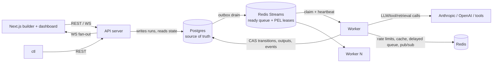

# CLAUDE.md — agentloom: Durable Execution Engine for AI Agent Workflows

## What this project is

A distributed, durable execution engine purpose-built for AI agent workflows — **Temporal-grade distributed-systems guarantees, AI-native orchestration semantics.** Users define workflows as DAGs of steps (LLM calls, tool calls, conditionals, fan-out/fan-in, human approvals); the engine distributes execution across independent worker processes, persists durable state so runs survive crashes and resume from the last completed step, and provides retries, timeouts, idempotency, and dead-lettering.

It sits between: **n8n/Zapier** (easy, not production-grade), **Temporal/Airflow** (production-grade, not AI-native), and **LangGraph** (great agent logic, but an in-process library with no distributed coordination or crash recovery).

**AI-native differentiators (core features, not add-ons):** semantic/self-correcting retries (retry LLM steps with critique-augmented prompts), dynamic runtime DAG generation (planner steps inject steps mid-run, durably), cost-aware scheduling (budgets, model downgrade, park-on-exceed), context/memory management (token accounting + automatic compaction), multi-agent handoff (roles + blackboard + bounded critic⇄writer loops), human-in-the-loop approvals, and a pluggable SPI for tools/agents/retrieval.

## Current status

- **Position:** M0–M6 **complete**. **Next ticket: 7.1** (ADR-008 & telemetry wiring: metric naming scheme `engine_*`, label cardinality budget — never `run_id`/`step_id` as metric labels — log field dictionary, trace propagation design; Prometheus registries + `/metrics` on API and worker admin ports; OTel SDK with OTLP exporter and `service.name`/`service.version` resources; compose profile `obs` — Prometheus, Grafana, Jaeger, scrape configs; telemetry cleanly disabled via config for tests).
- **Complete:** M0 foundation (0.1–0.5; one loose end below), all of M1 (workflow definition core: JSON contract per ADR-003, strict codec, validation, graph algorithms + readiness, CEL edge conditions, canonical examples — plus a post-M1 audit/hardening pass), all of M2 (compose stack, migrations + integration harness, ADR-004 schema v1, store layer, atomic run instantiation, guarded CAS transitions — plus a post-M2 audit/hardening pass: seq-after-CAS + uniform run-lock ordering in transitions, app-written `updated_at`, CI integration job boots the compose stack), M3's 3.1 (ADR-005: pointer envelopes with versioning policy, PEL-as-lease with `JUSTID` heartbeats, ACK discipline + takeover rule, crash matrix with per-cell recovery, delayed-delivery ZSET contract, orphan-consumer janitor), 3.2 (`internal/queue` producer & bootstrap per ADR-005, `RedisConfig`, typed envelope-decode errors, `Stats` depth/PEL introspection), 3.3 (consumer loop: single `process` path shared with the reclaimer, ACK-after-success on a detached context, no-ACK on handler error/panic/bad envelope, shutdown bounded by the configurable `XREADGROUP` block), 3.4 (lease machinery: jittered `XCLAIM JUSTID` heartbeats around every handler invocation, periodic `XAUTOCLAIM` reclaim feeding the shared `process` path with real delivery counts, poison diversion above the delivery-count threshold to a `PoisonHandler` callback with raw contents preserved, orphan-consumer janitor guarded by zero-pending, and TTL-derived interval defaults in `config.QueueConfig`), 3.5 (delayed delivery: `Delayed` handle with deterministic JSON-object ZSET members giving ZADD move-the-fire-time dedup, atomic Lua `PromoteDue` taking caller-injected `now`, `<key>:malformed` quarantine so a bad member can never wedge the promoter, `PromoteResult.MaxLag` as the M7 latency hook, promoter wired as a third consumer duty on `PromoterTick`), 3.6 (queue chaos harness: `internal/queue/queuetest` per the storetest shape — per-test isolated keys, `Spawn`/`Kill`/`KillAt` kill switches driven by the new `ConsumerConfig.PhaseHook` (pre-handle/pre-ack crash points; the only production change, needed because a die-before-ack crash cannot be provoked from outside the package), `Script` behaviors (succeed/fail/hang/panic, last-action-sticky sequences), a shared invocation `Journal`, quiescence assertions (group lag 0 + PEL empty + delayed empty) with diagnostics dump, `RequireHandledOncePerClaim`, and all M3 integration tests refactored onto the harness with contracts unchanged), and 3.7 (post-M3 audit: `Queue.TrimAcked` + per-consumer trim duty — exact `XTRIM MINID` at the smallest pending ID, or last-delivered's successor when the PEL is empty, so acked entries no longer accumulate forever, never touching pending/undelivered entries, group lag proven to survive trims; and Lua ownership-guarded heartbeats so a resumed zombie can no longer silently steal a reclaimed lease back — displacement now logs and stops the heartbeater), M4's 4.1 (executor SPI v0: `internal/exec` with `Executor`/`StepContext` (raw config + rendered input + 1-based attempt + logger)/`Output`, instance-based `Registry` with `*UnknownTypeError`/`*InvalidConfigError` typed errors, `Builtins()` bundling the four test executors — noop, echo, sleep with injectable wait, fail_n_times keyed solely off the durable attempt number; dag catalog grew `sleep`/`fail_n_times` with `config_field_invalid` validation for duration parseability and `n >= 1`, kitchen-sink coverage, regenerated JSON Schema, and exported `dag.DecodeStepConfig` so executors decode `run_steps.config` themselves), 4.2 (worker skeleton: `internal/engine` with `Engine.Handle` — one-`WithTx` `ClaimStep` then ADR-005's ACK discipline via a pure classifier: terminal/fresh-running-duplicate/dangling → ACK-and-drop, reclaimed-running → no-ACK pending 4.5's takeover, transport errors → redeliver; `cmd/worker` deployable with env-only config, graceful SIGINT/SIGTERM drain, periodic health logging (`config.WorkerConfig`, `AGENTLOOM_WORKER_HEALTH_INTERVAL`), nil `PoisonHandler` until M5.4; first integration suite composing storetest + queuetest — two-worker claim race proves exactly-one-executes), 4.3 (execute & complete pipeline: `internal/engine/complete.go` — pure pre-tx `planEdges` (all-matching `when`, branch first-match with trailing default, loop edges excluded, CEL errors fail the step per ADR-003), one completion transaction composing 2.6's primitives (claim-fenced `SucceedStep`, `fanOut` worklist: `ResolveEdge` → counter-guarded `ReadyStep`+outbox / `SkipStep`+skip-propagation, run-rollup attempt with dropped conflicts), ACK moved after commit; executor errors and registry/config misses land a real `FailStep`+`FailRun` failure tx; join-any late firings absorbed status-based with no re-dispatch; `WithDispatchNudge` seam for 4.4's drain loop; `SetCompleteFailpoint` proves single-tx atomicity; trivial `join`/`branch` builtin executors so control-flow fixtures run end-to-end; store grew the read-only `ListRunEdgesFromStep`), and 4.4 (outbox dispatcher & reconciler: `internal/engine/dispatch.go` — `Dispatcher` drain loop, one tx per pass of `ListForDrain` (FOR UPDATE SKIP LOCKED, ErrNoTx-guarded) → XADD via the `Enqueuer` seam → delete-what-XADDed → commit, partial-batch commit on enqueue failure, ticker + cap-1 coalescing `Nudge` wired into 4.3's seam; `internal/engine/reconcile.go` — jittered sweep under a fleet-wide `pg_try_advisory_xact_lock` (losers skip) that re-outboxes stuck-ready steps with no pending row (new reason `reconcile_ready`, heals ADR-005 P2/R1(a); anti-join keeps sweeps idempotent, per-scan `Limit` logged on hit) and flags stale-`running` steps (R1(c), flag-only until 4.5's takeover) plus impossible-state runs; store grew `queries/reconcile.sql` + `store/reconcile.go` (`TryReconcileLock`, staleness scans, all WithTx-required); `cmd/worker` runs both loops with new `WorkerConfig` dispatch/reconcile knobs; the 4.3 integration suite now drains through the production dispatcher; ADR-005 amended — reason vocabulary, R1(c) flagged-4.4/healed-4.5, tuning-table rows), and 4.5 (fencing enforcement: `store.TakeoverStep` — the `running → ready` takeover CAS, fenced on the *observed* holder's `claim_id` so a stale observation can never steal a newer live claim, closing the dangling attempt with the new administrative outcome `lost` and appending the new `step_reclaimed` event; `stepConflict` now always reports `CurrentClaimID` and reports `CallerClaimID` on any claim-guarded rejection; engine claim path grew the three-way classifier (ack-drop/redeliver/takeover) and a one-tx `TakeoverStep`+`ClaimStep` takeover on reclaimed deliveries of running steps, replacing 4.2's no-ACK spin; fenced completions (any terminal-CAS conflict) log both claim IDs and abandon with `errFencedCompletion` — never ACK, since a reclaimed entry's ACK would delete the new holder's lease; the reconciler heals stale-`running` steps with takeover + re-outbox under new reason `reconcile_running` (`ReconcileResult.TakenOver`), dropping per-step conflicts without aborting the sweep; headline integration test: stalled worker A, B reclaims/takes over/completes, resumed A rejected with both claim IDs, successors dispatched exactly once; ADR-004/005 amended — matrix row owned, `lost` outcome, `step_reclaimed`, reason vocabulary, R1(c) healed), and 4.6 (minimal ingest API & `ctl` CLI: `internal/api` — chi router, dev mode, no Redis client per ADR-002 — with `POST /v1/runs` (inline definition XOR stored `definition_id` ref, opaque params, idempotency token → 200 `reused` replay), `GET /v1/runs/{id}` (rollup + steps with full attempt history via new `AttemptRepo.ListByRun` + edges with resolutions), `GET /healthz` (new `Store.Ping`), 400s carrying M1's path-qualified issues in an `{"error": {code, message, issues}}` envelope via exported `DefinitionIssues`/`ValidationIssues`; `cmd/api` deployable with new `config.APIConfig` and graceful drain, `cmd/demo` deleted; cobra `cmd/ctl` — `validate` (local M1 validation), `submit` (run id alone on stdout so `ctl watch "$(ctl submit …)"` composes), `watch` (poll + topologically-indented status tree, exit 0/1 on succeeded/failed); `llm`/`tool`/`retrieve` added to `Builtins()` as deterministic dev-stub executors (`"stub": true` outputs; replaced in place by M8/M9) so the canonical fixtures execute; `deploy/dockerfiles/Dockerfile` multi-stage with api/worker/migrate targets; compose `app` profile (`make up-app`) — one-shot migrate job gating api (healthchecked `/healthz`) + 2 worker replicas, keeping `make up`/CI stores-only; acceptance verified live: fanout.json submitted and watched to `succeeded` on compose), and 4.7 (flagship crash-recovery test & demo: `test/crash` spawns real `cmd/worker` subprocesses and SIGKILLs them — scenario 1 kills the PEL-identified lease holder mid-`sleep` and asserts reclaim/takeover/completion with attempt history exactly `lost`→`succeeded`, one `step_reclaimed`, one line per counter file; scenario 2 SIGKILLs the whole fleet, proves the frozen-run state, and shows fresh workers resume from the last completed step; enablers: `AGENTLOOM_QUEUE_STREAM`/`_GROUP`/`_DELAYED_KEY` isolation knobs, the fifth test step type `counter` (O_APPEND external-effect ledger, also M5's no-double-fire probe), `storetest.NewDBWithDSN`; packaged as `make demo-crash` with narrated two-act output, documented in `docs/demos/crash-recovery.md`; `docs/architecture.md` gained the realized-walkthrough section, closing the milestone-exit doc obligation) — **plus a post-M4 audit/hardening pass** (worker bootstrap-failure deadlock fixed, trim-test CI flake cured in the queuetest harness, deterministic in-tx config corruption now lands a real failure completion instead of a takeover re-execution loop, stale-`running` takeover skips the re-outbox when a dispatch row is already pending, panic containment in API middleware and dispatcher/reconciler passes, exec-registry↔dag-catalog sync test with an explicit deferred set, `cmd/api` lifecycle test, crash-suite lease TTL margin doubled, ADR-005 amended with the post-4.5 accepted races and the `RunningStale` wall-clock-cap rule — details in the progress log) — and M5's 5.1 (ADR-006: failure taxonomy & retry semantics — five error classes with `validation_failed` reserved-and-rejected until M11, a 14-row taxonomy table mapping every 4.x failure path, default-transient for unclassified executor errors, `lost` excluded from the retry budget (poison threshold bounds crash loops), Postgres-as-DLQ with `dead_letters` + requeue-from-baseline, `fail_fast` vs `continue_independent_branches` with eager write-off of blocked descendants, policies materialized onto `run_steps` in 5.2; contract half implemented in `internal/dag` — `Step.Retry`/`Definition.OnFailure` with strict decode, bounds validation under new codes `retry_field_required`/`retry_field_invalid` (backoff cap required, `max_attempts` ≤ 100, `retry_on` ⊆ {transient, timeout}), canonical encoding, regenerated JSON Schema, fixtures + both corpora carrying explicit policies with construct-coverage pins) and 5.2 (retry engine with backoff: migration 0003 — `run_steps.retry_policy` materialized effective policy + `next_attempt_at`, `retrying` status, the postponed `step_attempts.outcome` CHECK with the classed vocabulary (bare `failed` backfilled to `permanent`), retrying partial index, and the post-M4-audit `task_outbox(run_id, step_id)` index; `store.RetryStep` — claim-fenced `running → retrying` recording the class, clearing the claim, stamping `next_attempt_at`, appending `step_retry_scheduled`, never bumping `steps_failed`; `FailStep` takes a required class `Outcome`; the claim CAS accepts due retrying steps (`next_attempt_at ≤ now` — the backoff enforcer against early duplicates) and refuses steps of non-running runs (`run_not_running`, reused by 5.6); `exec.ClassifiedError`/`Transientf`/`Permanentf`; engine `classifyFailure` (declared honored, registry/config misses force-permanent, default-transient) + pure `retryDelay` (full jitter via injected rand) + `completeFailure` as router (budget = `CountCountedFailures`, outcomes transient/timeout only, `lost` excluded) with post-commit delayed scheduling through the `RetryScheduler` seam — reason `retry`, no EnqueuedAt so ZADD dedups to one pending retry per step, failures log-and-ACK since the row is the truth; reconciler heals the commit-then-schedule gap via the overdue-retrying anti-join scan + `reconcile_retry` re-outbox (`ReconcileRetryStale` knob, ADR-005 crash cell P3); headline tests on a fully injected clock prove exact backoff timings, exhaustion with full history, and the reconciler heal; ADR-004/005/006 amended with the as-built collapsed transitions), and 5.3 (step execution timeouts: `Step.Timeout` — a step-envelope Go-duration field like `retry`, validated parseable/positive/≤ 24h under new code `timeout_field_invalid`, kitchen-sink corpora + construct pins extended; migration 0004 materializes it as nullable `run_steps.timeout` TEXT (NULL = no timeout, no backfill); engine `runExecutor` — synchronous cooperative cancellation under `context.WithTimeout` (no detached goroutine: nothing leaks and a step can never run concurrently with its own retry in-process) plus a joined watchdog goroutine logging deadline overruns; class judged from context state per ADR-006 row 3 — expired + error → `ClassTimeout` through the 5.2 retry router, parent cancellation deliberately not a timeout (5.6's), success racing the deadline honored, corrupt materialized timeout → permanent failure completion; timeout ≠ reclaim: the heartbeat wraps the whole handler so a live worker records `timeout` where a crash records `lost` via takeover, proven in the headline integration test (attempt history exactly [timeout, timeout], zero `step_reclaimed` events, backoff on the injected clock) and the no-leak criterion by a goroutine-count unit test; `ReconcileRunningStale` guidance updated — size it above the largest configured timeout; ADR-006 gained the as-built “Step execution timeouts” section), 5.4 (dead-letter handling: migration 0005 — step statuses `dead_lettered`/`cancelled` (`failed` retired as a resting state, kept for pre-5.4 rows), `runs.on_failure` materialized failure policy + `steps_cancelled` counter, and the `dead_letters` table keyed `(run_id, step_id, seq)` with source `retries_exhausted|permanent|poison`, nullable class, raw poison payload, and `attempts_at_death`; store — `FailStep` replaced by the claim-fenced direct CAS `DeadLetterStep` (attempt closed with its judged class, `steps_failed` bump, DLQ row + event in one tx), unfenced `PoisonDeadLetterStep` from any non-terminal status (claim cleared, dangling attempt closed `lost`), `CancelStep`/`ReviveStep` write-off pair, `RequeueStep`/`ResumeRun` requeue pair, all-terminal `FailRunRollup`, `CountCountedFailures` counting from the `attempts_at_death` baseline (requeue re-arms the budget with immutable history), and reconciler step scans filtered to running runs (ends the failed-run re-outbox churn); engine — `planWriteOff` pure fixed-point (join-any survives any live parent), `deadLetterDisposition` shared by judged and poison paths (`fail_fast` → `FailRun`; `continue` → write-off + rollup attempt), `completeFailure` terminal branch dead-letters with the source rule (`retries_exhausted` iff a retryable class exhausted), dual rollup in `attemptRunRollup`, `HandlePoison` wired as the worker's `PoisonHandler` (DLQ row is the durable consumption → the one failure-path ACK; undecodable envelopes logged-with-contents and consumed), `Engine.Requeue` (resume failed run, revival recompute of written-off descendants, `dlq_requeue` outbox rows for all undispatched ready steps), claim/takeover classifiers ack-drop the new terminal statuses; `ctl watch` renders `†`/`⊘`; headline integration tests: continue-mode write-off with partial results, poison crash-loop quiescing into the DLQ, and requeue re-executing through a re-armed budget to run success; ADR-004/005/006 amended with the as-built rows), and 5.5 (idempotency keys & side-effect journal: `effects.Key` — the stable per-(run, step) idempotency key as a UUIDv5 over a fixed namespace, derived not stored, stable across attempts/reclaims/takeovers by construction, stamped onto the new `StepContext.IdempotencyKey`; migration 0006 — the `side_effects` table keyed `(run_id, step_id, effect_id)` with `intent|done` status, diagnostics-only attempt/claim, and journaled `result`; `internal/exec/effects` — the journal protocol (record-intent → execute → record-result, each phase its own short tx, never spanning the external call) behind `StepContext.Effects` (`exec.EffectJournal`, `Do`-only interface; `Begin`/`Complete` primitives on the concrete `*StepJournal`): done rows short-circuit re-execution (the exactly-once half), dangling intents are taken over and re-executed (the documented residual at-least-once window the key absorbs externally), result writes are first-wins (never claim-fenced — step-level fencing already rejects the zombie's outcome), and misuse (execute without intent) panics under `AGENTLOOM_EFFECTS_STRICT` (default true; `WithStrictEffects`) riding the consumer's panic containment into the poison DLQ, or dead-letters permanent when non-strict; test executor `effectful_echo` (dag catalog + `Builtins()`) journals one `key=… attempt=…` file line then optionally fails `fail_times` attempts *after* the journal, so retries prove N+1 attempts with one line; headline integration tests — retry short-circuit on the fake clock, the kill/reclaim key-stability scenario (A journals then stalls, B takes over and short-circuits, A fenced, one line one key, history `[lost, succeeded]`), and misuse both ways; no events for journal writes by design; ADR-004/005/006 amended with the as-built section), 5.6 (cancel, park/resume, run deadlines: migration 0007 — run statuses `parked`/`cancelling`/`cancelled` with typed `park_reason`/`cancel_reason` and the materialized `deadline_at` + partial scan index; engine ops `Cancel`/`Park`/`Unpark` (API in M6.5); cancel converges via three mechanisms — the request transaction's sweep (claimless pending/ready/retrying steps → `cancelled` through the broadened 5.4 CAS, finalization rollup `cancelling → cancelled` when nothing is in flight), completion transactions re-checking run status under the run lock (`store.LockRunStatus`: success honored without fan-out, failure settled through the new claim-fenced `CancelRunningStep` with attempt outcome `cancelled` — never judged, per ADR-006 row 8), and the cancellation watch (a joined poller per executor invocation, `AGENTLOOM_WORKER_CANCEL_POLL_INTERVAL` default 10s, cancelling the executor context — pure latency, the in-tx check is the authority); the reconciler heals dead-worker cancelling runs (takeover `lost` + cancel + rollup, never a re-outbox) and enforces `max_wall_clock` (new dag field, ≤ 30d, code `max_wall_clock_field_invalid`) via the deadline scan feeding the same sweep with reason `deadline_exceeded`; park is a pure dispatch pause — the claim guard refuses parked runs, in-flight completions fan out normally, rollups fire from parked (guards widened to `running|parked`), and unpark re-outboxes ready-without-outbox steps under new reason `unpark`; `Engine.Requeue` refuses cancelled runs; `ctl watch` treats `cancelled` as terminal; headline tests — mid-run cancel with watch-interrupted sleep and full queue quiescence, success-racing-cancel honored, park → zero-attempt bounce → unpark → completion, deadline on the injected clock, cancelling-run crash heal with history `[lost]`), and 5.7 (graceful shutdown & drain: two-phase consumer shutdown — soft stop suspends reads and every periodic duty while handlers run on under a work context surviving the cancellation, hard-cancelled by a watchdog at `ConsumerConfig.DrainTimeout`; the drain covers the whole PEL in hand (in-flight handler, read-batch remainder, reclaimed entries mid-pass) through the new `deliver` path, each entry logged with its disposition (drained/redeliver/abandoned) plus a summary; the abandon path is deliberately the crash path — the engine returns `step abandoned at shutdown` without attempting a completion on a cancelled handler context, the entry stays un-acked, the lease expires into reclaim/takeover; a clean-drained consumer self-deregisters (`XGROUP DELCONSUMER` guarded by a stable empty-PEL check) so graceful restarts strand no orphan, while `DrainTimeout` zero keeps the pre-5.7 immediate-cancel semantics the queuetest kill switches need for crash simulation; `cmd/worker` gains `AGENTLOOM_WORKER_DRAIN_TIMEOUT` (default 25s, inside K8s's 30s grace) and moves dispatcher/reconciler/health onto a context outliving SIGTERM until the consumer drains, so draining completions' successors still dispatch; queuetest gains the non-joining `ConsumerHandle.Interrupt`; headline tests — queue-level drain-finishes-hang/batch-remainder/deadline-abandons, and crash-suite real-SIGTERM scenarios: rolling restart of 2 workers under continuous load with every step exactly `[succeeded]`, zero `step_reclaimed`, counters exact; and a 500ms budget abandoning a 6s sleep to the survivor with history `[lost, succeeded]`), and 5.8 (sustained chaos suite: `TestSustainedChaos` in `test/crash` — a continuous submitter cycling five fixtures (chain, retry, effectful, fan-out/join, deliberate dead-letter) against a 3-worker fleet under random SIGKILLs every ~3s plus one mid-run Redis restart, executed against a **dedicated `redis-chaos` compose service** (`restart: always`, own AOF volume, port `AGENTLOOM_REDIS_CHAOS_PORT`/test knob `AGENTLOOM_TEST_CHAOS_REDIS_ADDR`) bounced via client-issued `SHUTDOWN NOSAVE` and proven restarted by the server run_id changing (go-redis retries mask the sub-second downtime; SHUTDOWN itself returns nil); the reconciler runs hot (1s sweeps) because the deliberate ~1s AOF tail loss is healable only by its scans; expected terminal states are kill-proof by construction (`lost` excluded from budgets, `fail_n_times` on durable attempt numbers, poison threshold raised to 50) and the dead-letter fixture must land exactly one `retries_exhausted` DLQ row; journaled effects asserted exactly-once **by idempotency key** (raw line count only ≥1 — the intent→result crash window is the journal's documented residual), unjournaled counters bounded [1, attempts] as the contrast; quiescence via 3.6's `WaitQuiescent` + outbox-empty, diagnostics dumped on any failure; harness addition `queuetest.NewAt`, zero production changes; CI short mode ~28s (24s window, ~104 runs) green 5× consecutively under `-race`, long mode `make test-chaos-long` via `AGENTLOOM_CHAOS_DURATION`), and M6's 6.1 (ADR-007 & API key model: bearer keys `sk_` + base64url(32B) stored as hex SHA-256 (fast hash by design — 256-bit secret, no KDF) + 11-char UNIQUE lookup prefix with regenerate-on-collision, plaintext returned once by `POST /v1/keys` and nowhere else; scopes `submit`/`read`/`approve`(reserved M15)/`admin`-implies-all with the route→scope table decided through 6.5/M15; lifecycle = create (server-clock-resolved TTL) / soft first-wins idempotent revoke / auth-time expiry; migration 0008 `api_keys` + plain-CRUD `APIKeyRepo`; `internal/api/auth.go` verifier + scope-parameterized `requireScope` middleware gating only the `/v1/keys` subtree until 6.2, 401 indistinguishable for every credential failure vs 403 naming the missing scope; `AGENTLOOM_API_ROOT_KEY` bootstrap credential hashed at boot, logged `key_id="root"`, never stored — set → mint admin key → unset; `ctl keys create/list/revoke` with `--key`/`AGENTLOOM_API_KEY` bearer and plaintext-alone-on-stdout composability; secret hygiene proven by a captured-slog + all-columns integration assertion with the prefix as positive control, plus a CI grep failing on committed `sk_`-shaped literals — tests construct keys at runtime), and 6.2 (auth middleware: `requireScope` mounted per-route on every `/v1` route per ADR-007's table — `submit` on `POST /v1/runs`, `read` on `GET /v1/runs/{id}`, `admin` on `/v1/keys`, `/healthz` exempt; a `chi.Walk` route-coverage unit test fails any `/v1` route missing from the route→scope table so a new endpoint can't ship anonymous by omission (404/405 fallbacks deliberately anonymous — outside the middleware tree, route existence is public); authenticated identity stamped into the request context (`identityFrom`, 6.4's per-key rate-limit hook) and `key_id` reported up to the per-request log line via a mutable `authStamp` slot; the credential matrix integration test drives every route through missing/malformed/non-Bearer/unknown/forged-prefix/revoked → uniform 401 + `WWW-Authenticate`, all-scopes-but-the-right-one → 403 naming the scope, exact-scope and admin-implies-all → success, TTL expiry → 401 everywhere, with log discipline asserted (key_id + `missing_scope` present, no plaintext, prefix as positive control); both parked post-M4-audit items resolved — compose api binds `127.0.0.1` by default (`AGENTLOOM_API_BIND` overrides), and the filesystem-writing test executors (`counter`, `effectful_echo`) left the production default registry: `exec.CoreBuiltins()` unless `AGENTLOOM_WORKER_TEST_EXECUTORS=true` (binary default false; compose and the crash harness set true), unregistered types dead-lettering permanent at claim time per 5.4; demo-crash authenticates as the root credential, minting an ephemeral one when `.env` has none), and 6.3 (Redis token-bucket limiter: `internal/ratelimit` — `Limiter.Acquire(ctx, Bucket{Key, Capacity, RefillPerSec}, cost)` runs one atomic Lua script returning `Result{Allowed, Remaining, RetryAfter}`; the script reads Redis `TIME`, deliberately not caller-injected time — a bucket is shared state and a skewed caller could mint tokens for everyone, so one Redis = one clock, with fake time reaching the script only through a test-only ARGV override behind `export_test.go` and backwards time clamped to zero; state is one hash per bucket key with absent-key-=-full-bucket and TTL re-armed to time-to-full each acquire so idle buckets self-clean (rate-zero fixed quotas PERSIST instead), balance serialized `%.17g` for an exact float64 round-trip; config rides along per acquire so limit changes apply next request and capacity shrinks clamp; `cost > capacity` → typed `ErrCostExceedsCapacity` and never-refilling denials → `RetryAfterNever`, both for M9's wait-vs-perm-fail distinction; no logging in the library; proven by the exact-accounting concurrency stress test (32 goroutines × 100 acquires → exactly 500 grants), a rapid property test demanding exact equality against a pure-Go model of the refill math (2000 iterations), and `BenchmarkAcquire` — ~141µs/op sequential, ~44µs/op parallel, ≈7× under the 1ms target), and 6.4 (per-client API rate limiting: `rateLimit(class)` middleware mounted after `requireScope` on every `/v1` route — buckets `<prefix>:<key_id>:<class>` off the authenticated identity (root under `"root"`), so 401/403s consume nothing; route→class mirrors the scope table with its own chi.Walk coverage test; per-key acquired before global so an abusive client's 429 storm can't drain the shared budget (a global denial deliberately doesn't refund the per-key token); fail-open on Redis errors — `cmd/api`'s new Redis client serves rate-limit buckets only (ADR-002 untouched), boots without Redis, and Postgres stays the API's only hard dependency; 429s carry new envelope code `rate_limited` + `Retry-After` (whole seconds, rounded up, from the denying bucket) while `X-RateLimit-Limit`/`-Remaining`/`-Reset` always describe the caller's class bucket, Reset derived ceil((capacity−remaining)/refill) per the 6.3 deferred decision; config `AGENTLOOM_API_RATELIMIT_{ENABLED,KEY_PREFIX,{SUBMIT,READ,ADMIN,GLOBAL}_{CAPACITY,REFILL_PER_SEC}}` with strictly-positive refill validated at parse and in `api.New` (a rate-zero API bucket would brick a key); `RateLimitMetrics` seam no-op until M7; integration suite proves threshold exactness with the header countdown, refill recovery by bounded real-time polling (the limiter's clock is Redis's by design), global-bucket protection with every key individually under-limit, per-key/per-class isolation, root-key limiting, and credential-failure storms consuming nothing), and 6.5 (run & definition lifecycle endpoints: `engine.Control` — Cancel/Park/Unpark/Requeue extracted from Engine (which embeds it), `NewControl` giving the API a registry-free control surface with a deliberately nil dispatcher nudge (worker drain cadence dispatches, ADR-002 intact), Requeue's cancelled-run refusal typed as `ErrRunNotRequeueable`; migration 0009 — `runs.idempotency_fingerprint` + the run-list keyset indexes (`created_at DESC, id DESC` and partial definition_id variant); idempotency per the post-M4 audit — token moved to the `Idempotency-Key` header (body field removed), ≤ 200 bytes → 400, fingerprint (SHA-256 over canonical snapshot + canonicalized params + ref) binds token→payload with mismatch → 409 `idempotency_key_conflict` via typed `*store.IdempotencyMismatchError`, pre-0009 rows grandfathered, tokens global by decision; definition registry — `Store.CreateDefinition` (canonical spec, v1, 409 on existing name) and `CreateDefinitionVersion` (per-name `pg_advisory_xact_lock` serializes MAX+1 allocation — concurrent appenders proven consecutive), routes for create/new-version/get/list-latest-per-name/versions; `GET /v1/runs` keyset list (opaque base64url cursors, status/definition/time filters, uniform descending order making the concurrent-insert acceptance hold by construction); lifecycle routes cancel/park/unpark/requeue under submit scope with new envelope codes `conflict`/`step_not_found`, shared store-error mapper, `GET /v1/runs/{id}` now carrying `dead_letters` + the 5.x RunView columns; ctl grew runs/cancel/park/unpark/requeue; e2e acceptance — DLQ requeue to success on the re-armed budget, in-flight cancel with history exactly `[cancelled]`, park/strand/unpark re-dispatching exactly the stranded step — all through the API against the production dispatcher + fleet), and 6.6 (OpenAPI contract & docs: hand-maintained `api/openapi.yaml` in OpenAPI **3.1** — its schema dialect is JSON Schema 2020-12, so the workflow-definition schema is one external `$ref` to the generated `docs/schema/workflow-definition.v1.json` with zero duplication; all 16 `/v1` routes + `/healthz` with component schemas mirroring `internal/api/types.go`, closed vocabularies as enums, `additionalProperties: false` on request bodies matching `DisallowUnknownFields`, the `bearerAuth` scheme, the error envelope with the full `ErrorCode` enum, `Idempotency-Key` parameter, and the 401/429 response headers; enforcement two-layer — `make openapi-lint` runs go-run-pinned vacuum at `--fail-severity warn` with `api/vacuum.ruleset.yaml` disabling exactly three justified style rules (spec lints 100/100, CI lint job gained the step), and `TestOpenAPIRouteCoverage` compares `chi.Walk` against the spec's `paths` both directions with param names normalized, so route drift fails the ordinary unit-test job, with `TestOpenAPIOperationContracts` pinning operationId + schema'd 2xx everywhere and 401/403/429 on every `/v1` operation; `docs/api.md` curl walkthroughs for auth bootstrap, idempotent submission, pagination, the definition registry, lifecycle steering, DLQ requeue, and rate-limit headers; field-level types.go↔spec sync stays a by-hand discipline recorded in both files' comments).
- **Open loose ends:** the one-time CI verification on GitHub — ticket 0.2's red path plus the reworked compose-based integration job from the post-M2 pass; a deferred cosmetic quirk in loop-edge `max_iterations: 0` error reporting. (The long-deferred storetest template-database fast path is now a recorded won't-do-until-it-hurts decision — see the 3.7 progress-log entry.)
- **Per-ticket history lives in [`docs/progress.md`](docs/progress.md)** — what each ticket delivered, non-obvious decisions, deferred quirks. Read the sections relevant to the code you're about to touch before starting a ticket that builds on earlier work.

## How to work on this project

1. **`ROADMAP.md` is the source of truth for sequencing.** 22 milestones (M0–M21), 134 tickets, strictly linear — dependencies only point backwards. Pick the first unfinished ticket, complete it fully, move on. Do not skip ahead or start milestones out of order.
2. **One ticket = one focused session** (1–4h, ~a couple hundred LOC). If a ticket balloons, split it and record the split in ROADMAP.md.
3. **Definition of Done (every ticket):** lint + tests green (integration tests when crossing process/datastore boundaries); tests written in the same ticket as the behavior; structured logs (and metrics/traces once M7 exists) on new hot paths; ADRs updated if a decision changed; no secrets anywhere; no TODOs without a ticket reference.
4. **Status convention:** check off acceptance-criteria boxes in ROADMAP.md as you complete them; append ` ✅` to the ticket heading when all are checked. On finishing a ticket, append its detailed entry to `docs/progress.md` (what it delivered, non-obvious decisions, deferred quirks) and refresh the short Current-status block above — the details go in the log, never inline here.
5. **ADRs govern design.** Most milestones open with an ADR ticket; implementation must conform. If reality contradicts an ADR, update the ADR and affected future tickets in the same change. ADRs live in `docs/adr/`.
6. **Testing discipline:** unit tests always; integration tests (build tag `integration`) run against the Docker Compose stack (`make test-integration`); chaos/crash tests are first-class deliverables, not optional extras.

## Architecture summary

Two long-running deployables + shared internal packages (ADR-001). No central scheduler (ADR-002): scheduling is event-driven — the worker that completes a step computes successor readiness in the same transaction and dispatches via a transactional outbox.



**Execution flow:** submit → validate → instantiate run in one tx (per-run graph copy, entry steps `ready`, outbox rows) → outbox drained to Redis Streams → a worker claims via Postgres CAS (`ready → running`, fresh `claim_id`) → executes through the middleware chain → completion tx (output + CAS + evaluate CEL edges + decrement join counters + outbox newly-ready steps + events) → ACK.

**Key mechanisms:**
- **Leases:** the Redis Streams pending-entries list (PEL) is the lease ledger. Heartbeat = `XCLAIM JUSTID` to self; reclaim = `XAUTOCLAIM` with min-idle = lease TTL; poison detection via delivery count. Postgres `claim_id` fencing rejects zombie writes. At-least-once delivery + CAS-guarded claims + idempotency keys = effectively-once execution.
- **Outbox + reconciler:** every Postgres→Redis handoff goes through a transactional outbox drained by all workers (`FOR UPDATE SKIP LOCKED`); a periodic reconciler heals crash gaps and stuck states.
- **Executor middleware chain** (order matters): cache read → rate limit (fleet-wide Redis token buckets; throttled = delayed requeue, not a failure) → budget check (park/downgrade) → context assembly + compaction → execute → validate (semantic retries on `validation_failed`) → cost ledger → cache write.
- **Per-run graph copy:** each run owns its graph rows, so planner steps mutate the graph atomically with their completion (`ExpandRun`, `graph_version++`). Loops are authored as marked loop edges and executed by unrolling iterations through the same expansion machinery — the instance graph stays acyclic.
- **Park/resume:** one primitive underlies manual pause, budget-exceeded halts, and human approvals (approvals ACK the queue message — no lease or worker slot is held while waiting).
- **Events:** append-only per-run event log with monotonic `seq` in Postgres (truth), Redis pub/sub for low-latency fan-out, WS protocol = snapshot → backfill from `last_seq` → live tail.

## Tech stack

| Area | Choice |
|---|---|
| Backend | Go; chi (HTTP), coder/websocket, pgx v5 + sqlc, golang-migrate, go-redis, cel-go (expressions), invopop/jsonschema (schema generation), slog |
| Data | Postgres (durable state, source of truth), Redis (streams/leases, token buckets, delayed ZSET, cache, pub/sub) |
| LLM | Anthropic + OpenAI behind one provider interface; deterministic mock provider for tests and load |
| Observability | Prometheus client_golang, OpenTelemetry (trace context propagated through queue envelopes), Grafana + Jaeger in compose |
| Frontend | Next.js (App Router, TS strict), React Flow (`@xyflow/react`), zustand, Tailwind + shadcn/ui, elkjs, openapi-typescript, vitest + Playwright |
| Infra | Docker multi-stage → Docker Compose (local, from M2) → Helm on EKS, RDS, ElastiCache, ECR, Terraform, KEDA (queue-depth autoscaling), GitHub Actions |

## Planned repository layout

```
cmd/            api, worker, ctl, loadgen
internal/
  version/      build version of agentloom binaries (ldflags-injected)
  dag/          definition types, validation, graph algorithms, CEL
  store/        Postgres repositories (sqlc), migrations, tx helpers
  queue/        Redis Streams, leases, delayed delivery, chaos harness
  engine/       claim/execute/complete pipeline, outbox, reconciler
  exec/         executor SPI, registry, middleware, side-effect journal
  llm/          provider interface, Anthropic, OpenAI, mock
  tools/        tool SPI + built-ins (http_request, json_transform)
  ratelimit/    Redis token bucket (shared by API + fleet limits)
  cache/        response cache, key builder
  cost/         pricing catalog, ledger, budget enforcement
  contextmgr/   token counting, blackboard, assembly, compaction
  validate/     validator SPI, deterministic + LLM-judge validators
  api/          HTTP handlers, auth, WS
  obs/          logging, metrics, tracing
  config/
web/            Next.js app (lib/graphdef = serialization boundary)
deploy/         helm/, terraform/, dockerfiles
docs/           architecture.md, adr/, demos/, load/, examples/
examples/       definitions/ (canonical workflow JSON fixtures)
test/           integration + chaos suites
api/openapi.yaml
```

## Non-negotiable invariants

- **Postgres is the source of truth**; Redis is redeliverable transport + coordination. Any Redis data loss must be recoverable via the reconciler.
- **Every state transition is a guarded CAS** appending an event in the same transaction. Completion requires the matching `claim_id` (fencing).
- **Enqueue is at-least-once; claims dedupe.** Duplicate deliveries are ACK-and-drop, never double-execution.
- **Side effects go through idempotency keys** (stable across attempts/reclaims) and/or the side-effect journal.
- **Graph mutations are atomic with planner completion** — no observable half-expanded state, ever.
- **No metric labels with unbounded cardinality** (`run_id`/`step_id` are log/trace fields, never metric labels).
- **No secrets in code, fixtures, logs, traces, or state.** Provider keys via env/config only.
- **Time is injectable** — no bare `time.Now()`/sleeps in logic under test; chaos and backoff tests use controlled clocks.
- **The workflow definition JSON is a versioned contract** — Go structs are the source of truth; JSON Schema is generated; the UI serialization module round-trips unknown fields.

## Scope boundaries

Not building: model training/fine-tuning, LLM/tool implementations (real provider APIs via the SPI), a generic non-AI automation platform, fine-grained microservices (exactly two deployables), multi-tenancy in v1. See ROADMAP.md non-goals and Appendix A backlog.

## Glossary

**run** — one execution of a workflow definition (owns a graph copy) · **step** — node in a run's graph · **attempt** — one execution try of a step · **lease** — a worker's time-bound claim on a step (PEL entry + heartbeat) · **claim_id** — fencing token guarding state writes · **outbox** — transactional Postgres→Redis dispatch buffer · **reconciler** — periodic healer for crash gaps · **blackboard** — run-scoped shared memory store · **expansion** — atomic runtime graph mutation (planners, map, loop unrolling) · **semantic retry** — re-attempt with critique-augmented prompt after output validation fails · **park** — pause a run without holding leases (manual / budget / approval).
