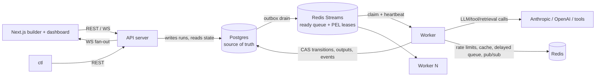

# CLAUDE.md — agentloom: Durable Execution Engine for AI Agent Workflows

## What this project is

A distributed, durable execution engine purpose-built for AI agent workflows — **Temporal-grade distributed-systems guarantees, AI-native orchestration semantics.** Users define workflows as DAGs of steps (LLM calls, tool calls, conditionals, fan-out/fan-in, human approvals); the engine distributes execution across independent worker processes, persists durable state so runs survive crashes and resume from the last completed step, and provides retries, timeouts, idempotency, and dead-lettering.

It sits between: **n8n/Zapier** (easy, not production-grade), **Temporal/Airflow** (production-grade, not AI-native), and **LangGraph** (great agent logic, but an in-process library with no distributed coordination or crash recovery).

**AI-native differentiators (core features, not add-ons):** semantic/self-correcting retries (retry LLM steps with critique-augmented prompts), dynamic runtime DAG generation (planner steps inject steps mid-run, durably), cost-aware scheduling (budgets, model downgrade, park-on-exceed), context/memory management (token accounting + automatic compaction), multi-agent handoff (roles + blackboard + bounded critic⇄writer loops), human-in-the-loop approvals, and a pluggable SPI for tools/agents/retrieval.

## Current status

- **Position:** M0–M4 **complete**. **Next ticket: 5.1** (ADR-006: failure taxonomy — transient/permanent/timeout/cancelled with `validation_failed` reserved for M11, step-vs-run failure semantics, workflow failure policy, DLQ model, retry-policy fields on steps with engine defaults; definition schema + validation extended).
- **Complete:** M0 foundation (0.1–0.5; one loose end below), all of M1 (workflow definition core: JSON contract per ADR-003, strict codec, validation, graph algorithms + readiness, CEL edge conditions, canonical examples — plus a post-M1 audit/hardening pass), all of M2 (compose stack, migrations + integration harness, ADR-004 schema v1, store layer, atomic run instantiation, guarded CAS transitions — plus a post-M2 audit/hardening pass: seq-after-CAS + uniform run-lock ordering in transitions, app-written `updated_at`, CI integration job boots the compose stack), M3's 3.1 (ADR-005: pointer envelopes with versioning policy, PEL-as-lease with `JUSTID` heartbeats, ACK discipline + takeover rule, crash matrix with per-cell recovery, delayed-delivery ZSET contract, orphan-consumer janitor), 3.2 (`internal/queue` producer & bootstrap per ADR-005, `RedisConfig`, typed envelope-decode errors, `Stats` depth/PEL introspection), 3.3 (consumer loop: single `process` path shared with the reclaimer, ACK-after-success on a detached context, no-ACK on handler error/panic/bad envelope, shutdown bounded by the configurable `XREADGROUP` block), 3.4 (lease machinery: jittered `XCLAIM JUSTID` heartbeats around every handler invocation, periodic `XAUTOCLAIM` reclaim feeding the shared `process` path with real delivery counts, poison diversion above the delivery-count threshold to a `PoisonHandler` callback with raw contents preserved, orphan-consumer janitor guarded by zero-pending, and TTL-derived interval defaults in `config.QueueConfig`), 3.5 (delayed delivery: `Delayed` handle with deterministic JSON-object ZSET members giving ZADD move-the-fire-time dedup, atomic Lua `PromoteDue` taking caller-injected `now`, `<key>:malformed` quarantine so a bad member can never wedge the promoter, `PromoteResult.MaxLag` as the M7 latency hook, promoter wired as a third consumer duty on `PromoterTick`), 3.6 (queue chaos harness: `internal/queue/queuetest` per the storetest shape — per-test isolated keys, `Spawn`/`Kill`/`KillAt` kill switches driven by the new `ConsumerConfig.PhaseHook` (pre-handle/pre-ack crash points; the only production change, needed because a die-before-ack crash cannot be provoked from outside the package), `Script` behaviors (succeed/fail/hang/panic, last-action-sticky sequences), a shared invocation `Journal`, quiescence assertions (group lag 0 + PEL empty + delayed empty) with diagnostics dump, `RequireHandledOncePerClaim`, and all M3 integration tests refactored onto the harness with contracts unchanged), and 3.7 (post-M3 audit: `Queue.TrimAcked` + per-consumer trim duty — exact `XTRIM MINID` at the smallest pending ID, or last-delivered's successor when the PEL is empty, so acked entries no longer accumulate forever, never touching pending/undelivered entries, group lag proven to survive trims; and Lua ownership-guarded heartbeats so a resumed zombie can no longer silently steal a reclaimed lease back — displacement now logs and stops the heartbeater), M4's 4.1 (executor SPI v0: `internal/exec` with `Executor`/`StepContext` (raw config + rendered input + 1-based attempt + logger)/`Output`, instance-based `Registry` with `*UnknownTypeError`/`*InvalidConfigError` typed errors, `Builtins()` bundling the four test executors — noop, echo, sleep with injectable wait, fail_n_times keyed solely off the durable attempt number; dag catalog grew `sleep`/`fail_n_times` with `config_field_invalid` validation for duration parseability and `n >= 1`, kitchen-sink coverage, regenerated JSON Schema, and exported `dag.DecodeStepConfig` so executors decode `run_steps.config` themselves), 4.2 (worker skeleton: `internal/engine` with `Engine.Handle` — one-`WithTx` `ClaimStep` then ADR-005's ACK discipline via a pure classifier: terminal/fresh-running-duplicate/dangling → ACK-and-drop, reclaimed-running → no-ACK pending 4.5's takeover, transport errors → redeliver; `cmd/worker` deployable with env-only config, graceful SIGINT/SIGTERM drain, periodic health logging (`config.WorkerConfig`, `AGENTLOOM_WORKER_HEALTH_INTERVAL`), nil `PoisonHandler` until M5.4; first integration suite composing storetest + queuetest — two-worker claim race proves exactly-one-executes), 4.3 (execute & complete pipeline: `internal/engine/complete.go` — pure pre-tx `planEdges` (all-matching `when`, branch first-match with trailing default, loop edges excluded, CEL errors fail the step per ADR-003), one completion transaction composing 2.6's primitives (claim-fenced `SucceedStep`, `fanOut` worklist: `ResolveEdge` → counter-guarded `ReadyStep`+outbox / `SkipStep`+skip-propagation, run-rollup attempt with dropped conflicts), ACK moved after commit; executor errors and registry/config misses land a real `FailStep`+`FailRun` failure tx; join-any late firings absorbed status-based with no re-dispatch; `WithDispatchNudge` seam for 4.4's drain loop; `SetCompleteFailpoint` proves single-tx atomicity; trivial `join`/`branch` builtin executors so control-flow fixtures run end-to-end; store grew the read-only `ListRunEdgesFromStep`), and 4.4 (outbox dispatcher & reconciler: `internal/engine/dispatch.go` — `Dispatcher` drain loop, one tx per pass of `ListForDrain` (FOR UPDATE SKIP LOCKED, ErrNoTx-guarded) → XADD via the `Enqueuer` seam → delete-what-XADDed → commit, partial-batch commit on enqueue failure, ticker + cap-1 coalescing `Nudge` wired into 4.3's seam; `internal/engine/reconcile.go` — jittered sweep under a fleet-wide `pg_try_advisory_xact_lock` (losers skip) that re-outboxes stuck-ready steps with no pending row (new reason `reconcile_ready`, heals ADR-005 P2/R1(a); anti-join keeps sweeps idempotent, per-scan `Limit` logged on hit) and flags stale-`running` steps (R1(c), flag-only until 4.5's takeover) plus impossible-state runs; store grew `queries/reconcile.sql` + `store/reconcile.go` (`TryReconcileLock`, staleness scans, all WithTx-required); `cmd/worker` runs both loops with new `WorkerConfig` dispatch/reconcile knobs; the 4.3 integration suite now drains through the production dispatcher; ADR-005 amended — reason vocabulary, R1(c) flagged-4.4/healed-4.5, tuning-table rows), and 4.5 (fencing enforcement: `store.TakeoverStep` — the `running → ready` takeover CAS, fenced on the *observed* holder's `claim_id` so a stale observation can never steal a newer live claim, closing the dangling attempt with the new administrative outcome `lost` and appending the new `step_reclaimed` event; `stepConflict` now always reports `CurrentClaimID` and reports `CallerClaimID` on any claim-guarded rejection; engine claim path grew the three-way classifier (ack-drop/redeliver/takeover) and a one-tx `TakeoverStep`+`ClaimStep` takeover on reclaimed deliveries of running steps, replacing 4.2's no-ACK spin; fenced completions (any terminal-CAS conflict) log both claim IDs and abandon with `errFencedCompletion` — never ACK, since a reclaimed entry's ACK would delete the new holder's lease; the reconciler heals stale-`running` steps with takeover + re-outbox under new reason `reconcile_running` (`ReconcileResult.TakenOver`), dropping per-step conflicts without aborting the sweep; headline integration test: stalled worker A, B reclaims/takes over/completes, resumed A rejected with both claim IDs, successors dispatched exactly once; ADR-004/005 amended — matrix row owned, `lost` outcome, `step_reclaimed`, reason vocabulary, R1(c) healed), and 4.6 (minimal ingest API & `ctl` CLI: `internal/api` — chi router, dev mode, no Redis client per ADR-002 — with `POST /v1/runs` (inline definition XOR stored `definition_id` ref, opaque params, idempotency token → 200 `reused` replay), `GET /v1/runs/{id}` (rollup + steps with full attempt history via new `AttemptRepo.ListByRun` + edges with resolutions), `GET /healthz` (new `Store.Ping`), 400s carrying M1's path-qualified issues in an `{"error": {code, message, issues}}` envelope via exported `DefinitionIssues`/`ValidationIssues`; `cmd/api` deployable with new `config.APIConfig` and graceful drain, `cmd/demo` deleted; cobra `cmd/ctl` — `validate` (local M1 validation), `submit` (run id alone on stdout so `ctl watch "$(ctl submit …)"` composes), `watch` (poll + topologically-indented status tree, exit 0/1 on succeeded/failed); `llm`/`tool`/`retrieve` added to `Builtins()` as deterministic dev-stub executors (`"stub": true` outputs; replaced in place by M8/M9) so the canonical fixtures execute; `deploy/dockerfiles/Dockerfile` multi-stage with api/worker/migrate targets; compose `app` profile (`make up-app`) — one-shot migrate job gating api (healthchecked `/healthz`) + 2 worker replicas, keeping `make up`/CI stores-only; acceptance verified live: fanout.json submitted and watched to `succeeded` on compose), and 4.7 (flagship crash-recovery test & demo: `test/crash` spawns real `cmd/worker` subprocesses and SIGKILLs them — scenario 1 kills the PEL-identified lease holder mid-`sleep` and asserts reclaim/takeover/completion with attempt history exactly `lost`→`succeeded`, one `step_reclaimed`, one line per counter file; scenario 2 SIGKILLs the whole fleet, proves the frozen-run state, and shows fresh workers resume from the last completed step; enablers: `AGENTLOOM_QUEUE_STREAM`/`_GROUP`/`_DELAYED_KEY` isolation knobs, the fifth test step type `counter` (O_APPEND external-effect ledger, also M5's no-double-fire probe), `storetest.NewDBWithDSN`; packaged as `make demo-crash` with narrated two-act output, documented in `docs/demos/crash-recovery.md`; `docs/architecture.md` gained the realized-walkthrough section, closing the milestone-exit doc obligation) — **plus a post-M4 audit/hardening pass** (worker bootstrap-failure deadlock fixed, trim-test CI flake cured in the queuetest harness, deterministic in-tx config corruption now lands a real failure completion instead of a takeover re-execution loop, stale-`running` takeover skips the re-outbox when a dispatch row is already pending, panic containment in API middleware and dispatcher/reconciler passes, exec-registry↔dag-catalog sync test with an explicit deferred set, `cmd/api` lifecycle test, crash-suite lease TTL margin doubled, ADR-005 amended with the post-4.5 accepted races and the `RunningStale` wall-clock-cap rule — details in the progress log).
- **Open loose ends:** the one-time CI verification on GitHub — ticket 0.2's red path plus the reworked compose-based integration job from the post-M2 pass; a deferred cosmetic quirk in loop-edge `max_iterations: 0` error reporting. (The long-deferred storetest template-database fast path is now a recorded won't-do-until-it-hurts decision — see the 3.7 progress-log entry.)
- **Per-ticket history lives in [`docs/progress.md`](docs/progress.md)** — what each ticket delivered, non-obvious decisions, deferred quirks. Read the sections relevant to the code you're about to touch before starting a ticket that builds on earlier work.

## How to work on this project

1. **`ROADMAP.md` is the source of truth for sequencing.** 22 milestones (M0–M21), 134 tickets, strictly linear — dependencies only point backwards. Pick the first unfinished ticket, complete it fully, move on. Do not skip ahead or start milestones out of order.
2. **One ticket = one focused session** (1–4h, ~a couple hundred LOC). If a ticket balloons, split it and record the split in ROADMAP.md.
3. **Definition of Done (every ticket):** lint + tests green (integration tests when crossing process/datastore boundaries); tests written in the same ticket as the behavior; structured logs (and metrics/traces once M7 exists) on new hot paths; ADRs updated if a decision changed; no secrets anywhere; no TODOs without a ticket reference.
4. **Status convention:** check off acceptance-criteria boxes in ROADMAP.md as you complete them; append ` ✅` to the ticket heading when all are checked. On finishing a ticket, append its detailed entry to `docs/progress.md` (what it delivered, non-obvious decisions, deferred quirks) and refresh the short Current-status block above — the details go in the log, never inline here.
5. **ADRs govern design.** Most milestones open with an ADR ticket; implementation must conform. If reality contradicts an ADR, update the ADR and affected future tickets in the same change. ADRs live in `docs/adr/`.
6. **Testing discipline:** unit tests always; integration tests (build tag `integration`) run against the Docker Compose stack (`make test-integration`); chaos/crash tests are first-class deliverables, not optional extras.

## Architecture summary

Two long-running deployables + shared internal packages (ADR-001). No central scheduler (ADR-002): scheduling is event-driven — the worker that completes a step computes successor readiness in the same transaction and dispatches via a transactional outbox.



**Execution flow:** submit → validate → instantiate run in one tx (per-run graph copy, entry steps `ready`, outbox rows) → outbox drained to Redis Streams → a worker claims via Postgres CAS (`ready → running`, fresh `claim_id`) → executes through the middleware chain → completion tx (output + CAS + evaluate CEL edges + decrement join counters + outbox newly-ready steps + events) → ACK.

**Key mechanisms:**
- **Leases:** the Redis Streams pending-entries list (PEL) is the lease ledger. Heartbeat = `XCLAIM JUSTID` to self; reclaim = `XAUTOCLAIM` with min-idle = lease TTL; poison detection via delivery count. Postgres `claim_id` fencing rejects zombie writes. At-least-once delivery + CAS-guarded claims + idempotency keys = effectively-once execution.
- **Outbox + reconciler:** every Postgres→Redis handoff goes through a transactional outbox drained by all workers (`FOR UPDATE SKIP LOCKED`); a periodic reconciler heals crash gaps and stuck states.
- **Executor middleware chain** (order matters): cache read → rate limit (fleet-wide Redis token buckets; throttled = delayed requeue, not a failure) → budget check (park/downgrade) → context assembly + compaction → execute → validate (semantic retries on `validation_failed`) → cost ledger → cache write.
- **Per-run graph copy:** each run owns its graph rows, so planner steps mutate the graph atomically with their completion (`ExpandRun`, `graph_version++`). Loops are authored as marked loop edges and executed by unrolling iterations through the same expansion machinery — the instance graph stays acyclic.
- **Park/resume:** one primitive underlies manual pause, budget-exceeded halts, and human approvals (approvals ACK the queue message — no lease or worker slot is held while waiting).
- **Events:** append-only per-run event log with monotonic `seq` in Postgres (truth), Redis pub/sub for low-latency fan-out, WS protocol = snapshot → backfill from `last_seq` → live tail.

## Tech stack

| Area | Choice |
|---|---|
| Backend | Go; chi (HTTP), coder/websocket, pgx v5 + sqlc, golang-migrate, go-redis, cel-go (expressions), invopop/jsonschema (schema generation), slog |
| Data | Postgres (durable state, source of truth), Redis (streams/leases, token buckets, delayed ZSET, cache, pub/sub) |
| LLM | Anthropic + OpenAI behind one provider interface; deterministic mock provider for tests and load |
| Observability | Prometheus client_golang, OpenTelemetry (trace context propagated through queue envelopes), Grafana + Jaeger in compose |
| Frontend | Next.js (App Router, TS strict), React Flow (`@xyflow/react`), zustand, Tailwind + shadcn/ui, elkjs, openapi-typescript, vitest + Playwright |
| Infra | Docker multi-stage → Docker Compose (local, from M2) → Helm on EKS, RDS, ElastiCache, ECR, Terraform, KEDA (queue-depth autoscaling), GitHub Actions |

## Planned repository layout

```
cmd/            api, worker, ctl, loadgen
internal/
  version/      build version of agentloom binaries (ldflags-injected)
  dag/          definition types, validation, graph algorithms, CEL
  store/        Postgres repositories (sqlc), migrations, tx helpers
  queue/        Redis Streams, leases, delayed delivery, chaos harness
  engine/       claim/execute/complete pipeline, outbox, reconciler
  exec/         executor SPI, registry, middleware, side-effect journal
  llm/          provider interface, Anthropic, OpenAI, mock
  tools/        tool SPI + built-ins (http_request, json_transform)
  ratelimit/    Redis token bucket (shared by API + fleet limits)
  cache/        response cache, key builder
  cost/         pricing catalog, ledger, budget enforcement
  contextmgr/   token counting, blackboard, assembly, compaction
  validate/     validator SPI, deterministic + LLM-judge validators
  api/          HTTP handlers, auth, WS
  obs/          logging, metrics, tracing
  config/
web/            Next.js app (lib/graphdef = serialization boundary)
deploy/         helm/, terraform/, dockerfiles
docs/           architecture.md, adr/, demos/, load/, examples/
examples/       definitions/ (canonical workflow JSON fixtures)
test/           integration + chaos suites
api/openapi.yaml
```

## Non-negotiable invariants

- **Postgres is the source of truth**; Redis is redeliverable transport + coordination. Any Redis data loss must be recoverable via the reconciler.
- **Every state transition is a guarded CAS** appending an event in the same transaction. Completion requires the matching `claim_id` (fencing).
- **Enqueue is at-least-once; claims dedupe.** Duplicate deliveries are ACK-and-drop, never double-execution.
- **Side effects go through idempotency keys** (stable across attempts/reclaims) and/or the side-effect journal.
- **Graph mutations are atomic with planner completion** — no observable half-expanded state, ever.
- **No metric labels with unbounded cardinality** (`run_id`/`step_id` are log/trace fields, never metric labels).
- **No secrets in code, fixtures, logs, traces, or state.** Provider keys via env/config only.
- **Time is injectable** — no bare `time.Now()`/sleeps in logic under test; chaos and backoff tests use controlled clocks.
- **The workflow definition JSON is a versioned contract** — Go structs are the source of truth; JSON Schema is generated; the UI serialization module round-trips unknown fields.

## Scope boundaries

Not building: model training/fine-tuning, LLM/tool implementations (real provider APIs via the SPI), a generic non-AI automation platform, fine-grained microservices (exactly two deployables), multi-tenancy in v1. See ROADMAP.md non-goals and Appendix A backlog.

## Glossary

**run** — one execution of a workflow definition (owns a graph copy) · **step** — node in a run's graph · **attempt** — one execution try of a step · **lease** — a worker's time-bound claim on a step (PEL entry + heartbeat) · **claim_id** — fencing token guarding state writes · **outbox** — transactional Postgres→Redis dispatch buffer · **reconciler** — periodic healer for crash gaps · **blackboard** — run-scoped shared memory store · **expansion** — atomic runtime graph mutation (planners, map, loop unrolling) · **semantic retry** — re-attempt with critique-augmented prompt after output validation fails · **park** — pause a run without holding leases (manual / budget / approval).
