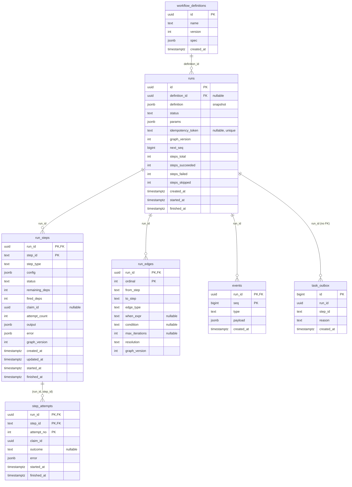

# ADR-004: Persistence model & state machines

- **Status:** Accepted
- **Date:** 2026-08-08
- **Ticket:** ROADMAP.md ticket 2.3

## Context

Every durability claim the engine makes — "survives a full crash/restart,
resumes from the last completed step" — reduces to the Postgres schema and
the discipline governing writes to it. This ADR fixes both before any store
code exists, because the tickets that follow all build directly on it:

- **2.4** generates a typed store layer against these tables (sqlc).
- **2.5** instantiates runs atomically: per-run graph copy, entry steps
  ready, outbox rows, events — one transaction.
- **2.6** implements guarded CAS transitions; **M4** extends them into
  lease fencing (`claim_id`).
- **ADR-002** requires readiness to be computable inside completion
  transactions, which dictates what per-step dependency state the schema
  must carry — and it must reproduce exactly the readiness/skip/join
  semantics ADR-003 defines and `internal/dag.ReadySteps` implements.
- **M13** mutates run graphs at runtime (`ExpandRun`, `graph_version++`);
  the per-run graph copy decided here is what makes that a row insert
  instead of a rework.
- **M15** parks steps awaiting human decisions; **M16** builds the event
  feed on the event log defined here.

Forces in tension:

- **Authoritative state vs. audit history.** The UI and API need a
  history of what happened; the engine needs fast authoritative state for
  claims and readiness. One mechanism serving both (event sourcing) pulls
  toward replay machinery; two mechanisms pull toward drift.
- **A schema that will grow.** Nearly every later milestone adds status
  values (M5: `cancelling`, `cancelled`, `dead_lettered`; M5.6: `parked`;
  M15: `awaiting_human`) and columns (retry state, cost aggregates). The
  schema must evolve by additive migration, not rebuild.
- **Hot paths are known in advance.** Claiming ready steps, draining the
  outbox, rolling up run status, backfilling events — the indexes must
  serve these without speculative coverage of everything else.

## Decision

### State-machine tables plus an append-only event log — not event sourcing

Authoritative state lives in **mutable rows** — `runs.status`,
`run_steps.status`, dependency counters — updated only through guarded
compare-and-swap transitions (2.6). The **`events` table is an append-only
audit/UI feed**, written in the same transaction as the transition it
records, and **never replayed to derive state**.

Full event sourcing was rejected because replay complexity buys little
here: Postgres already holds authoritative state, ADR-002's crash-recovery
reasoning reduces to "the completion transaction committed or it didn't,"
and rebuilding state from events would reintroduce exactly the ambiguity
that model avoids. The event log serves audit and the live UI (M16), where
at-least-once append with per-run ordering is all that is needed.

### Identifiers and keys

- `workflow_definitions` and `runs` get **UUID primary keys**
  (`gen_random_uuid()` as the database default; callers may supply their
  own, which run instantiation (2.5) will for idempotent submission).
- Per-run children use **composite natural keys** rather than surrogate
  ids:
  - `run_steps`: `(run_id, step_id)` — `step_id` is the definition step
    ID, `TEXT` because runtime instances from loop unrolling and map
    fan-out are named `{id}#k` (ADR-003 reserves `#` for exactly this).
  - `run_edges`: `(run_id, ordinal)` — **`ordinal` is the edge's position
    in the definition's `edges` array**. Declaration order is semantic:
    the branch first-match firing rule (ADR-003) evaluates out-edges in
    declaration order, so the schema must preserve it.
  - `step_attempts`: `(run_id, step_id, attempt_no)`, `attempt_no`
    starting at 1.
  - `events`: `(run_id, seq)`.
- `task_outbox` uses a `BIGINT GENERATED ALWAYS AS IDENTITY` key; ascending
  id order is the drain order.

### Statuses are `TEXT` with `CHECK` constraints, not native enums

Every status column is `TEXT NOT NULL` constrained by a named `CHECK`
against the currently-valid vocabulary. Native Postgres enum types were
rejected: the vocabulary grows in nearly every milestone, and
`ALTER TYPE ... ADD VALUE` carries transactional restrictions (historically
disallowed in transaction blocks; still unusable-before-commit today),
while dropping and re-adding a `CHECK` constraint is a plain transactional
DDL statement that golang-migrate handles like any other. The evolution
recipe for adding a status is: one migration that drops the named
constraint and re-adds it with the extended list.

#### Status vocabulary v1

- **Runs:** `running`, `succeeded`, `failed`. A run is created directly as
  `running` — instantiation (2.5) marks entry steps ready in the creating
  transaction, so there is no pending-run state.
- **Steps:** `pending`, `ready`, `running`, `succeeded`, `failed`,
  `skipped`.

Reserved for later milestones (listed so the matrix below is complete;
each lands via the CHECK-constraint recipe in its owning milestone):
runs — `cancelling`, `cancelled`, `parked` (M5.6); steps — `retrying`,
`dead_lettered`, `cancelled` (M5), `awaiting_human` (M15).

### Allowed-transition matrix

Transitions not listed are illegal; 2.6 enforces this with conditional
UPDATEs that return typed errors, and every legal transition appends an
event in the same transaction. Guards marked with a milestone are enforced
from that milestone on; v1 rows are enforced from 2.6.

**Runs**

| From | To | Guard | Owner |
|---|---|---|---|
| — | `running` | run instantiation transaction (2.5) | 2.5 |
| `running` | `succeeded` | every step terminal, none `failed`/`dead_lettered` | 2.6 |
| `running` | `failed` | a step failed and the workflow failure policy halts the run (policy: ADR-006) | 2.6/M5 |
| `running` | `parked` | typed reason: `manual`, `budget_exceeded` (M10), `awaiting_human` (M15) | M5.6 |
| `parked` | `running` | unpark; re-outboxes all `ready` steps | M5.6 |
| `running`, `parked` | `cancelling` | cancel requested | M5.6 |
| `cancelling` | `cancelled` | all in-flight steps resolved | M5.6 |

**Steps**

| From | To | Guard | Owner |
|---|---|---|---|
| — | `pending` / `ready` | instantiation: `ready` iff entry step (no incoming normal edges) | 2.5 |
| `pending` | `ready` | `remaining_deps = 0 AND fired_deps ≥ 1`; or, for `join any`, `fired_deps ≥ 1` (bookkeeping below) | 2.6 |
| `pending` | `skipped` | `remaining_deps = 0 AND fired_deps = 0` (skip propagation) | 2.6 |
| `ready` | `running` | **claim**: status matches, a fresh `claim_id` is set, an attempt row is inserted, `attempt_count` increments | 2.6 |
| `running` | `succeeded` | **completion**: supplied `claim_id` matches the row's (fencing); output persisted; out-edges resolved | 2.6 |
| `running` | `failed` | matching `claim_id`; error recorded on the attempt | 2.6 |
| `running` | `ready` | reclaim after lease expiry: row's `claim_id` cleared so the zombie's write is fenced | M4 |
| `running` | `awaiting_human` | approval executor parks; matching `claim_id`; queue message ACKed after commit | M15 |
| `awaiting_human` | `ready` | decision recorded (single winner vs timeout under CAS) | M15 |
| `failed` | `ready` | retry per policy (via delayed queue) or DLQ requeue | M5 |
| `failed` | `dead_lettered` | retries exhausted / permanent class / poison | M5 |
| any non-terminal | `cancelled` | run cancellation sweep | M5.6 |

Terminal step states in v1: `succeeded`, `failed` (until M5 makes `failed`
retryable), `skipped`. A step never leaves a terminal state except through
the explicitly-listed M5 requeue transitions.

### Dependency bookkeeping: two counters + per-edge resolutions

This is the schema encoding of ADR-003's readiness, skip-propagation, and
join semantics (`internal/dag.ReadySteps` is the reference
implementation). One counter is not enough: `join any` readiness, the
skipped-vs-ready distinction, and "skipped parents satisfy a `join all`"
all depend on *how* an edge resolved, not just whether it did.

Each `run_steps` row carries, computed over its **incoming normal edges
only** (loop edges are excluded from readiness entirely, per ADR-003 —
they participate in expansion, M14):

- **`remaining_deps`** — the number of incoming normal edges not yet
  resolved. Initialized at instantiation to the incoming-normal-edge
  count; decremented exactly once when an edge resolves, whether it fired
  or skipped.
- **`fired_deps`** — the number of incoming normal edges that resolved
  *fired*. Initialized to 0; incremented when an edge fires.

Each `run_edges` row carries **`resolution`**
(`unresolved | fired | skipped`). The counters are the hot-path readiness
read; the per-edge resolution is what makes counter updates **idempotent**
— a completion transaction retried after a partial failure updates only
edges still `unresolved`, so it can never double-decrement — and gives the
UI and audit trail per-edge outcomes.

An edge resolves when its source step reaches a terminal state
(ADR-003 "Edge resolution"): *fired* if the source succeeded, `when` was
absent or evaluated true, and (for branch steps) the first-match rule
selected it; *skipped* if the source was skipped, `when` was false, or the
branch rule passed it over. Edges from **failed** steps stay `unresolved`.

Correspondence with `ReadySteps`, rule by rule:

| ADR-003 / `ReadySteps` rule | Counter form |
|---|---|
| Entry steps ready at creation | `remaining_deps = 0` at instantiation ⇒ created `ready` |
| Non-join and `join all` ready: every incoming edge resolved, ≥ 1 fired | `remaining_deps = 0 AND fired_deps ≥ 1` |
| `join any` ready on first fired edge; later firings absorbed | `fired_deps ≥ 1`; absorption is free — the step has already left `pending`, and `pending → ready` is the only transition this guard drives |
| Skipped when all incoming edges resolved skipped | `remaining_deps = 0 AND fired_deps = 0` ⇒ `pending → skipped`, and the step's own out-edges then resolve skipped, propagating |
| A failed parent permanently blocks (until ADR-006 policy) | its out-edges stay `unresolved`, so dependents' `remaining_deps` never reaches 0 — never ready, never skipped |
| `when`-false / branch pass-over | edge resolves *skipped*: `remaining_deps` decrements, `fired_deps` does not |

`ExpandRun` (M13) computes the same two counters for spliced-in steps at
insertion time; nothing about the bookkeeping is instantiation-specific.

### Event sequencing

`events.seq` is **per-run and monotonic**, allocated from a counter column
on the run row: the appending transaction executes
`UPDATE runs SET next_seq = next_seq + 1 ... RETURNING next_seq`. This
serializes event appends per run — acceptable, because the transactions
that append events (completion, transition, expansion) already touch the
run row for aggregate counters, so the row lock adds no new contention
point — and it gives gap-free, run-scoped ordering that the WS protocol
(M16: snapshot → backfill from `last_seq` → live tail) depends on.
Cross-run ordering is explicitly not provided and not needed.

`type` is free-form `TEXT` in v1 (2.5/2.6 write `run_created`,
`step_ready`, `step_claimed`, `step_succeeded`, `step_failed`,
`step_skipped`, `run_succeeded`, `run_failed`); ADR-018 (M16) owns
formalizing the envelope and payload versioning. Append-only is a
discipline enforced by code review and the store layer's API surface (no
update/delete queries generated), not by triggers — a trigger would add a
hot-path cost to guard against a write the codebase never issues.

### Table-by-table

**`workflow_definitions`** — the stored-definition registry's storage
(registry *semantics* — creation API, version assignment, listing — are
M6's). `name` + `version` are unique together; `spec` is the full
definition document (JSONB, validated before insert). Rows are immutable
once written; a new version is a new row.

**`runs`** — one row per execution. Carries:

- `definition_id` — nullable FK to `workflow_definitions` (`ON DELETE
  RESTRICT`): null for inline submissions (M6 allows submit-by-value).
- `definition` — the **definition snapshot**, JSONB, always present. The
  snapshot, not the FK, is what the run executes: it insulates in-flight
  runs from registry changes (ADR-001: per-run snapshots are the
  compatibility surface) and is the source `run_steps.config` is
  materialized from.
- `status`, `params` (submitted run parameters), `idempotency_token`
  (nullable; unique among non-null — 2.5's idempotent submission).
- `graph_version` — the run's current graph version, starting at 1;
  `ExpandRun` increments it (M13).
- `next_seq` — the event sequence counter (above).
- Aggregate counters `steps_total`, `steps_succeeded`, `steps_failed`,
  `steps_skipped`, maintained by instantiation/completion transactions —
  the run-status rollup read path (list views, progress bars) without a
  `run_steps` aggregate scan.
- `created_at` (DB default), `started_at`, `finished_at` (application-
  written; see Timestamps).

**`run_steps`** — the per-run graph copy, node side. Materializes
`step_type` and `config` (JSONB) from the snapshot so executors never
reparse the definition; carries `status`, the two dependency counters,
`claim_id` (nullable UUID — the fencing token, set on claim, cleared on
reclaim), `attempt_count`, `output` (JSONB, set on success), `error`
(JSONB, last failure summary; full per-attempt detail lives on
`step_attempts`), `graph_version` (the version that introduced this row —
1 for instantiation-time rows, >1 for expansion-injected ones: M13/M18
provenance), and timestamps.

**`run_edges`** — the per-run graph copy, edge side. `from_step`,
`to_step`, `edge_type` (`normal | loop`), the raw predicate texts
(`when_expr` for normal edges, `condition` + `max_iterations` for loop
edges — compiled at evaluation time; validation already proved they
compile), `resolution`, and `graph_version`. Loop edges keep
`resolution = 'unresolved'` forever in v1 — iteration accounting belongs
to expansion (M14), which this schema anticipates but does not implement.

**`step_attempts`** — one row per execution try, keyed
`(run_id, step_id, attempt_no)` with a composite FK to `run_steps`.
`claim_id` ties the attempt to its lease; `outcome` is nullable `TEXT`
(null while in flight; v1 writes `succeeded`/`failed`, the full taxonomy —
`timeout`, `cancelled`, `validation_failed` — is ADR-006's, so no CHECK
constraint yet); `error` (JSONB), `started_at`, `finished_at`.

**`events`** — `(run_id, seq)` PK, `type`, `payload` (JSONB),
`created_at`. Append-only.

**`task_outbox`** — the transactional Postgres→Redis dispatch buffer
(ADR-002). `id` (identity, drain order), `run_id`, `step_id`, `reason`
(`TEXT`: the enqueue reason carried into the task envelope — ADR-005 owns
the envelope, but v1 seeds `step_ready`), `created_at`. **Drained rows are
deleted**, in the drain transaction
(`DELETE ... WHERE id IN (SELECT ... FOR UPDATE SKIP LOCKED)` — M4), not
flagged: the table stays small (its scan is the hot path), and a row's
existence *is* the pending-dispatch state, which keeps the reconciler's
question simple. No `available_at`: delayed delivery is Redis's job
(ZSET promoter, M3.5). No FK to `run_steps`: the outbox outlives no
run data it points at in practice, and dispatch must never block or
cascade on run-row churn; the reconciler treats a dangling outbox row as
ACK-and-drop.

### Indexes (hot paths only)

| Path | Index |
|---|---|
| Reconciler: find stuck / claimable work | partial index on `run_steps (status, updated_at)` `WHERE status IN ('ready','running')` — small (only in-flight steps), serves "ready longer than X" and "running with expired lease" scans |
| Run listing / status rollup | `runs (status, created_at DESC)` |
| Idempotent submission | unique partial index on `runs (idempotency_token) WHERE idempotency_token IS NOT NULL` |
| Definition registry lookup | unique `workflow_definitions (name, version)` |
| Outbox drain | primary key (ascending id order) |
| Event backfill from `last_seq` | primary key `(run_id, seq)` |
| Child-row access by run | composite PKs are `(run_id, ...)`-prefixed — no extra index |

Anything else waits for a measured need (M19 is the performance
milestone). `run_id`/`step_id` never become metric labels (project
invariant); they are key columns here and log fields elsewhere.

### Timestamps

`created_at` columns default to `now()` in the database — they are
operational metadata, not logic inputs. All **lifecycle** times
(`started_at`, `finished_at`, `updated_at` on `run_steps`) are written by
the application from its injected clock (project invariant: time is
injectable — tests control it). No `ON UPDATE` triggers.

### Referential integrity

`run_steps`, `run_edges`, `events` reference `runs (id)` with `ON DELETE
CASCADE`; `step_attempts` references `run_steps` composite with `ON
DELETE CASCADE` — deleting a run (future retention policy) removes its
whole subtree in one statement. `runs.definition_id` is `ON DELETE
RESTRICT`: a stored definition with runs on record cannot be deleted out
from under them (the snapshot makes this a bookkeeping restriction, not a
correctness one). `run_edges` endpoints deliberately have **no FK** to
`run_steps`: expansion (M13) inserts nodes and edges in one statement
batch where ordering-by-FK would be gratuitous friction, and edge
endpoints are validated by graph revalidation in the same transaction.

### ERD

## Consequences

Positive:

- Crash-recovery reasoning stays one-dimensional: authoritative state is
  rows, transitions are CAS, and "did the transaction commit" is the only
  question — the event log adds history without adding a second truth.
- The two-counter + per-edge-resolution encoding reproduces `ReadySteps`
  exactly and makes completion transactions idempotent under retry, which
  M4's at-least-once delivery requires.
- Statuses grow by a two-statement transactional migration; no enum-type
  ceremony, no rebuild.
- The per-run graph copy with `graph_version` stamping makes M13's
  runtime expansion an insert-plus-increment, and gives the UI expansion
  provenance for free.
- Composite natural keys mean every hot-path access (claim, complete,
  attempt append, event backfill) is a primary-key operation.

Negative:

- **Two bookkeeping representations must agree.** Counters and per-edge
  resolutions encode the same facts; a bug can desynchronize them.
  Accepted: the pairing is what buys idempotent retries, updates happen in
  the same transaction, and 2.6/M4 tests assert their consistency.
- **`CHECK` constraints are weaker than enums** — no type-level reuse
  across tables, and the valid set lives in migration files rather than a
  catalog type. Accepted for the evolution ergonomics.
- **Per-run event appends serialize on the run row.** A run with massive
  parallel fan-in funnels completions through one row lock. Accepted:
  those transactions update run aggregates anyway, and per-run ordering
  is a feature the WS protocol needs.
- **Snapshot duplication.** The definition is stored on the run *and*
  materialized into `run_steps.config`. Costs bytes; buys executor reads
  that never reparse documents and runs that are immune to registry
  changes.
- **No FK on `run_edges` endpoints or `task_outbox`** trades declarative
  integrity for expansion/drain simplicity; the reconciler and in-tx
  revalidation carry the burden instead.

## Alternatives considered

- **Full event sourcing (state = fold of events).** Rejected: replay
  machinery, snapshotting, and upcasting buy nothing when Postgres holds
  authoritative state anyway (project invariant), and it would smear
  ADR-002's "committed or not" recovery story across an event-replay
  dimension. The audit/UI need is served by the cheap append-only log.
- **Native Postgres enum types for statuses.** Rejected for the
  `ALTER TYPE ... ADD VALUE` transactional restrictions; the vocabulary
  provably grows in ≥ 4 later milestones. `TEXT` + named `CHECK` evolves
  with plain transactional DDL.
- **Single `remaining_deps` counter (no `fired_deps`, no per-edge
  resolution).** Rejected: cannot distinguish "all resolved, some fired"
  (ready) from "all resolved skipped" (skip propagation), cannot express
  `join any`, and counter decrements are not idempotently retryable
  without per-edge state. It would silently diverge from M1 semantics —
  the exact drift this ticket's acceptance criteria forbid.
- **No per-run graph copy — join runs to their definition's graph.**
  Rejected: runtime expansion (M13) and loop unrolling (M14) mutate the
  *run's* graph; sharing definition rows would need copy-on-write
  machinery at the worst moment (mid-run). Decided project-wide long ago;
  recorded here because this is where it becomes rows.
- **Global event sequence (one `BIGSERIAL` across runs).** Rejected:
  sequences are gap-prone under rollback (breaking contiguous backfill),
  the WS protocol needs per-run ordering only, and a global ordering
  invites cross-run coupling nothing needs.
- **Outbox rows flagged as drained instead of deleted.** Rejected: the
  drain scan is the hot path and wants the table small; retained rows are
  audit data the `events` table already provides. Deletion keeps
  "row exists ⇔ dispatch pending" as the reconciler's invariant.
- **Storing evaluated CEL programs / ASTs in `run_edges`.** Rejected:
  compiled CEL is not meaningfully serializable across processes, source
  text is tiny, compilation is ~50µs (measured in 1.5), and workers cache
  by expression text if it ever matters.
