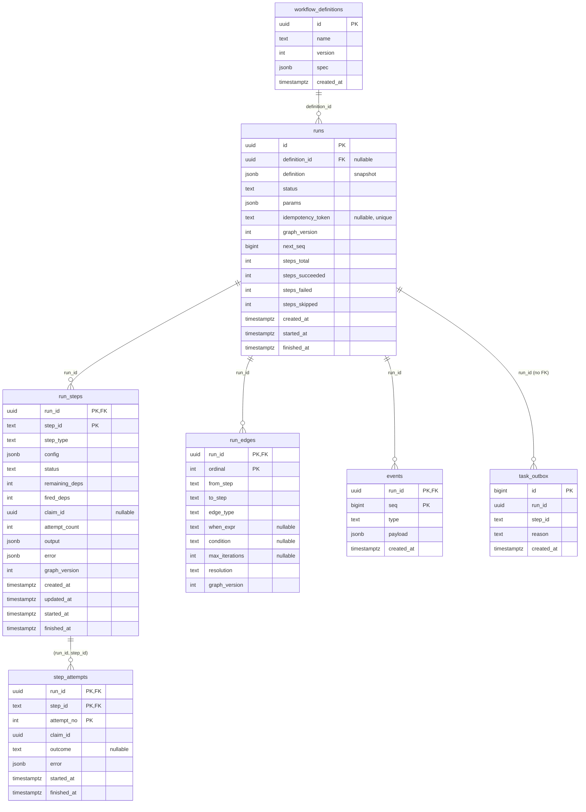

# ADR-004: Persistence model & state machines

- **Status:** Accepted
- **Date:** 2026-08-08
- **Ticket:** ROADMAP.md ticket 2.3

## Context

Every durability claim the engine makes — "survives a full crash/restart,
resumes from the last completed step" — reduces to the Postgres schema and
the discipline governing writes to it. This ADR fixes both before any store
code exists, because the tickets that follow all build directly on it:

- **2.4** generates a typed store layer against these tables (sqlc).
- **2.5** instantiates runs atomically: per-run graph copy, entry steps
  ready, outbox rows, events — one transaction.
- **2.6** implements guarded CAS transitions; **M4** extends them into
  lease fencing (`claim_id`).
- **ADR-002** requires readiness to be computable inside completion
  transactions, which dictates what per-step dependency state the schema
  must carry — and it must reproduce exactly the readiness/skip/join
  semantics ADR-003 defines and `internal/dag.ReadySteps` implements.
- **M13** mutates run graphs at runtime (`ExpandRun`, `graph_version++`);
  the per-run graph copy decided here is what makes that a row insert
  instead of a rework.
- **M15** parks steps awaiting human decisions; **M16** builds the event
  feed on the event log defined here.

Forces in tension:

- **Authoritative state vs. audit history.** The UI and API need a
  history of what happened; the engine needs fast authoritative state for
  claims and readiness. One mechanism serving both (event sourcing) pulls
  toward replay machinery; two mechanisms pull toward drift.
- **A schema that will grow.** Nearly every later milestone adds status
  values (M5: step `retrying`, `dead_lettered`, `cancelled`; M5.6: run
  `cancelling`, `cancelled`, `parked`; M15: `awaiting_human`) and columns
  (retry state, cost aggregates). The schema must evolve by additive
  migration, not rebuild.
- **Hot paths are known in advance.** Claiming ready steps, draining the
  outbox, rolling up run status, backfilling events — the indexes must
  serve these without speculative coverage of everything else.

## Decision

### State-machine tables plus an append-only event log — not event sourcing

Authoritative state lives in **mutable rows** — `runs.status`,
`run_steps.status`, dependency counters — updated only through guarded
compare-and-swap transitions (2.6). The **`events` table is an append-only
audit/UI feed**, written in the same transaction as the transition it
records, and **never replayed to derive state**.

Full event sourcing was rejected because replay complexity buys little
here: Postgres already holds authoritative state, ADR-002's crash-recovery
reasoning reduces to "the completion transaction committed or it didn't,"
and rebuilding state from events would reintroduce exactly the ambiguity
that model avoids. The event log serves audit and the live UI (M16), where
at-least-once append with per-run ordering is all that is needed.

### Identifiers and keys

- `workflow_definitions` and `runs` get **UUID primary keys**
  (`gen_random_uuid()` as the database default; callers may supply their
  own, which run instantiation (2.5) will for idempotent submission).
- Per-run children use **composite natural keys** rather than surrogate
  ids:
  - `run_steps`: `(run_id, step_id)` — `step_id` is the definition step
    ID, `TEXT` because runtime instances from loop unrolling and map
    fan-out are named `{id}#k` (ADR-003 reserves `#` for exactly this).
  - `run_edges`: `(run_id, ordinal)` — **`ordinal` is the edge's position
    in the definition's `edges` array**. Declaration order is semantic:
    the branch first-match firing rule (ADR-003) evaluates out-edges in
    declaration order, so the schema must preserve it.
  - `step_attempts`: `(run_id, step_id, attempt_no)`, `attempt_no`
    starting at 1.
  - `events`: `(run_id, seq)`.
- `task_outbox` uses a `BIGINT GENERATED ALWAYS AS IDENTITY` key; ascending
  id order is the drain order.

### Statuses are `TEXT` with `CHECK` constraints, not native enums

Every status column is `TEXT NOT NULL` constrained by a named `CHECK`
against the currently-valid vocabulary. Native Postgres enum types were
rejected: the vocabulary grows in nearly every milestone, and
`ALTER TYPE ... ADD VALUE` carries transactional restrictions (historically
disallowed in transaction blocks; still unusable-before-commit today),
while dropping and re-adding a `CHECK` constraint is a plain transactional
DDL statement that golang-migrate handles like any other. The evolution
recipe for adding a status is: one migration that drops the named
constraint and re-adds it with the extended list.

#### Status vocabulary v1

- **Runs:** `running`, `succeeded`, `failed`. A run is created directly as
  `running` — instantiation (2.5) marks entry steps ready in the creating
  transaction, so there is no pending-run state. Since 5.6 also `parked`
  (dispatch paused: the claim path refuses the run's steps; in-flight
  steps settle normally — not terminal), `cancelling` (a cancel was
  requested: the quiescing state while in-flight steps settle — not
  terminal), and `cancelled` (terminal). Migration 0007 also added the
  typed `park_reason` / `cancel_reason` columns and the nullable
  `deadline_at` — the materialized `created_at + max_wall_clock` run
  deadline, with a partial index serving the reconciler's deadline scan.
- **Steps:** `pending`, `ready`, `running`, `succeeded`, `failed`,
  `skipped`; since 5.2 also `retrying` (a failed attempt recorded, the
  next one due at `next_attempt_at` — not terminal); since 5.4 also
  `dead_lettered` (the terminal failure state — ADR-006's DLQ) and
  `cancelled` (written off: readiness made impossible by a dead-lettered
  upstream step; M5.6's run-cancel writes the same status). `failed` is
  retired as a resting state by 5.4 — it remains in the CHECK for pre-5.4
  rows and as ADR-006's conceptual routing state, but nothing writes it.

Reserved for later milestones (listed so the matrix below is complete;
each lands via the CHECK-constraint recipe in its owning milestone):
steps — `awaiting_human` (M15).

### Allowed-transition matrix

Transitions not listed are illegal; 2.6 enforces this with conditional
UPDATEs that return typed errors, and every legal transition appends an
event in the same transaction. Guards marked with a milestone are enforced
from that milestone on; v1 rows are enforced from 2.6.

**Runs**

| From | To | Guard | Owner |
|---|---|---|---|
| — | `running` | run instantiation transaction (2.5) | 2.5 |
| `running`, `parked` | `succeeded` | every step terminal, none `failed`/`dead_lettered`; since 5.6 fires from `parked` too — park pauses the dispatch of new work, not the settling of work already in flight (ADR-006 "Park semantics"); `park_reason` clears with the exit | 2.6/5.6 |
| `running`, `parked` | `failed` | as built in 5.4, two guards per the workflow failure policy (ADR-006): **fail_fast** — `steps_failed ≥ 1`, fired by the dead-lettering transaction immediately; **all-terminal rollup** (`continue_independent_branches`) — `steps_failed ≥ 1 AND succeeded + failed + skipped + cancelled = total`, attempted (conflict dropped) by every completion transaction alongside the succeed rollup; both fire from `parked` since 5.6, like SucceedRun | 2.6/5.4/5.6 |
| `failed` | `running` | **DLQ requeue resume** (5.4): the requeue op re-opens a failed run so the claim path admits its steps again; `finished_at` clears (5.6: refused for cancelled/cancelling runs — a cancel is terminal by operator intent) | 5.4 |
| `running` | `parked` | **park** (as built in 5.6): typed `park_reason` — `manual` now, `budget_exceeded` (M10) and `awaiting_human` (M15) reserved in the CHECK | 5.6 |
| `parked` | `running` | **unpark** (as built in 5.6): `park_reason` clears; the op re-outboxes every `ready` step with no pending dispatch row (their deliveries were consumed by the run-status guard while parked, reason `unpark`); overdue `retrying` steps are left to the reconciler's ordinary overdue-retrying scan, which admits them again once the run is running | 5.6 |
| `running`, `parked` | `cancelling` | **cancel request** (as built in 5.6): typed `cancel_reason` — `manual`, or `deadline_exceeded` from the reconciler's `deadline_at` sweep; the same transaction sweeps every claimless non-terminal step (pending/ready/retrying) to `cancelled` and attempts the finalization below | 5.6 |
| `cancelling` | `cancelled` | **cancel finalization** (as built in 5.6): all-terminal counter guard (`succeeded + failed + skipped + cancelled = total`), attempted (conflict dropped) by the cancel request itself and by every transaction settling a step of a possibly-cancelling run | 5.6 |

**Steps**

| From | To | Guard | Owner |
|---|---|---|---|
| — | `pending` / `ready` | instantiation: `ready` iff entry step (no incoming normal edges) | 2.5 |
| `pending` | `ready` | `remaining_deps = 0 AND fired_deps ≥ 1`; or, for `join any`, `fired_deps ≥ 1` (bookkeeping below) | 2.6 |
| `pending` | `skipped` | `remaining_deps = 0 AND fired_deps = 0` (skip propagation) | 2.6 |
| `ready` | `running` | **claim**: status matches, a fresh `claim_id` is set, an attempt row is inserted, `attempt_count` increments; since 5.2 additionally guarded on the run being `running` (typed rejection `run_not_running` — ADR-006's "claim path refuses terminal runs", reused by M5.6 park/cancel) | 2.6 |
| `running` | `succeeded` | **completion**: supplied `claim_id` matches the row's (fencing); output persisted; out-edges resolved | 2.6 |
| `running` | `failed` | matching `claim_id`; error recorded on the attempt *(retired by 5.4 — the terminal failure CAS now lands `dead_lettered` directly; listed for pre-5.4 history)* | 2.6–5.3 |
| `running` | `ready` | reclaim after lease expiry (**takeover**): guarded on the *observed* holder's `claim_id` (a stale observation must not steal a newer live claim), which is cleared so the zombie's write is fenced; the holder's dangling attempt row closes with the administrative outcome `lost` | 4.5 |
| `running` | `awaiting_human` | approval executor parks (ADR-017, ticket 15.2); matching `claim_id`; the `approvals` row is written and the queue message ACKed after commit, so no lease or worker slot is held while waiting | M15 |
| `awaiting_human` | `ready` / `succeeded` / `dead_lettered` / `cancelled` | decision recorded (ADR-017, ticket 15.3): single winner vs timeout under a CAS on the `approvals` row — approve → the step succeeds with the (edited) payload; reject → dead-letter (`fail`) or route (`route`); run-cancel → cancelled | M15 |
| `running` | `retrying` | **retry routing** (as built in 5.2; the reserved `failed → retrying` row was realized as a direct CAS — ADR-006's `failed` routing state is passed through *inside* the completion transaction, never rested): matching `claim_id`; the policy admits another attempt; the attempt row closes with its error class; `claim_id` clears and `next_attempt_at` is stamped; the delayed re-dispatch is scheduled post-commit | 5.2 |
| `retrying` | `running` | **claim once due** (as built in 5.2; the reserved `retrying → ready` row: delayed promotion is a pure Redis event with no Postgres write, so the hop to `ready` is realized at claim time): the claim CAS additionally guards `next_attempt_at ≤ now`, which is what makes backoff enforceable against early duplicate deliveries | 5.2 |
| `running` | `dead_lettered` | **terminal failure** (as built in 5.4; the reserved `failed → dead_lettered` row was realized as a direct CAS, like the retry route): matching `claim_id`; retries exhausted or class never retryable; the attempt closes with its judged class, `steps_failed` bumps, and the `dead_letters` record (source, class, attempts-at-death) inserts in the same transaction, followed by the run disposition | 5.4 |
| `pending`, `ready`, `running`, `retrying` | `dead_lettered` | **poison** (5.4): no claim fence — the entry's handlers kept dying without recording a judgment; `claim_id` clears (a zombie holder's completion then fences off) and a running step's dangling attempt closes `lost`; the `dead_letters` record carries source `poison`, NULL class, and the raw envelope payload | 5.4 |
| `pending` | `cancelled` | **write-off** (5.4, `continue_independent_branches`): a dead-lettered upstream step made readiness impossible (the fixed-point walk of ADR-006); `steps_cancelled` bumps; dependency counters and edges untouched | 5.4 |
| `dead_lettered` | `ready` | **DLQ requeue** (5.4 internal op; `POST /v1/runs/{id}/steps/{sid}/requeue` since 6.5): error and schedule state clear, `steps_failed` un-bumps, `dlq_requeue` outbox row; the budget re-arms via the `dead_letters` baseline, attempt history immutable | 5.4 |
| `cancelled` | `pending` | **revival** (5.4): a requeue made a written-off step's readiness possible again (recomputed write-off set); `steps_cancelled` un-bumps — a pure status flip, since the write-off never touched counters | 5.4 |
| `pending`, `ready`, `retrying` | `cancelled` | **run-cancel sweep** (as built in 5.6): the cancel request writes off every claimless non-terminal step in its own transaction (a `retrying` step's `next_attempt_at` clears); `steps_cancelled` bumps; no attempt closes — none is open. Same CAS as the 5.4 write-off, broadened from-set, event reason `run_cancelled` | 5.4/5.6 |
| `running` | `cancelled` | **run-cancel settlement** (as built in 5.6): matching `claim_id`; the in-flight worker noticed its run is cancelling (the cancellation watch, or the completion transaction's run-status check under the run lock) and settles the step instead of routing its outcome — the attempt closes with the administrative outcome `cancelled` (never counted against the retry budget), the executor's error (if any) is recorded, `steps_cancelled` bumps. A worker that *died* instead is healed by the reconciler's cancelling-run scan: takeover (attempt `lost`) + the sweep CAS above | 5.6 |

Terminal step states: `succeeded`, `skipped`, `dead_lettered`,
`cancelled` (and the retired `failed` on pre-5.4 rows). `retrying` is not
terminal. A step never leaves a terminal state except through the
explicitly-listed 5.4 requeue/revival transitions.

### Dependency bookkeeping: two counters + per-edge resolutions

This is the schema encoding of ADR-003's readiness, skip-propagation, and
join semantics (`internal/dag.ReadySteps` is the reference
implementation). One counter is not enough: `join any` readiness, the
skipped-vs-ready distinction, and "skipped parents satisfy a `join all`"
all depend on *how* an edge resolved, not just whether it did.

Each `run_steps` row carries, computed over its **incoming normal edges
only** (loop edges are excluded from readiness entirely, per ADR-003 —
they participate in expansion, M14):

- **`remaining_deps`** — the number of incoming normal edges not yet
  resolved. Initialized at instantiation to the incoming-normal-edge
  count; decremented exactly once when an edge resolves, whether it fired
  or skipped.
- **`fired_deps`** — the number of incoming normal edges that resolved
  *fired*. Initialized to 0; incremented when an edge fires.

Each `run_edges` row carries **`resolution`**
(`unresolved | fired | skipped`). The counters are the hot-path readiness
read; the per-edge resolution is what makes counter updates **idempotent**
— a completion transaction retried after a partial failure updates only
edges still `unresolved`, so it can never double-decrement — and gives the
UI and audit trail per-edge outcomes.

An edge resolves when its source step reaches a terminal state
(ADR-003 "Edge resolution"): *fired* if the source succeeded, `when` was
absent or evaluated true, and (for branch steps) the first-match rule
selected it; *skipped* if the source was skipped, `when` was false, or the
branch rule passed it over. Edges from **failed** steps stay `unresolved`.

Correspondence with `ReadySteps`, rule by rule:

| ADR-003 / `ReadySteps` rule | Counter form |
|---|---|
| Entry steps ready at creation | `remaining_deps = 0` at instantiation ⇒ created `ready` |
| Non-join and `join all` ready: every incoming edge resolved, ≥ 1 fired | `remaining_deps = 0 AND fired_deps ≥ 1` |
| `join any` ready on first fired edge; later firings absorbed | `fired_deps ≥ 1`; absorption is free — the step has already left `pending`, and `pending → ready` is the only transition this guard drives |
| Skipped when all incoming edges resolved skipped | `remaining_deps = 0 AND fired_deps = 0` ⇒ `pending → skipped`, and the step's own out-edges then resolve skipped, propagating. Side condition: this form presumes ≥ 1 incoming normal edge — a zero-indegree step satisfies it vacuously but is created `ready` at instantiation and never `pending`, which M13's `ExpandRun` must preserve by inserting steps atomically with their incoming edges |
| A failed parent permanently blocks (until ADR-006 policy) | its out-edges stay `unresolved`, so dependents' `remaining_deps` never reaches 0 — never ready, never skipped. Exception: a `join any` dependent still readies on any *other* parent's fired edge, since its guard ignores `remaining_deps` |
| `when`-false / branch pass-over | edge resolves *skipped*: `remaining_deps` decrements, `fired_deps` does not |

`ExpandRun` (M13) computes the same two counters for spliced-in steps at
insertion time; nothing about the bookkeeping is instantiation-specific.

### Event sequencing

`events.seq` is **per-run and monotonic**, allocated from a counter column
on the run row: the appending transaction executes
`UPDATE runs SET next_seq = next_seq + 1 ... RETURNING next_seq`. This
serializes event appends per run — acceptable, because the transactions
that append events (completion, transition, expansion) already touch the
run row for aggregate counters, so the row lock adds no new contention
point — and it gives gap-free, run-scoped ordering that the WS protocol
(M16: snapshot → backfill from `last_seq` → live tail) depends on.
Cross-run ordering is explicitly not provided and not needed.

Two ordering rules keep the log gap-free and composed transactions
deadlock-free (2.6): every transition **first acquires the run-row lock**
(a `FOR UPDATE` read — uniform run → step → edge lock ordering), and the
seq is allocated **only after the guarded CAS succeeds**. A rejected
transition therefore writes nothing, so a composed completion transaction
(M4.3) may drop a typed conflict — a lost claim race, a join-any late
firing, a premature rollup — and still commit without burning a sequence
number.

`type` is free-form `TEXT` in v1 (2.5/2.6 write `run_created`,
`step_ready`, `step_claimed`, `step_succeeded`, `step_failed`,
`step_skipped`, `run_succeeded`, `run_failed`; 4.5 adds
`step_reclaimed` for the lease-expiry takeover, payload carrying the
displaced holder's `claim_id` and the attempt it strands); ADR-018 (M16)
owns formalizing the envelope and payload versioning. Append-only is a
discipline enforced by code review and the store layer's API surface (no
update/delete queries generated), not by triggers — a trigger would add a
hot-path cost to guard against a write the codebase never issues.

### Table-by-table

**`workflow_definitions`** — the stored-definition registry's storage
(registry *semantics* — creation API, version assignment, listing — are
M6's). `name` + `version` are unique together; `spec` is the full
definition document (JSONB, validated before insert). Rows are immutable
once written; a new version is a new row.

**`runs`** — one row per execution. Carries:

- `definition_id` — nullable FK to `workflow_definitions` (`ON DELETE
  RESTRICT`): null for inline submissions (M6 allows submit-by-value).
- `definition` — the **definition snapshot**, JSONB, always present. The
  snapshot, not the FK, is what the run executes: it insulates in-flight
  runs from registry changes (ADR-001: per-run snapshots are the
  compatibility surface) and is the source `run_steps.config` is
  materialized from.
- `status`, `params` (submitted run parameters), `idempotency_token`
  (nullable; unique among non-null — 2.5's idempotent submission), and
  since 6.5 `idempotency_fingerprint` (nullable; the hex SHA-256 binding
  the token to its payload — canonical definition snapshot,
  canonicalized params, definition ref — so a token replayed with a
  different payload is refused instead of silently returning the
  original run; NULL on pre-0009 rows means unchecked reuse, ADR-007
  "ticket 6.5"). Migration 0009 also added the run-list keyset indexes
  `runs (created_at DESC, id DESC)` and the partial
  `runs (definition_id, created_at DESC, id DESC)`.
- `graph_version` — the run's current graph version, starting at 1;
  `ExpandRun` increments it once per committed expansion (13.2), so the
  run's expansion count is `graph_version - 1` (no separate counter,
  ADR-015).
- `expansion_caps` — the run's resolved `dag.ExpansionCaps` (migration
  0023), materialized at instantiation like `retry_policy`/`on_failure`
  so `ExpandRun` and the claim-time guards never reparse the snapshot;
  NULL on pre-0023 rows means the compiled defaults apply (ADR-015).
- `next_seq` — the event sequence counter (above).
- Aggregate counters `steps_total`, `steps_succeeded`, `steps_failed`,
  `steps_skipped` — and since 5.4 `steps_cancelled` (the write-off
  counter) — maintained by instantiation/completion transactions — the
  run-status rollup read path (list views, progress bars) without a
  `run_steps` aggregate scan. `steps_failed` counts terminal failures
  (`dead_lettered` since 5.4; the requeue op decrements it).
- `on_failure` (TEXT, NOT NULL, default `fail_fast`; since 5.4) — the
  workflow failure policy, materialized at instantiation like the steps'
  `retry_policy` and for the same reasons (ADR-006 "Run disposition").
- `trace_parent`, `trace_state` (TEXT, nullable; since 7.3, migration
  0010) — the run's durable root trace context (W3C), captured from the
  `POST /v1/runs` server span at instantiation. Re-dispatches that
  descend from no live span (reconciler heals, delayed retries,
  `dlq_requeue`, `unpark`) restore trace linkage from here (ADR-008).
  NULL means no context — tracing off, or a pre-0010 row.
- `created_at` (DB default), `started_at`, `finished_at` (application-
  written; see Timestamps).

**`run_steps`** — the per-run graph copy, node side. Materializes
`step_type` and `config` (JSONB) from the snapshot so executors never
reparse the definition, and — since 5.2 — `retry_policy` (JSONB, NOT
NULL): the *effective* retry policy, authored fields merged over engine
defaults at instantiation (ADR-006 "Where the policy lives at runtime"),
so the failure path never reparses the snapshot and a worker upgrade
cannot change an in-flight run's retry behavior. Carries `status`, the two
dependency counters, `claim_id` (nullable UUID — the fencing token, set on
claim, cleared on reclaim), `attempt_count`, `next_attempt_at` (nullable —
set while `retrying`: when the next attempt is due, the durable state the
reconciler heals a lost delayed re-dispatch from), `output` (JSONB, set on
success), `error` (JSONB, last failure summary; full per-attempt detail
lives on `step_attempts`), `graph_version` (the version that introduced
this row — 1 for instantiation-time rows, >1 for expansion-injected ones:
M13/M18 provenance), `trace_span` (TEXT, nullable; since 7.3, migration
0010 — the current attempt's span context in traceparent format, stamped
by the claim CAS; the value a claim overwrites is the previous attempt's
span, which is how retries and takeovers link the new attempt span back
to the attempt it re-executes, ADR-008), `depth`/`origin_step`/`origin_kind`
(migration 0023 — the expansion provenance ADR-015 needs: `depth` is the
nesting depth (0 for a definition-authored step, `origin.depth + 1` for an
injected one), and `origin_step`/`origin_kind` (both NULL for an authored
step) name the expansion that spliced the row in — read by the 13.6
introspection API as columns, never a join through the event log), and
timestamps.

**`run_edges`** — the per-run graph copy, edge side. `from_step`,
`to_step`, `edge_type` (`normal | loop`), the raw predicate texts
(`when_expr` for normal edges, `condition` + `max_iterations` for loop
edges — compiled at evaluation time; validation already proved they
compile), `resolution`, `graph_version`, and (migration 0023)
`origin_step`/`origin_kind` — the same expansion provenance as the node
side (NULL for a definition-authored edge). Loop edges keep
`resolution = 'unresolved'` forever in v1 — iteration accounting belongs
to expansion (M14), which this schema anticipates but does not implement.

**`step_attempts`** — one row per execution try, keyed
`(run_id, step_id, attempt_no)` with a composite FK to `run_steps`.
`claim_id` ties the attempt to its lease; `outcome` is nullable `TEXT`
(null while in flight). Since 5.2 the postponed CHECK is in place with
ADR-006's classed vocabulary — `succeeded | transient | permanent |
timeout | cancelled` plus the administrative `lost` (4.5's takeover
closure, deliberately outside the taxonomy and outside the retry budget);
the pre-M5 bare `failed` was backfilled to `permanent` by migration 0003
(under pre-M5 semantics every failure was terminal). `validation_failed`
joins the CHECK when M11 unlocks it. Also `error` (JSONB), `started_at`,
`finished_at`, and — since 8.6 (migration 0012) — `usage` (nullable
JSONB `{input_tokens, output_tokens}`): the provider's token accounting on
a successful `llm` attempt, written inside the success completion tx and
metered by M10's cost ledger. NULL for every non-`llm` step, every failed
provider call, and all pre-0012 rows.

**`dead_letters`** (since 5.4) — the DLQ (ADR-006 "Dead-letter model":
Postgres is the DLQ, not a Redis stream). One row per dead-lettering,
keyed `(run_id, step_id, seq)` with a composite FK to `run_steps` — `seq`
is the per-step death count (a step can die, be requeued, and die again;
attempt history is immutable, so the requeue budget counts attempts past
the latest row's `attempts_at_death` baseline). `source`
(`retries_exhausted | permanent | poison`), `class` (the judged ADR-006
class; NULL for poison — nothing judged it), `error` (JSONB), `payload`
(JSONB — the raw envelope contents, poison entries only), and
`attempts_at_death`. Written exclusively inside the dead-lettering
transitions, never updated or deleted.

**`side_effects`** (since 5.5) — the side-effect journal (ADR-006
"Idempotency keys & side-effect journal"). One row per journaled external
effect, keyed `(run_id, step_id, effect_id)` with a composite FK to
`run_steps` — `effect_id` is executor-chosen and scopes multiple effects
within one step. `status` (`intent | done`; a CHECK requires `done` rows
to carry `result_at`), `attempt` + `claim_id` (who last held the intent —
diagnostics, never fencing: the result write is first-wins by the status
guard on the completing UPDATE), `result` (JSONB, the journaled result
that short-circuits re-execution), `intent_at`, `result_at`. Written only
through the journal protocol in `internal/exec/effects`; a `done` row is
immutable. Deliberately no event appends — journal rows are not step
state transitions, and the table itself is the audit record.

**`cost_ledger`** (since 10.2, migration 0016) — the cost ledger (ADR-012).
One row per cost-bearing attempt completion, keyed
`(run_id, step_id, attempt, entry)` with an FK to `runs` (`ON DELETE
CASCADE`) — `entry` discriminates the charge kind (`attempt` in M10; the
`judge`/`compaction` overhead rows ADR-012 rule 4 reserves attach to the
same attempt in M11/M12 without a schema change). `resource` (the ADR-010
name — a model or `tool:<name>`), `usage` (JSONB token snapshot, NULL for a
tool row), `rate` (JSONB rate snapshot — the price that priced the row, kept
for auditability independent of later catalog edits), `rate_source`
(`exact | wildcard | fallback`), `cache_hit`, `overhead`, `cost_nano_usd`
(≥ 0), `saved_nano_usd` (≥ 0, the cache counterfactual), `created_at`.
Written exclusively by `store.ApplyAttemptCost` inside the success
completion transaction, after the fenced CAS and under the run lock — a
fenced zombie completion never lands a row, and the claim-fenced CAS
guarantees at most one `attempt` row per attempt. `runs` gained
`spent_nano_usd` / `saved_nano_usd` (`BIGINT`, default 0), the materialized
aggregate bumped in the same transaction so it always equals the exact
integer sum of the run's ledger rows (money is nano-USD `int64`, ADR-012);
by-step and by-model breakdowns are read-time `GROUP BY` over the ledger,
not materialized. Since 10.3 (migration 0017) `runs` also carries
`budget_nano_usd` (nullable `BIGINT` — NULL = unbudgeted, distinct from 0)
and `on_budget_exceeded` (`TEXT NOT NULL DEFAULT 'park'`, CHECK
`park | fail`), the materialized run spend budget and its exceed
disposition (ADR-012); `run_steps` gains `budget_policy` (nullable JSONB, the
authored `{max_usd, max_tokens}` caps read off the claimed row like
`cache_policy`). Migration 0017 also extends the `step_attempts.outcome`
CHECK with the administrative outcome `budget_exceeded` (the drop/re-add
recipe, as 0014 did for `throttled`).

**`events`** — `(run_id, seq)` PK, `type`, `payload` (JSONB),
`created_at`. Append-only. Since 10.2 the vocabulary includes
`cost_unknown_model` (payload `{model, fallback}`): a cost-bearing attempt
priced at the catalog fallback because its model had no entry, appended by
`ApplyAttemptCost` in the same completion transaction. Since 10.3 it also
includes `budget_exceeded` (the projection detail a claim-time budget
park/fail records) and `run_budget_updated` (a `PATCH …/budget` raise),
since 10.4 `model_downgraded` (a claim routed to a cheaper fallback), and
since 10.5 `cost_updated` (payload `CostUpdatedEvent`: one cost-bearing
attempt's charge plus the run's running spend/saved totals after the bump,
appended by `ApplyAttemptCost` under the completion transaction's run lock
and seq, so the totals are non-decreasing in seq order — the M18 live
meter's source), and since 12.2 `blackboard_updated` (payload
`BlackboardUpdatedEvent`: a run-scoped blackboard key gained a new version —
key, version, tags, token_count, author step/attempt — appended by
`PutBlackboardEntry` in the same transaction as the insert, under the run
lock and monotonic seq), and since 12.3 `context_assembled` (payload
`ContextAssembledEvent`: a context-bearing llm step's pre-execution assembly
manifest — the counter fingerprint, the assembled context tokens, the
pre-flight request total, and each source's disposition
`included | truncated | skipped` (since 12.4 also `dropped`, plus
`budget_tokens`/`raw_*_tokens`/`revisions`) — appended by
`RecordContextAssembled` in its own short fenced transaction before the
assembled request runs, the `model_downgraded` precedent), and since 12.4
`context_revision` (payload `ContextRevisionEvent`: one deterministic
compaction strategy's application to shrink an over-budget assembly — the
strategy, its parameters, the framed-request tokens before/after, and the
per-entry drop/truncate actions — appended by the *same* `RecordContextAssembled`
call, one per strategy that ran, ahead of the `context_assembled` event, so the
whole compaction decision is one fenced atomic write reading raw → revision* →
assembled in seq order).

**`blackboard_entries`** — the run-scoped blackboard (ticket 12.2, ADR-014):
shared, versioned key/value memory steps read and write during a run.
Append-only per key (`PRIMARY KEY (run_id, key, version)`, `version`
1-based); `value` (JSONB), `token_count` + `token_counter` (the counter
fingerprint that produced the count), `tags` (`TEXT[]`, GIN-indexed,
per-version immutable, carrying the reserved `pinned` tag), `author_step_id`
/ `author_attempt` (nullable — a non-step writer is reserved), `created_at`.
Writes go through the transition-style `PutBlackboardEntry` (run-lock →
optional claim fence → CAS → insert → event); `run_steps.blackboard_policy`
(nullable JSONB, migration 0021) materializes a step's declarative-write
block like `cache_policy`. Retained past the run for audit; pruned in M21.
Since 12.3, `run_steps.context_policy` (nullable JSONB, migration 0022)
materializes a step's authored `context`-assembly spec the same way; the
assembly writes no new table (its manifest is the `context_assembled` event).

**`task_outbox`** — the transactional Postgres→Redis dispatch buffer
(ADR-002). `id` (identity, drain order), `run_id`, `step_id`, `reason`
(`TEXT`: the enqueue reason carried into the task envelope — ADR-005 owns
the envelope, but v1 seeds `step_ready`), `trace_parent`/`trace_state`
(TEXT, nullable; since 7.3 — the enqueuing span's context, stamped by
writers that run inside a live span: completion fan-out and
instantiation; NULL rows fall back to the run row's root context at
drain, so healed re-dispatches stay in the run trace), `created_at`.
**Drained rows are deleted**, in the drain transaction
(`DELETE ... WHERE id IN (SELECT ... FOR UPDATE SKIP LOCKED)` — M4), not
flagged: the table stays small (its scan is the hot path), and a row's
existence *is* the pending-dispatch state, which keeps the reconciler's
question simple. No `available_at`: delayed delivery is Redis's job
(ZSET promoter, M3.5). No FK to `run_steps`: the outbox outlives no
run data it points at in practice, and dispatch must never block or
cascade on run-row churn; the reconciler treats a dangling outbox row as
ACK-and-drop.

### Indexes (hot paths only)

| Path | Index |
|---|---|
| Reconciler: find stuck / claimable work | partial index on `run_steps (status, updated_at)` `WHERE status IN ('ready','running')` — small (only in-flight steps), serves "ready longer than X" and "running with expired lease" scans |
| Reconciler: overdue retries (5.2) | partial index on `run_steps (next_attempt_at)` `WHERE status = 'retrying'` — serves the "due longer than RetryStale ago" scan healing the failure-commit/delayed-schedule crash gap |
| Reconciler anti-joins into the outbox (5.2, post-M4 audit) | `task_outbox (run_id, step_id)` — the stale-ready/overdue-retrying anti-joins and the stale-running pending-row probe stop scanning the identity PK |
| Run listing filtered by status | `runs (status, created_at DESC)`; unfiltered newest-first listing is a heap scan until a measured need says otherwise (M19) |
| Idempotent submission | unique partial index on `runs (idempotency_token) WHERE idempotency_token IS NOT NULL` |
| Definition registry lookup | unique `workflow_definitions (name, version)` |
| Outbox drain | primary key (ascending id order) |
| Event backfill from `last_seq` | primary key `(run_id, seq)` |
| Child-row access by run | composite PKs are `(run_id, ...)`-prefixed — no extra index |

Anything else waits for a measured need (M19 is the performance
milestone). `run_id`/`step_id` never become metric labels (project
invariant); they are key columns here and log fields elsewhere.

### Timestamps

`created_at` columns default to `now()` in the database — they are
operational metadata, not logic inputs. All **lifecycle** times
(`started_at`, `finished_at`, `updated_at` on `run_steps`) are written by
the application from its injected clock (project invariant: time is
injectable — tests control it), on insert as well as on every transition —
`run_steps.updated_at` feeds the reconciler's staleness scans, so a
database-written value would put freshly created steps outside the test
clock's control. (The column keeps a `now()` schema default as a fallback,
but the store layer always supplies the value and rejects a zero one.) No
`ON UPDATE` triggers.

### Referential integrity

`run_steps`, `run_edges`, `events` reference `runs (id)` with `ON DELETE
CASCADE`; `step_attempts` references `run_steps` composite with `ON
DELETE CASCADE` — deleting a run (future retention policy) removes its
whole subtree in one statement. `runs.definition_id` is `ON DELETE
RESTRICT`: a stored definition with runs on record cannot be deleted out
from under them (the snapshot makes this a bookkeeping restriction, not a
correctness one). `run_edges` endpoints deliberately have **no FK** to
`run_steps`: expansion (M13) inserts nodes and edges in one statement
batch where ordering-by-FK would be gratuitous friction, and edge
endpoints are validated by graph revalidation in the same transaction.

### ERD

## Consequences

Positive:

- Crash-recovery reasoning stays one-dimensional: authoritative state is
  rows, transitions are CAS, and "did the transaction commit" is the only
  question — the event log adds history without adding a second truth.
- The two-counter + per-edge-resolution encoding reproduces `ReadySteps`
  exactly and makes completion transactions idempotent under retry, which
  M4's at-least-once delivery requires.
- Statuses grow by a two-statement transactional migration; no enum-type
  ceremony, no rebuild.
- The per-run graph copy with `graph_version` stamping makes M13's
  runtime expansion an insert-plus-increment, and gives the UI expansion
  provenance for free.
- Composite natural keys mean every hot-path access (claim, complete,
  attempt append, event backfill) is a primary-key operation.

Negative:

- **Two bookkeeping representations must agree.** Counters and per-edge
  resolutions encode the same facts; a bug can desynchronize them.
  Accepted: the pairing is what buys idempotent retries, updates happen in
  the same transaction, and 2.6/M4 tests assert their consistency.
- **`CHECK` constraints are weaker than enums** — no type-level reuse
  across tables, and the valid set lives in migration files rather than a
  catalog type. Accepted for the evolution ergonomics.
- **Per-run event appends serialize on the run row.** A run with massive
  parallel fan-in funnels completions through one row lock. Accepted:
  those transactions update run aggregates anyway, and per-run ordering
  is a feature the WS protocol needs.
- **Snapshot duplication.** The definition is stored on the run *and*
  materialized into `run_steps.config`. Costs bytes; buys executor reads
  that never reparse documents and runs that are immune to registry
  changes.
- **No FK on `run_edges` endpoints or `task_outbox`** trades declarative
  integrity for expansion/drain simplicity; the reconciler and in-tx
  revalidation carry the burden instead.
- **Step transitions carry no run-status guard.** A step that was already
  claimed when its run turned `failed` can still complete, bumping
  aggregates and appending events on a terminal run. Accepted, and still
  true at the store layer after 5.6: the *engine's* completion
  transactions now read the run status under the run lock and settle
  cancelling runs' steps as `cancelled` (skipping fan-out), but the
  transitions themselves stay unguarded — completions on a failed run
  remain observable-but-harmless (the run's terminal status never
  regresses), and parked runs deliberately accept them (park pauses
  dispatch, not settling).

## Alternatives considered

- **Full event sourcing (state = fold of events).** Rejected: replay
  machinery, snapshotting, and upcasting buy nothing when Postgres holds
  authoritative state anyway (project invariant), and it would smear
  ADR-002's "committed or not" recovery story across an event-replay
  dimension. The audit/UI need is served by the cheap append-only log.
- **Native Postgres enum types for statuses.** Rejected for the
  `ALTER TYPE ... ADD VALUE` transactional restrictions; the vocabulary
  provably grows in ≥ 4 later milestones. `TEXT` + named `CHECK` evolves
  with plain transactional DDL.
- **Single `remaining_deps` counter (no `fired_deps`, no per-edge
  resolution).** Rejected: cannot distinguish "all resolved, some fired"
  (ready) from "all resolved skipped" (skip propagation), cannot express
  `join any`, and counter decrements are not idempotently retryable
  without per-edge state. It would silently diverge from M1 semantics —
  the exact drift this ticket's acceptance criteria forbid.
- **No per-run graph copy — join runs to their definition's graph.**
  Rejected: runtime expansion (M13) and loop unrolling (M14) mutate the
  *run's* graph; sharing definition rows would need copy-on-write
  machinery at the worst moment (mid-run). Decided project-wide long ago;
  recorded here because this is where it becomes rows.
- **Global event sequence (one `BIGSERIAL` across runs).** Rejected:
  sequences are gap-prone under rollback (breaking contiguous backfill),
  the WS protocol needs per-run ordering only, and a global ordering
  invites cross-run coupling nothing needs.
- **Outbox rows flagged as drained instead of deleted.** Rejected: the
  drain scan is the hot path and wants the table small; retained rows are
  audit data the `events` table already provides. Deletion keeps
  "row exists ⇔ dispatch pending" as the reconciler's invariant.
- **Storing evaluated CEL programs / ASTs in `run_edges`.** Rejected:
  compiled CEL is not meaningfully serializable across processes, source
  text is tiny, compilation is ~50µs (measured in 1.5), and workers cache
  by expression text if it ever matters.
