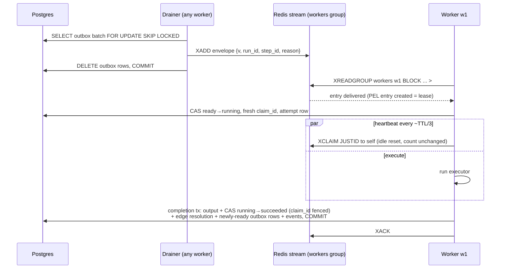
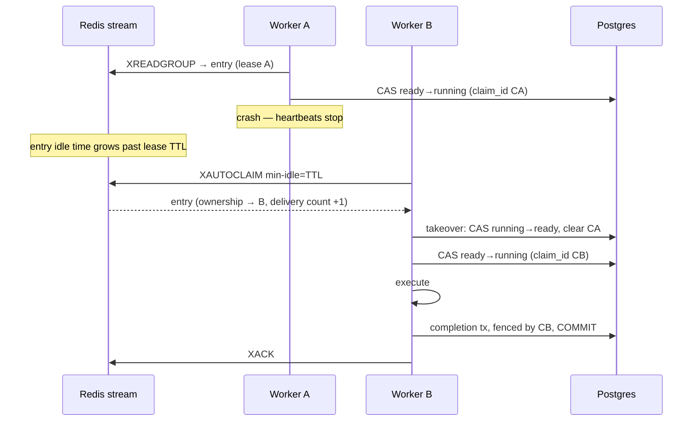
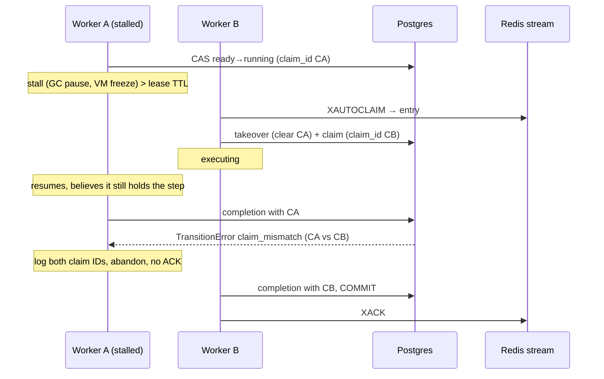

# ADR-005: Dispatch & lease protocol (Redis Streams)

- **Status:** Accepted
- **Date:** 2026-08-08
- **Ticket:** ROADMAP.md ticket 3.1
- **Amended:** 2026-08-10 (ticket 3.7, post-M3 audit) — stream retention
  section added; heartbeat specified as ownership-guarded.

## Context

ADR-002 decides *who* schedules (the completing worker, through the
transactional outbox) and ADR-004 decides what durable state looks like
(guarded CAS transitions, `claim_id` fencing, the outbox table). Neither
says how a committed "this step is ready" row becomes exactly one worker
executing the step — and keeps becoming that across worker crashes,
stalls, redeliveries, and Redis restarts. This ADR fixes that protocol
before any of it is built: M3 implements it as a standalone library
(`internal/queue`, tickets 3.2–3.6) with a chaos harness, and M4 welds it
to the store layer. The details here are load-bearing for both.

Forces in tension:

- **Redis is redeliverable transport, not truth** (project invariant).
  Whatever the queue does, total Redis data loss must be recoverable from
  Postgres via the reconciler. That rules out any design where a Redis
  structure is the only record of pending work.
- **At-least-once delivery is the only honest offer.** Every attempt to
  make a queue exactly-once moves the dedup problem somewhere else; here
  it lands on the claim CAS (2.6), which is already built and tested.
  The protocol must therefore make duplicate delivery *routine and
  harmless*, not exceptional.
- **Steps run long.** An LLM step can hold a worker for minutes; a lease
  that expires on a fixed deadline would reclaim live work. Leases need
  heartbeats — and heartbeats must not pollute the signal that detects
  poison messages (repeated redelivery).
- **Dead workers must not strand work; stalled workers must not corrupt
  it.** Redelivery-after-silence handles the first; the second needs
  fencing, because a stalled worker that wakes after its lease was
  reclaimed will still try to write. 2.6's `claim_id` CAS is that fence;
  this ADR defines the lease layer that decides *when* someone else may
  take over.
- **The layer has future tenants.** Retry backoff (M5.2), throttled
  requeue (M9), and approval timeouts (M15) all need "deliver this later",
  so delayed delivery is part of the protocol, not an add-on. Trace
  context (M7) must ride the messages without a format break.

## Decision

### Topology: one stream, one consumer group

We will use a single Redis Stream **`steps:ready`** with a single consumer
group **`workers`**. Every worker process is one consumer; consumer names
are unique per process *incarnation* (identity plus a random suffix,
format decided in 3.2). A restarted worker is a new consumer: it never
replays its own pre-crash PEL (which fresh names make empty by
construction) — recovery of a dead incarnation's entries flows through
the same reclaim path as any other consumer's, so there is exactly one
recovery mechanism, not two. The accumulation of dead consumer names this
causes is handled by the janitor (below).

The scale lever, per ADR-002, is sharding into K streams by
`hash(run_id)` with workers consuming all shards; K is config-driven and
the protocol is unchanged (an outbox row simply targets a shard).
Measurement and implementation belong to M19 (ticket 19.5). Until then
one stream is the simplest thing that works, and every mechanism below is
per-stream, so sharding multiplies rather than modifies it.

### The task envelope: a pointer, not a payload

A message carries *which step to look at*, never *what to do*. No step
config, no rendered input, no definition fragment — Postgres holds all of
that, and materializing any of it into messages would create a second,
staler copy of truth and make duplicate delivery dangerous. Because the
envelope is a pointer, a duplicate costs one Postgres read before
ACK-and-drop, a lost message costs one reconciler re-outbox, and a
redelivered message can never carry stale instructions.

Envelopes are encoded as **flat Redis Stream field–value pairs** (not a
JSON blob in one field): entries stay inspectable with `XRANGE` and
`redis-cli` during an incident, and the codec is a trivial map, not a
nested parser.

| Field | Required | Content |
|---|---|---|
| `v` | yes | Envelope version, integer as string. This ADR defines `1`. |
| `run_id` | yes | Run UUID, canonical string form. |
| `step_id` | yes | Definition step ID, or a runtime instance ID `{id}#k` once M13/M14 expansion exists (ADR-003 reserves `#` for exactly this). Opaque to the queue layer. |
| `reason` | yes | Enqueue reason — the `task_outbox.reason` value carried through (ADR-004), or stamped directly by a non-outbox producer. Vocabulary: `step_ready`, `reconcile_ready` (the reconciler's re-outbox of a stuck-ready step, 4.4), `reconcile_running` (the reconciler's re-outbox after taking over a stale-running step, 4.5), `retry` (a retry re-dispatch scheduled through the delayed set by the failing worker, 5.2 — the one reason produced without an outbox row), `reconcile_retry` (the reconciler's re-outbox of an overdue retrying step whose delayed entry was lost, 5.2), `dlq_requeue` (the requeue op's re-dispatch of a dead-lettered step it just reset to ready — plus any other ready step of the run whose dispatch was consumed while the run was failed, 5.4), `unpark` (the unpark op's re-dispatch of a ready step whose delivery was consumed by the run-status guard while the run was parked, 5.6), `throttle` (a rate-limited step's re-dispatch scheduled through the delayed set by the throttling worker, 9.2 — like `retry`, produced without an outbox row and built without `EnqueuedAt` so a fan-out of throttled siblings dedups to one pending re-dispatch per step), `semantic_retry` (an output-validation failure's feedback-augmented re-attempt, 11.4 — unlike `retry`/`throttle` it is enqueued through the transactional **outbox** in the completion transaction with `next_attempt_at = now`, since a semantic retry has no backoff; the `reconcile_retry` scan still heals a crash between commit and drain, the row being `retrying` and due now) — all handled identically downstream; the distinct values make healed dispatches visible in entries and logs. Future reasons land with their owning milestones (approval timeout M15). The vocabulary is small and closed, so `reason` is safe as a metric label (unlike `run_id`/`step_id`, which never are — project invariant). |
| `traceparent`, `tracestate` | no | W3C trace context. Reserved by this ADR; populated since 7.3 (additive within version 1, exactly as intended): the enqueuing span's context — the outbox row's stamped context when its writer ran inside a live span, else the run row's durable root (ADR-008); the delayed retry envelope always carries the run root, which keeps identical retries encoding to byte-identical delayed members (the ZADD dedup below is undisturbed — the root context is constant per run). Consumers start each delivery's attempt span under this context; absent fields mean no context, and the span becomes a root. |
| `enqueued_at_ms` | no | Producer's injected-clock time at enqueue, epoch milliseconds. Informational only — feeds dispatch-latency metrics (M7); never an input to logic, because producer and consumer clocks are not comparable. |

**Versioning and compatibility policy:**

- `v` is required; a missing or non-integer `v` is a malformed envelope.
- **Within a version, evolution is additive**: new optional fields may
  appear, and decoders MUST ignore fields they do not recognize. Removing
  a field, changing a field's meaning or type, or making an optional
  field required bumps `v`.
- **Consumers before producers**: a version `N+1` envelope may only be
  produced once the whole fleet decodes `N+1`. Since both ends live in
  this repo and deploy together (rolling), the rule is operational, not
  code: the decoder for a new version ships at least one release before
  the first producer of it. There is no multi-version negotiation.
- A consumer receiving an **unknown version or malformed envelope**
  returns a typed decode error and does **not** ACK. The message stays in
  the PEL, is reclaimed, fails again, and its rising delivery count walks
  it into the poison path (below) — where it is dead-lettered *with its
  contents preserved* (M5.4) instead of being silently dropped. Silent
  drops are the one behavior this protocol never exhibits.

### The lease: the PEL entry is the lease

Redis Streams consumer groups already maintain, per delivered-but-unACKed
entry: the owning consumer, the time since last delivery/claim (idle
time), and a delivery counter. That *is* a lease ledger — owner, expiry
clock, and retry count — so we will not build a second one.

- **Claim (queue-level):** `XREADGROUP GROUP workers <consumer> COUNT n
  BLOCK t STREAMS steps:ready >`. Reading an entry creates its PEL entry
  under this consumer: the lease. The worker then performs the
  authoritative claim — the Postgres CAS `ready → running` with a fresh
  `claim_id` (2.6). The queue-level claim admits; the CAS decides.
- **Lease TTL:** a configuration constant (see Tuning). Nothing in Redis
  stores it; it exists as the `min-idle-time` argument every consumer
  passes to `XAUTOCLAIM`. An entry whose idle time exceeds the TTL is by
  definition expired.
- **Heartbeat:** while executing, the worker runs a heartbeater goroutine
  per in-flight entry (3.4): periodically `XCLAIM` **to itself** with
  **`JUSTID`**, which resets the entry's idle time to zero. `JUSTID` is
  load-bearing: a plain `XCLAIM` increments the delivery counter, and the
  delivery counter must remain a pure redelivery signal — a long step
  heartbeating for an hour must not look like a poison message.
  The beat is **ownership-guarded** (3.7, post-M3 audit): a small Lua
  script claims only when the beater still owns the entry, atomically. A
  bare `XCLAIM` with min-idle 0 would unconditionally transfer ownership,
  so a stalled worker that resumed after its lease was reclaimed would
  silently steal the entry back from the legitimate new holder and the
  two heartbeaters would flap ownership — safe (the fence decides), but
  it hides the displacement from logs and resets idle time nobody should
  be resetting. With the guard, a displaced (or already-acked) entry
  stops its heartbeater with a logged warning and the worker keeps
  executing; correctness rests on the `claim_id` fence as always.
- **Reclaim:** every consumer periodically runs `XAUTOCLAIM ... workers
  <consumer> <lease-TTL> <cursor>`, taking ownership of expired entries
  and feeding them through its normal handler path. `XAUTOCLAIM` (without
  `JUSTID`) increments the delivery counter — correctly, because a
  reclaim *is* a redelivery. 3.4's tests assert both counter behaviors.
  Idle time is tracked by the Redis server against its own clock, so
  expiry is immune to worker clock skew; worker clocks matter only for
  heartbeat *scheduling*, where jitter tolerance absorbs them.
- **Poison:** an entry whose delivery count exceeds the configured
  threshold has crashed or errored its way through that many handlers.
  The consumer loop diverts it to a poison callback instead of the
  handler; since 5.4 `cmd/worker` wires the callback to the engine's
  dead-lettering (step → `dead_lettered` from any non-terminal status,
  full context + raw envelope contents recorded in `dead_letters`, run
  disposition applied, then ACK — the DLQ row is the durable consumption
  of the message). *As built (5.4), the undecodable-envelope case:* a
  poison entry whose envelope does not decode has no step identity to key
  a DLQ row to; the handler logs the raw contents loudly and consumes the
  entry — ending the pre-5.4 designed pending spin — rather than spinning
  forever or writing an unrequeueable orphan record. A poison entry whose
  step is already terminal is likewise consumed (a stale duplicate of
  decided work); transport failures leave it pending for the next reclaim
  pass.

**Two layers, one purpose each.** The PEL answers a *liveness* question —
"has whoever holds this gone silent long enough that someone else should
take over?" — cheaply and continuously, worker-side, with no Postgres
traffic. The `claim_id` CAS answers the *correctness* question — "is this
write from the current holder?" — authoritatively, at every state write.
Neither substitutes for the other: Postgres cannot see heartbeats (a
liveness check there would poll the hot store), and Redis cannot fence
writes it never sees (the zombie writes to Postgres directly). The
protocol is safe if the fence holds even when the lease layer misjudges —
a spurious reclaim wastes one execution; it can never corrupt state.

### ACK discipline

`XACK` removes the PEL entry — it is the queue forgetting the message. It
happens **only after the Postgres transaction that consumes the message
commits**, or when consuming the message is provably unnecessary:

| Case | Action |
|---|---|
| Completion/failure transition committed (M4.3; also budget park, M10; also human-approval park, 15.2) | ACK |
| Retry-routing transition committed (`running → retrying`, 5.2) | ACK — the durable row (`next_attempt_at`) now carries the retry; the post-commit delayed schedule is best-effort, its loss healed by the reconciler's overdue-retrying scan |
| Claim CAS reports the step is already terminal (`succeeded`/`failed`/`skipped`; since 5.4 also `dead_lettered`/`cancelled`) — duplicate of finished work | ACK and drop |
| Poison diversion: the dead-lettering transaction committed (5.4) — the `dead_letters` row is the durable consumption; also an undecodable-envelope or already-terminal poison entry (provably unconsumable / already consumed) | ACK |
| Claim CAS reports the step is already `running` on a message from the **fresh-delivery** path — a concurrent duplicate; the live holder's own entry covers the crash case | ACK and drop |
| Claim CAS reports the step is `retrying` with its backoff still pending (5.2 — a due step would have matched the claim) | ACK and drop — `next_attempt_at` is durable and the delayed entry or the reconciler carries the future dispatch |
| Claim CAS reports the step is `awaiting_human` (15.2) — parked without a lease | ACK and drop — the pending approval is durable, and the decision path (15.3) resumes the step through a fresh dispatch. This is the crash-before-ACK convergence: a redelivery of a committed park (W4) is a duplicate of a parked step |
| Claim CAS reports the run is not `running` (5.2's run-status guard; since 5.6 that covers `parked`, `cancelling`, and `cancelled` runs as well as terminal ones) | ACK and drop — executing a step of a settled (or paused) run is provably unnecessary; for a parked run the unpark op re-outboxes stranded ready steps, and the reconciler covers overdue retrying ones |
| Step is `running` on a message from the **reclaim** path — the holder's lease expired | lease-expiry takeover (below), no ACK until the subsequent completion commits |
| Run or step row does not exist (dangling reference — e.g. run deleted under a retention policy) | ACK and drop |
| Handler error, handler panic, worker crash | **no ACK** — the entry stays in the PEL and redelivers via reclaim |
| Unknown envelope version / malformed envelope | no ACK — delivery count walks it to the poison path |

ACK-before-execute (at-most-once) is rejected outright: a crash between
ACK and completion silently loses the step, and the reconciler's staleness
sweep would become the *primary* delivery mechanism instead of a backstop.

**Lease-expiry takeover.** A reclaimed entry whose step is `running` in
Postgres means the previous holder went silent past the TTL. The new
holder performs ADR-004's M4 transition `running → ready` (clearing
`claim_id` — this is the moment the zombie loses its fence) and then
claims normally (`ready → running`, fresh `claim_id`). Both are guarded
CAS: if the original worker's completion commits between the reclaim and
the takeover, the takeover CAS finds the step terminal, fails typed, and
the new holder ACK-and-drops instead. The race has no window where both
writes land.

**The duplicate-vs-crash distinction is by delivery path, not by
guessing.** At-least-once enqueue means one step can have two live stream
entries (reconciler re-outbox, promoter duplicate). A *fresh* delivery
(`XREADGROUP >`) finding the step `running` must not take over — the
holder may be alive and heartbeating its own entry; if the holder is in
fact dead, *its* entry's reclaim performs the takeover. One known race
survives this rule: if a duplicate entry's reader crashes before
ACK-dropping it, that duplicate is later *reclaimed* while the real
holder still runs, and the takeover steals a live claim. It is rare
(needs a duplicate *and* a crash), bounded (one wasted execution), and
safe — the fenced original's completion is rejected, the step re-executes,
and side-effect idempotency (built in 5.5: journaled results short-circuit
the re-execution) absorbs the external effects. Accepted.

### Crash matrix

Worker crash points (W), producer crash points (P), and Redis loss (R).
Each cell names its recovery mechanism and where it is (or will be)
proven — per the M3 exit criterion that every cell carries a test or an
explicit rationale.

| # | Dies / fails at | State left behind | Recovery | Proven by |
|---|---|---|---|---|
| W1 | Before `XREADGROUP` reads the entry | Entry undelivered in stream; step `ready` | Any other consumer reads it; nothing to heal | 3.3 (round-trip under multiple consumers) |
| W2 | After `XREADGROUP`, before the Postgres claim CAS | PEL entry under dead consumer; step still `ready` | Idle exceeds TTL → `XAUTOCLAIM` → new consumer claims normally | 3.4 kill-reclaim test; 3.6 `pre-handle` kill hook |
| W3 | After claim CAS, mid-execute | PEL entry going stale; step `running` with dead worker's `claim_id` | Reclaim → lease-expiry takeover (`running → ready`, clear claim) → fresh claim → execute; original holder's late write fenced by `claim_id` | 3.4 (queue layer); 4.5 (fencing); 4.7 (flagship crash demo) |
| W4 | After completion tx commits, before `XACK` | Step terminal; PEL entry lingers | Reclaim redelivers → claim CAS sees terminal → ACK-and-drop; no side effects (envelope is a pointer) | 3.3 kill-pre-ACK redelivery; 4.2 duplicate-delivery test |
| W5 | After `XACK` | Nothing pending anywhere | Nothing to recover — rationale: ACK is the last protocol step; all durable effects committed in W4's transaction | rationale (no test needed) |
| P1 | Outbox drainer, between `XADD` and the outbox-row `DELETE` committing | Entry in stream *and* outbox row still present | Row re-drained → duplicate entry → ACK-and-drop at claim. Enqueue is at-least-once by design | 4.4 (kill between commit and XADD; duplicate-dispatch assertion) |
| P2 | Stream entry lost after drain (never delivered, no PEL trace) | Step stuck `ready`, no message anywhere | Reconciler re-outboxes steps `ready` longer than a threshold (ADR-004's partial index on `(status, updated_at)` serves the scan). *Since 5.4 all three step scans (stale-ready, stale-running, overdue-retrying) additionally require the run to be `running`:* a failed run legitimately strands ready/running/retrying steps (fail_fast disposition; the claim path refuses them), and healing those would be an infinite re-outbox → deliver → ack-drop churn loop — a requeue that re-opens the run re-dispatches its ready steps itself. *5.6 adds the one exception:* a dedicated scan for stale `running` steps of **cancelling** runs — their dead holders are settled with takeover (attempt `lost`) + step cancel + the cancel rollup, never a re-outbox (cancelled work is not re-dispatched); without it a cancelling run whose in-flight worker died would never finalize | 4.4 reconciler test; 5.6 `TestReconcilerHealsCancellingRun` |
| P3 | Retry-routing worker dies (or its ZADD fails) after the `running → retrying` commit, before the delayed schedule (5.2) | Step `retrying` with `next_attempt_at` set; no delayed entry; original PEL entry either ACKed (schedule failed softly) or redelivered-then-dropped (retrying, not due) | Reconciler re-outboxes steps `retrying` whose `next_attempt_at` is more than the retry-stale threshold in the past with no pending outbox row (reason `reconcile_retry`; same anti-join idempotency as P2); the claim CAS accepts a due retrying step directly, so no status heal is needed. A late-arriving duplicate delivery past the due time claims and executes on its own — self-healing without the sweep | 5.2 failing-scheduler integration test (`TestRetryCrashGapHealedByReconciler`) |
| R1 | Redis loses stream + PEL + delayed set (crash beyond AOF's fsync window, failover) | Postgres intact: steps `ready` with no messages, steps `running` with no leases | Three-part: (a) `ready` steps — as P2. (b) `running` steps with a **live** worker — unaffected: the fence is Postgres `claim_id`, which survived; the worker's heartbeat starts failing (entry gone), it logs and continues, and its completion commits normally. (c) `running` steps with a **dead** worker — no PEL entry will ever expire, so the reconciler is the backstop: steps `running` with `updated_at` staler than a threshold ≫ lease TTL get the takeover (the same fenced CAS as the reclaim path, guarded on the scanned claim so a step re-claimed between snapshot and row lock is left alone) + a re-outbox with reason `reconcile_running` (4.5). The threshold is generous because `updated_at` moves on transitions, not heartbeats — it is effectively a cap on step wall-clock time; a false positive keeps durable state correct (fencing rejects the live holder's completion) but re-runs the step's side effects. The heal skips its re-outbox when the step already carries a pending outbox row (the P1 shape sustained past the threshold), so a takeover never doubles a pending dispatch. (d) delayed entries — recovered by their owners' durable state: the retry tenant (5.2, the delayed set's first production tenant) rests in `retrying` with `next_attempt_at` durable, so a lost entry is healed exactly as P3 | (a) 4.4; (b) 4.5; (c) flagged 4.4, healed 4.5; (d) 5.2's P3 test; full-loss drill in 5.8 chaos (Redis restart blip) |

The uniform shape: **every recovery is either "redeliver and let the
claim CAS decide" or "reconciler re-outboxes from Postgres state."** No
cell requires human intervention, message archaeology, or Redis being
durable.

### Sequence diagrams

**Happy path** — outbox to ACK:

**Crash-reclaim** — worker A dies mid-execute, B takes over:

**Zombie fenced write** — A stalls past TTL, wakes, and is rejected:

### Delayed delivery: `sched:delayed`

"Deliver this envelope at time T" is a sorted set: member = encoded
envelope, score = fire-at time in epoch milliseconds. Every consumer runs
a promoter loop (3.5): each tick, a Lua script atomically pops entries
with `score ≤ now` (bounded batch) and `XADD`s each to `steps:ready`. The
script's atomicity means no crash point between "removed from the set"
and "added to the stream" — within one Redis, promotion neither loses nor
duplicates entries, which the 3.5 stress test asserts under concurrent
promoters. System-level duplicates remain possible (AOF-replay artifacts,
an owner re-scheduling after a reconciler nudge) and are absorbed
downstream like every other duplicate: at the claim CAS.

`now` is passed into the script by the caller from its injectable clock —
tests drive promotion with a fake clock; the script never reads Redis
server time. ZSET member semantics are deliberate: `ZADD` of an identical
envelope *moves its fire time* rather than queueing a second copy — "at
most one pending future dispatch per identical envelope" is the semantic
retries and requeues want. The retry tenant (5.2) leans into this
deliberately: retry envelopes are built without `enqueued_at_ms` so
successive retries of one step encode byte-identically — at most one
pending retry dispatch per step, ever. A tenant needing two independent
future dispatches of the same step must instead make the envelopes
distinct; that is the tenant's contract, recorded here so nobody trips
over it.

Delayed entries are *scheduling state, not truth*: each tenant must hold
durable Postgres state from which a lost delayed entry is re-derivable.
The first production tenant — 5.2's retry re-dispatch — models this:
`retrying` status plus `next_attempt_at` on the step row are the truth,
the delayed entry is a latency optimization, and the reconciler's
overdue-retrying scan (crash cell P3) re-dispatches from the row alone.
The queue library provides the mechanism; durability remains Postgres's
job.

A member the script cannot decode into stream fields is moved to a
quarantine list (`<key>:malformed`) instead of the stream (decided in
3.5). Only the library writes the set, so such a member should be
unreachable — but an unguarded decode failure would abort the script,
and since the bad member holds a due score it would be re-selected first
on every tick, wedging every promoter in the fleet; quarantine preserves
the contents for an operator, per the no-silent-drop rule.

### Stream retention: trimming acked entries

`XACK` removes an entry from the PEL but not from the stream, so without
retention the stream keeps every envelope ever enqueued and Redis memory
grows without bound. Every consumer therefore runs a low-frequency trim
duty (3.7, post-M3 audit): compute the oldest entry ID still relevant to
the group and issue an exact `XTRIM MINID` at it.

The threshold is the group's **smallest pending entry ID** when the PEL
is non-empty, otherwise the **successor of the group's last-delivered
ID**. Every entry below it has been delivered (its ID is at or below
last-delivered) and is not pending — i.e. acked, and an acked entry is
one the protocol has permanently forgotten. The threshold is
monotonically safe against concurrent consumers: `XREADGROUP >` only
delivers IDs above last-delivered, and `XCLAIM`/`XAUTOCLAIM` only operate
on entries already in the PEL, so nothing below a snapshotted threshold
can ever become pending again — a stale snapshot merely trims less.
Pending and undelivered entries are never trimmed; deleting a pending
entry would drop lease state (`XAUTOCLAIM` silently discards PEL entries
whose stream entry is gone), and deleting an undelivered one would lose
work the reconciler would then have to heal.

Because deletions never exceed last-delivered, the group's `lag` stays
computable after every trim (`XINFO GROUPS` reports a NULL lag only when
entries the group may not have read were deleted) — which the 3.6
quiescence probe depends on; 3.7's tests pin both properties.

Exact (non-`~`) trimming is deliberate: the per-pass cost is bounded by
the entries acked since the last pass, and determinism keeps depth
observations honest (`XLEN` after a trim ≈ undelivered + in-flight). A
crash anywhere in the duty is harmless — the next pass, on any consumer,
recomputes the threshold from live state.

### Orphan-consumer cleanup

Per-incarnation consumer names mean every worker restart strands a
consumer record. Stranded PELs drain via `XAUTOCLAIM` (that is the normal
crash path), after which the empty consumer record is pure clutter — but
unbounded clutter: `XINFO CONSUMERS` output and group memory grow forever.
Every worker therefore runs a low-frequency janitor (3.4): list consumers,
and for each with **zero pending entries** and idle beyond a generous
threshold (hours, not lease TTLs), issue `XGROUP DELCONSUMER`. The
zero-pending guard makes the janitor safe by construction — deleting a
consumer with pending entries would drop PEL state, and a consumer that
is merely quiet still heartbeats its entries, keeping them visibly
pending. Janitor races (two workers deleting the same dead consumer) are
benign: `DELCONSUMER` of an absent consumer is a no-op.

*Amendment (5.7):* gracefully drained workers deregister themselves at
exit (below), so the janitor's caseload shrinks to genuine crashes; its
guard and cadence are unchanged.

### Graceful shutdown & drain (ticket 5.7, as built)

Everything above treats worker death as sudden — heartbeats stop, leases
expire, survivors reclaim. A rolling restart through that path works but
is wasteful: every deploy would cost one reclaim cycle per in-flight
step, a `lost` attempt, and a re-execution. SIGTERM therefore gets a
deliberate two-phase shutdown, built on the observation that "stop
taking work" and "stop doing work" are different events:

- **Soft stop (SIGTERM / context cancellation).** The consumer stops
  issuing `XREADGROUP` and suspends every periodic duty — reclaim,
  promotion, janitor, trim. From this moment nothing can be added to
  this consumer's PEL (only its own reads and reclaims ever grow it),
  which is what makes the exit-time logic below race-free.
- **Drain.** The in-flight handler *and every already-delivered entry*
  (the unprocessed remainder of the last read batch, plus any reclaimed
  entries in hand) keep processing under a **work context** that
  survives the cancellation. Heartbeats and ACKs already run detached,
  so a draining step keeps its lease alive and acks normally after its
  completion commits. The worker's outbox drain loop deliberately
  outlives the SIGTERM too: the draining steps' completions fan
  successors out through the outbox, and the draining worker's own
  dispatcher is what hands them to survivors promptly.
- **Hard stop (drain deadline).** A watchdog cancels the work context
  `DrainTimeout` after the soft stop. Whatever is still running is
  abandoned: the executor's context cancels, the engine returns without
  attempting a completion (nothing can commit on a canceled context),
  the entry stays un-acked, and its lease expires naturally into the
  reclaim → takeover path. **The abandon path IS the crash path** — no
  new recovery machinery, the existing matrix cells cover it.

Every entry in hand at shutdown gets a logged disposition — `drained`
(completed and acked), `redeliver` (handler error, stays pending as in
normal operation), or `abandoned` (drain deadline) — plus a summary line
with counts. A consumer that exits with a provably empty PEL deletes its
own consumer record (`XGROUP DELCONSUMER`, safe because nothing can be
assigned to it anymore); one that abandoned or left entries pending
stays registered so its PEL state remains owned until reclaim.

`DrainTimeout` zero (the internal/queue default) preserves the pre-5.7
semantics — cancellation reaches the handler immediately, no drain, no
deregistration. That mode exists for the queuetest chaos harness, whose
kill switches simulate crashes via context cancellation and must remain
a faithful sudden death. The production worker always drains:
`AGENTLOOM_WORKER_DRAIN_TIMEOUT` must be positive (default 25s, sized to
fit inside Kubernetes's default 30s `terminationGracePeriodSeconds` with
margin — the contract M20's `preStop`/rolling restarts build on).

Accepted residuals: a completion transaction torn down by the hard
deadline mid-commit either lands (the un-acked entry later redelivers
and ack-drops at the claim CAS) or rolls back (normal abandon) — both
safe; and an executor succeeding just before the deadline may be
abandoned anyway and re-executed elsewhere, absorbed by idempotency keys
and the side-effect journal like any reclaim.

### Tuning parameters

All values are config (0.5's loader) with these defaults; 3.2–3.5 wire
them. Time-dependent behavior uses injected clocks per project invariant
(Redis-server-side idle tracking excepted — that is the one clock we
consume rather than inject, and tests tune TTLs down rather than faking
it).

| Parameter | Default | Rationale |
|---|---|---|
| Lease TTL (`XAUTOCLAIM` min-idle) | 30s | Long enough that heartbeats at TTL/3 survive two consecutive misses; short enough that crash recovery (W2/W3) is prompt. Chaos tests shrink it to hundreds of ms for speed. |
| Heartbeat interval | TTL/3, ±20% jitter | Two missed beats still precede expiry; jitter prevents fleet-wide alignment. |
| Poison threshold (delivery count) | 5 | Survives plausible unlucky redelivery chains (a couple of crashes + a reclaim) without letting a crash-looping handler spin indefinitely. |
| `XREADGROUP` COUNT / BLOCK | 16 / 5s | Batch amortizes round-trips; 5s block keeps shutdown latency and liveness checks bounded. |
| Reclaimer interval | TTL/2 | Bounds reclaim latency to TTL + TTL/2 worst case (the "TTL + ε" in the M3 exit criteria). |
| Promoter tick | 1s | Delayed delivery is for backoffs and timeouts measured in seconds-to-days; sub-second precision buys nothing. |
| Janitor interval / idle threshold | 10m / 1h | Cleanup is cosmetic-plus-memory; there is no urgency. |
| Trim interval | 1m | Retention is a memory concern, not correctness; a minute bounds acked-entry buildup to a minute of throughput. |
| Outbox drain interval / batch | 1s / 64 | The interval is only the latency backstop — same-process completions wake the drainer via nudge, and the reconciler nudges after re-outboxing; the batch bounds rows locked per drain transaction (which holds its row locks across the XADDs). |
| Reconciler sweep interval | 30s, ±20% jitter | Bounds lost-dispatch heal latency; the fleet-wide advisory lock (`pg_try_advisory_xact_lock`) admits one sweep at a time — losers skip, so N workers cost one sweep per interval, not N. Jitter keeps worst-case heal latency near one interval instead of stacking skipped sweeps. |
| Ready-stale threshold | 1m | ≫ the drain interval, so only a genuinely lost dispatch (P2/R1(a)) qualifies; the anti-join against pending `task_outbox` rows makes sweeps idempotent — a stuck step costs at most one duplicate dispatch per threshold period, never one per sweep. |
| Running-stale threshold | 5m | ≫ the lease TTL because `updated_at` moves on transitions, not heartbeats (R1(c)); a hit gets takeover + re-outbox (4.5) — a false positive is fenced, so the cost of too tight a bound is wasted re-execution, not corruption. |
| Retry-stale threshold | 1m | Measured from a retrying step's `next_attempt_at` (5.2, crash cell P3), so no lease-TTL margin applies; it need only comfortably exceed the promoter tick. A false positive (delayed entry merely slow) costs one duplicate dispatch, absorbed at the claim CAS. |
| Reconciler sweep limit | 256 rows/scan | Caps sweep transaction size; a hit is logged (no silent truncation) and the next sweep continues. |
| Drain timeout (`AGENTLOOM_WORKER_DRAIN_TIMEOUT`) | 25s | The SIGTERM grace budget (5.7): long enough to finish a typical in-flight step plus a read batch, short enough to fit inside K8s's default 30s termination grace with margin for the final exit. Size it alongside `terminationGracePeriodSeconds` (M20): grace period ≥ drain timeout + a few seconds. Steps longer than the budget are abandoned to the crash path by design. |
| Stream / group / delayed-set names | `steps:ready` / `workers` / `sched:delayed` | The fleet-wide names above; overridable via env (`AGENTLOOM_QUEUE_STREAM`/`_GROUP`/`_DELAYED_KEY`, 4.7) for test isolation only — the crash-recovery suite runs real worker processes against per-test keys on a shared Redis. Production sharding is M19's lever, not this knob. |

### Deployment expectation

Redis runs with AOF enabled (`appendonly yes`, `everysec` fsync — already
the compose configuration). This narrows the R1 window to roughly one
second of acknowledged writes; the protocol does not *depend* on it (R1's
recovery holds for total loss), but cheap durability makes the backstop
path rare instead of routine.

## Consequences

Positive:

- **No second lease store.** Owner, expiry clock, and retry count come
  from the PEL for free; there is no lease table to keep consistent with
  the queue, and lease state dies with the queue state it describes —
  which is exactly the right lifetime.
- **Delivery count is an uncontaminated poison signal** because
  heartbeats use `JUSTID`. Poison detection needs no extra bookkeeping.
- **Pointer envelopes make every failure boring.** Duplicates cost one
  read; losses cost one re-outbox; nothing in a message can be stale or
  harmful. The crash matrix collapses to two recovery shapes.
- **Recovery is symmetric and leaderless.** Every consumer reclaims,
  promotes, and janitors; there is no special role to fail over,
  consistent with ADR-002.
- **The M19 sharding lever stays cheap** — all mechanisms are per-stream.

Negative:

- **At-least-once is contagious.** Every current and future message path
  (retries, requeues, unparks, approval timeouts) must be dedupe-safe at
  the claim CAS, forever. One forgotten ACK-and-drop branch is a
  double-execution bug. Accepted: the alternative (queue-side dedup)
  is a second truth store; 3.6's harness exists to keep paths honest.
- **TTL tuning is a real hazard.** A stall longer than the lease TTL
  (GC pause, VM freeze) causes a spurious reclaim: safe (fenced) but
  wasted work — and with side effects, wasted *external* calls unless
  5.5's journal absorbs them (it does, for any effect whose result was
  journaled before the stall). Mitigated by heartbeat = TTL/3 and the
  takeover CAS window being race-free; not eliminated.
- **The duplicate-reclaim takeover race** (a duplicate entry's reader
  crashes; its reclaim steals a live claim) is accepted as rare, bounded,
  and fenced rather than engineered away — closing it would need
  PEL-wide by-step introspection on every reclaim. *Post-M4 audit:* the
  likelier trigger is now the reconciler itself — a `reconcile_running`
  re-outbox creates exactly such a duplicate next to the original
  holder's entry, so a false-positive takeover of a live worker can
  ping-pong (original entry goes stale after its handler errors on the
  fence, redelivers, takes over the new holder). Same bound applies: each
  round costs one fenced execution, and the poison threshold caps the
  loop; 5.5's side-effect journal (built) absorbs the external effects.
- **A failed completion transaction now re-executes, not just
  redelivers** (*post-M4 audit*). Before 4.5 a transient completion-tx
  failure left the entry to bounce off the claim CAS; with the takeover
  in place, the redelivery (delivery count > 1, step `running`) takes
  over and runs the executor again. Correct for a dead holder, and the
  right trade for a transient blip — but it means completion-tx failures
  are bounded by the poison threshold, not free. Deterministic in-tx
  content failures (a join target's corrupt config) are therefore routed
  to the failure completion instead of the transaction abort; only
  graph-integrity corruption still rides the redeliver-to-poison path,
  deliberately loud.
- **Reclaim latency for the Redis-loss case is poor.** R1(c) waits for a
  reconciler threshold ≫ lease TTL because `updated_at` does not move on
  heartbeats. Accepted: the case is rare (Redis loss *and* worker death
  together), and heartbeating into Postgres to tighten it would put the
  fleet's steady-state load on the hot store. The flip side (*post-M4
  audit*): that same threshold is a de-facto hard cap on step wall-clock
  execution time — a live executor running past `RunningStale` is taken
  over and its side effects double. Until M5.3 adds real step timeouts,
  operators must size `RunningStale` above their longest expected step.
- **PEL observability requires deliberate work** — pending counts, oldest
  idle, delivery-count histograms come from `XPENDING`/`XINFO` polling
  (3.2's introspection helpers, M7's metrics), not from anything the
  protocol emits for free.

## Alternatives considered

- **Separate lease keys (`SET NX PX` + renewal) alongside a simple
  queue.** The classic Redis lock pattern. Rejected: it rebuilds what the
  PEL already provides (owner, expiry, and — with delivery counts —
  retry history), doubles the structures that can disagree after a crash
  (queue entry present, lock absent, and vice versa), and still needs
  Postgres fencing for correctness. The PEL keeps lease and delivery
  state in one place with one recovery path.
- **Postgres-only dispatch (`SKIP LOCKED` polling, no Redis).** Already
  rejected in ADR-002 (poll latency/load trade-off, claim contention on
  the hot store, no delivery counts or blocking delivery); recorded here
  because M3 is where it would have been implemented.
- **Kafka / NATS JetStream / RabbitMQ / SQS.** All plausible transports;
  all rejected on the same grounds: none is already in the stack (Redis
  serves four roles here — queue, rate limiting, delayed delivery,
  cache/pub-sub), and none maps the lease protocol as directly. Kafka's
  consumer-partition model makes per-message claim/reclaim foreign
  (partition rebalancing is the unit of takeover); RabbitMQ redelivers on
  connection death rather than offering claimable per-message idle state;
  SQS's visibility timeout is close semantically but is a managed service
  (local-first development and the chaos harness want a process we
  control). Operating a second broker for a protocol Redis Streams
  expresses natively is pure cost.
- **Fat envelopes carrying step config/input.** Saves one Postgres read
  per execution. Rejected: creates a second copy of truth that can go
  stale the moment M13 expansion or a retry mutates state, makes
  duplicates dangerous instead of boring, and bloats Redis memory with
  data Postgres already serves from the claim-path read it must do anyway
  (fencing requires talking to Postgres regardless).
- **Queue-side exactly-once (dedup keys in Redis, transactional ACK).**
  Rejected on principle: it moves dedup into the transport, which is the
  component we have declared lossy. The claim CAS is durable, already
  exists (2.6), and dedupes *all* duplicate sources — producer retries,
  reconciler re-outboxing, promoter replays — with one mechanism.
- **Per-run streams.** Natural ordering per run, trivially shardable.
  Rejected: unbounded key cardinality (streams × runs), consumer groups
  per run to create and destroy, and fleet-wide claim fairness would need
  key discovery (`SCAN`) or a registry — a coordination problem the
  single shared stream simply does not have. Per-run ordering is not even
  a requirement: readiness ordering comes from the DAG in Postgres.
- **`XCLAIM` without `JUSTID` for heartbeats (simpler client code).**
  Rejected: every heartbeat would increment the delivery counter,
  destroying poison detection — a two-hour step heartbeating at 10s
  intervals would look like a 720-delivery poison message. This is why
  the heartbeat form is specified normatively in this ADR rather than
  left as an implementation detail.
