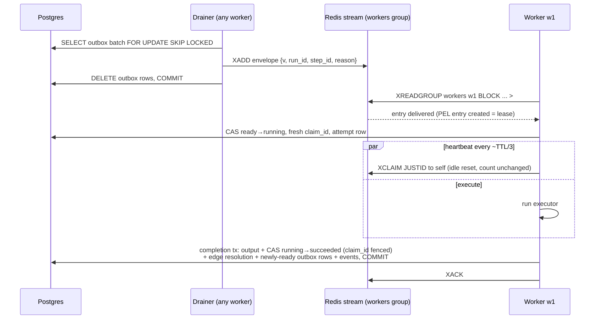
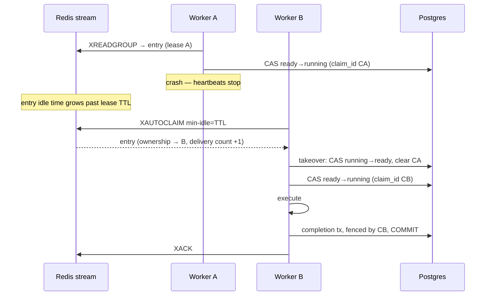
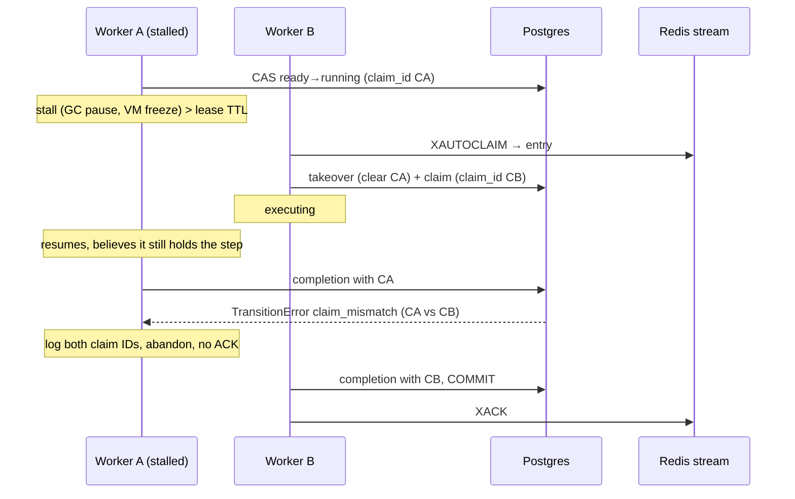

# ADR-005: Dispatch & lease protocol (Redis Streams)

- **Status:** Accepted
- **Date:** 2026-08-08
- **Ticket:** ROADMAP.md ticket 3.1

## Context

ADR-002 decides *who* schedules (the completing worker, through the
transactional outbox) and ADR-004 decides what durable state looks like
(guarded CAS transitions, `claim_id` fencing, the outbox table). Neither
says how a committed "this step is ready" row becomes exactly one worker
executing the step — and keeps becoming that across worker crashes,
stalls, redeliveries, and Redis restarts. This ADR fixes that protocol
before any of it is built: M3 implements it as a standalone library
(`internal/queue`, tickets 3.2–3.6) with a chaos harness, and M4 welds it
to the store layer. The details here are load-bearing for both.

Forces in tension:

- **Redis is redeliverable transport, not truth** (project invariant).
  Whatever the queue does, total Redis data loss must be recoverable from
  Postgres via the reconciler. That rules out any design where a Redis
  structure is the only record of pending work.
- **At-least-once delivery is the only honest offer.** Every attempt to
  make a queue exactly-once moves the dedup problem somewhere else; here
  it lands on the claim CAS (2.6), which is already built and tested.
  The protocol must therefore make duplicate delivery *routine and
  harmless*, not exceptional.
- **Steps run long.** An LLM step can hold a worker for minutes; a lease
  that expires on a fixed deadline would reclaim live work. Leases need
  heartbeats — and heartbeats must not pollute the signal that detects
  poison messages (repeated redelivery).
- **Dead workers must not strand work; stalled workers must not corrupt
  it.** Redelivery-after-silence handles the first; the second needs
  fencing, because a stalled worker that wakes after its lease was
  reclaimed will still try to write. 2.6's `claim_id` CAS is that fence;
  this ADR defines the lease layer that decides *when* someone else may
  take over.
- **The layer has future tenants.** Retry backoff (M5.2), throttled
  requeue (M9), and approval timeouts (M15) all need "deliver this later",
  so delayed delivery is part of the protocol, not an add-on. Trace
  context (M7) must ride the messages without a format break.

## Decision

### Topology: one stream, one consumer group

We will use a single Redis Stream **`steps:ready`** with a single consumer
group **`workers`**. Every worker process is one consumer; consumer names
are unique per process *incarnation* (identity plus a random suffix,
format decided in 3.2). A restarted worker is a new consumer: it never
replays its own pre-crash PEL (which fresh names make empty by
construction) — recovery of a dead incarnation's entries flows through
the same reclaim path as any other consumer's, so there is exactly one
recovery mechanism, not two. The accumulation of dead consumer names this
causes is handled by the janitor (below).

The scale lever, per ADR-002, is sharding into K streams by
`hash(run_id)` with workers consuming all shards; K is config-driven and
the protocol is unchanged (an outbox row simply targets a shard).
Measurement and implementation belong to M19 (ticket 19.5). Until then
one stream is the simplest thing that works, and every mechanism below is
per-stream, so sharding multiplies rather than modifies it.

### The task envelope: a pointer, not a payload

A message carries *which step to look at*, never *what to do*. No step
config, no rendered input, no definition fragment — Postgres holds all of
that, and materializing any of it into messages would create a second,
staler copy of truth and make duplicate delivery dangerous. Because the
envelope is a pointer, a duplicate costs one Postgres read before
ACK-and-drop, a lost message costs one reconciler re-outbox, and a
redelivered message can never carry stale instructions.

Envelopes are encoded as **flat Redis Stream field–value pairs** (not a
JSON blob in one field): entries stay inspectable with `XRANGE` and
`redis-cli` during an incident, and the codec is a trivial map, not a
nested parser.

| Field | Required | Content |
|---|---|---|
| `v` | yes | Envelope version, integer as string. This ADR defines `1`. |
| `run_id` | yes | Run UUID, canonical string form. |
| `step_id` | yes | Definition step ID, or a runtime instance ID `{id}#k` once M13/M14 expansion exists (ADR-003 reserves `#` for exactly this). Opaque to the queue layer. |
| `reason` | yes | Enqueue reason — the `task_outbox.reason` value carried through (ADR-004). v1 vocabulary: `step_ready`. Future reasons land with their owning milestones (retry re-dispatch M5.2, DLQ requeue M5.4, unpark M5.6, reconciler re-outbox M4.4, approval timeout M15). The vocabulary is small and closed, so `reason` is safe as a metric label (unlike `run_id`/`step_id`, which never are — project invariant). |
| `traceparent`, `tracestate` | no | W3C trace context placeholder. Reserved now, written and propagated from M7 on; absent until then. Reserving the fields is what lets observability arrive without a version bump. |
| `enqueued_at_ms` | no | Producer's injected-clock time at enqueue, epoch milliseconds. Informational only — feeds dispatch-latency metrics (M7); never an input to logic, because producer and consumer clocks are not comparable. |

**Versioning and compatibility policy:**

- `v` is required; a missing or non-integer `v` is a malformed envelope.
- **Within a version, evolution is additive**: new optional fields may
  appear, and decoders MUST ignore fields they do not recognize. Removing
  a field, changing a field's meaning or type, or making an optional
  field required bumps `v`.
- **Consumers before producers**: a version `N+1` envelope may only be
  produced once the whole fleet decodes `N+1`. Since both ends live in
  this repo and deploy together (rolling), the rule is operational, not
  code: the decoder for a new version ships at least one release before
  the first producer of it. There is no multi-version negotiation.
- A consumer receiving an **unknown version or malformed envelope**
  returns a typed decode error and does **not** ACK. The message stays in
  the PEL, is reclaimed, fails again, and its rising delivery count walks
  it into the poison path (below) — where it is dead-lettered *with its
  contents preserved* (M5.4) instead of being silently dropped. Silent
  drops are the one behavior this protocol never exhibits.

### The lease: the PEL entry is the lease

Redis Streams consumer groups already maintain, per delivered-but-unACKed
entry: the owning consumer, the time since last delivery/claim (idle
time), and a delivery counter. That *is* a lease ledger — owner, expiry
clock, and retry count — so we will not build a second one.

- **Claim (queue-level):** `XREADGROUP GROUP workers <consumer> COUNT n
  BLOCK t STREAMS steps:ready >`. Reading an entry creates its PEL entry
  under this consumer: the lease. The worker then performs the
  authoritative claim — the Postgres CAS `ready → running` with a fresh
  `claim_id` (2.6). The queue-level claim admits; the CAS decides.
- **Lease TTL:** a configuration constant (see Tuning). Nothing in Redis
  stores it; it exists as the `min-idle-time` argument every consumer
  passes to `XAUTOCLAIM`. An entry whose idle time exceeds the TTL is by
  definition expired.
- **Heartbeat:** while executing, the worker runs a heartbeater goroutine
  per in-flight entry (3.4): periodically `XCLAIM` **to itself** with
  **`JUSTID`**, which resets the entry's idle time to zero. `JUSTID` is
  load-bearing: a plain `XCLAIM` increments the delivery counter, and the
  delivery counter must remain a pure redelivery signal — a long step
  heartbeating for an hour must not look like a poison message.
- **Reclaim:** every consumer periodically runs `XAUTOCLAIM ... workers
  <consumer> <lease-TTL> <cursor>`, taking ownership of expired entries
  and feeding them through its normal handler path. `XAUTOCLAIM` (without
  `JUSTID`) increments the delivery counter — correctly, because a
  reclaim *is* a redelivery. 3.4's tests assert both counter behaviors.
  Idle time is tracked by the Redis server against its own clock, so
  expiry is immune to worker clock skew; worker clocks matter only for
  heartbeat *scheduling*, where jitter tolerance absorbs them.
- **Poison:** an entry whose delivery count exceeds the configured
  threshold has crashed or errored its way through that many handlers.
  The consumer loop diverts it to a poison callback instead of the
  handler; M5.4 wires the callback to dead-lettering (step →
  `dead_lettered`, full context recorded, then ACK). Until M5.4 the
  library's contract is the callback itself (3.4); tests and the chaos
  harness supply one.

**Two layers, one purpose each.** The PEL answers a *liveness* question —
"has whoever holds this gone silent long enough that someone else should
take over?" — cheaply and continuously, worker-side, with no Postgres
traffic. The `claim_id` CAS answers the *correctness* question — "is this
write from the current holder?" — authoritatively, at every state write.
Neither substitutes for the other: Postgres cannot see heartbeats (a
liveness check there would poll the hot store), and Redis cannot fence
writes it never sees (the zombie writes to Postgres directly). The
protocol is safe if the fence holds even when the lease layer misjudges —
a spurious reclaim wastes one execution; it can never corrupt state.

### ACK discipline

`XACK` removes the PEL entry — it is the queue forgetting the message. It
happens **only after the Postgres transaction that consumes the message
commits**, or when consuming the message is provably unnecessary:

| Case | Action |
|---|---|
| Completion/failure transition committed (M4.3; also park, M15) | ACK |
| Claim CAS reports the step is already terminal (`succeeded`/`failed`/`skipped`) — duplicate of finished work | ACK and drop |
| Claim CAS reports the step is already `running` on a message from the **fresh-delivery** path — a concurrent duplicate; the live holder's own entry covers the crash case | ACK and drop |
| Step is `running` on a message from the **reclaim** path — the holder's lease expired | lease-expiry takeover (below), no ACK until the subsequent completion commits |
| Run or step row does not exist (dangling reference — e.g. run deleted under a retention policy) | ACK and drop |
| Handler error, handler panic, worker crash | **no ACK** — the entry stays in the PEL and redelivers via reclaim |
| Unknown envelope version / malformed envelope | no ACK — delivery count walks it to the poison path |

ACK-before-execute (at-most-once) is rejected outright: a crash between
ACK and completion silently loses the step, and the reconciler's staleness
sweep would become the *primary* delivery mechanism instead of a backstop.

**Lease-expiry takeover.** A reclaimed entry whose step is `running` in
Postgres means the previous holder went silent past the TTL. The new
holder performs ADR-004's M4 transition `running → ready` (clearing
`claim_id` — this is the moment the zombie loses its fence) and then
claims normally (`ready → running`, fresh `claim_id`). Both are guarded
CAS: if the original worker's completion commits between the reclaim and
the takeover, the takeover CAS finds the step terminal, fails typed, and
the new holder ACK-and-drops instead. The race has no window where both
writes land.

**The duplicate-vs-crash distinction is by delivery path, not by
guessing.** At-least-once enqueue means one step can have two live stream
entries (reconciler re-outbox, promoter duplicate). A *fresh* delivery
(`XREADGROUP >`) finding the step `running` must not take over — the
holder may be alive and heartbeating its own entry; if the holder is in
fact dead, *its* entry's reclaim performs the takeover. One known race
survives this rule: if a duplicate entry's reader crashes before
ACK-dropping it, that duplicate is later *reclaimed* while the real
holder still runs, and the takeover steals a live claim. It is rare
(needs a duplicate *and* a crash), bounded (one wasted execution), and
safe — the fenced original's completion is rejected, the step re-executes,
and side-effect idempotency (M5.5) absorbs the external effects. Accepted.

### Crash matrix

Worker crash points (W), producer crash points (P), and Redis loss (R).
Each cell names its recovery mechanism and where it is (or will be)
proven — per the M3 exit criterion that every cell carries a test or an
explicit rationale.

| # | Dies / fails at | State left behind | Recovery | Proven by |
|---|---|---|---|---|
| W1 | Before `XREADGROUP` reads the entry | Entry undelivered in stream; step `ready` | Any other consumer reads it; nothing to heal | 3.3 (round-trip under multiple consumers) |
| W2 | After `XREADGROUP`, before the Postgres claim CAS | PEL entry under dead consumer; step still `ready` | Idle exceeds TTL → `XAUTOCLAIM` → new consumer claims normally | 3.4 kill-reclaim test; 3.6 `pre-handle` kill hook |
| W3 | After claim CAS, mid-execute | PEL entry going stale; step `running` with dead worker's `claim_id` | Reclaim → lease-expiry takeover (`running → ready`, clear claim) → fresh claim → execute; original holder's late write fenced by `claim_id` | 3.4 (queue layer); 4.5 (fencing); 4.7 (flagship crash demo) |
| W4 | After completion tx commits, before `XACK` | Step terminal; PEL entry lingers | Reclaim redelivers → claim CAS sees terminal → ACK-and-drop; no side effects (envelope is a pointer) | 3.3 kill-pre-ACK redelivery; 4.2 duplicate-delivery test |
| W5 | After `XACK` | Nothing pending anywhere | Nothing to recover — rationale: ACK is the last protocol step; all durable effects committed in W4's transaction | rationale (no test needed) |
| P1 | Outbox drainer, between `XADD` and the outbox-row `DELETE` committing | Entry in stream *and* outbox row still present | Row re-drained → duplicate entry → ACK-and-drop at claim. Enqueue is at-least-once by design | 4.4 (kill between commit and XADD; duplicate-dispatch assertion) |
| P2 | Stream entry lost after drain (never delivered, no PEL trace) | Step stuck `ready`, no message anywhere | Reconciler re-outboxes steps `ready` longer than a threshold (ADR-004's partial index on `(status, updated_at)` serves the scan) | 4.4 reconciler test |
| R1 | Redis loses stream + PEL + delayed set (crash beyond AOF's fsync window, failover) | Postgres intact: steps `ready` with no messages, steps `running` with no leases | Three-part: (a) `ready` steps — as P2. (b) `running` steps with a **live** worker — unaffected: the fence is Postgres `claim_id`, which survived; the worker's heartbeat starts failing (entry gone), it logs and continues, and its completion commits normally. (c) `running` steps with a **dead** worker — no PEL entry will ever expire, so the reconciler is the backstop: steps `running` with `updated_at` staler than a threshold ≫ lease TTL get takeover + re-outbox. The threshold is generous because `updated_at` moves on transitions, not heartbeats; a false positive is safe (fencing) and merely wasteful. (d) delayed entries — recovered by their owners' durable state (a `retrying` step visibly stuck, M5.2's reconciler concern; v1 has no production tenant of the delayed set) | (a),(c) 4.4; (b) 4.5; full-loss drill in 5.8 chaos (Redis restart blip) |

The uniform shape: **every recovery is either "redeliver and let the
claim CAS decide" or "reconciler re-outboxes from Postgres state."** No
cell requires human intervention, message archaeology, or Redis being
durable.

### Sequence diagrams

**Happy path** — outbox to ACK:

**Crash-reclaim** — worker A dies mid-execute, B takes over:

**Zombie fenced write** — A stalls past TTL, wakes, and is rejected:

### Delayed delivery: `sched:delayed`

"Deliver this envelope at time T" is a sorted set: member = encoded
envelope, score = fire-at time in epoch milliseconds. Every consumer runs
a promoter loop (3.5): each tick, a Lua script atomically pops entries
with `score ≤ now` (bounded batch) and `XADD`s each to `steps:ready`. The
script's atomicity means no crash point between "removed from the set"
and "added to the stream" — within one Redis, promotion neither loses nor
duplicates entries, which the 3.5 stress test asserts under concurrent
promoters. System-level duplicates remain possible (AOF-replay artifacts,
an owner re-scheduling after a reconciler nudge) and are absorbed
downstream like every other duplicate: at the claim CAS.

`now` is passed into the script by the caller from its injectable clock —
tests drive promotion with a fake clock; the script never reads Redis
server time. ZSET member semantics are deliberate: `ZADD` of an identical
envelope *moves its fire time* rather than queueing a second copy — "at
most one pending future dispatch per identical envelope" is the semantic
retries and requeues want. A tenant needing two independent future
dispatches of the same step must make the envelopes distinct (e.g. M5.2
can carry the attempt number in a field); that is the tenant's contract,
recorded here so nobody trips over it.

Delayed entries are *scheduling state, not truth*: each future tenant
must hold durable Postgres state from which a lost delayed entry is
re-derivable (M5.2's `retrying` step status is the first example). The
queue library provides the mechanism; durability remains Postgres's job.

### Orphan-consumer cleanup

Per-incarnation consumer names mean every worker restart strands a
consumer record. Stranded PELs drain via `XAUTOCLAIM` (that is the normal
crash path), after which the empty consumer record is pure clutter — but
unbounded clutter: `XINFO CONSUMERS` output and group memory grow forever.
Every worker therefore runs a low-frequency janitor (3.4): list consumers,
and for each with **zero pending entries** and idle beyond a generous
threshold (hours, not lease TTLs), issue `XGROUP DELCONSUMER`. The
zero-pending guard makes the janitor safe by construction — deleting a
consumer with pending entries would drop PEL state, and a consumer that
is merely quiet still heartbeats its entries, keeping them visibly
pending. Janitor races (two workers deleting the same dead consumer) are
benign: `DELCONSUMER` of an absent consumer is a no-op.

### Tuning parameters

All values are config (0.5's loader) with these defaults; 3.2–3.5 wire
them. Time-dependent behavior uses injected clocks per project invariant
(Redis-server-side idle tracking excepted — that is the one clock we
consume rather than inject, and tests tune TTLs down rather than faking
it).

| Parameter | Default | Rationale |
|---|---|---|
| Lease TTL (`XAUTOCLAIM` min-idle) | 30s | Long enough that heartbeats at TTL/3 survive two consecutive misses; short enough that crash recovery (W2/W3) is prompt. Chaos tests shrink it to hundreds of ms for speed. |
| Heartbeat interval | TTL/3, ±20% jitter | Two missed beats still precede expiry; jitter prevents fleet-wide alignment. |
| Poison threshold (delivery count) | 5 | Survives plausible unlucky redelivery chains (a couple of crashes + a reclaim) without letting a crash-looping handler spin indefinitely. |
| `XREADGROUP` COUNT / BLOCK | 16 / 5s | Batch amortizes round-trips; 5s block keeps shutdown latency and liveness checks bounded. |
| Reclaimer interval | TTL/2 | Bounds reclaim latency to TTL + TTL/2 worst case (the "TTL + ε" in the M3 exit criteria). |
| Promoter tick | 1s | Delayed delivery is for backoffs and timeouts measured in seconds-to-days; sub-second precision buys nothing. |
| Janitor interval / idle threshold | 10m / 1h | Cleanup is cosmetic-plus-memory; there is no urgency. |

### Deployment expectation

Redis runs with AOF enabled (`appendonly yes`, `everysec` fsync — already
the compose configuration). This narrows the R1 window to roughly one
second of acknowledged writes; the protocol does not *depend* on it (R1's
recovery holds for total loss), but cheap durability makes the backstop
path rare instead of routine.

## Consequences

Positive:

- **No second lease store.** Owner, expiry clock, and retry count come
  from the PEL for free; there is no lease table to keep consistent with
  the queue, and lease state dies with the queue state it describes —
  which is exactly the right lifetime.
- **Delivery count is an uncontaminated poison signal** because
  heartbeats use `JUSTID`. Poison detection needs no extra bookkeeping.
- **Pointer envelopes make every failure boring.** Duplicates cost one
  read; losses cost one re-outbox; nothing in a message can be stale or
  harmful. The crash matrix collapses to two recovery shapes.
- **Recovery is symmetric and leaderless.** Every consumer reclaims,
  promotes, and janitors; there is no special role to fail over,
  consistent with ADR-002.
- **The M19 sharding lever stays cheap** — all mechanisms are per-stream.

Negative:

- **At-least-once is contagious.** Every current and future message path
  (retries, requeues, unparks, approval timeouts) must be dedupe-safe at
  the claim CAS, forever. One forgotten ACK-and-drop branch is a
  double-execution bug. Accepted: the alternative (queue-side dedup)
  is a second truth store; 3.6's harness exists to keep paths honest.
- **TTL tuning is a real hazard.** A stall longer than the lease TTL
  (GC pause, VM freeze) causes a spurious reclaim: safe (fenced) but
  wasted work — and with side effects, wasted *external* calls until
  M5.5's journal absorbs them. Mitigated by heartbeat = TTL/3 and the
  takeover CAS window being race-free; not eliminated.
- **The duplicate-reclaim takeover race** (fresh duplicate's reader
  crashes; its reclaim steals a live claim) is accepted as rare, bounded,
  and fenced rather than engineered away — closing it would need
  PEL-wide by-step introspection on every reclaim.
- **Reclaim latency for the Redis-loss case is poor.** R1(c) waits for a
  reconciler threshold ≫ lease TTL because `updated_at` does not move on
  heartbeats. Accepted: the case is rare (Redis loss *and* worker death
  together), and heartbeating into Postgres to tighten it would put the
  fleet's steady-state load on the hot store.
- **PEL observability requires deliberate work** — pending counts, oldest
  idle, delivery-count histograms come from `XPENDING`/`XINFO` polling
  (3.2's introspection helpers, M7's metrics), not from anything the
  protocol emits for free.

## Alternatives considered

- **Separate lease keys (`SET NX PX` + renewal) alongside a simple
  queue.** The classic Redis lock pattern. Rejected: it rebuilds what the
  PEL already provides (owner, expiry, and — with delivery counts —
  retry history), doubles the structures that can disagree after a crash
  (queue entry present, lock absent, and vice versa), and still needs
  Postgres fencing for correctness. The PEL keeps lease and delivery
  state in one place with one recovery path.
- **Postgres-only dispatch (`SKIP LOCKED` polling, no Redis).** Already
  rejected in ADR-002 (poll latency/load trade-off, claim contention on
  the hot store, no delivery counts or blocking delivery); recorded here
  because M3 is where it would have been implemented.
- **Kafka / NATS JetStream / RabbitMQ / SQS.** All plausible transports;
  all rejected on the same grounds: none is already in the stack (Redis
  serves four roles here — queue, rate limiting, delayed delivery,
  cache/pub-sub), and none maps the lease protocol as directly. Kafka's
  consumer-partition model makes per-message claim/reclaim foreign
  (partition rebalancing is the unit of takeover); RabbitMQ redelivers on
  connection death rather than offering claimable per-message idle state;
  SQS's visibility timeout is close semantically but is a managed service
  (local-first development and the chaos harness want a process we
  control). Operating a second broker for a protocol Redis Streams
  expresses natively is pure cost.
- **Fat envelopes carrying step config/input.** Saves one Postgres read
  per execution. Rejected: creates a second copy of truth that can go
  stale the moment M13 expansion or a retry mutates state, makes
  duplicates dangerous instead of boring, and bloats Redis memory with
  data Postgres already serves from the claim-path read it must do anyway
  (fencing requires talking to Postgres regardless).
- **Queue-side exactly-once (dedup keys in Redis, transactional ACK).**
  Rejected on principle: it moves dedup into the transport, which is the
  component we have declared lossy. The claim CAS is durable, already
  exists (2.6), and dedupes *all* duplicate sources — producer retries,
  reconciler re-outboxing, promoter replays — with one mechanism.
- **Per-run streams.** Natural ordering per run, trivially shardable.
  Rejected: unbounded key cardinality (streams × runs), consumer groups
  per run to create and destroy, and fleet-wide claim fairness would need
  key discovery (`SCAN`) or a registry — a coordination problem the
  single shared stream simply does not have. Per-run ordering is not even
  a requirement: readiness ordering comes from the DAG in Postgres.
- **`XCLAIM` without `JUSTID` for heartbeats (simpler client code).**
  Rejected: every heartbeat would increment the delivery counter,
  destroying poison detection — a two-hour step heartbeating at 10s
  intervals would look like a 720-delivery poison message. This is why
  the heartbeat form is specified normatively in this ADR rather than
  left as an implementation detail.
