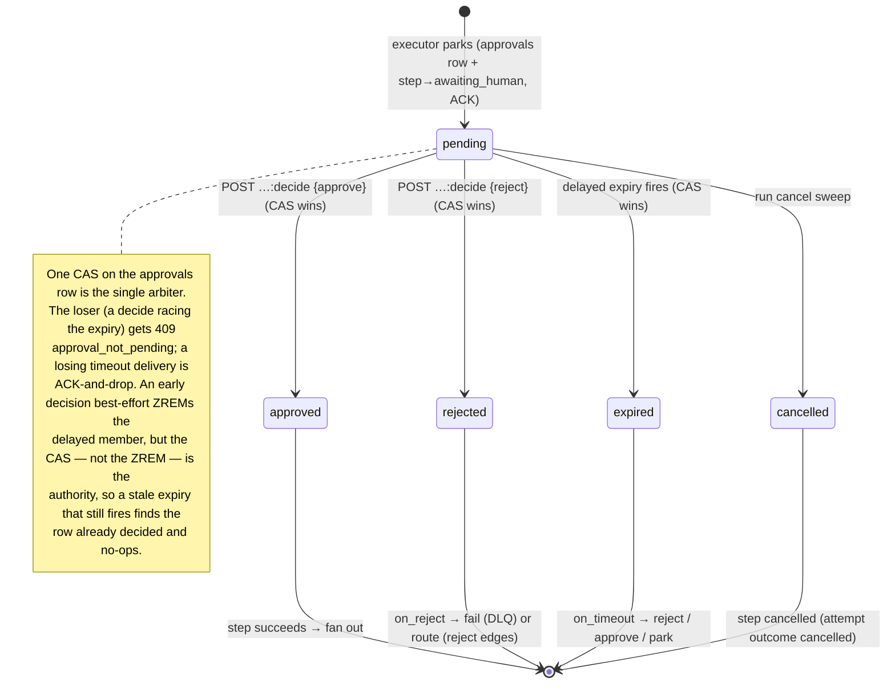

# ADR-017: Human-in-the-loop — approval steps, decisions, timeouts

- **Status:** Accepted
- **Date:** 2026-08-17
- **Ticket:** ticket 15.1 (opens Milestone 15)

<!--
This ADR opens M15. Ticket 15.1 fixes the whole human-in-the-loop contract —
the human_approval step config, the decision model, edit constraints, the
timeout/decision race, the park-without-lease mechanics, and the authz/audit
rules — so the later M15 tickets conform to it without re-litigating the design:

  - 15.2 park without lease (awaiting_human step status, approvals row, ACK)
  - 15.3 decision API (GET /v1/approvals, POST …:decide, CAS, routing, audit)
  - 15.4 approval timeouts (delayed-queue expiry envelope, single winner)
  - 15.5 notification webhook & the flagship approval gate

Sections tagged "(arrives in 15.x)" state the contract now; those tickets add
"### … (as built, 15.x)" subsections under ## Decision as they land, the way
ADR-014 / ADR-015 / ADR-016 grew across their milestones.
-->

## Context

Differentiator #6 is a human gate that a side-effectful agent workflow can pause
at: a step surfaces a proposed action, a person approves / rejects / **edits**
it, and the run resumes on that decision — or times out. The safety valve for
"the agent drafted a customer reply; do not send it without sign-off."

M15 builds this on primitives that already exist, so the milestone is careful
semantics rather than new machinery:

- **Park/resume (M5.6).** A parked run holds no lease and no worker slot; its
  in-flight steps settle, new dispatch pauses, and unpark re-outboxes ready
  steps. An approval is a *step-level* park: exactly one step waits while the
  rest of the run's independent work keeps running.
- **Delayed delivery (M3.5).** The `sched:delayed` ZSET already schedules
  "deliver this later" for retry backoff (M5) and throttled requeue (M9);
  approval timeouts are a third client. The ZADD dedup on a deterministic member
  keeps a re-scheduled expiry idempotent.
- **Scoped auth (M6).** The `approve` scope was reserved in ADR-007 and is
  assignable today, so an approval bot can be provisioned before enforcement.
- **The materialized graph copy (ADR-004).** Each run owns its step rows, so an
  approval step's decision and (edited) payload live on the run's own rows;
  an approval inside a loop body gets a fresh instance per iteration for free.

The forces this ADR must resolve:

- **No lease may be held while waiting.** A human decision can take days. The
  step must ACK its queue message and leave the PEL empty — otherwise the lease
  TTL would reclaim it and a worker slot would be pinned for the duration. This
  is the defining constraint (ticket 15.2).
- **The decision is data flowing downstream.** An approved (possibly edited)
  payload becomes the step's output, so successors reference it with the
  ordinary `${{ steps.gate.output… }}` templating — no bespoke channel.
- **Edits must be constrained.** An approver may reshape the payload, but a
  workflow that trusts the edited value needs a way to bound it: an optional
  JSON Schema, enforced at decision time.
- **Exactly one of {human, timeout} wins.** A decision arriving as the timeout
  fires must not double-transition the step. One compare-and-swap on the
  approval row is the single arbiter.
- **Every decision is attributable.** Who decided, when, with what comment and
  what edit — immutable, in the run's event log and status.

The rest of the pipeline already fits: an approval step makes no provider call
(no cost, no rate limit, no context assembly), produces no model output to
validate, and holds no external resource. It is the simplest possible executor
wrapped around the park primitive — which is exactly why the milestone is small.

## Decision

### The `human_approval` step (15.1)

A `human_approval` step parks the run until a decision is recorded. Its config
(`dag.HumanApprovalConfig`):

| Field | Type | Meaning |
|---|---|---|
| `title` | string, **required** | Short headline shown to the approver. Templated (8.2). |
| `description` | string | Longer context. Templated. |
| `payload` | JSON | The proposed action shown for review and carried into the step's output on approval. Typically a whole-expression reference to the upstream step's output, e.g. `"${{ steps.draft.output }}"`. |
| `allowed_decisions` | `[approve\|reject]` | Which decisions the API accepts; empty = the engine default `[approve, reject]`. Distinct values. |
| `allow_edit` | bool | Permits an `edited_payload` with an approve decision. Requires `approve` allowed. |
| `edit_schema` | JSON Schema (object) | Constrains an edited payload; requires `allow_edit`. Compiled at claim pre-flight, enforced at decide time (the 11.3 `output_format` precedent). |
| `timeout` | Go duration, ≤ `MaxApprovalTimeout` (30d) | How long to wait before `on_timeout` fires. Empty = wait indefinitely (bounded only by the run's `max_wall_clock`). |
| `on_timeout` | `reject\|approve\|park` | Policy at expiry; requires `timeout`. Default `reject` when a timeout is set. |
| `on_reject` | `fail\|route` | How a reject routes; default `fail`. |

A worked example:

```json
{
  "id": "approve_publish",
  "type": "human_approval",
  "config": {
    "title": "Publish this article?",
    "description": "Review the final draft before it goes live.",
    "payload": "${{ steps.editor.output }}",
    "allowed_decisions": ["approve", "reject"],
    "allow_edit": true,
    "edit_schema": { "type": "object", "properties": { "body": { "type": "string" } } },
    "timeout": "48h",
    "on_timeout": "reject",
    "on_reject": "route"
  }
}
```

`title`, `description`, and `payload` are ordinary templated config values
(ticket 8.2): the same rendering that flows data between any two steps builds
the approval's content, so there is no new render path. The rendered config is
what the executor persists into the `approvals` row (15.2) and surfaces to the
approver — a snapshot, immune to later graph changes.

**Validation (15.1, `internal/dag`).** All config combinations are checked at
submit time, reporting every violation in one pass (the codes
`config_field_required` / `config_field_invalid` for the config, plus two new
edge codes below):

- `title` required.
- `allowed_decisions` distinct (the enum spelling is a codec check).
- `edit_schema` requires `allow_edit` and must be a JSON object; `allow_edit`
  requires `approve` to be an allowed decision.
- `on_timeout` requires `timeout`; a `timeout` is parseable, positive, ≤ 30d;
  when `on_timeout` records a decision (`reject`/`approve`) that decision must
  be allowed (`park` records none).
- `on_reject: route` requires `reject` to be an allowed decision.
- The envelope `validation` and `timeout` blocks are **forbidden** on a
  `human_approval` step: it produces no model output to validate (edits are
  constrained by `edit_schema` instead), and a per-attempt execution timeout is
  meaningless for a step that parks without a lease (the wait is
  `config.timeout`). Reported as `validation_field_invalid` / `timeout_field_invalid`.

The other envelope blocks stay legal: `retry` covers a transient failure of the
park-write itself, `cache` is inert (a park is uncacheable), and `budget` never
fires (no spend).

### Decisions & the step's output contract

A decision is one of the allowed `ApprovalDecision` values. On decision the
step's output is:

```json
{
  "approval_id": "<uuid>",
  "decision": "approve",
  "payload": <edited or original payload>,
  "edited": false,
  "comment": "<optional approver note>",
  "decided_by": "<key_id> | system:timeout",
  "decided_at": "<rfc3339>",
  "source": "human | timeout"
}
```

Downstream steps read `${{ steps.approve_publish.output.payload }}` (the
approved value, edited in place when an edit was supplied) and may branch on
`output.decision`.

- **Approve** → the step succeeds with the output above; its outgoing edges fan
  out normally (an edge with no `decision` marker is the approve/success path).
- **Reject** → routed by `on_reject`:
  - **`fail`** (default) — the step dead-letters permanently with the message
    `approval_rejected: <comment>` (ADR-006 row 24, reusing the existing
    `permanent` DLQ source — no new source), then the run follows its
    `on_failure` disposition. A DLQ requeue re-runs the gate, producing a fresh
    pending approval.
  - **`route`** — the step succeeds with `decision: reject`, and **only** its
    outgoing edges marked `decision: reject` fire; the approve edges are skipped
    (ordinary skip propagation). This is the "dedicated reject edge" path — a
    fail branch versus a reject branch, author's choice.

### The `decision` edge marker

Reject routing under `on_reject: route` uses a new normal-edge field
`Edge.Decision` (`approve`/`reject`), not a synthesized CEL `when`. Rationale:

- **Presence rules are statically checkable.** "A reject edge is meaningful only
  under `route`" and "`route` needs a reject edge" are graph-shape rules the
  validator enforces at submit time — a CEL predicate over the output could not
  be checked that cleanly.
- **The builder (M18) renders it.** A typed marker is a first-class edge
  attribute the UI draws; a `when` string is opaque.
- **The runtime gate is trivial.** 15.3's edge-firing rule is a comparison on
  the materialized `run_edges.decision` column against the recorded decision,
  not a rewritten-and-compiled predicate.

Validation (15.1): the enum is a codec check; a `decision` marker is valid only
on a **normal** edge leaving a **human_approval** step (else
`approval_edge_invalid`); a `decision: reject` edge whose source's `on_reject`
is not `route` is `approval_edge_invalid` (the edge could never fire); and a
`route` step with no outgoing `decision: reject` edge is
`approval_reject_edge_required`. An unmarked edge is decision-agnostic (fires on
approve). On an engine-injected edge (map/loop/planner) the marker degrades
safely — a marker on a non-approval source simply never matches at routing time
— so, like the expansion ref lint, only the enum is re-checked there.

### Timeouts & the decision-vs-timeout race (contract; as built in 15.4 below)

On park, if `timeout` is set, the executor schedules an expiry envelope through
the delayed queue (reason `approval_timeout`, built without an `EnqueuedAt` so
the ZADD dedups to one pending expiry per approval — the `throttle`/`retry`
precedent). When it fires, `on_timeout` is applied through the **same
compare-and-swap** as a human decision, so exactly one winner exists:



`on_timeout` policies:

- **`reject`** (default) — records a reject; routes exactly as a human reject
  (`on_reject`).
- **`approve`** — auto-approves the **original** payload (never an edit).
  Deliberately available but documented as dangerous: it lets a side effect fire
  with no human in the loop. Only for gates where "no answer means go."
- **`park`** — records **no** decision. The approval stays `pending` and
  decidable; the run parks with the reserved `park_reason = awaiting_human` as
  an escalation. A decision arriving while parked completes the step through the
  ordinary park-tolerant completion path (ADR-006 "Park semantics"); `unpark`
  resumes dispatch of the run's other work, so "timeout policy `park` leaves the
  run resumable via unpark" holds. Rejected alternative: expiring the approval
  under `park` — that would strand the step with nothing left to decide.

A **run cancel** while an approval is pending sweeps the `awaiting_human` step to
`cancelled` (the 5.6 run-cancel sweep, its from-set widened to include
`awaiting_human`) and marks the approval `cancelled`; the delayed expiry, if it
later fires, finds the row non-pending and no-ops.

### Park without lease — mechanics contract (arrives in 15.2)

The executor path: render the config → in **one transaction** write the
`approvals` row (status `pending`) and transition the step
`running → awaiting_human` (fenced on the claim), optionally schedule the expiry
→ **ACK the queue message**. After the ACK the PEL holds nothing for the step,
the heartbeat stops, and the worker slot is freed. The reconciler treats
`awaiting_human` as healthy-parked (never a stale-running takeover). A crash
between commit and ACK is benign: redelivery sees the step already
`awaiting_human` and ACK-and-drops (the ADR-005 duplicate-delivery rule).

The **attempt spans the wait**: it is opened at claim and closed by the
decision with the decision's outcome (`succeeded` on approve/route,
`permanent` on reject-fail, `cancelled` on run-cancel), so there is no dangling
attempt row and the attempt's duration is the human latency. Rejected
alternative: closing the attempt at park with an administrative outcome and
opening a new one at decision — that splits one logical wait across two attempt
rows for no benefit and complicates the audit.

Materialization sketch (owned by 15.2, stated here so the contract is fixed):
an `approvals` table keyed by a UUID, carrying `run_id` / `step_id` / `attempt`,
`status` (`pending` / `approved` / `rejected` / `expired` / `cancelled`), the
rendered `title` / `description` / `payload`, the `edit_schema`, the
`allowed_decisions`, `timeout_at`, the decision fields (`decision`,
`edited_payload`, `comment`, `decided_by`, `decided_at`), and timestamps — with
a **unique partial index on `(run_id, step_id) WHERE status = 'pending'`** so a
step has at most one open approval. The step status gains `awaiting_human` via
the ADR-004 CHECK-widening recipe; `park_reason` already reserves
`awaiting_human` (migration 0007). Approval lifecycle events
(`approval_requested` / `approval_decided` / `approval_expired` /
`approval_cancelled`) ride the existing `events` table — ADR-018 already lists
"approval lifecycle" in the M16 event envelope.

### Park without lease (as built, 15.2)

15.2 built exactly the mechanics contract above: **one migration (0025), no new
config var, one new metric** (the `approval` subsystem's pending gauge). No
decision API, no timeout scheduling — those are 15.3/15.4; `timeout_at` is
**persisted now** so 15.4's expiry scheduler has it, but nothing is scheduled.

- **Executor** (`exec.HumanApprovalExecutor`, `human_approval`, `1.0.0`,
  side_effectful): it does the deterministic pre-flight — decode the rendered
  config, resolve the `[approve, reject]` default, **compile the `edit_schema`**
  (an uncompilable schema fails permanent before the step parks, the 11.3
  claim-pre-flight precedent), parse the `timeout` — and returns an
  `exec.ApprovalRequest` (the planner "executor produces, engine applies"
  pattern). It blocks on nothing: the wait is the engine's park, not the
  executor's. Its flags (side_effectful, uncacheable, not cost-bearing) make the
  cache / limiter / budget / window stages bypass it structurally. Registered in
  `CoreBuiltins`; `human_approval` left `deferredStepTypes` (now empty — every
  catalog step type has a builtin).
- **Engine** (`completeAwaitHuman`, the `completeBudgetPark` shape): a
  `human_approval` step does **not** complete on its executor's return — the
  routing branch in `execute()` sends it to the park path instead of `runChain`
  (an approval step has no validation chain — the envelope block is forbidden,
  15.1). In one `step.completion` transaction it `LockRunStatus`es, and — on a
  **cancelling** run — settles the step `cancelled` via `CancelRunningStep`
  (ADR-006 row 8), else calls `store.AwaitHumanStep`; then returns `nil` (ACK).
  A fenced conflict abandons without ACK; a transport error redelivers. The run
  stays `running` — only the step parks.
- **Store** (`AwaitHumanStep` / `CancelAwaitingHumanStep`, transition-style like
  `BudgetParkStep`): `AwaitHumanStep` CASes `running → awaiting_human` fenced on
  the claim (clearing it — no lease held), inserts the pending `approvals` row,
  appends `approval_requested`; the **attempt row is left open** (spans the
  wait). `CancelAwaitingHumanStep` is the 5.6 run-cancel sweep widened to
  `awaiting_human`: `awaiting_human → cancelled`, close the open attempt
  `cancelled`, bump `steps_cancelled`, `step_cancelled`, and CAS the pending
  approval → cancelled with `approval_cancelled`. The `ApprovalRepo`
  (`Get` / `ListByRun` / `CountPending`) serves the run view and the gauge.
- **ACK discipline** (ADR-005): `classifyClaimFailure` maps a
  `wrong_status(awaiting_human)` claim conflict to **ack-drop** — the crash-
  before-ACK convergence (a redelivery of a committed park is a duplicate of a
  parked step), regardless of delivery count; `classifyTakeoverFailure` adds
  `awaiting_human` to the "completed between reclaim and takeover" ack-drop set.
- **Reconciler**: `ListStalledRuns`' live-status set gains `awaiting_human`, so
  a running run whose only unfinished step is a parked gate is healthy, never
  flagged stalled. The stale-running / ready / retrying scans skip it by status.
- **Run view / ctl**: `GET /v1/runs/{id}` gains an `approvals[]` array
  (`ApprovalView`); `awaiting_human` joins the `StepState` enum; `ctl watch`
  glyph `?`, and the status is non-terminal so `watch` keeps polling.
- **Metrics**: `engine_approval_pending` gauge (ADR-008 `approval` subsystem),
  sampled fleet-wide by the worker's metrics loop from
  `Approvals().CountPending`. The `approval_decisions_total{decision,source}`
  counter lands with the decision API (15.3).

**Fail-fast note for 15.3.** Under `on_reject: fail` (or an upstream
dead-letter under `fail_fast`), a run may go `failed` while an approval sits
`pending` and its step `awaiting_human` — the same way a `fail_fast` run strands
`ready` steps. 15.3's decide endpoint must therefore gate on the run being
`running` (or `parked`), returning a conflict when it is not, rather than
assuming a pending approval implies a live run. A DLQ requeue re-runs the gate
(fresh pending approval), so this is recoverable.

**Decisions.** Executor-produces / engine-applies (keeps the park transaction in
the engine beside the other park paths, and the executor pure); `claim_id`
cleared at park (claimless like `retrying` — the approvals row, not a lease, is
the durable waiting state); the cancel-sweep widening and the `ListStalledRuns`
widening ship in 15.2 (needed for convergence and health the moment the status
exists, even though the sections above frame cancel under 15.4); `timeout_at`
persisted but expiry unscheduled until 15.4; the pending gauge in 15.2, the
decisions counter in 15.3.

### Authz & audit (arrives in 15.3)

- `GET /v1/approvals` (list pending / filter) requires the **`read`** scope.
- `POST /v1/approvals/{id}:decide` requires the **`approve`** scope (admin
  implies it). An approval bot is minted `read` + `approve`.
- The decision record — actor `key_id`, timestamp, comment, decision, and any
  edit — is written immutably on the `approvals` row and in the
  `approval_decided` event, and is exposed in run status. A timeout decision
  carries the actor `system:timeout`.

**Self-approval stance.** v1 has no principal below the API key and enforces no
separation of duty: a key with both `submit` and `approve` may approve a run it
submitted. This is permitted by default and documented; operators who want SoD
mint distinct `submit` and `approve` keys and withhold `approve` from
submitters. A `submitted_by` attribution on runs and an enforced SoD policy are
deferred (they need per-user identity, which is out of scope for single-tenant
v1).

### Decision API (as built, 15.3)

15.3 built the decision half exactly to the contract above: **one migration
(0026), no new config var, one new metric** (the `approval` subsystem's
decisions counter on the API instrument set). No timeout scheduling — that is
15.4 — but the whole human decision path is complete and usable headlessly and
by `ctl`.

- **The arbiter lives on `engine.Control`.** `Control.Decide(ctx, approvalID,
  DecideRequest)` is the single decision op, on the registry-free control
  surface (no executor registry, no queue — the API server holds one, ADR-002).
  It is deliberately the *shared* path: 15.4's timeout policy calls the same
  `Decide` with `Source: timeout` and `DecidedBy: system:timeout`, so "the same
  compare-and-swap as a human decision" holds by construction. Successors are
  dispatched through the transactional outbox on the fleet's drain cadence (the
  API's Control carries no dispatch nudge — the `Unpark`/`Requeue` precedent).

- **One transaction, the CAS is the fence.** Pre-transaction, `Decide` loads the
  approval, its step, and its run, and validates the decision against the gate
  (below) — a rejection here is a client error before anything is written. Then
  one transaction: `LockRunStatus` gates on the run being **running or parked**
  (the fail-fast note — a run may have failed with an approval still pending;
  such a decision is a 409), `store.DecideApproval` CASes the `approvals` row
  `pending → approved|rejected` (the single arbiter — a loser matches nothing and
  returns `*store.ApprovalNotPendingError` → 409, rolling the whole transaction
  back so nothing is written), and the parked step is settled in the same tx.

- **Settlement by decision.** Approve, or a reject routed via `on_reject: route`,
  calls `store.SucceedAwaitingHumanStep` (an **unfenced** `awaiting_human →
  succeeded` — the step holds no lease; the approvals CAS is the fence) with the
  ADR-017 decision output as the step's result, then reads the out-edges under
  the run lock, plans them (`planEdges` for the `when` predicates), **filters by
  the decision edge marker** (`filterDecisionVerdicts`: on approve, unmarked and
  `approve`-marked edges fire; on reject-route, only `reject`-marked edges fire —
  the unmarked approve edge is skipped by ordinary skip propagation), fans out,
  and writes the outbox rows. A reject under `on_reject: fail` calls
  `store.DeadLetterAwaitingHumanStep` (unfenced `awaiting_human → dead_lettered`,
  attempt outcome `permanent`, a `permanent` DLQ record with message
  `approval_rejected: <comment>` — ADR-006 row 24) and applies the run's
  `on_failure` disposition (`deadLetterDisposition`). A DLQ requeue re-runs the
  gate, minting a fresh pending approval (the unique-pending index is satisfied
  because the old row is now `rejected`).

- **The decision edge marker is materialized.** Migration 0026 adds
  `run_edges.decision` (`approve`/`reject`/NULL), stamped by the shared
  `edgeRowParams` so authored edges and engine-injected instances (a gate inside
  a loop keeps its reject edge across `#k`) carry it identically. The runtime
  gate is then a column comparison, never a re-decode of the definition snapshot
  (which could not cleanly see injected instances).

- **Edit validation reuses the json_schema validator.** An `edited_payload` is
  accepted only on an approve and only when the gate permits edits; when the gate
  carries an `edit_schema`, the payload is checked through the built-in
  `validate.JSONSchema` validator, so the issue flattening (RFC 6901 pointers,
  structure-only messages) is the same tested mapping the validate stage uses. A
  violation is a `*engine.DecisionInvalidError` → **422** with the issues; the
  approval stays pending.

- **API surface.** `GET /v1/approvals` (`read` scope, `read` rate class) — a
  keyset page of approvals, oldest-first (the inbox), filterable by `status` and
  `run_id`. `POST /v1/approvals/{id}:decide` (`approve` scope, **`submit`** rate
  class — a mutating op reusing the submit bucket rather than a new class) —
  `{decision, edited_payload?, comment?}`, actor taken from the authenticated
  key. Error codes: `approval_not_found` (404), `approval_not_pending` (409),
  `approval_decision_invalid` (422 with issues), `conflict` (409, wrong run
  state). `ctl approvals` / `ctl approve` / `ctl reject` mirror them.

- **Audit & metric.** The decision — actor, timestamp, comment, decision, and any
  edit — is written immutably on the `approvals` row and in the `approval_decided`
  event (`store.ApprovalDecidedEvent`), and surfaced in the run view's
  `approvals[]`. The `engine_approval_decisions_total{decision,source}` counter
  (ADR-008 `approval` subsystem, on `APIMetrics`) is recorded post-commit from
  the decide handler.

**Decisions.** The arbiter on `Control` (shared by the human path now and the
15.4 timeout path); the CAS as the sole fence for the claimless
`awaiting_human →` transitions; `parked` runs accept decisions (a decision on a
parked run settles the step; `unpark` resumes the rest); the decision edge
marker materialized on `run_edges` rather than re-decoded; edit validation via
the existing json_schema validator; the decide endpoint under the `submit` rate
class (no new class); a re-read of the run for the response rollup (Control
returns the terminal run only when it terminalized it). **Deferred to 15.4:** the
decisions counter is on `APIMetrics` (the human path); the worker's timeout path
will need the same-named counter on its instrument set — noted for 15.4 to place
it on a shared set or split the conformance harness.

### Approval timeouts (as built, 15.4)

15.4 built the timeout half exactly to the contract above, reusing the 15.3
arbiter: **one migration (0027), no new config var, two new worker metrics**
(`engine_approval_timeouts_total{action}` and the worker-side
`engine_approval_decisions_total{decision,source}`). The delayed-delivery queue
(M3.5) gains a third client; nothing new was needed beyond the expiry envelope,
one durable marker column, and a reconciler safety net.

- **The expiry is a pointer envelope, scheduled on park.** When a
  `human_approval` step parks with a `timeout`, the executor path schedules an
  `approval_timeout` envelope through the delayed queue, due at `timeout_at`,
  **best-effort post-commit** (the `scheduleRetry` discipline — a nil scheduler
  or a failed ZADD only logs; the reconciler heals it). The envelope names the
  **step**, not the approval (`{run_id, step_id, reason: approval_timeout}`,
  ADR-005's pointer-not-payload rule), carrying the run's durable root trace
  context and **no `EnqueuedAt`**, so re-scheduling the same expiry encodes to a
  byte-identical delayed member and ZADD dedups to one pending expiry per step —
  and a DLQ-requeue-minted *fresh* approval is resolved by the handler through
  `GetPendingApprovalByStep` (the envelope carries no approval id), so a stale
  id can never be acted on.

- **The handler branches before the claim.** `Engine.Handle` routes an
  `approval_timeout` delivery to `handleApprovalTimeout` ahead of the claim CAS
  — a parked step holds no lease, so there is nothing to claim. The handler
  resolves the step's current pending approval; a missing one (already decided /
  cancelled), a nil deadline, or an already-applied marker is **ack-and-drop**;
  a not-yet-due delivery (an AOF replay ahead of the score) is rescheduled at
  the real deadline and dropped. Otherwise it reads the materialized
  `on_timeout` policy (never templated, so the config decode is authoritative;
  an unreadable one defaults to `reject`) and applies it.

- **`reject` / `approve` reuse `Control.Decide`.** The handler calls the same
  `Decide` a human uses, with `Source: timeout` / `DecidedBy: system:timeout`,
  so the **single arbiter CAS** on the approvals row settles the human-vs-timeout
  race by construction. `store.DecideApproval` gains a timeout branch: the CAS
  target is status **`expired`** (not `approved`/`rejected` — the audit trail
  separates an automatic expiry from an operator's decision, and
  `?status=expired` is a real inbox filter), it stamps `expired_at`, records the
  `decision` (`reject`/`approve`) with `decision_source: timeout`, and appends a
  distinct **`approval_expired`** event (policy + action + timeout_at). The
  reject then routes through the same `on_reject` logic (dead-letter + run
  disposition, or the reject edges); the approve auto-approves the **original**
  payload (never an edit). A lost race (`*ApprovalNotPendingError`) or a
  non-live run (`ConflictRunNotRunning`) is ack-and-drop; a transport error
  redelivers.

- **`park` records no decision.** `store.ExpireApprovalPark` CASes the durable
  marker `approvals.expired_at` on the still-pending row (the single-shot guard
  `status='pending' AND expired_at IS NULL`), parks the run with
  `park_reason = awaiting_human` (skipping the park when the run is already
  parked → action `run_already_parked`), and appends `approval_expired` with
  policy `park`. Because status stays `pending`, the marker — not the status —
  is what makes a redelivered or reconciler-healed expiry idempotent
  (`*ApprovalAlreadyExpiredError` → ack-drop, no re-park). A decision arriving
  while parked settles the gate through the ordinary park-tolerant `Decide`
  path, and `unpark` resumes the run — so "timeout policy `park` leaves the run
  resumable via unpark" holds.

- **Migration 0027** adds `approvals.expired_at TIMESTAMPTZ` and a partial index
  `approvals_overdue_idx (timeout_at) WHERE status='pending' AND expired_at IS
  NULL AND timeout_at IS NOT NULL` for the reconciler scan. The status column
  cannot double as the park-policy marker (a `park` approval must stay
  `pending`), which is why the marker column exists.

- **Early-decision cleanup is best-effort; the CAS is the authority.** A human
  decision on an approval that had a scheduled timeout best-effort ZREMs the
  pending expiry (`queue.Delayed.Cancel`, the new `ExpiryCanceller` seam on both
  the worker engine and the API's `Control`). A failed or missed Cancel only
  means one stale expiry fires later and finds the row already decided
  (ack-drop). The API wiring is a ZREM, not a dispatch, so ADR-002 (the API
  never dispatches) holds; when the API's Redis is unwired the canceller is
  absent and the stale expiry no-ops.

- **The reconciler is the safety net** (ADR-005 P3 analogue). A pending approval
  whose deadline is well past due (grace = the existing `RetryStale`, so **no
  new config var**) with no policy applied means its delayed expiry was lost or
  never scheduled; a new sweep duty re-outboxes an `approval_timeout` envelope
  (`OutboxReasonApprovalTimeout`), which lands on the same handler. A duplicate
  (a healed expiry racing a late delayed one) is arbitrated by the CAS.

- **Metrics.** `engine_approval_timeouts_total{action}` (rejected / approved /
  run_parked / run_already_parked) and the worker-side
  `engine_approval_decisions_total{decision,source}` (the timeout path — the
  same series the API records human decisions on, on a distinct registry, the
  `build_info` precedent), both post-commit. The conformance harness now
  registers the worker and API instrument sets on **separate** registries
  (mirroring the two processes), since they share the decisions series.

**Decisions.** The arbiter is `Control.Decide`, shared verbatim with the human
path (one CAS, "exactly one winner" by construction); status `expired` +
`approval_expired` distinct from a human decision (honest audit, real inbox
filter); `expired_at` as the durable park-policy idempotence marker (status
can't be it — park stays pending); the expiry envelope names the step and
carries no approval id (a requeue-minted fresh approval is resolved live);
scheduling and cancellation both best-effort with the reconciler as the net and
the CAS as the authority; the reconciler grace reuses `RetryStale` (no new
config var); the API best-effort ZREM is not a dispatch (ADR-002 intact).
**Accepted residual:** a repeatedly-failing expiry envelope crossing the poison
threshold would `PoisonDeadLetterStep` the `awaiting_human` step (leaving the
approval `pending`) — a transport-only failure mode, the same class as a
poisoned retry envelope, noted rather than special-cased.

### Notification webhook & flagship gate (as built, 15.5)

When a parked approval should page a human, an optional webhook POSTs a signed
notification. **No migration, no new store table, no new outcome/class; one
config block, two events, one worker metric.**

- **A seam, not a sixth plugin kind.** `notify.Notifier` (`internal/notify`, a
  stdlib-only leaf) + `engine.WithNotifier` — the `WithSummarizer`/`WithRetrievers`
  precedent. Widening the closed `plugin.Kind` vocabulary (plugins API, OpenAPI
  enum, docs) for one implementation isn't worth it; a `notifier` kind is
  deferred until a second backend (Slack/email) exists. The built-in
  `notify.Webhook` POSTs one signed payload per attempt with capped exponential
  backoff (default 3 attempts, 5s per-call timeout, injectable clock/sleep).
- **Where it fires.** `completeAwaitHuman` calls `notifyApproval` **post-commit,
  before the ACK**, right after `scheduleApprovalExpiry` — the same "best-effort,
  never a handler error" discipline. Nothing there returns an error to `Handle`,
  so a broken webhook can never un-ACK an already-committed park. Skipped
  entirely when no notifier is wired (the default), so it costs nothing on the
  hot path.
- **Effectively-once = journal + receiver dedupe key.** The delivery rides the
  5.5 side-effect journal under the effect id `approval_notify:<approval_id>`, so
  a re-invocation short-circuits on the `done` row (no second POST), and a
  DLQ-requeue that mints a *fresh* approval notifies again (correct). The
  residual intent→result crash window is absorbed by the receiver deduping on
  `X-Agentloom-Delivery-Id` (= the approval id, stable across the delivery's
  retries) — exactly the `http_request` `Idempotency-Key` pattern. **Retries are
  synchronous in the leaf**, not routed through the delayed queue: a
  repeatedly-failing `approval_notify` envelope would otherwise cross the poison
  threshold and dead-letter the `awaiting_human` step, i.e. a notification could
  hurt correctness — synchronous, capped, in-handler retries cannot.
- **Signature.** `X-Agentloom-Signature: v1=<hex HMAC-SHA256(secret,
  "<ts>.<body>")>` with `X-Agentloom-Timestamp`, `X-Agentloom-Delivery-Id`, and
  `X-Agentloom-Event: approval.requested`. The body & timestamp are fixed on the
  first attempt and reused across retries, so every attempt carries a valid
  signature and one delivery id. `notify.Verify`/`VerifyWithin` are exported for
  receivers. Secret hygiene is structural: the URL is recorded/logged as **host
  only** (the path/query may carry a token), and the error type holds no headers
  or body.
- **Audit & metric.** Two best-effort events under the run lock (not state
  transitions) — `approval_notified {approval_id, target_host, attempts,
  status_code}` and `approval_notification_failed {approval_id, target_host,
  attempts, reason}` — plus `engine_approval_notifications_total{result}` on the
  worker `approval` subsystem. A failed delivery is a warning, never a failure:
  `GET /v1/approvals` remains the source of truth, so no reconciler net (unlike
  the 15.4 expiry, which *does* govern correctness).
- **Accepted residual.** A crash strictly between the park commit and the
  notification loses that one notification (no reconciler heal). Correctness
  never depends on it.
- **Flagship gate.** `examples/definitions/research-critic-writer.json` gained
  an `approve_publish` `human_approval` step (with an `edit_schema`) between
  `finalize` and `publish`; `publish` reads `${{
  steps.approve_publish.output.payload.text }}`. `TestFlagshipResearchCriticWriter`
  now waits for `awaiting_human` and **decides through the real HTTP decision
  API** (approve-with-edit, authenticated by an admin key that implies
  `approve`), proving the M15 exit criterion end-to-end offline.

### Interplay with the rest of the engine

- **Expansions (ADR-015).** An approval inside a loop body is unrolled to a
  fresh `gate#k` instance per iteration, each parking independently; a planner
  may inject one. `ValidateExpansion` reuses the same config/edge checks, and
  the `decision` marker's syntactic rule is mirrored in
  `checkExpansionEdgeFields`.
- **Budgets / cost (ADR-012).** An approval step is not cost-bearing: no ledger
  row, no budget check, no `max_tokens` cap (the config carries none).
- **Cache (ADR-011).** The approval executor is side-effectful and uncacheable
  (its ADR-009 flag row lands with the executor in 15.2); a decision is never
  served from cache.
- **Metrics (ADR-008).** A new `approval` subsystem — an `engine_approval_pending`
  gauge and an `engine_approval_decisions_total{decision,source}` counter —
  arrives with the executor/decision API (15.2/15.3); no metric is added in 15.1.
  15.4 adds `engine_approval_timeouts_total{action}` and places the decisions
  counter on the worker instrument set too (the timeout path), so the two
  deployables share the series on distinct registries.
- **Notifications (15.5).** An optional notifier POSTs a signed payload to a
  webhook on each new pending approval, delivered effectively-once through the
  side-effect journal; webhook failure never affects run correctness. Built as
  built in §"Notification webhook & flagship gate (as built, 15.5)" above.

### What is deferred (M15+)

Per-user identity and enforced separation of duty; multi-approver quorum;
approval reassignment / delegation; a per-field structured edit UI (M18.5 builds
the inbox on this contract). These are listed so the sections above read as the
complete v1 contract, not an accidental subset.

## Consequences

- **The park primitive pays off a third time.** Manual pause (5.6),
  budget-exceeded halts (10.3), and now human approvals all reduce to
  "park without a lease, resume via the outbox." No new waiting mechanism, no
  worker slot pinned while a human deliberates for days.
- **The decision is ordinary data flow.** Because the (edited) payload is the
  step's output, successors consume it with the same templating as any other
  step — the approval gate is transparent to the rest of the graph.
- **One CAS arbitrates the race.** Human-vs-timeout, concurrent decides, and a
  stale expiry all funnel through a single compare-and-swap on the approvals
  row, so "exactly one wins" is true by construction, not by careful ordering.
- **The reject-routing choice is the author's.** `fail` (dead-letter + run
  disposition) and `route` (a dedicated reject branch) are both first-class; the
  `decision` edge marker makes the branch explicit and UI-renderable.
- **Edits are bounded, not free-form.** An `edit_schema` lets a workflow trust
  an edited payload; without one, any JSON edit is accepted — the author opts
  into the constraint.
- **No migration, no new config var, no new metric in 15.1.** This ticket is the
  contract half: `internal/dag` config + edge marker + validation + generated
  schema. The `approvals` table, the `awaiting_human` status, the executor, the
  decision API, the timeout wiring, the events, and the metrics land in 15.2–15.5.
