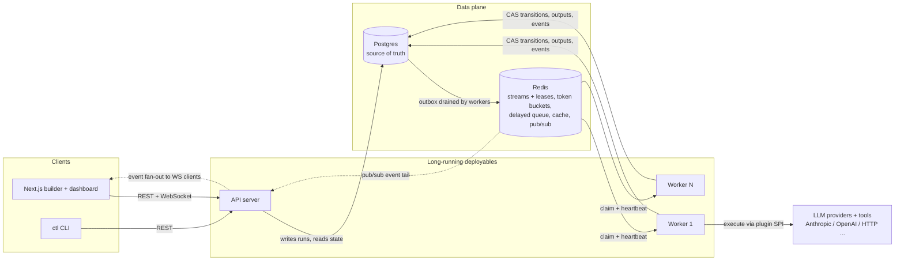
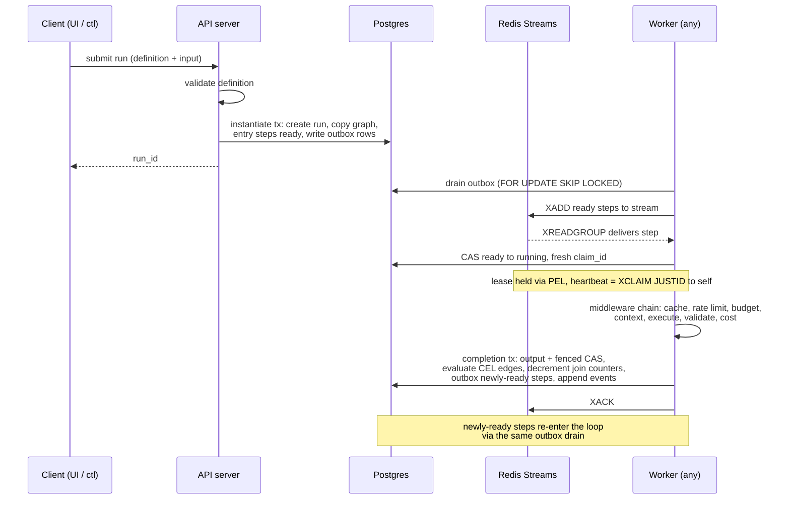
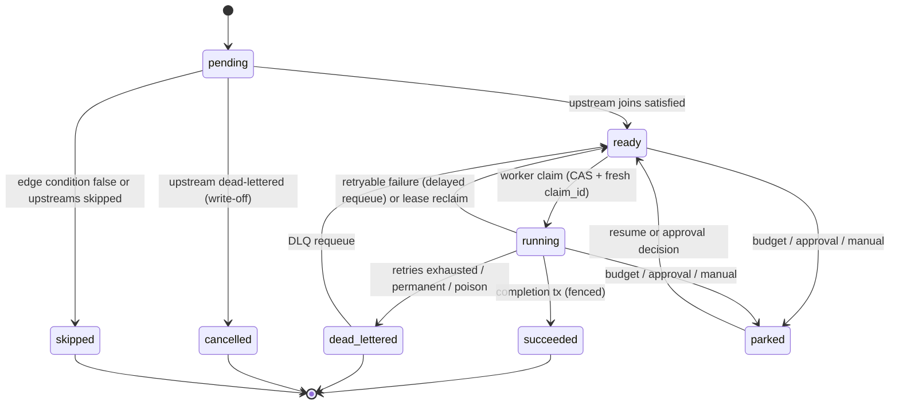

# Architecture Overview

agentloom is a distributed, durable execution engine purpose-built for AI agent workflows: **Temporal-grade distributed-systems guarantees, AI-native orchestration semantics.** Users define workflows as DAGs of steps (LLM calls, tool calls, conditionals, fan-out/fan-in, human approvals); the engine distributes execution across independent worker processes, persists durable state so runs survive crashes and resume from the last completed step, and provides retries, timeouts, idempotency, and dead-lettering.

It sits deliberately between three categories: **n8n / Zapier** (easy visual automation, not production-grade), **Temporal / Airflow** (production-grade durable execution, not AI-native), and **LangGraph** (excellent agent logic, but an in-process library with no distributed coordination or crash recovery). The AI-native capabilities — semantic/self-correcting retries, dynamic runtime DAG generation, cost-aware scheduling with budgets, context/memory management, multi-agent handoff, human-in-the-loop approvals, and a pluggable tool/agent/retrieval SPI — are core features of the engine, not add-ons. See the [README](../README.md) for positioning and [ROADMAP.md](../ROADMAP.md) for the full build plan.

This document is the system overview: components, the execution data flow, tech-stack rationale, and the project glossary. Individual design decisions are governed by ADRs in [`docs/adr/`](adr/README.md).

## System components

There are exactly **two long-running deployables** — the API server and the worker — plus two data stores and a set of clients. Everything else (DAG model, leasing, retries, cost, context, caching, plugins) lives in shared internal Go packages compiled into both binaries. This boundary is formalized in [ADR-001](adr/001-service-boundaries.md).

**API server** (`cmd/api`) — accepts workflow definitions and run submissions over REST, validates them, instantiates runs transactionally in Postgres, serves run state and the run event feed (WebSocket: snapshot → backfill → live tail), and enforces API-key auth and per-client rate limits. It never executes steps.

**Worker** (`cmd/worker`) — the execution fleet. Each worker claims ready steps from Redis Streams, executes them through the executor middleware chain, and commits results back to Postgres. Workers also collectively drain the transactional outbox and run the reconciler; there is no dedicated scheduler or dispatcher process (see [Scheduling model](#scheduling-model-no-central-scheduler)).

**Postgres** — the single source of truth: workflow definitions, runs and their per-run graph copies, step states and outputs, attempt history, the append-only event log, the transactional outbox, the cost ledger, and the side-effect journal. Every state transition is a guarded compare-and-swap (CAS) that appends an event in the same transaction.

**Redis** — one infra component in four roles: (1) work queue and lease ledger via Redis Streams consumer groups, (2) fleet-wide rate limiting via Lua token buckets, (3) delayed delivery (retry backoff, throttled requeues) via a ZSET, and (4) response cache plus pub/sub fan-out for low-latency event tails. Redis is redeliverable transport and coordination only — any Redis data loss is recoverable from Postgres via the reconciler.

**External providers** — LLM APIs (Anthropic, OpenAI, and a deterministic mock for tests/load), tools, and retrieval backends, all reached through a pluggable SPI. The engine orchestrates them; it does not implement them.

**Clients** — the Next.js visual builder + live dashboard (talks REST + WebSocket) and the `ctl` CLI (REST).

## Execution data flow

The life of a run: **submit → validate → instantiate → dispatch → claim → execute → complete → fan out**, repeating claim-through-fan-out until no steps remain.

### 1. Submit and instantiate

The API validates the definition (schema, graph well-formedness), then creates the run in **one Postgres transaction**: the run row, a **per-run copy of the graph** (so planner steps can later mutate this run's graph without touching the definition), entry steps marked `ready`, and outbox rows for them. Committing this transaction is the durability point — everything after is recoverable.

### 2. Dispatch: transactional outbox

Every Postgres → Redis handoff goes through a transactional **outbox**: state changes and "enqueue this" intents commit atomically, and all workers drain pending outbox rows to Redis Streams using `FOR UPDATE SKIP LOCKED`. This closes the dual-write gap (a crash between DB commit and queue publish); a periodic **reconciler** heals anything that still slips through — stuck states, undrained rows, lost Redis data. Enqueue is therefore **at-least-once**, and deduplication happens at claim time.

### 3. Claim and lease

A worker receives a step delivery via its consumer group and claims it with a guarded CAS in Postgres: `ready → running`, stamping a fresh **claim ID**. The CAS is the dedupe gate — a duplicate delivery fails the CAS and is ACKed and dropped, never double-executed.

The Redis Streams **pending-entries list (PEL) is the lease ledger**: holding the undelivered-but-unACKed entry *is* the lease. Heartbeating is `XCLAIM JUSTID` to self (resets the idle clock); expiry and reclaim use `XAUTOCLAIM` with min-idle equal to the lease TTL, so a crashed worker's steps are redelivered to a live one; repeated redelivery (delivery count) flags poison steps for dead-lettering. The claim ID doubles as a **fencing token**: a completion write from a zombie worker whose lease was reclaimed carries a stale claim ID and is rejected. At-least-once delivery + CAS-guarded claims + idempotency keys on side effects = **effectively-once execution**.

### 4. Execute: the middleware chain

Every step attempt runs through an ordered executor middleware chain (order matters):

**cache read → rate limit → budget check → context assembly → execute → validate → cost ledger → cache write**

- *Cache read/write* — response cache for identical LLM/tool calls; failed outputs are never cached.
- *Rate limit* — fleet-wide Redis token buckets per provider/model; a throttled step is requeued with a delay (via the ZSET), not failed.
- *Budget check* — cost budgets can park the run or downgrade the model before spend happens.
- *Context assembly* — builds the prompt from step config, upstream outputs, and the run's blackboard, with token accounting and automatic compaction.
- *Execute* — the actual LLM/tool/retrieval call through the plugin SPI, journaled for idempotency.
- *Validate* — output validators; a `validation_failed` outcome can trigger a **semantic retry**: re-attempt with a critique-augmented prompt rather than blind re-execution.
- *Cost ledger* — records actual spend per attempt in Postgres.

### 5. Complete and fan out

The completion transaction is where scheduling happens: persist the output, CAS `running → succeeded` (fenced by claim ID), evaluate CEL edge conditions on outgoing edges, decrement join counters on successors, mark newly-ready successors `ready` with outbox rows, and append events — all atomically. The worker then ACKs the queue message. Failures follow the same shape with retry/backoff policies, timeouts, and dead-lettering after exhaustion.

### 6. Dynamic expansion, park/resume, events

- **Expansion** (ADR-015) — planner steps (and map fan-out and loop unrolling) mutate the run's own graph copy atomically with their completion transaction (`graph_version++`). A planner's output is a validated `PlanOutput` delta of new steps and edges, spliced in by `ExpandRun` inside the completion CAS; hard caps (`max_added_steps`/`max_total_steps`/`max_expansions`/`max_depth`) bound runaway growth, and a rejected plan is a `validation_failed` verdict M11's semantic retries repair. There is never observable half-expanded state. Loops are authored as marked loop edges and executed by unrolling iterations through the same machinery — the instance graph stays acyclic.
- **Park/resume** — one primitive underlies manual pause, budget-exceeded halts, and human approvals. Parking ACKs the queue message: no lease or worker slot is held while a run waits, whether for minutes or days.
- **Events** — every transition appends to a per-run, monotonically-sequenced event log in Postgres (truth), mirrored to Redis pub/sub for latency. Each event is a normalized envelope (per-run `seq`, `type`, `ts`, lifted `step_id`, versioned payload) whose taxonomy and payload structs live in the `internal/event` leaf package and are published as `docs/schema/events.v1.json` (ADR-018); the store's two typed `appendEvent` helpers are the only sanctioned writers. The WebSocket protocol is snapshot → backfill from `last_seq` → live tail, so clients never miss or reorder events (delivery is at-least-once; consumers dedupe by `(run_id, seq)` and heal missed pub/sub messages via a DB backfill).

### The realized walkthrough (as of M4)

The sections above describe the full design; as of M4 (distributed
execution MVP) the following is **built and proven end-to-end** — submit a
definition and watch two independent worker processes execute it:

1. **Submit** — `POST /v1/runs` (or `ctl submit`) validates the
   definition (M1's path-qualified issues on a 400) and runs 2.5's
   instantiation transaction: run row, per-run graph copy, entry steps
   `ready`, outbox rows. The API holds no Redis client (ADR-002) —
   dispatch is entirely the fleet's job.
2. **Dispatch** — every worker runs the outbox drain loop (`ListForDrain`
   with `FOR UPDATE SKIP LOCKED` → `XADD` → delete-what-landed, one
   transaction per pass) plus the jittered reconciler under a fleet-wide
   advisory lock, which re-outboxes stuck-`ready` steps and heals
   stale-`running` steps via takeover (reasons `reconcile_ready` /
   `reconcile_running`).
3. **Claim** — on delivery, one transaction attempts the `ready →
   running` CAS (fresh `claim_id`, attempt row, `step_claimed` event). A
   pure classifier applies ADR-005's ACK discipline to failures:
   terminal/duplicate/dangling → ACK-and-drop; a **reclaimed** delivery
   of a `running` step → lease-expiry **takeover** (`store.TakeoverStep`:
   fenced on the observed holder's claim, closes the dead attempt as
   `lost`, appends `step_reclaimed`) then re-claim, in one transaction.
4. **Execute** — through the 4.1 executor SPI (the middleware chain
   arrives M9–M12): the test executors (`noop`, `echo`, `sleep`,
   `fail_n_times`, `counter`), trivial control-flow executors (`join`,
   `branch`), and deterministic dev stubs for `llm`/`tool`/`retrieve`
   until M8/M9.
5. **Complete** — one transaction: output + fenced `running → succeeded`
   CAS, edge verdicts from pre-computed CEL evaluation (branch
   first-match with trailing default; errors fail the step), join-counter
   decrements with skip propagation, outbox rows for newly-ready steps,
   run rollup. Then ACK, then nudge the dispatcher. Executor errors land
   a real `FailStep` + `FailRun` transaction. Any terminal-CAS conflict
   means the worker lost its lease: log both claim IDs, no ACK, abandon —
   the fence did its job.
6. **Crash recovery** — the flagship guarantee, proven by `make
   demo-crash` ([docs/demos/crash-recovery.md](demos/crash-recovery.md))
   and the automated [`test/crash`](../test/crash/) suite: SIGKILL the
   lease-holding worker mid-step and the survivor reclaims, takes over,
   re-executes, and completes — attempt history `lost → succeeded`, no
   double effects; a full-fleet restart resumes from the last completed
   step.

Since then M5 has landed retries with backoff (5.2), per-step execution
timeouts (5.3), and dead-letter handling with requeue (5.4 — terminal
failures land `dead_lettered` with a durable `dead_letters` record, the
run disposition follows the workflow failure policy, and poison messages
are consumed into the DLQ instead of redelivering forever).

Not yet realized: idempotency keys / side-effect journal and park/resume
(M5), input rendering and auth (M6), observability (M7), the middleware
chain and real providers (M8–M12), expansion (M13+).

### Step lifecycle

Illustrative summary of step states (the authoritative state machine and its guards are fixed in the M2 schema ADR):

## Scheduling model: no central scheduler

There is no scheduler service. Scheduling is **event-driven and worker-embedded**: the worker completing a step computes successor readiness inside its completion transaction and dispatches via the outbox, and every worker participates in outbox draining and reconciliation. Adding workers adds both execution *and* dispatch capacity — no single-process bottleneck, no scheduler HA story. The decision, its escape criteria (what would justify a dedicated scheduler), and the scale lever (sharded streams) are documented in [ADR-002](adr/002-scheduling-model.md).

## Tech stack

Condensed rationale; the full decision table with rejected alternatives is in [ROADMAP.md](../ROADMAP.md#stack-decisions-and-alternatives-considered).

| Layer | Choice | Why |
|---|---|---|
| Backend language | Go | Concurrency primitives map directly onto worker dispatch and lease heartbeats; Temporal's implementation language. |
| Queue + leases | Redis Streams (consumer groups) | PEL + `XCLAIM`/`XAUTOCLAIM` natively provide claim/heartbeat/reclaim; the same Redis serves rate limiting, delayed delivery, cache, and pub/sub — one component, four roles. |
| Durable state | Postgres (pgx v5 + sqlc, golang-migrate) | Transactional state transitions + outbox in one commit; sqlc gives compile-time-checked queries. |
| Expressions | cel-go | Sandboxed, non-Turing-complete, JSON-friendly; one engine for edge conditions and validator guards. |
| HTTP / WS | stdlib + chi, coder/websocket | Boring, maintained, middleware-friendly. |
| Observability | Prometheus client_golang + OpenTelemetry, slog JSON logs | Trace context propagates through queue message envelopes for cross-worker traces. |
| Frontend | Next.js (App Router, TS) + React Flow + zustand + Tailwind/shadcn + elkjs | React Flow for the DAG canvas; elkjs auto-lays-out runtime-mutated graphs. |
| API contract | OpenAPI + openapi-typescript | One contract drives backend tests and the typed frontend client. |
| Load testing | Custom Go loadgen | Tracks workflow lifecycle via API/WS with shared Go types; k6 fits request-level load, not run-level orchestration. |
| Infra | Docker Compose → Helm on EKS, RDS, ElastiCache, ECR, Terraform, KEDA | Managed stateful services (ops isn't the project's signal); KEDA scales workers on queue-depth metrics from our own Prometheus exposition. |

## Glossary

| Term | Definition |
|---|---|
| **run** | One execution of a workflow definition. Owns its own copy of the graph, its event log, and its cost ledger. |
| **step** | A node in a run's graph: an LLM call, tool call, conditional, planner, approval, etc. |
| **attempt** | One execution try of a step. A step may have many attempts (retries, semantic retries, reclaims); cost and validation verdicts are recorded per attempt. |
| **lease** | A worker's time-bound claim on a step, embodied by the step's Redis Streams pending-entries-list entry. Kept alive by heartbeats; expired leases are reclaimed and the step redelivered. |
| **claim ID (fencing token)** | A unique token stamped when a worker claims a step. Every subsequent state write must present the matching claim ID, so a zombie worker whose lease was reclaimed cannot corrupt state. |
| **outbox** | The transactional Postgres → Redis dispatch buffer: enqueue intents commit atomically with state changes and are drained to Redis Streams by all workers. |
| **reconciler** | A periodic healer that scans Postgres for crash gaps — stuck states, undrained outbox rows, Redis data loss — and repairs them. |
| **blackboard** | A run-scoped shared memory store that steps (and multiple agents) read and write, assembled into prompts by the context manager. |
| **expansion** | An atomic runtime mutation of a run's graph — planner-injected steps, map fan-out, loop unrolling — committed with the triggering step's completion. |
| **semantic retry** | Re-attempting an LLM step after output validation fails, with a critique of the failed output injected into the prompt — self-correction rather than blind re-execution. |
| **park** | Pausing a run without holding leases or worker slots. One primitive for manual pause, budget-exceeded halts, and human approvals; resuming re-dispatches via the outbox. |

## Repository layout

See the [README](../README.md#repository-layout) — the layout there is kept current as milestones land.
