# Research → write → critique — the flagship agent example

**Run it:** `make demo-research` (≈2 minutes after the first image build,
self-narrating, exits non-zero if the run does not converge).

This is the M14 flagship: a **multi-agent workflow that researches a topic,
drafts an article, and refines it through a bounded writer⇄critic loop** —
composing nearly every AI-native feature the engine has into one definition.
It is the readable, compose-driven twin of the automated
`TestFlagshipResearchCriticWriter` in [`internal/engine`](../../internal/engine/flagship_integration_test.go)
(run by `make test-integration`), which proves the same convergence
deterministically in CI on the offline mock.

The definition is [`research-critic-writer.json`](../../examples/definitions/research-critic-writer.json).

## The cast

Four agent **roles** (declared once in the `agents:` section, referenced by
`agent` steps — ADR-016) plus a retrieve step and a publish step:

```mermaid
flowchart LR
  search[search · retrieve<br/>pg_fulltext] --> research[research · researcher agent]
  research -- pins research_brief --> draft[draft · writer agent<br/>llm_judge + feedback]
  draft --> critique[critique · critic agent<br/>strict-JSON verdict]
  critique -- verdict = revise<br/>loop, max 3 --> draft
  critique -- verdict = approve / cap --> finalize[finalize · editor agent]
  finalize --> gate[approve_publish · human_approval<br/>parks without a lease]
  gate -- approve / edit --> publish[publish · echo]
```



- **researcher** — reads the `pg_fulltext` results and states the key facts;
  its findings are **pinned to the blackboard** (`research_brief`) and
  auto-appended to the handoff **thread** (14.2).
- **writer** — drafts (or revises) the article. Its role carries a
  cost-bearing **`llm_judge`** validator (11.5) with a semantic-retry
  **`feedback`** loop (11.4), a **`model_fallbacks`** cheapening chain (10.4)
  under the run **`budget_usd`** (10.3), and a **`context` preset** (12.3) —
  the critic-filtered thread plus the pinned brief — with a **`summarize` +
  `drop_lowest_priority` compaction** pipeline under `budget_tokens`
  (12.4/12.5).
- **critic** — reviews in strict JSON (`output_format: json`), emitting
  `{"verdict":"approve"}` or `{"verdict":"revise","notes":[…]}`.
- **editor** — produces the final version from the blackboard-head draft
  (a post-loop step can't template the terminal iteration's output, so it
  reads the latest draft from the blackboard — see *Reading the final draft*
  below).
- **approve_publish** (`human_approval`, M15) — parks the run **without holding
  a lease or worker slot** (ADR-017) so a human can review the editor's article
  before it goes live. The approver approves (optionally supplying an edited
  payload, constrained by the gate's `edit_schema`) or rejects (`on_reject:
  fail`). The (edited) payload becomes the gate's output, which `publish` reads
  — so the gate is transparent to the rest of the graph. When a webhook is
  configured, parking also POSTs a signed notification (15.5).

## What happens

The demo boots the compose stack with a **scripted mock provider**
([`research-critic-writer.mock.json`](research-critic-writer.mock.json)):
the critic rejects twice then approves, and the quality judge fails the first
draft then passes. The stock echo mock never returns a `revise` verdict, so a
scripted critic is what makes real loop iterations visible offline.

The run unrolls the loop twice, then **parks at the approval gate** — it does
not finish on its own. The demo polls the decision inbox for the pending
approval and approves it via the API (with an edited payload); the decision
resumes the run through `publish` to success:

```
run … succeeded — 11/11 succeeded, 0 failed, 0 skipped
  ✓ search [retrieve] succeeded
    ✓ research [agent] succeeded
      ✓ draft [agent] succeeded (2 attempts)
        ✓ critique [agent] succeeded
          ✓ draft#1 [agent] succeeded
            ✓ critique#1 [agent] succeeded
              ✓ draft#2 [agent] succeeded
                ✓ critique#2 [agent] succeeded
                  ✓ finalize [agent] succeeded
                    ✓ approve_publish [human_approval] succeeded
                      ✓ publish [echo] succeeded
```

`draft` shows **2 attempts**: the judge scored the first draft below its
threshold, so a semantic retry re-prompted the writer with the judge's
rationale as feedback, and the revised draft passed. `draft#1` and `draft#2`
are the **loop iterations** — fresh instances the engine cloned by unrolling
the marked loop edge through `ExpandRun` (14.3).

### The approval gate (`ctl approvals` → `ctl approve <id> --edit @file`)

After `finalize`, the run parks at `approve_publish` in `awaiting_human` — the
PEL holds nothing for it, no worker slot is pinned, and the fleet keeps running
other work while it waits (M15.2). The pending decision is visible in the
inbox:

```
$ ctl approvals --run <run>
ID    RUN   STEP             STATUS   EDIT  TIMEOUT_AT         TITLE
…     …     approve_publish  pending  yes   2026-08-19T12:00Z  Publish the article on "…"?
```

The demo approves it with an edited payload (`ctl approve <id> --edit '{"text":
"…"}'`). The decision goes through the single-CAS arbiter (15.3), settles the
gate `awaiting_human → succeeded` with the edited payload as its output, and
fans out to `publish` — which reads `${{ steps.approve_publish.output.payload.text
}}`. If a notification webhook is configured, parking also delivered a signed
HMAC notification (15.5), effectively-once via the side-effect journal; a
webhook failure would have been a warning event, never a run failure.

### The handoff thread (`ctl blackboard <run> --name thread --history`)

Every agent turn auto-appends to one versioned `thread` key, carrying its
author, role, and iteration — the standardized memory the agents hand off
through (14.2):

```
KEY     VERSION  TOKENS  AUTHOR      VALUE
thread  1        227     research    {"role":"researcher","author":"research", …}
thread  2        619     draft       {"role":"writer","author":"draft", …}
thread  3        47      critique    {"role":"critic","author":"critique","content":"{\"verdict\":\"revise\", …}
thread  4        358     draft#1     {"role":"writer","author":"draft#1", …}
thread  5        49      critique#1  {"role":"critic","author":"critique#1", …}
thread  6        405     draft#2     {"role":"writer","author":"draft#2", …}
thread  7        34      critique#2  {"role":"critic","author":"critique#2","content":"{\"verdict\":\"approve\"}"}
thread  8        2217    finalize    {"role":"editor","author":"finalize", …}
```

The writer's role context preset reads this thread **filtered to the critic
role**, so each revision's prompt carries the prior verdict's notes — that is
how the critique flows back into the next draft, with no bespoke feedback path.

### The runtime graph (`GET /v1/runs/{id}/graph`)

The loop is not a cycle in the stored graph — it is **unrolled** into new
instances, so the run graph stays acyclic and every iteration is durably
checkpointed. Two expansions moved the graph from version 1 → 3:

```json
{
  "graph_version": 3,
  "expansions": [
    { "from_version": 1, "version": 2, "origin_step": "critique",   "added_steps": ["critique#1", "draft#1"] },
    { "from_version": 2, "version": 3, "origin_step": "critique#1", "added_steps": ["critique#2", "draft#2"] }
  ]
}
```

Each injected node carries `origin.kind = loop` and constant `depth` (loop
iterations are sequential, not nested — 14.3). This is the contract the M18
dashboard animates.

### The cost breakdown (`GET /v1/runs/{id}/cost`)

Money is metered per attempt against the pricing catalog (the mock models are
priced, so the numbers are real). The **judge's provider calls are ledgered as
overhead** on the writer steps (ADR-012 rule 4) — separate from the writer's
own productive spend:

```json
{
  "summary": { "spent_usd": "0.010972", "spent_nano_usd": 10972000 },
  "by_step": [
    { "step_id": "finalize", "spent_nano_usd": 5912000, "overhead_nano_usd": 0 },
    { "step_id": "draft",    "spent_nano_usd": 1942000, "overhead_nano_usd": 1155000 },
    { "step_id": "draft#1",  "spent_nano_usd": 471000,  "overhead_nano_usd": 471000 },
    { "step_id": "draft#2",  "spent_nano_usd": 510000,  "overhead_nano_usd": 510000 }
  ],
  "judge_overhead": [
    { "step_id": "draft",   "entry": "judge:0", "resource": "mock:judge-1", "spent_nano_usd": 426000 },
    { "step_id": "draft",   "entry": "judge:0", "resource": "mock:judge-1", "spent_nano_usd": 729000 },
    { "step_id": "draft#1", "entry": "judge:0", "resource": "mock:judge-1", "spent_nano_usd": 471000 },
    { "step_id": "draft#2", "entry": "judge:0", "resource": "mock:judge-1", "spent_nano_usd": 510000 }
  ]
}
```

`draft` carries two judge entries (one per writer attempt); the run aggregate
`spent_nano_usd` equals the exact sum of the ledger rows. (Repeated productive
writer calls may be served from the response cache — ADR-011 — so their
productive spend can show as `$0` with a `saved` figure; the judge overhead is
always metered.)

### Event highlights

```
 14  step_semantic_retry_scheduled   ← the judge sent the first draft back
 29  graph_expanded                  ← loop iteration 1 (draft#1/critique#1)
 43  graph_expanded                  ← loop iteration 2 (draft#2/critique#2)
 66  run_succeeded
```

## How the pieces compose (mechanism map)

| What you see | Mechanism | Where it's specified |
|---|---|---|
| A role's defaults (judge, context, fallbacks) apply to its `agent` steps | `ResolveAgentStep` merges role defaults into the materialized step row at instantiation | ADR-016 §14.1 |
| The critique reaches the next draft | Auto-thread append per agent turn + the writer role's critic-filtered `thread` context source | ADR-016 §14.2, ADR-014 |
| The judge sends a weak draft back | `llm_judge` fail verdict → semantic retry re-prompts with the rationale as `feedback` | ADR-013 §11.4/11.5 |
| The loop unrolls into `draft#k` / `critique#k` | Marked loop edge executed by `ExpandRun` — one iteration at a time, atomic with the critic's completion | ADR-016 §14.3, ADR-015 |
| The loop stops | `condition` false (`approve`) exits; at `max_iterations` the `on_exhausted: proceed` policy routes the exit edge | ADR-016 §14.3 |
| A runaway loop can't run forever | `max_wall_clock`, `expansion` caps, and the opt-in `no_progress` detector each halt it with a typed event | ADR-016 §14.4 |
| Judge spend is attributed but separable | Overhead ledger rows (`judge:*`, `overhead: true`) on the serving step | ADR-012 rule 4 |
| Cost stays bounded | Per-attempt pricing against the run `budget_usd`; `model_fallbacks` cheapen as spend approaches budget | ADR-012, ticket 10.3/10.4 |

### Reading the final draft

A step *after* the loop cannot template the terminal iteration's output: loop
exit-target references are not rewritten, so `${{ steps.draft.output.text }}`
in `publish` would resolve to iteration 0's draft. The idiom (used here) is the
blackboard: the writer `blackboard.write`s a `draft` key each iteration (one
version per instance), and the `editor` reads the **head** via a pinned
`blackboard` context source. `publish` then echoes the editor's output. This is
the deferred quirk recorded in ADR-016 §14.5 — a `blackboard.<key>` template
root or terminal-instance rewriting would let a plain step read the final
draft directly.

## Guards & termination (what would stop a runaway)

The fixture declares the 14.4 guards so the loop is always bounded:

- **`max_iterations: 3`** on the loop edge (total ≤ 4 writer runs), with
  **`on_exhausted: proceed`** — at the cap the run routes the exit edge and
  finalizes the best draft rather than failing.
- **`no_progress: { step: draft, path: /text, policy: proceed }`** — if two
  consecutive drafts are byte-identical, the loop force-exits with a
  `loop_no_progress` event (opt-in; off by default elsewhere).
- **`max_wall_clock: "30m"`**, and the **`expansion`** caps
  (`max_expansions`, `max_total_steps`) — each halts a runaway with a typed
  `guard_tripped` event naming the limit, current value, and cap.
- Run **`budget_usd`** with **`on_budget_exceeded: park`** — the run parks
  (resumable) rather than overspending; `model_fallbacks` cheapen the writer
  as spend approaches the budget before it ever parks.

## Live mode

The same definition runs against real providers — swap the `mock/*` model ids
for real ones. Two ways:

1. **Ad-hoc**, via `ctl` or the API against a live-configured worker
   (`AGENTLOOM_ANTHROPIC_API_KEY` set, mock disabled), submitting a copy of
   the definition with the model ids rewritten.
2. **The gated smoke test** — `TestFlagshipLive` in
   [`flagship_integration_test.go`](../../internal/engine/flagship_integration_test.go)
   rewrites the ids to Sonnet (agents) and Haiku (judge/fallback) and asserts
   the pipeline reaches a published article:

   ```bash
   LIVE_LLM_TESTS=1 AGENTLOOM_ANTHROPIC_API_KEY=sk-ant-… \
     go test -tags integration -run TestFlagshipLive ./internal/engine -v
   ```

   It is skipped in CI (no key). With a real critic, the loop may converge in
   fewer iterations — the test asserts convergence-or-exhaustion and a
   non-empty article, not a fixed count. Under real model verbosity the
   writer's growing conversation exceeds `budget_tokens` and the `summarize`
   compaction pipeline engages (on the terse mock it stays under budget).

## Notes

- The demo runs with **one worker** on purpose: the scripted mock's response
  *sequence* (reject, reject, approve) is per worker process, so a
  multi-worker fleet would split the sequence nondeterministically. The engine
  is still fully distributed — `make demo-crash` exercises the fleet, and the
  CI twin shares one mock instance across two workers to stay deterministic.
- The demo seeds a small retrieval corpus directly via SQL (`pg_fulltext` has
  no ingest API in v1). An empty corpus is fine too — the researcher just has
  less to ground on.
- The stack is left running after the demo; `make down` tears it down.

## This example is a seed fixture

`research-critic-writer.json` gained its **M15** human-approval gate
(`approve_publish`) before the side-effectful `publish` step in ticket 15.5 —
approve / reject / edit, parked without a lease. **M18** animates its loop
expansions and cost meter live in the dashboard, and builds the approval inbox
UI on the same decision API this example drives.
