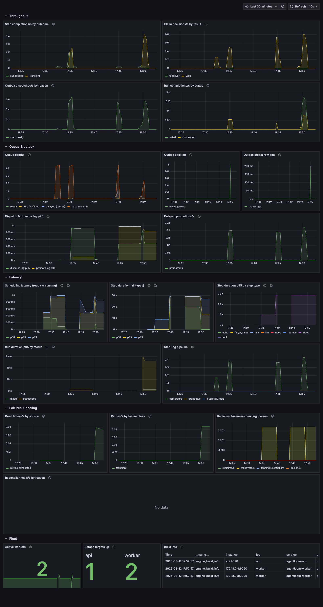
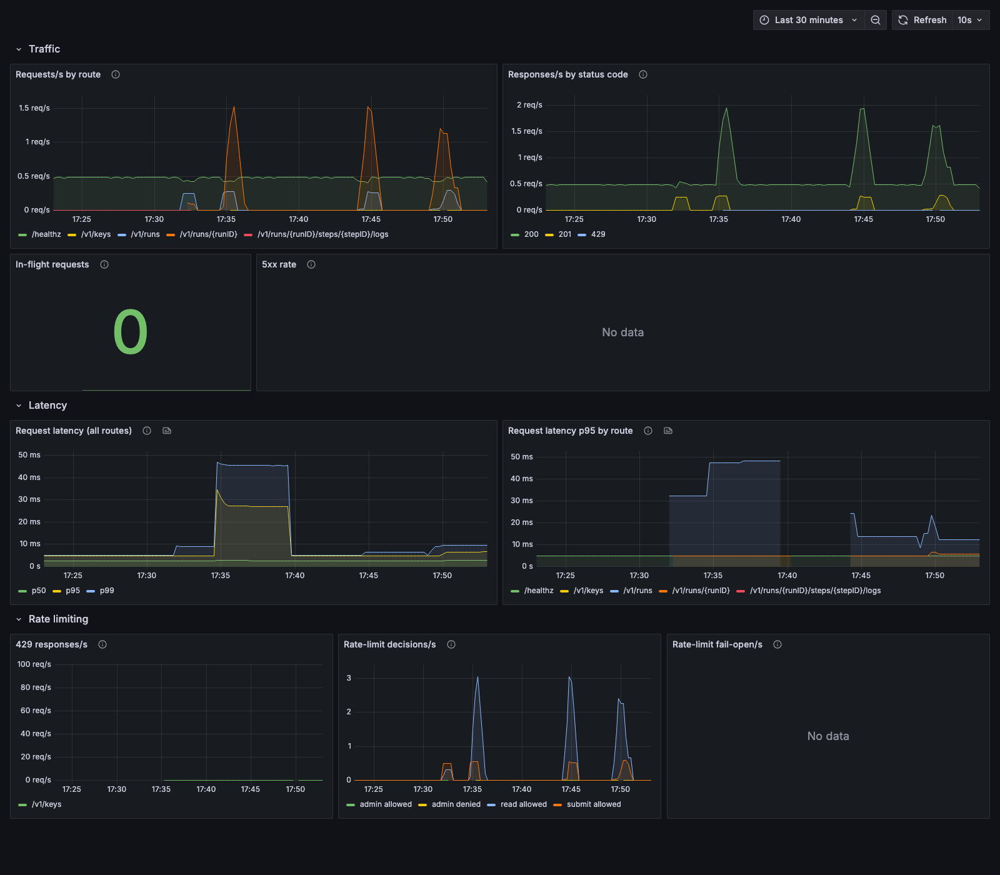
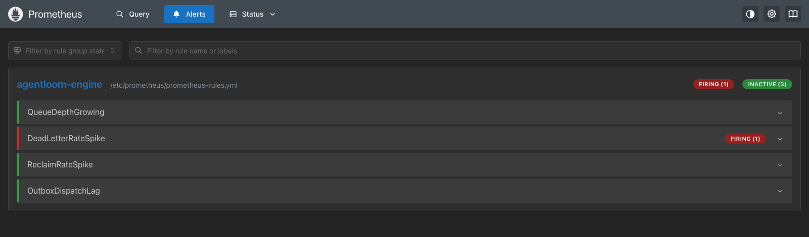

# Observability: dashboards, alert rules, and key signals

Everything here ships with the compose `obs` profile (ticket 7.5, built
on 7.1–7.4's pipeline; conventions in
[ADR-008](adr/008-observability-conventions.md)):

```
make up-obs        # app profile + Prometheus, Grafana, Jaeger; OTel export on
```

| Surface | Where | What |
|---|---|---|
| Grafana | `http://localhost:3000` (anonymous admin, dev-only) | the two provisioned dashboards |
| Prometheus | `http://localhost:9090` | raw queries, `/alerts`, `/rules` |
| Jaeger | `http://localhost:16686` | distributed traces (7.3) |

All three bind loopback by default (`AGENTLOOM_*_BIND` to override). The
deployables' `/metrics` admin ports stay in-network only — Prometheus
scrapes `api:9090` statically and the worker replicas via DNS service
discovery.

Everything is provisioned as code under
[`deploy/observability/`](../deploy/observability/):

```
deploy/observability/
  prometheus.yml               # scrape config + rule_files
  prometheus-rules.yml         # example alert rules (4 alerts)
  prometheus-rules.test.yml    # promtool unit tests (make obs-lint, CI)
  grafana/
    provisioning/datasources/  # the Prometheus datasource (uid: prometheus)
    provisioning/dashboards/   # file provider config
    dashboards/                # engine.json, api.json
```

Grafana UI edits do not survive — the file provider re-reads the JSON
and `allowUiUpdates` is off. Edit the JSON, and note that every
`engine_*` metric name referenced in the dashboards or rules is audited
against the registered instruments by
`TestDashboardsAndRulesReferenceRegisteredMetrics`
(`internal/obs/metrics`), so a renamed metric fails the unit-test job
instead of silently blanking a panel.

## The Engine dashboard (`agentloom-engine`)



One convention up front: the queue/outbox/fleet gauges are sampled by
**every worker replica reporting the same fleet-wide value**, so panels
aggregate them with `max()`. That also means they go **stale, not to
zero**, when the whole fleet is down — the *Scrape targets up* panel is
the tell.

**Throughput row.** Step completions/s by outcome, claim decisions/s by
result, dispatches/s by reason, run completions/s by status. What to
read: `ack_drop` claims are deduped duplicate deliveries (normal in
small numbers); `takeover` claims mean dead workers; dispatch reasons
other than `step_ready` mean the reconciler or lifecycle ops
(requeue/unpark) are re-outboxing.

**Queue & outbox row.** The four depths tell four different stories:

- **ready** growing → dispatch is outrunning consumption (fleet too
  small, workers wedged) — the `QueueDepthGrowing` alert;
- **PEL** (in-flight leases) growing → handlers stuck or slow;
- **delayed** → scheduled retry backlog, spikes with retry storms;
- **outbox backlog / oldest age** → the Postgres→Redis handoff; a
  rising oldest-age is the `OutboxDispatchLag` alert and means runs are
  frozen even though Postgres is accepting work.

Dispatch/promote lag p95 sit at tick-interval scale when healthy.

**Latency row.** Scheduling latency (ready → claim CAS won) is the
end-to-end queue backpressure signal — retry backoff waits are excluded
by construction. Step duration by type shows which executor is slow
(interesting from M8's LLM/tool steps on); run duration p95 by status is
the user-facing number.

**Failures & healing row.** Dead letters/s by source
(`retries_exhausted` = budget spent, `permanent` = non-retryable,
`poison` = crash-looping delivery), retries/s by class, and the
crash-path counters (reclaims, takeovers, fencing rejections, poison) —
all ~0 in a healthy fleet. The reconciler-heals panel has **no series at
all** until the first heal; empty is the good state.

**Cost row.** Spend rate ($/min) and saved-by-cache rate ($/min) by
resource (the pricing-catalog name — model or `tool:<name>`), tokens/s by
resource, and a budget-actions/downgrades panel. Spend is the run's real
money burn; saved is the counterfactual value response-cache hits avoided.
The budget-actions panel is ~0 until runs start hitting their caps (parks
by limit, downgrades by trigger) — empty is the healthy state, so
`make smoke-dashboards` allowlists it. `BudgetParkRateSpike` alerts when
budgeted runs park in a sustained flow.

**Output quality row (ticket 11.6).** Validation verdicts/s by step type &
status, the failure ratio by resource (the quality-health headline — a
rising line is a model or step producing more invalid output), validator
results/s by validator & status (which validator in a chain is rejecting,
and `on_error:skip` degradations as the `error` status), semantic-retry
depth p50/p95 by outcome (a rising `validation_failed` depth means the
feedback loop is not converging), the repair-status share (native/raw/
repaired/unrepairable — a rising unrepairable line is malformed output at
the source), and the llm-judge score p50/p90 by validator. The judge-score
panel is empty on the offline smoke (the unscripted mock emits no parseable
judge verdict) and is allowlisted; `ValidationFailureRatioHigh` alerts when
a large fraction of verdicts fail while verdicts are actually flowing.

**Context row (ticket 12.6).** Context-window utilization p50/p95 by
resource (`(preflight + max_tokens) / context_window` — compaction keeps
this below 1.0, so a p95 pressed against 1.0 means requests are running hot
against the window), window rejections/s by resource (claims the guardrail
failed before any provider call because the assembly plus `max_tokens`
exceeded the model window and compaction was absent or insufficient — a
non-zero line means a workflow needs a compaction pipeline or a smaller
`max_tokens`), and the token estimate-error p50/p95 by resource (M12.6
swapped `chars/4` for real token counters, so this distribution tightens
toward zero — exact on the mock and OpenAI). The estimate-error panel is
allowlisted quiet on the smoke (no `AGENTLOOM_RESOURCES` limits configured,
so no token reconciliation).

**Fleet row.** Active workers (consumer-group members recently active),
scrape-target health, and `engine_build_info` per instance.

**Event pub/sub (ticket 16.2).** The live event-feed publisher exports the
`events` subsystem on **both** deployables (both fan committed events out to
Redis): `engine_events_published_total{channel}` (`run`/`firehose`),
`engine_events_publish_failures_total`, `engine_events_publish_dropped_total`,
and `engine_events_publish_latency_seconds` (commit-to-published, local budget
under 100ms). A non-zero failures or dropped rate means Redis pub/sub is degraded
(the events stay durable in Postgres and consumers heal via DB backfill, so this
is a latency-hint degradation, never data loss).

**WebSocket streaming (ticket 16.4).** The run WS (16.3) and multi-run firehose
(16.4) export the `api`-subsystem WS metrics, labelled `kind` ∈ {`run`,
`firehose`}: `engine_api_ws_connections{kind}` and `engine_api_ws_subscriptions`
(open connections and active firehose subscriptions),
`engine_api_ws_frames_sent_total{kind}`, `engine_api_ws_slow_closes_total{kind}`
(a client closed 4001 for slow consumption — it resumes, so a low rate is
benign; a spike means clients can't keep up), `engine_api_ws_hub_dropped_total`
(firehose envelopes dropped at a full per-connection inbox — healed by backfill,
never lost), and the `engine_api_ws_send_queue_fill_ratio{kind}` histogram (the
direct backpressure signal; a fill ratio riding near 1 precedes slow-closes).

## The API dashboard (`agentloom-api`)



**Traffic row.** RPS by chi route pattern (404/405 collapse to
`unmatched` — raw paths are never labels), responses by status code, the
in-flight gauge (`engine_api_requests_in_flight` — sustained growth
against flat RPS means handlers are blocking, usually on Postgres), and
the 5xx rate (recovered panics land here as 500s).

**Latency row.** p50/p95/p99 overall and p95 by route. Status code is
deliberately not a label on the duration histogram (ADR-008's series
budget), so error and success latencies mix.

**Rate limiting row.** 429s/s by route, bucket decisions by class and
decision, and fail-open/s. Per-key denials with a quiet global bucket
mean one abusive client, not fleet overload. Any fail-open data means
the rate-limit Redis is unhealthy (the API deliberately serves on,
ADR-007).

## Alert rules

Six **example** rules in
[`prometheus-rules.yml`](../deploy/observability/prometheus-rules.yml),
loaded by the compose Prometheus (see them under
`http://localhost:9090/alerts`). Thresholds are dev-scale on purpose —
low enough for the smoke script to test-fire; production re-tunes them
against real traffic.

| Alert | Fires when | It means |
|---|---|---|
| `QueueDepthGrowing` | ready depth > 10 **and** above its value 10m ago, for 5m | consumption is not keeping up with dispatch — check fleet size, slow executors |
| `DeadLetterRateSpike` | dead-letter rate > 0.01/s over 5m, for 2m | terminal step failures — split by `source` on the Engine dashboard, requeue after fixing the cause |
| `ReclaimRateSpike` | reclaim rate > 0.01/s over 5m, for 2m | workers dying or stalling past the lease TTL |
| `OutboxDispatchLag` | oldest pending outbox row > 30s, for 2m | the Postgres→Redis drain is stalled; runs are frozen (critical) |
| `BudgetParkRateSpike` | budget-park rate > 0.01/s over 5m, for 5m | budgeted runs are hitting their caps and parking on cost (ticket 10.5) |
| `ValidationFailureRatioHigh` | >30% of verdicts failing **and** verdict rate > 0.02/s, for 5m | a model or validation chain is producing mostly invalid output (ticket 11.6) |

Because the gauges behind `QueueDepthGrowing` and `OutboxDispatchLag`
come from the worker sampler, a fully dead fleet silences them instead
of firing them — a real deployment pairs these with `absent()`/`up`
fleet alerts.

The rules are validated and unit-tested in CI:

```
make obs-lint      # promtool check rules + promtool test rules
```

`promtool` runs from the exact Prometheus image tag compose pins, and
[`prometheus-rules.test.yml`](../deploy/observability/prometheus-rules.test.yml)
feeds each alert a synthetic series shaped like its failure mode (plus a
negative case: a deep-but-draining queue must stay quiet).

## Verifying it live: `make smoke-dashboards`

The 7.5 acceptance script
([`scripts/dashboard-smoke.sh`](../scripts/dashboard-smoke.sh)) boots
app+obs with a 5s lease TTL and drives a chaos-grade workload — a
SIGKILL of the worker holding a lease mid-step (reclaim + takeover),
then a paced burst of 12 retries-exhausted dead letters, three
fan-outs, a transient retry, and a 429 storm against the admin
rate-limit class — and asserts:

1. **every panel query** in both dashboards returns a non-empty result
   from Prometheus (three deliberately-quiet-when-healthy queries
   allowlisted: reconciler heals, rate-limit fail-open, 5xx rate);
2. **all four alert rules are loaded**, and
3. **`DeadLetterRateSpike` reaches `firing`** — the documented
   test-fire. The `for: 2m` hold elapses while the remaining workload
   and panel checks execute. Two orderings matter and both are recorded
   in the script: the SIGKILL runs *before* the burst (a restarted
   worker resets its counter registry, so a label-vec counter only the
   victim had recorded would go stale fleet-wide, deflating the rate
   mid-hold), and the burst is *paced* across scrape intervals (a vec
   counter has no series until its first increment, so a burst absorbed
   between two scrapes is born at its final value and rates as zero).
   The script prints the firing alert from `/api/v1/alerts`:

```json
{
  "state": "firing",
  "activeAt": "2026-08-12T21:49:56.416048112Z",
  "value": "3.7917701397859216e-02"
}
```



The sustained chaos suite (`test/crash`) runs host subprocesses on
isolated queue keys that compose Prometheus structurally cannot scrape,
so the smoke recreates its signal shape (crashes, retries, dead letters)
against the scrapable compose fleet instead.

Related smoke scripts: `make smoke-metrics` (every 7.2 metric visible in
Prometheus) and `make smoke-trace` (one Jaeger trace across two worker
processes with a retry link).

## Correlating metrics → traces → logs

A metric anomaly is a *when*; the trace and logs are the *what*.

- Every run row persists its root trace context; each attempt's span is
  on `run_steps.trace_span` (7.3). Find the run's trace in Jaeger by
  time window, or grab `trace_id` from any of its structured log lines.
- Worker and API logs carry `trace_id`/`span_id` plus `run_id`/`step_id`
  (log fields, never metric labels — ADR-008).
- Executor output is captured per attempt and served by
  `GET /v1/runs/{id}/steps/{sid}/logs` (7.4), each line carrying its
  attempt's `trace_id`.

So the loop is: dashboard panel spikes → narrow by label
(source/class/route) → pull the trace for one affected run → read its
step logs by attempt.
